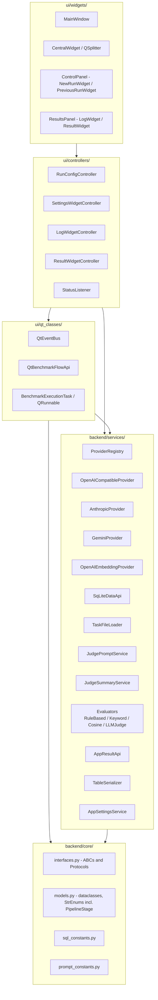
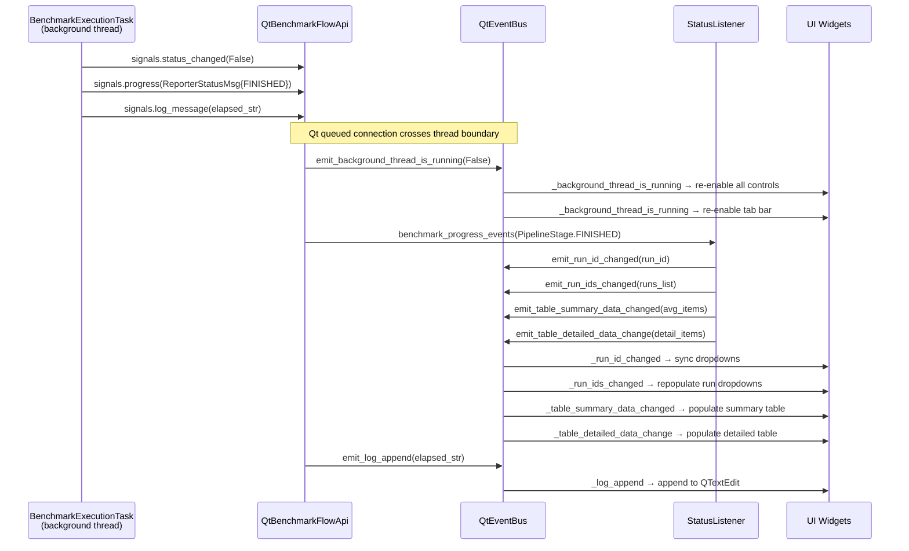

# Architecture

## Package Layout

All source code lives under `src/ollama_llm_bench/`.

Two top-level groups: `backend/` (pure Python, zero Qt) and `ui/` (PySide6-dependent).

**`backend/`** — pure Python:

| Package | Role |
|---|---|
| `backend/core/` | Domain models (`models.py`), ABCs for all services (`interfaces.py`), controller ABCs (`ui_controllers.py`), SQL schema/queries (`sql_constants.py`), prompt templates (`prompt_constants.py`), stage constants (`stages_constants.py`) |
| `backend/services/` | Concrete implementations: `ProviderRegistry`, `ProviderConfigLoader`, `SqliteProviderConfigRepository`, `OpenAICompatibleProvider`, `AnthropicProvider`, `GeminiProvider`, `OpenAIEmbeddingProvider`, `EmbeddingService`, `EmbeddingModelClassifier`, `SqLiteDataApi`, `AppSettingsService`, `AppReadinessService`, `AdaptiveTimeoutService`, `LlmErrorClassifier`, `ModelCapabilityService`, `JudgePromptService`, `JudgeSummaryService`, `RuleBasedEvaluator`, `KeywordEvaluator`, `CosineSimilarityEvaluator`, `LLMJudgeEvaluator`, `ModelNameParser`, `TaskFileLoader`, `PerformanceTaskGenerator`, `AppResultApi`, `TableSerializer`, `CircuitBreaker`, `LogFileWriter`, `ModeVisibilityPolicy`, `ProviderHealthChecker`; sub-packages: `charts/` (12 `BaseChartAggregator` subclasses), `evaluators/`, `providers/` |
| `backend/utils/` | Pure utilities: `text_utils` (sanitize, parse judge), `time_utils` (format elapsed), `run_utils` (fetch+sort runs) |

**`ui/`** — PySide6-dependent:

| Package | Role |
|---|---|
| `ui/qt_classes/` | Qt threading and event infrastructure: `QtEventBus` (pub/sub via `Signal`), `QtBenchmarkFlowApi` (execution lifecycle), `BenchmarkExecutionTask` (QRunnable worker), `MetaQObjectABC` (metaclass for QObject+ABC), `ProviderHealthRunnable` (QRunnable wrapper for provider health checks) |
| `ui/controllers/` | Widget controllers: `RunConfigController`, `SettingsWidgetController`, `ResultWidgetController`, `LogWidgetController`, `StatusListener` |
| `ui/widgets/` | PySide6 widgets: `MainWindow` → `CentralWidget` (QSplitter 20/80) → `ControlPanel` + `ResultsPanel` → tabs and sub-panels |
| `ui/utils/` | Qt-dependent utilities: `widget_utils` (combobox helper) |
| `ui/models/` | `QAbstractTableModel` subclasses + sort/filter proxies |
| `ui/style/` | Theme loader, design tokens (`tokens.py`), QSS templates, icons |

**Root** (bridge/entry):

| File | Role |
|---|---|
| `app_context.py` | DI composition root — wires all backend and UI components |
| `main.py` | Entry point — `QApplication`, `MainWindow`, `ContextProvider` |
| `dataset/` | 50 YAML benchmark task files (coding, data extraction, general knowledge, text operations) |

## Layer Architecture

Dependencies point inward only. `core/` has zero Qt dependencies.



## Dependency Injection Wiring

`app_context.py` wires all components in this order. `ContextProvider` is a thread-safe singleton using `QMutex`.

```
SqLiteDataApi(db_path=app_root/"db.sqlite")
→ AppResultApi(data_api=data_api)
→ AppSettingsService(data_api=data_api)
→ SqliteProviderConfigRepository(data_api=data_api)   ← primary store for provider config
→ ProviderConfigLoader()   ← used for YAML import/export/fallback reset only
→ ProviderRegistry(config_loader, provider_config_repo, providers_yaml_path).load()
→ TaskFileLoader()
→ JudgePromptService()
→ JudgeSummaryService(provider_registry=registry)
→ LogFileWriter(app_root=app_root)
→ EmbeddingService(provider=registry.get_embedding_provider())
→ Evaluators: RuleBasedEvaluator(), KeywordEvaluator, CosineSimilarityEvaluator, LLMJudgeEvaluator
→ TableSerializer(root_dir=app_root)
→ QThreadPool(maxThreadCount=1)
→ QtEventBus()
→ QtBenchmarkFlowApi(data_api, thread_pool, event_bus, provider_registry, task_loader, judge_prompt_service, judge_summary_service, app_settings, evaluators..., log_file_writer)
     ↳ benchmark_status_events   → event_bus.emit_background_thread_is_running
     ↳ benchmark_output_events   → event_bus.emit_log_append
     ↳ benchmark_progress_events → event_bus.emit_background_thread_progress
→ LogWidgetController(event_bus)
→ ResultWidgetController(event_bus, data_api, table_serializer, app_settings)
→ StatusListener(data_api, event_bus, benchmark_flow_api, result_api)
→ SettingsWidgetController(provider_registry, provider_config_loader, app_settings, providers_yaml_path, embedding_service, event_bus)
→ RunConfigController(data_api, provider_registry, benchmark_flow_api, event_bus, task_file_loader, app_settings, embedding_classifier)
→ ApplicationContext(all of the above)
```

`MainWindow` receives `ApplicationContext` and calls `ctx.send_initialization_events()` to fire initial `emit_*` calls that populate all dropdowns on first paint.

## EventBus Signal Catalogue

`QtEventBus` (`ui/qt_classes/qt_event_bus.py`) implements `EventBus` ABC via `MetaQObjectABC`. All signals are private. Every signal is exposed through a matching `subscribe_to_X(callback)` / `emit_X(value)` pair.

| Private field | Signal type | Python payload | Purpose |
|---|---|---|---|
| `_run_id_changed` | `Signal(int)` | `int` (`-1` encodes `None`) | Active run selection changed |
| `_run_ids_changed` | `Signal(list)` | `list[tuple[int, str]]` | Full runs list refreshed |
| `_models_test_changed` | `Signal(list)` | `list[str]` | Test model list changed |
| `_models_judge_changed` | `Signal(str)` | `str` | Judge model selection changed |
| `_log_clean` | `Signal()` | (none) | Clear all log content |
| `_log_append` | `Signal(str)` | `str` | Append one log line |
| `_table_summary_data_changed` | `Signal(list)` | `list[AvgSummaryTableItem]` | Summary table data refreshed |
| `_table_detailed_data_change` | `Signal(list)` | `list[SummaryTableItem]` | Detailed table data refreshed |
| `_background_thread_is_running` | `Signal(bool)` | `bool` | Background thread started/stopped |
| `_background_thread_progress_changed` | `Signal(object)` | `ReporterStatusMsg` | Per-task progress update |
| `_global_event_msg` | `Signal(str)` | `str` | Modal notification message |

**Note:** `emit_run_id_changed(None)` is coerced to `-1` before emitting because `Signal(int)` cannot carry Python `None`. Subscribers must treat `-1` as "no selection."

## Benchmark Execution Flow

Pipeline runs in `BenchmarkExecutionTask(QRunnable)` on `QThreadPool`. **Never throws** — errors are captured in `BenchmarkResult.error_message`.

### Pipeline stages (`backend/core/models.py` — `class PipelineStage(StrEnum)`)
```
PipelineStage.INITIALIZING → BENCHMARKING → JUDGING → FINISHED
                                                    → FAILED
```

### Resumability
On re-run, only `NOT_COMPLETED` tasks are fetched for benchmarking; only `WAITING_FOR_JUDGE` tasks are fetched for judging. Incomplete runs can be continued from the "Previous Runs" tab.

### Signal flow when benchmark completes



## Database

SQLite via stdlib `sqlite3`. Schema in `core/sql_constants.py`. DB file: `<cwd>/db.sqlite`.

Nine tables (schema in `core/sql_constants.py`):

```
schema_version       ← migration version tracking
benchmark_runs       ← run metadata, mode, provider fields, task_file_paths, models_json
benchmark_results    ← ~65 fields across 12 eval-layer groups
prompt_variants      ← Prompt Eval mode variant definitions (v1 schema)
prompt_variants_v2   ← Prompt Eval mode variant definitions (v2 schema)
app_settings         ← feature flags and UI preferences (KV store)
model_capabilities   ← cached model capability flags (vision, tools, etc.)
providers            ← provider endpoint config (primary store, replaces providers.yaml as live config)
embedding_config     ← embedding provider configuration
```

`SqLiteDataApi` opens a fresh `sqlite3.connect()` per method call (no persistent connection). FK constraints are declared but not enforced (no `PRAGMA foreign_keys = ON`). `delete_benchmark_run` manually deletes child results first.

## Response Processing

`utils/text_utils.py`:
- `sanitize_text(text)` — strips `<think>...</think>` reasoning blocks (DeepSeek-R1 style). Called by every concrete `LLMProviderApi.inference_*` implementation on raw responses.
- `parse_judge_response(json_string)` — pipeline: strip XML turn markers + markdown fences → extract `{...}` → `json.loads` → validate `grade` float + `reason` str → returns `(has_error, grade, reason)`.
- `sanitize_json_string(s)` / `extract_json_object(s)` — pre-processing helpers for JSON extraction.

`JudgePromptService.build_judge_prompt(task, result)` uses `str.replace()` (not `.format()`) to fill the `USER_PROMPT` template — avoids conflicts with curly braces inside coding task prompts.

## Key Invariants

Rules an AI agent must never break:

1. `core/` must never import `PySide6` or `PyQt6` — it must be usable outside the GUI context.
2. All cross-thread UI updates must go through EventBus signals (never direct widget method calls from background thread).
3. `BenchmarkExecutionTask` must never throw to callers; all errors stored in model fields.
4. `ContextProvider.initialize()` must be called before `ContextProvider.get_context()`.
5. `None` run_id is encoded as `-1` on `_run_id_changed` — all subscribers must handle `-1`.
6. `QThreadPool(maxThreadCount=1)` — only one benchmark can run at a time. Do not increase this.
7. Every service must have an ABC in `core/interfaces.py`; concrete classes subclass the ABC.
8. `StatusListener` bridges benchmark completion → table data refresh. Do not remove or bypass it.
9. Dependencies point inward: `ui/widgets/` → `ui/controllers/` → `services/` → `core/`. No reverse imports.
10. `MetaQObjectABC` is required on any class combining `QObject` + `ABC`. Never use `(QObject, ABC)` directly.

## Migration State

| Target state | Current state | Migration strategy |
|---|---|---|
| PySide6 | ~~PyQt6 used throughout~~ | **Complete** — `feature/pyside-migration` |
| UV + hatchling | ~~Poetry + poetry-core build backend~~ | **Complete** — `feature/migrate-to-uv` |
| Mypy | Complete — sole type checker | |
| structlog | `logging.getLogger(__name__)` stdlib (lazy `%` formatting enforced via Ruff `G`) | Migration plan needed before implementation |
| 80% test coverage | 1207 tests pass; coverage target 80% in `pyproject.toml` | |
| Multi-provider abstraction | **Complete** — V1 `OllamaApi`/`LLMApi` removed in 2026-05-10 cleanup; `ProviderRegistry` is canonical | |
| V2 full redesign (see below) | Shipped + cleaned | `feature/v2-app-redesign` — commit `af2528a` plus 2026-05-10 cleanup pass |

---

## V2 Target Architecture

> UI design reference: `docs/reference/v2-ui-design-guide.html`. The implementation plan has been merged and the original plan archive removed.
> Active branch: `feature/v2-app-redesign`.

### V2 Provider Layer (replaces single `OllamaApi`)

```
LLMProviderApi (Protocol, core/interfaces.py)
  ├── OpenAICompatibleProvider  ← Ollama, LM Studio, llama.cpp, OpenAI, Azure
  ├── AnthropicProvider         ← anthropic SDK
  └── GeminiProvider            ← google-genai SDK

EmbeddingProviderApi (Protocol)
  └── OpenAIEmbeddingProvider   ← /v1/embeddings endpoint

ProviderRegistry (services/)               ← reads SqliteProviderConfigRepository, constructs clients
ProviderConfigLoader (services/)           ← validates YAML, resolves ${ENV_VAR} (import/export/fallback only)
SqliteProviderConfigRepository (services/) ← primary persistent store for provider config
EmbeddingService (services/)   ← wraps embedding with LRU cache
```

### V2 Evaluation Pipeline (replaces single judge call)

```
STAGE_BENCHMARKING → STAGE_JUDGING:
  Layer 1: RuleBasedEvaluator   ← empty, echo, too_short, error_marker
  Layer 2: KeywordEvaluator     ← exact/forbidden/semantic terms
  Layer 3: CosineSimilarityEvaluator ← skipped for code/reasoning tasks
  Layer 4: LLMJudgeEvaluator    ← task-type-specific prompt; structured JSON output

JudgePromptService              ← selects template by task_type; assembles prompt
AppSettingsService              ← KV store backed by app_settings table
ModelNameParser                 ← parses family/size/quantization from model name
TaskFileLoader                  ← multi-file + folder YAML loading
```

### V2 DB Schema (9 tables vs V1's 2)

```
schema_version       ← migration version tracking
benchmark_runs       ← expanded: run_mode, provider fields, task_file_paths, models_json
benchmark_results    ← replaces results: ~65 fields across 12 eval-layer groups
prompt_variants      ← Prompt Eval mode variant definitions (v1 schema)
prompt_variants_v2   ← Prompt Eval mode variant definitions (v2 schema)
app_settings         ← feature flags and UI preferences (KV store)
model_capabilities   ← cached model capability flags (vision, tools, etc.)
providers            ← provider endpoint config (primary store, replaces providers.yaml as live config)
embedding_config     ← embedding provider configuration
```

### V2 UI Layout (3-panel vs V1's 2-panel)

```
┌────────────────┬────────────────────────┬──────────────────────┐
│  LEFT (~22%)   │     CENTER (~45%)      │    RIGHT (~33%)      │
│  Run Config    │  Progress + Log        │  Results             │
│  (mode, judge, │  (structured progress, │  (summary table,     │
│  models, tasks,│  filterable log,       │  charts, detail,     │
│  options)      │  streaming display)    │  export)             │
└────────────────┴────────────────────────┴──────────────────────┘
```

Design tokens in `ui/style/tokens.py` — DARK/LIGHT/SHARED dicts injected into QSS via `str.format()`.

### V2 Event Catalogue (12+ typed events vs V1's minimal progress events)

All events are frozen dataclasses in `core/models.py`, emitted via `QtEventBus`.

Key new event categories:
- **Lifecycle**: `BenchmarkStartedEvent`, `BenchmarkPausedEvent`, `BenchmarkResumedEvent`, `BenchmarkStoppedEvent`, `BenchmarkFinishedEvent`
- **Switch** (each can trigger configurable pause): `ProviderSwitchEvent`, `ModelSwitchEvent`, `TaskSwitchEvent`, `ModeSwitchEvent`
- **Eval**: `JudgeStartedEvent`, `JudgeCompletedEvent`, `TaskCompletedEvent`
- **Streaming**: `StreamingChunkEvent` — buffered at 20 Hz to prevent Qt event queue flooding
- **Progress**: `ProgressUpdateEvent` — ETA + provider/model/task identity

### V2 Key Invariants (additions to V1 invariants)

11. The `providers` SQLite table (via `SqliteProviderConfigRepository`) is the primary store for provider configuration. `providers.yaml` is used only for initial import, export, and "Reset to Defaults" operations — no provider-specific code outside `services/providers/`.
12. All eval layer services receive `sanitized_response` (think tags stripped) — never `raw_response`.
13. `ModelDescriptor` replaces all plain `model_name: str` — provider_id + model_name + parsed metadata.
14. Streaming chunks MUST be buffered at the task level and emitted at max 20 Hz — never one Qt event per token.
15. `providers.yaml` paths: macOS `~/Library/Application Support/OllamaLLMBench/`, Linux `~/.local/share/OllamaLLMBench/`, Windows `%APPDATA%\OllamaLLMBench\`.
16. `db.sqlite` must NOT be committed to git — add to `.gitignore` immediately.

## Modification Scope Guide

| Change | Files to modify |
|---|---|
| Add new benchmark task | `src/ollama_llm_bench/dataset/*.yaml` |
| Change judge scoring rubric / grading scale | `src/ollama_llm_bench/backend/core/prompt_constants.py` |
| Add new EventBus signal | `backend/core/interfaces.py` (EventBus ABC) + `ui/qt_classes/qt_event_bus.py` |
| Add new UI control to control panel | `ui/widgets/panels/control/` widget + corresponding controller method |
| Change SQLite schema | `backend/core/sql_constants.py` + `backend/services/sq_lite_data_api.py` (+ migration) |
| Add new export format | `backend/core/interfaces.py` (`TableSerializerApi` ABC) + `backend/services/table_serializer.py` |
| Fix LLM response parsing or sanitization | `backend/utils/text_utils.py` |
| Change provider connection settings | `providers.yaml` + `backend/services/providers/<provider>.py` |
| Add new result metric | `backend/core/models.py` + `backend/services/sq_lite_data_api.py` + `backend/services/app_result_api.py` |
| Add new UI tab | `ui/widgets/panels/` + new controller ABC in `backend/core/ui_controllers.py` + concrete controller in `ui/controllers/` + wire in `app_context.py` |

## Key Files Quick Reference

| File | Purpose |
|---|---|
| `src/ollama_llm_bench/main.py` | Entry point: argparse, logging config, QApplication bootstrap |
| `src/ollama_llm_bench/app_context.py` | DI wiring: `ContextProvider`, `ApplicationContext`, `_create_app_context()` |
| `src/ollama_llm_bench/backend/core/interfaces.py` | ABCs: `DataApi`, `ResultApi`, `BenchmarkFlowApi`, `EventBus`, `AppContext`, `TableSerializerApi`. Protocols: `LLMProviderApi`, `EmbeddingProviderApi`, `ProviderRegistryApi`, `EvaluatorApi`, `LLMJudgeEvaluatorApi`, `JudgePromptServiceApi`, `JudgeSummaryServiceApi`, `AppSettingsServiceApi`, `LogFileWriterApi`, `TaskFileLoaderApi`, `ProviderConfigLoaderApi`, `ModelNameParserApi`. |
| `src/ollama_llm_bench/backend/core/models.py` | Frozen dataclasses + StrEnums: `BenchmarkRun`, `BenchmarkResult`, `InferenceResponse`, `PipelineStage`, `EvalLayer`, all event dataclasses. |
| `src/ollama_llm_bench/backend/core/sql_constants.py` | DB schema DDL + all SQL query strings |
| `src/ollama_llm_bench/backend/core/prompt_constants.py` | `SYSTEM_PROMPT` (judge rubric) + `USER_PROMPT` template |
| `src/ollama_llm_bench/backend/core/ui_controllers.py` | ABCs/Protocols for widget controllers |
| `src/ollama_llm_bench/ui/qt_classes/qt_event_bus.py` | `QtEventBus` — typed Signals, pub/sub hub |
| `src/ollama_llm_bench/ui/qt_classes/qt_benchmark_execution_task.py` | `BenchmarkExecutionTask` — QRunnable pipeline worker |
| `src/ollama_llm_bench/ui/qt_classes/qt_benchmark_flow.py` | `QtBenchmarkFlowApi` — execution lifecycle manager |
| `src/ollama_llm_bench/ui/qt_classes/meta_class.py` | `MetaQObjectABC` — resolves QObject + ABCMeta MRO conflict |
| `src/ollama_llm_bench/backend/services/provider_registry.py` | `ProviderRegistry` — multi-provider composition root |
| `src/ollama_llm_bench/backend/services/providers/` | `OpenAICompatibleProvider`, `AnthropicProvider`, `GeminiProvider`, `OpenAIEmbeddingProvider` |
| `src/ollama_llm_bench/backend/services/sq_lite_data_api.py` | `SqLiteDataApi` — SQLite CRUD, fresh connection per call |
| `src/ollama_llm_bench/backend/services/sqlite_provider_config_repository.py` | `SqliteProviderConfigRepository` — provider config CRUD, primary store (replaces providers.yaml as live config) |
| `src/ollama_llm_bench/backend/services/app_result_api.py` | `AppResultApi` — aggregates results to summary/detailed tables |
| `src/ollama_llm_bench/backend/utils/text_utils.py` | `sanitize_text`, `parse_judge_response`, JSON extraction |
| `src/ollama_llm_bench/ui/controllers/status_listener.py` | `StatusListener` — bridges benchmark completion → table data refresh |
