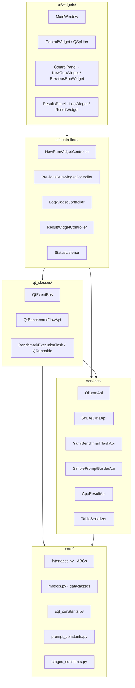

# Architecture

## Package Layout

All source code lives under `src/ollama_llm_bench/`.

| Package | Role |
|---|---|
| `core/` | Domain models (`models.py`), ABCs for all services (`interfaces.py`), controller ABCs (`ui_controllers.py`), SQL schema/queries (`sql_constants.py`), prompt templates (`prompt_constants.py`), stage constants (`stages_constants.py`) |
| `services/` | Concrete implementations: `OllamaApi` (LLM client), `SqLiteDataApi` (SQLite CRUD), `YamlBenchmarkTaskApi` (YAML loader), `SimplePromptBuilderApi` (prompt construction), `AppResultApi` (result aggregation), `TableSerializer` (CSV/MD export) |
| `qt_classes/` | Qt threading and event infrastructure: `QtEventBus` (pub/sub via pyqtSignal), `QtBenchmarkFlowApi` (execution lifecycle), `BenchmarkExecutionTask` (QRunnable worker), `MetaQObjectABC` (metaclass for QObject+ABC) |
| `ui/controllers/` | Widget controllers: `NewRunWidgetController`, `PreviousRunWidgetController`, `ResultWidgetController`, `LogWidgetController`, `StatusListener` |
| `ui/widgets/` | PyQt6 widgets: `MainWindow` → `CentralWidget` (QSplitter 20/80) → `ControlPanel` + `ResultsPanel` → tabs and sub-panels |
| `utils/` | Pure utilities: `text_utils` (sanitize, parse judge), `time_utils` (format elapsed), `run_utils` (fetch+sort runs), `widget_utils` (combobox helper) |
| `dataset/` | 50 YAML benchmark task files (coding, data extraction, general knowledge, text operations) |

## Layer Architecture

Dependencies point inward only. `core/` has zero Qt dependencies.



## Dependency Injection Wiring

`app_context.py` wires all components in this order. `ContextProvider` is a thread-safe singleton using `QMutex`.

```
ollama.Client(timeout=300)
→ OllamaApi(client)
→ YamlBenchmarkTaskApi(task_folder_path=dataset_path)
→ SimplePromptBuilderApi(task_api=task_api)
→ SqLiteDataApi(db_path=app_root/"db.sqlite")
→ AppResultApi(data_api=data_api)
→ TableSerializer(root_dir=app_root)
→ QThreadPool(maxThreadCount=1)
→ QtEventBus()
→ QtBenchmarkFlowApi(data_api, task_api, prompt_builder_api, llm_api, thread_pool)
     ↳ benchmark_status_events   → event_bus.emit_background_thread_is_running
     ↳ benchmark_output_events   → event_bus.emit_log_append
     ↳ benchmark_progress_events → event_bus.emit_background_thread_progress
→ PreviousRunWidgetController(data_api, task_api, benchmark_flow_api, event_bus)
→ NewRunWidgetController(data_api, llm_api, task_api, event_bus, benchmark_flow_api)
→ LogWidgetController(event_bus)
→ ResultWidgetController(event_bus, data_api, table_serializer)
→ StatusListener(data_api, event_bus, benchmark_flow_api, result_api)
→ ApplicationContext(all of the above)
```

`MainWindow` receives `ApplicationContext` and calls `ctx.send_initialization_events()` to fire initial `emit_*` calls that populate all dropdowns on first paint.

## EventBus Signal Catalogue

`QtEventBus` (`qt_classes/qt_event_bus.py`) implements `EventBus` ABC via `MetaQObjectABC`. All signals are private. Every signal is exposed through a matching `subscribe_to_X(callback)` / `emit_X(value)` pair.

| Private field | pyqtSignal type | Python payload | Purpose |
|---|---|---|---|
| `_run_id_changed` | `pyqtSignal(int)` | `int` (`-1` encodes `None`) | Active run selection changed |
| `_run_ids_changed` | `pyqtSignal(list)` | `list[tuple[int, str]]` | Full runs list refreshed |
| `_models_test_changed` | `pyqtSignal(list)` | `list[str]` | Test model list changed |
| `_models_judge_changed` | `pyqtSignal(str)` | `str` | Judge model selection changed |
| `_log_clean` | `pyqtSignal()` | (none) | Clear all log content |
| `_log_append` | `pyqtSignal(str)` | `str` | Append one log line |
| `_table_summary_data_changed` | `pyqtSignal(list)` | `list[AvgSummaryTableItem]` | Summary table data refreshed |
| `_table_detailed_data_change` | `pyqtSignal(list)` | `list[SummaryTableItem]` | Detailed table data refreshed |
| `_background_thread_is_running` | `pyqtSignal(bool)` | `bool` | Background thread started/stopped |
| `_background_thread_progress_changed` | `pyqtSignal(object)` | `ReporterStatusMsg` | Per-task progress update |
| `_global_event_msg` | `pyqtSignal(str)` | `str` | Modal notification message |

**Note:** `emit_run_id_changed(None)` is coerced to `-1` before emitting because `pyqtSignal(int)` cannot carry Python `None`. Subscribers must treat `-1` as "no selection."

## Benchmark Execution Flow

Pipeline runs in `BenchmarkExecutionTask(QRunnable)` on `QThreadPool`. **Never throws** — errors are captured in `BenchmarkResult.error_message`.

### Stage constants (`core/stages_constants.py`)
```
STAGE_INITIALIZING → STAGE_BENCHMARKING → STAGE_JUDGING → STAGE_FINISHED
                                                         → STAGE_FAILED
```

### Resumability
On re-run, only `NOT_COMPLETED` tasks are fetched for benchmarking; only `WAITING_FOR_JUDGE` tasks are fetched for judging. Incomplete runs can be continued from the "Previous Runs" tab.

### Signal flow when benchmark completes


## Database

SQLite via stdlib `sqlite3`. Schema in `core/sql_constants.py`. DB file: `<cwd>/db.sqlite`.

Two tables:
- `benchmark_runs(run_id PK, timestamp TEXT, judge_model TEXT, status TEXT)`
- `results(result_id PK, run_id FK, task_id TEXT, model_name TEXT, status TEXT, llm_response TEXT, time_taken_ms INT, tokens_generated INT, evaluation_score REAL, evaluation_reason TEXT, error_message TEXT)`

`SqLiteDataApi` opens a fresh `sqlite3.connect()` per method call (no persistent connection). FK constraints are declared but not enforced (no `PRAGMA foreign_keys = ON`). `delete_benchmark_run` manually deletes child results first.

## Response Processing

`utils/text_utils.py`:
- `sanitize_text(text)` — strips `<think>...</think>` reasoning blocks (DeepSeek-R1 style). Called by `OllamaApi.inference()` on every raw response.
- `parse_judge_response(json_string)` — pipeline: strip XML turn markers + markdown fences → extract `{...}` → `json.loads` → validate `grade` float + `reason` str → returns `(has_error, grade, reason)`.
- `sanitize_json_string(s)` / `extract_json_object(s)` — pre-processing helpers for JSON extraction.

`SimplePromptBuilderApi.build_judge_prompt()` uses `str.replace()` (not `.format()`) to fill `USER_PROMPT` template — avoids conflicts with curly braces inside coding task prompts.

## Key Invariants

Rules an AI agent must never break:

1. `core/` must never import `PySide6` or `PyQt6` — it must be usable outside the GUI context.
2. All cross-thread UI updates must go through EventBus signals (never direct widget method calls from background thread).
3. `BenchmarkExecutionTask` must never throw to callers; all errors stored in model fields.
4. `ContextProvider.initialize()` must be called before `ContextProvider.get_context()`.
5. `None` run_id is encoded as `-1` on `_run_id_changed` — all subscribers must handle `-1`.
6. `QThreadPool(maxThreadCount=1)` — only one benchmark can run at a time. Do not increase this.
7. Every service must have an ABC in `core/interfaces.py`; concrete classes subclass the ABC.
8. `StatusListener` bridges benchmark completion → table data refresh. Do not remove or bypass it.
9. Dependencies point inward: `ui/widgets/` → `ui/controllers/` → `services/` → `core/`. No reverse imports.
10. `MetaQObjectABC` is required on any class combining `QObject` + `ABC`. Never use `(QObject, ABC)` directly.

## Migration State

| Target state | Current state | Migration strategy |
|---|---|---|
| PySide6 | PyQt6 used throughout | Migrate file-by-file when touching existing code |
| UV + hatchling | Poetry + poetry-core build backend | Dedicated migration PR |
| Mypy as CI authority | Pyright in dev only | Already configured in pyproject.toml |
| structlog | `logging.getLogger(__name__)` stdlib | Migration plan needed before implementation |
| 80% test coverage | 0 tests exist (no `tests/` directory) | Write tests before any major changes |

## Modification Scope Guide

| Change | Files to modify |
|---|---|
| Add new benchmark task | `src/ollama_llm_bench/dataset/*.yaml` |
| Change judge scoring rubric / grading scale | `src/ollama_llm_bench/core/prompt_constants.py` |
| Add new EventBus signal | `core/interfaces.py` (EventBus ABC) + `qt_classes/qt_event_bus.py` |
| Add new UI control to control panel | `ui/widgets/panels/control/` widget + corresponding controller method |
| Change SQLite schema | `core/sql_constants.py` + `services/sq_lite_data_api.py` (+ migration) |
| Add new export format | `core/interfaces.py` (ITableSerializer ABC) + `services/table_serializer.py` |
| Fix LLM response parsing or sanitization | `utils/text_utils.py` |
| Change Ollama connection settings | `app_context.py` (`ollama.Client(timeout=...)`) |
| Add new result metric | `core/models.py` + `services/sq_lite_data_api.py` + `services/app_result_api.py` |
| Add new UI tab | `ui/widgets/panels/` + new controller ABC in `core/ui_controllers.py` + concrete controller in `ui/controllers/` + wire in `app_context.py` |

## Key Files Quick Reference

| File | Purpose |
|---|---|
| `src/ollama_llm_bench/main.py` | Entry point: argparse, logging config, QApplication bootstrap |
| `src/ollama_llm_bench/app_context.py` | DI wiring: `ContextProvider`, `ApplicationContext`, `_create_app_context()` |
| `src/ollama_llm_bench/core/interfaces.py` | All ABCs: `LLMApi`, `DataApi`, `EventBus`, `BenchmarkFlowApi`, `AppContext`, etc. |
| `src/ollama_llm_bench/core/models.py` | Frozen dataclasses: `BenchmarkRun`, `BenchmarkResult`, `InferenceResponse`, etc. |
| `src/ollama_llm_bench/core/sql_constants.py` | DB schema DDL + all SQL query strings |
| `src/ollama_llm_bench/core/prompt_constants.py` | `SYSTEM_PROMPT` (judge rubric) + `USER_PROMPT` template |
| `src/ollama_llm_bench/core/stages_constants.py` | `STAGE_*` string constants |
| `src/ollama_llm_bench/core/ui_controllers.py` | ABCs for all 4 widget controllers |
| `src/ollama_llm_bench/qt_classes/qt_event_bus.py` | `QtEventBus` — 11 pyqtSignals, pub/sub hub |
| `src/ollama_llm_bench/qt_classes/qt_benchmark_execution_task.py` | `BenchmarkExecutionTask` — QRunnable pipeline worker |
| `src/ollama_llm_bench/qt_classes/qt_benchmark_flow.py` | `QtBenchmarkFlowApi` — execution lifecycle manager |
| `src/ollama_llm_bench/qt_classes/meta_class.py` | `MetaQObjectABC` — resolves QObject + ABCMeta MRO conflict |
| `src/ollama_llm_bench/services/ollama_llm_api.py` | `OllamaApi` — Ollama client wrapper, 5-retry warmup, sanitize_text |
| `src/ollama_llm_bench/services/sq_lite_data_api.py` | `SqLiteDataApi` — SQLite CRUD, fresh connection per call |
| `src/ollama_llm_bench/services/app_result_api.py` | `AppResultApi` — aggregates results to summary/detailed tables |
| `src/ollama_llm_bench/utils/text_utils.py` | `sanitize_text`, `parse_judge_response`, JSON extraction |
| `src/ollama_llm_bench/ui/controllers/status_listener.py` | `StatusListener` — bridges benchmark completion → table data refresh |
