---
paths:
  - "src/**/*.py"
---

# Error Handling Standard

Source of truth: `docs/v3_specification/16_Engineering_Standards/05_ERROR_HANDLING_STANDARD.md`
and the concrete leaf catalogue in
`docs/v3_specification/11_Services_and_Algorithms/17_ERROR_TAXONOMY.md`.

## The binding stance (DD-44)

The application **uses exceptions** — standard Python behaviour — with controlled handling at
every boundary, in exactly **three sanctioned shapes**:

1. **Catch and return as data.** Failure-as-data surfaces — the benchmark pipeline,
   `probe_health`, `test_inference`, the readiness probes — catch every internal exception and
   return the outcome as a value. Their callers never see a raise.
2. **Catch, wrap, and re-raise.** Boundary translation: a provider SDK exception becomes a
   typed taxonomy leaf at the adapter where it is born (original chained as cause); the typed
   exception then drives retry/breaker/classification logic above it.
3. **Never catch.** `ProgrammerError` propagates to the process-terminal hook and crashes with
   a full diagnostic — by design.

**The user never sees the application break because of an uncaught exception** — every
exception is either converted to data, a typed and handled error, or a deliberate, diagnosed
crash. Monadic ("Go-style") result types remain banned — see Anti-Patterns.

## The four categories

| Category | Meaning | Retry? | Reaches the user? | Crashes the app? |
|---|---|---|---|---|
| **Transient** | A momentary failure likely to succeed on retry — timeout, connection reset, provider 5xx, rate limit, database lock | Yes (bounded) | Only as a summary if it persists | No |
| **Permanent** | A real failure retrying cannot fix — bad request, content-filter rejection, quota exhausted, disk full | No | Yes | No |
| **User** | A condition the user can fix and re-run — invalid configuration, a model not pulled, user-initiated cancellation | No | Yes, with actionable guidance | No |
| **Programmer-error** | A bug — a broken invariant, an impossible state, a contract violation | No | Crash dialog only | Yes |

## The exception hierarchy

Recoverable errors descend from `AppError(Exception)`. The programmer-error root descends from
`BaseException` **outside** `Exception`, so it survives `except Exception:` nets and reaches
the terminal hook — the same design as cancellation/`KeyboardInterrupt` in the standard
library.

```mermaid
flowchart TD
    BE["BaseException"]
    EXC["Exception"]
    BE --> EXC
    BE --> PROG["ProgrammerError — category: programmer"]

    EXC --> APP["AppError — root of recoverable errors"]
    APP --> TRANS["TransientError"]
    APP --> PERM["PermanentError"]
    APP --> USER["UserError"]

    TRANS --> HTTPT["HttpTimeoutError"]
    TRANS --> HTTPC["HttpConnectionError"]
    TRANS --> PRL["ProviderRateLimitedError"]
    TRANS --> PSE["ProviderServerError"]
    TRANS --> POVL["ProviderOverloadedError"]
    TRANS --> DBL["DatabaseLockedError"]

    PERM --> PBR["ProviderBadRequestError"]
    PERM --> PCF["ProviderContentFilterError"]
    PERM --> PQE["ProviderQuotaExhaustedError"]
    PERM --> PCL["ProviderContextLengthError"]
    PERM --> PARSE["LLMOutputParseError"]
    PERM --> DBF["DatabaseDiskFullError"]
    PERM --> EMBU["EmbeddingUnavailableError"]

    USER --> PAUTH["ProviderAuthError"]
    USER --> CFG["ConfigurationError"]
    USER --> MNA["ModelNotAvailableError"]
    USER --> MENV["MissingEnvVarError"]
    USER --> TFE["TaskFileError"]
    USER --> OSE["OsAdapterError"]
    USER --> CANCEL["TaskCancelledError"]

    PROG --> DBI["DatabaseIntegrityError"]
    PROG --> CONTRACT["ContractViolationError"]
    PROG --> VALERR["ValidationError"]
```

### Leaf catalogue

**Transient (retried — see `11_Services_and_Algorithms/18_RETRY_POLICY.md`):**

| Leaf | Raised when |
|---|---|
| `HttpTimeoutError` | A provider request exceeded the transport time budget. |
| `HttpConnectionError` | Connection refused, reset, or DNS failed. |
| `ProviderRateLimitedError` | HTTP 429; may carry a `retry_after`. |
| `ProviderServerError` | HTTP 5xx. |
| `ProviderOverloadedError` | SDK-reported temporary saturation. |
| `DatabaseLockedError` | A SQLite write blocked past the busy timeout. |

**Permanent (never retried; surfaced):**

| Leaf | Raised when |
|---|---|
| `ProviderBadRequestError` | HTTP 400 / malformed request. |
| `ProviderContentFilterError` | Content-policy refusal. |
| `ProviderQuotaExhaustedError` | Account quota exhausted. |
| `ProviderContextLengthError` | Prompt exceeded the model's context window. |
| `LLMOutputParseError` | Judge/inference output could not be parsed into the expected shape. |
| `DatabaseDiskFullError` | A SQLite write failed because the disk is full. |
| `EmbeddingUnavailableError` | The embedding endpoint failed at the run-start fail-fast probe (settles the run `FAILED` pre-inference; a per-task embedding failure during cosine never raises). |

**User (never retried; surfaced with actionable guidance):**

| Leaf | Raised when |
|---|---|
| `ProviderAuthError` | HTTP 401/403. |
| `ConfigurationError` | A required configuration value is missing, malformed, or contradictory. |
| `ModelNotAvailableError` | The requested model is not available on the provider. |
| `MissingEnvVarError` | The env var naming a provider's API key is unset or empty. |
| `TaskFileError` | A task file/folder could not be read or parsed as YAML at all. |
| `OsAdapterError` | An OS integration call failed (clipboard, file manager, picker). |
| `TaskCancelledError` | The user paused/stopped the run; raised by `CancellationToken.raise_if_cancelled()`. |

**Programmer-error (never caught; crash the process):**

| Leaf | Raised when |
|---|---|
| `DatabaseIntegrityError` | A schema invariant is broken (FK/uniqueness the app should have guaranteed). |
| `ContractViolationError` | A contract/assertion is violated — an impossible state. |
| `ValidationError` | A domain value violated a declared `msgspec.Meta` constraint at construction time. |

### Mixed inheritance for multi-axis dispatch

Some leaves dispatch on two axes at once: *category* (drives retry) and *provider-surface
meaning* (drives the health indicator and the `LLMClient` contract). Such leaves inherit from a
category root **and** the `ProviderError` marker type, e.g.
`ProviderAuthError(UserError, ProviderError)`. MRO is left-to-right, so the category root
listed first determines `category`. `ProviderError`-marked leaves: `HttpTimeoutError`,
`HttpConnectionError`, `ProviderRateLimitedError`, `ProviderServerError`,
`ProviderOverloadedError`, `ProviderBadRequestError`, `ProviderContentFilterError`,
`ProviderQuotaExhaustedError`, `ProviderAuthError`, `ModelNotAvailableError`,
`MissingEnvVarError`.

## The three sanctioned handling shapes — concretely

1. **Adapter-boundary translation.** Each provider adapter is the **sole** point where its raw
   SDK exceptions may exist. At the boundary: (1) translate — catch the raw exception, pass its
   message through `redact(text)`, raise the matching application leaf with an `ErrorContext`,
   chain the original (`raise AppLeaf(...) from original`); (2) retry transient leaves; (3)
   wrap in the circuit breaker; (4) surface upward as an application error type only. A raw
   provider/SDK exception type **must not** appear outside the `_internal` package of its
   owning adapter — an architecture test enforces this per provider.
2. **Pipeline containment.** The benchmark pipeline never raises to its caller — it captures
   every unit failure into `BenchmarkResult.error_kind`/`.error_message`/`ResultStatus`; a
   catastrophic failure sets `RunStatus.FAILED`.
3. **`ProgrammerError` never caught.** `icontract.errors.ViolationError` and any
   `ProgrammerError` propagate to the process-terminal hook and crash the process.

## ErrorContext — redaction-safe fields only

Every `AppError` carries a frozen, structured `ErrorContext` holding only values that can never
contain a secret: `provider_id`, `model_id_truncated`, `endpoint`, `http_status`,
`provider_error_code`, `attempt`, `request_id`, `correlation_id`. Anything that might contain a
secret (a prompt, a base URL, an API key) is never placed in the context — it lives only on the
raw exception arguments and is stripped by the redaction module before any egress (see
`logging.md`).

## Hard rules

- Recoverable errors **must** descend from `AppError`; programmer-errors **must** descend from
  `ProgrammerError`, never `Exception`. There is no single flat error class.
- `except Exception` is forbidden outside a small, explicitly listed allowlist (the terminal
  hook, and an adapter wrapping a native library with no typed exception hierarchy). An
  architecture-test AST scanner enforces this.
- `raise NewError(...) from original` always — never lose the chained cause.
- Within one `except` block: log the failure **or** re-raise it — never both.
- Retries apply **only** to `TransientError` (matched on the category root, not leaf types).
  `PermanentError`, `UserError`, and `ProgrammerError` are never retried.
- A circuit breaker scoped to `(provider_id, endpoint)` excludes user/config errors (auth,
  bad-request) from its failure count — they would otherwise trip the breaker on a problem
  retrying cannot fix.

## Anti-patterns

| Anti-pattern | Why it is wrong | Correct approach |
|---|---|---|
| `except Exception` outside the allowlist | Swallows everything, including bugs that must crash | Catch a specific category root or leaf |
| Catching a contract-violation / programmer-error | A bug must crash, not be recovered | Let it propagate to the terminal hook |
| `raise NewError(...)` without `from original` | Loses the root cause for diagnosis | `raise NewError(...) from original` |
| One flat error class | No category dispatch, no multi-axis matching | Categorized hierarchy with mixed inheritance |
| A raw provider SDK exception leaving its adapter | Couples the whole app to one SDK; leaks SDK detail | Translate to an application error at the boundary |
| Retrying a permanent or user error | Wastes time, cannot succeed | Retry only `TransientError` |
| Putting a secret-bearing value in `ErrorContext` | The context is treated as redaction-safe and may egress | Keep secrets off the context; the adapter-boundary `redact` strips raw args |
| A raw SDK exception message placed on `AppError.message` without `redact` | Can echo back an `Authorization: Bearer ...` header to display/exports/clipboard | Apply `redact(exc_message)` at the adapter boundary before constructing `AppError` |
| A monadic result type for failures | Forces unwrap everywhere; cannot model must-crash | Exception-native handling |
| Tripping the circuit breaker on auth/bad-request errors | Disables a provider over a problem retrying cannot fix | Exclude user/config errors from the breaker count |
