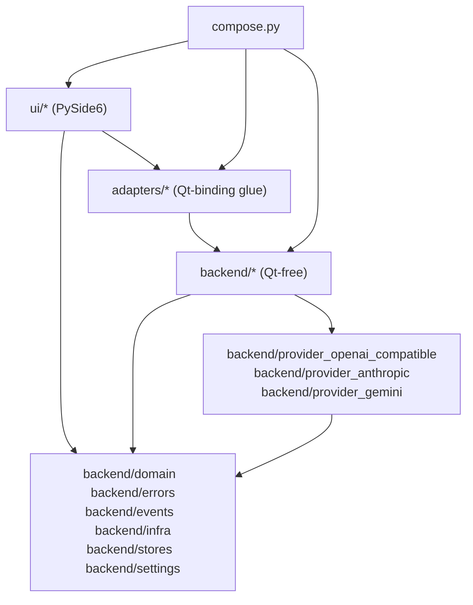

---
paths:
  - "src/**/*.py"
  - "pyproject.toml"
---

# Project Structure

Source of truth: `docs/v3_specification/16_Engineering_Standards/01_PROJECT_STRUCTURE.md`. The
layout is not advisory — it is enforced by `import-linter`, `ruff`, and architecture tests, and
any deviation fails the pull-request gate.

## The src/ layout

The package lives at `src/ollama_llm_bench/`. The `src/` directory is mandatory — a flat
(src-less) layout is forbidden, because it lets the test suite or the packaging step
accidentally import the working-tree copy and mask missing-dependency/missing-data-file bugs.

```toml
[tool.uv.build-backend]
module-name = "ollama_llm_bench"
module-root = "src"

[tool.pytest.ini_options]
testpaths = ["src", "tests"]
pythonpath = ["src"]
```

## Repository tree

```
ollama-llm-bench/
├── CLAUDE.md
├── README.md
├── CHANGELOG.md
├── LICENSE
├── pyproject.toml
├── uv.lock                          # COMMITTED
├── .python-version                  # 3.13.3
├── .gitignore
├── .gitattributes
├── .editorconfig
├── justfile
│
├── docs/
│   ├── architecture/
│   ├── adr/                         # MADR 4.0 — see repository-documentation.md
│   ├── stories/                     # see traceability-and-stories.md
│   ├── v3_specification/            # vendored, read-only spec
│   └── development/
│
├── src/
│   └── ollama_llm_bench/
│       ├── __init__.py
│       ├── __main__.py               # python -m ollama_llm_bench entry point
│       ├── compose.py                # the single composition root
│       │
│       ├── backend/                  # Qt-free (no PySide6 imports anywhere here)
│       │   ├── domain/                          # shared DTOs (msgspec Structs) + enums
│       │   ├── errors/                          # error taxonomy + redaction
│       │   ├── events/                          # typed event bus CORE (Qt-free)
│       │   ├── infra/                            # cross-cutting Qt-free infrastructure
│       │   ├── settings/                         # SettingsService + RunSnapshotBuilder Protocols
│       │   ├── stores/                           # reactive state stores (psygnal; Qt-free)
│       │   │   └── inference_activity/           # application-wide single-inference gate store
│       │   ├── persistence/                      # per-aggregate SQLite stores + schema (SIX sub-features)
│       │   │   ├── runs/                         # RunsStore (BenchmarkRun aggregate)
│       │   │   ├── tasks/                        # TasksStore (BenchmarkTask aggregate)
│       │   │   ├── results/                      # ResultsStore (BenchmarkResult aggregate + recovery sweep)
│       │   │   ├── providers/                    # ProvidersStore (provider catalog)
│       │   │   ├── model_capabilities/           # ModelCapabilitiesStore
│       │   │   └── app_settings/                 # AppSettingsStore (typed settings incl. app_meta)
│       │   ├── platform/                         # Platform Detector
│       │   ├── concurrency/                      # CancellationToken, executors, scheduling
│       │   ├── benchmark_pipeline/               # five-phase batched orchestrator
│       │   ├── evaluation/                       # rule + keyword + cosine + judge evaluation pipeline
│       │   ├── embedding/                        # embedding service + cosine
│       │   ├── adaptive_timeout/                 # adaptive timeout service
│       │   ├── circuit_breaker/                  # circuit breaker
│       │   ├── readiness/                        # readiness probe + aggregator
│       │   ├── mode_visibility/                  # mode-visibility policy
│       │   ├── run_drift/                        # run-drift detector
│       │   ├── yaml_formatter/                   # comment-preserving YAML formatter
│       │   ├── task_files/                       # task-file loader + validator
│       │   ├── charts/                           # chart aggregation service (Qt-free)
│       │   ├── csv_export/                       # CSV / Markdown table serializer
│       │   ├── html_rendering/                   # HTML renderer (string output; Qt-free)
│       │   ├── run_analysis/                     # consolidated run-analysis service
│       │   ├── performance_task_generator/       # synthetic-task generator for SYNTHETIC mode
│       │   ├── log_formatting/                   # event -> display-string formatter
│       │   ├── log_file_writer/                  # rotating + per-run log writers
│       │   ├── model_helpers/                    # model name parser, capability service, embedding classifier
│       │   ├── retry/                            # retry policy primitives
│       │   ├── provider_registry/                # holds all LLMClient instances
│       │   ├── provider_openai_compatible/       # Ollama / LM Studio / llama.cpp / OpenAI / Azure
│       │   ├── provider_anthropic/               # Anthropic provider adapter
│       │   └── provider_gemini/                  # Gemini provider adapter
│       │
│       ├── adapters/                 # Qt-binding glue between backend and ui
│       │   ├── qt_event_bus/                     # Qt delivery adapter — pure bus -> Qt signals
│       │   ├── qt_benchmark_flow/                # Qt-side facade over backend benchmark_pipeline
│       │   ├── qt_table_models/                  # QAbstractTableModel adapters
│       │   ├── qt_runnables/                     # QRunnable wrappers for backend work units
│       │   ├── store_qt_bridge/                  # psygnal -> Qt signal bridge
│       │   ├── qt_inference_activity_bridge/     # psygnal -> Qt bridge for InferenceActivityStore
│       │   ├── workspace_controller/             # workspace-switch coordinator (Qt-bound)
│       │   ├── notification_service/             # QStatusBar + QMessageBox notification
│       │   ├── native_pickers/                   # NativePickers Protocol
│       │   ├── clipboard/                        # Clipboard Protocol
│       │   └── file_system_actions/              # FileSystemActions Protocol
│       │
│       └── ui/                       # PySide6 user interface
│           ├── theme/                            # design tokens + the single QSS generator
│           ├── shared/                           # shared visual primitives
│           │   ├── provider_dropdown/
│           │   └── model_dropdown/
│           ├── main_window/                      # application shell
│           ├── new_benchmark/                    # New tab (+ mode_specifics/)
│           ├── resume_benchmark/                 # Resume tab
│           ├── progress/                         # benchmark workspace centre panel
│           ├── results/                          # benchmark workspace right panel (+ tabs/)
│           ├── settings_dialog/                  # (+ sub_dialogs/)
│           ├── task_editor/                      # Task Editor workspace
│           └── common_dialogs/                   # shared confirmation / summary dialogs
│
├── tests/
│   ├── conftest.py
│   ├── architecture/
│   ├── unit/
│   ├── integration/
│   ├── e2e/
│   ├── perf/
│   └── typing_negative/
│
├── scripts/
└── packaging/
```

## The feature-first module framework

The unit of architecture is the **module**: a first-party package directory with a stable
public surface, hidden internals, and an optional swap point. The repository is feature-first
within the three-layer split — every package under `backend/`, `adapters/`, or `ui/` is either
a feature package or a shared-infrastructure package. There is no top-level `models/`,
`services/`, or `controllers/` directory.

Three rules:

- **The module is the unit, not the file.** A 50-line utility and a 2000-line widget both get
  their own module directory with the same public surface. No loose single-file modules.
- **Depth varies with complexity.** A simple module has a flat `_internal/`; a complex one
  layers `_internal/` into sub-directories and may contain sub-feature packages.
- **Features may contain sub-features.** `ui/results/` contains `summary_tab/`, `details_tab/`,
  `charts_tab/`, `run_analysis_tab/` — each itself a full module nested inside a parent.

## The module public surface — exactly five files

Every module exposes a small fixed public surface; everything else hides under `_internal/`:

```
src/ollama_llm_bench/<feature>/
    __init__.py        # Thin facade: docstring + __all__ + re-exports from .api
    api.py              # Public functions, factories, Protocol re-exports — NO logic
    models.py           # msgspec.Struct DTOs and event types owned by this module
    protocols.py        # OPTIONAL — only when the module offers a swap point
    testing.py          # OPTIONAL — fakes / stubs / fixtures for downstream tests
    _internal/          # PRIVATE — all implementation
        __init__.py     # Docstring: "Private internals; do not import."
        *.py
    tests/               # Colocated unit tests scoped to THIS module only
        __init__.py
        conftest.py
        test_*.py
```

| File | Contains | Must not contain |
|---|---|---|
| `__init__.py` | Module docstring, literal `__all__: list[str]`, re-exports from `.api` | Implementation logic; any statement other than docstring/imports/`__all__` |
| `api.py` | Public functions/factories with `icontract` decorators; Protocol re-imports | Implementation bodies of non-trivial logic; private helpers not prefixed `_` |
| `models.py` | `msgspec.Struct(frozen=True, kw_only=True, gc=False)` DTOs; module-owned event types | Imports from `_internal/`; mutable module-level state |
| `protocols.py` | `typing.Protocol` definitions for swap points | Concrete implementations |
| `testing.py` | Fakes implementing the module's Protocols; canned fixtures | Real I/O, network, or database access |
| `_internal/*.py` | All implementation; may import `..models` and `..protocols` | Imports from `..api` (creates a cycle); module-level mutable globals |

**Consumers import from the package root only**:

```python
# Correct
from ollama_llm_bench.backend.csv_export import write_rows, CsvRow

# Forbidden — bypasses the public facade (ruff banned-api)
from ollama_llm_bench.backend.csv_export.api import write_rows

# Forbidden — reaches into private internals (import-linter)
from ollama_llm_bench.backend.csv_export._internal.writer import _write_rows_impl
```

`__all__` must be a literal `list[str]` written directly in `__init__.py` — a computed
`__all__` assembled from sub-module lists breaks under `mypy --strict --no-implicit-reexport`
and is forbidden.

| Module character | API shape |
|---|---|
| Pure transformation, no state, no swap point | Free function in `api.py` |
| Two or more interchangeable implementations | `Protocol` in `protocols.py` + concrete classes in `_internal/` |
| One implementation with constructor configuration | Class factory in `api.py` returning a Protocol type |
| Qt widget | Mountable widget factory in `api.py` returning a `QWidget` |
| Event publisher | Event types as frozen `msgspec.Struct` in `models.py` |

A module whose `_internal/` grows beyond roughly 1500 lines, or whose public surface would
need more than five files, is split into a parent feature with sub-features — structural only,
it never changes how consumers import from it.

UI feature modules follow the MVC-family layout inside `_internal/` (full rule and rationale
in `pyside6-app-development.md`):

```
src/ollama_llm_bench/ui/new_benchmark/
    __init__.py
    api.py                       # make_new_benchmark_widget(...) -> QWidget
    models.py                    # frozen ViewModel Struct + UI event types
    _internal/
        view.py                  # QWidget subclass: rendering only
        controller.py             # store subscriptions + signal handlers
        view_model_select.py      # pure functions: store state -> ViewModel
    tests/
```

## The composition root

There is exactly **one** composition root: `src/ollama_llm_bench/compose.py` — roughly 50-200
lines of manual factory calls. No dependency-injection container, no `@inject`, no
`Annotated[..., Depends(...)]`, no service locator, no reflection-based wiring.

`compose.py` is the **only** file allowed to import concrete provider adapters, the six
concrete per-aggregate persistence-store implementations, and concrete evaluators. Every other
file imports Protocols.

`src/ollama_llm_bench/__main__.py` is the process entry point: it creates the single
`QApplication`, calls `build_app`, shows the main window, runs the Qt event loop. There is no
asyncio/qasync loop (D-R-01). It contains no business logic.

## Import boundaries — dependency direction is strictly inward

- **Backend layer** (`backend/*`) — pure Python, imports no PySide6, no `adapters/`, no `ui/`.
  Runs headlessly under `pytest` with no `QApplication`.
- **Adapters layer** (`adapters/*`) — the only layer importing both `backend/*` and PySide6.
  Qt-binding glue: event-bus deliverer, `QAbstractTableModel` adapters, `QRunnable` wrappers,
  the psygnal-to-Qt store bridge, the workspace controller, the notification service, and the
  three OS-adapter Protocols (`NativePickers`, `Clipboard`, `FileSystemActions`).
- **UI layer** (`ui/*`) — depends on PySide6. Imports `ui/*`, `adapters/*`, and a strictly
  limited slice of `backend/*` (`domain`, `errors`, `events`, `stores`, `settings`, Protocol
  re-exports). Must not import concrete backend implementations directly.



| Folder | May import | Must not import |
|---|---|---|
| `backend/domain/` | stdlib, `msgspec` | Anything else project-internal |
| `backend/errors/` | stdlib, `msgspec` | `ui`, `adapters`, provider adapters |
| `backend/infra/` | stdlib, third-party infra libraries | `ui`, `adapters`, higher-level `backend/*` |
| `backend/events/` | stdlib, `msgspec` | `ui`, `adapters`, provider adapters |
| `backend/settings/` | `backend/infra`, `backend/persistence/app_settings` Protocol, `msgspec` | `ui`, `adapters`, higher-level `backend/*` |
| `backend/stores/` | `backend/infra`, `backend/events`, `backend/domain`, `msgspec`, `psygnal` | `ui`, `adapters` |
| `backend/persistence/{runs,tasks,results,providers,model_capabilities,app_settings}/` | `backend/domain`, `backend/infra`, `backend/errors`, `msgspec`, `sqlite3` | `ui`, `adapters`, other `backend/persistence/*` sub-features |
| `backend/benchmark_pipeline/`, `backend/evaluation/`, other `backend/*` services | `backend/domain`, `backend/infra`, `backend/events`, sibling `backend/*` Protocols | `ui`, `adapters`, concrete provider adapters |
| `backend/provider_openai_compatible/`, `backend/provider_anthropic/`, `backend/provider_gemini/` | their own SDK, `backend/domain`, `backend/errors`, `backend/infra`, `backend/events` | other `backend/provider_*` modules, `ui`, `adapters` |
| `adapters/*` | PySide6, any `backend/*` package | `ui` |
| `ui/theme/` | PySide6, stdlib, `msgspec`, `backend/domain` | other `ui/*` widgets, `adapters`, concrete backend services |
| `ui/*` (widgets/dialogs) | PySide6, `adapters/*`, `ui/theme`, `ui/shared`, `backend/domain`, `backend/errors`, `backend/events`, `backend/stores`, `backend/settings`, Protocol re-exports | direct SQLite, concrete provider adapters, concrete `backend/*` implementations, any `_internal/` package |
| `compose.py` | everything | — |

Concrete provider adapters never import each other — they are independent and interchangeable
through the `LLMClient` Protocol.

## Boundary enforcement — four layers

| Layer | Tool | Catches |
|---|---|---|
| Boundary contracts | `import-linter` | Layered dependency direction, private-internal access, provider independence, sole composition root |
| Per-file rules | `ruff` | Relative imports, banned-API imports through `.api`, dead re-exports |
| Type discipline | `mypy --strict` | `__all__` correctness under `--no-implicit-reexport`, full type coverage |
| Architecture tests | `pytest` AST walkers | Symbol-level rules: no module-level mutable globals, public-API contract presence |

Four `import-linter` contracts pin the structure (configured in `pyproject.toml`, run via
`uv run lint-imports`):

1. **Backend layer is Qt-free** — `forbidden`: every `backend/*` package forbids `PySide6`.
2. **Module internals are private** — `forbidden`: nothing outside a module imports its own
   `_internal` package (test code is given a higher access tier via `ignore_imports`).
3. **Provider adapters are independent** — `independence`: `provider_openai_compatible`,
   `provider_anthropic`, `provider_gemini` never import each other.
4. **Only compose.py wires concrete adapters** — `forbidden`: `ui` and `adapters` forbid
   importing the three concrete provider-adapter packages.

The colocated per-module `tests/` directories are allowed to import that module's `_internal/`
package via `import-linter` `ignore_imports` and `ruff` per-file-ignores.

## Required root files

`pyproject.toml`, `uv.lock` (committed), `.python-version` (single line, `3.13.3`),
`README.md`, `CHANGELOG.md` (Keep-a-Changelog, `[Unreleased]` maintained), `LICENSE` (SPDX id
matching `pyproject.toml`), `.gitignore`, `.gitattributes` (`* text=auto eol=lf` + binary
markers), `.editorconfig`, `justfile`. There is one project version in `pyproject.toml` and one
top-level `CHANGELOG.md` — modules do not carry their own `__version__` or `CHANGELOG.md`.

## Anti-patterns

| Anti-pattern | Why it is wrong | Correct approach |
|---|---|---|
| A flat (src-less) package directory | Working-tree imports mask packaging bugs | `src/` layout |
| A loose single-file module | Bypasses the public-surface convention | Module directory with the five-file surface |
| A file named `interfaces.py` collecting unrelated Protocols | Becomes a god-interface; couples unrelated modules | One `protocols.py` per module, scoped to that module's swap point |
| A consumer importing through `.api` or `._internal` | Bypasses the facade; breaks under refactor | Import from the package root |
| A computed `__all__` | Breaks `mypy --no-implicit-reexport` | Literal `list[str]` in `__init__.py` |
| Concrete adapter constructed outside `compose.py` | Defeats the swap point; hides wiring | Construct in `compose.py`, pass the Protocol |
| `_internal/` importing `..api` | Creates an import cycle | `_internal/` imports `..models` and `..protocols` only |
| A dependency-injection container or service locator | Hides dependencies; reflection defeats `mypy` | Manual constructor wiring in `compose.py` |
| Top-level technical-layer directories (`services/`, `models/`) | Not feature-first; scatters one feature across the tree | Feature packages under `backend/`, `adapters/`, or `ui/` |
