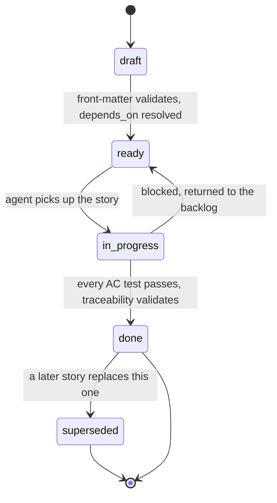
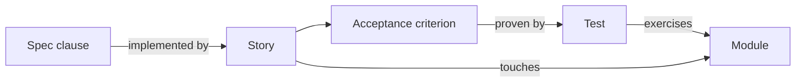

---
paths:
  - "docs/stories/**/*.md"
  - "docs/adr/**/*.md"
---

# Traceability and Stories

Source of truth: `docs/v3_specification/14_Process_and_Traceability/02_STORY_FORMAT.md` and
`03_TRACEABILITY.md` (story format), `04_ADR_FORMAT.md` (ADR format). See also
`repository-documentation.md` for where these files live in the `docs/` tree.

## What a story is

A story is the unit of work the implementation agent executes: a single Markdown file with a
**YAML front-matter block** (machine-readable: id, spec clauses, modules, acceptance-criterion
ids, dependencies) and a **Markdown body** (human-readable: goal, scope, design constraints,
acceptance criteria written out, test plan). A story is *complete* only when every acceptance
criterion has a passing test, every test names the story in its docstring, and the
traceability record validates with no orphans. A story is never partially landed.

### The hard rule: every story must cite real spec clauses and real modules

**Every story MUST cite at least one real `spec_clauses:` anchor and at least one real
`modules:` path from `01_MODULE_INVENTORY.md`.** A story citing no spec clause is invalid,
full stop — `trace.py` rejects it. Each `spec_clauses` entry is
`<spec-file-path>#<anchor>` and must resolve to a real file and heading inside
`docs/v3_specification/`; each `modules` entry must be a module path that exists in
`01_MODULE_INVENTORY.md`.

### Story identifiers

`STORY-NNN` (zero-padded three digits, assigned in creation order, permanent — never reused,
renumbered, or deleted even when superseded). Acceptance criteria are `STORY-NNN-AC-N`,
likewise permanent.

### Where stories live

`docs/stories/story-NNN-short-slug.md` — flat directory, one file per story. The `modules:`
front-matter records the feature, not the file location.

### Front-matter schema (required fields)

```yaml
---
id: STORY-042                       # STORY-\d{3}, unique
title: Resume a stopped run from its persisted result rows
status: draft                       # draft | ready | in-progress | done | superseded
spec_clauses:                       # >=1; must resolve to a real heading
  - 03_Resume_Benchmark_Widget/description.md#resume-action
  - 08_Cross_Cutting/08-I_edge_cases.md#EC-RUN-5
modules:                            # >=1; must exist in 01_MODULE_INVENTORY.md
  - ui/resume_benchmark/
  - backend/benchmark_pipeline/
acceptance_criteria:                # >=1; defined in the body
  - STORY-042-AC-1
  - STORY-042-AC-2
edge_cases:                         # optional; EC ids from 08-I or a scoped catalog
  - EC-RUN-5
depends_on:                         # >=0; acyclic
  - STORY-018
adrs:                                # optional; accepted ADR ids only
  - ADR-0007
owner: coder                        # arch | coder | tester
estimate: M                         # S | M | L
---
```

| `estimate` | Bound |
|---|---|
| `S` | One module; 1-3 acceptance criteria; no new public API |
| `M` | Up to three modules; up to six acceptance criteria; may add one public API symbol |
| `L` | Up to five modules; up to ten acceptance criteria; may add a sub-feature package |

A story that would exceed `L` is split into a parent story and dependent child stories linked
through `depends_on`. A story never crosses the backend/UI boundary leaving either side
unverifiable on its own — a UI story `depends_on` the backend story that supplies its
Protocols.

### Story lifecycle



**One story = one coding session.** A change to an `Accepted` spec clause that a `done` story
depends on is never silently re-edited — it requires a **new story**, plus a **new ADR** if the
change is architecturally significant.

## ADRs

An ADR records a decision that is architecturally significant, costly to reverse, and not
pre-settled by the specification. It does **not** duplicate a rule the specification already
fixes — cite the spec document instead.

- **Identifier**: `ADR-NNNN` (zero-padded four digits, permanent).
- **Location**: `docs/adr/NNNN-short-slug.md`, one file per ADR, plus `docs/adr/README.md` as
  the index table (ADR, Title, Status, Supersedes, Superseded by).
- **A `proposed` ADR is never cited by a story's `adrs:` front-matter** — only `accepted` ADRs
  may be cited.
- **Supersession**: a new ADR's `Supersedes:` line names the old one; the old ADR's `Status:`
  becomes `superseded by ADR-NNNN`, and that is the **only** edit ever made to an `accepted`
  ADR's body. The old file is never deleted. A decision splitting into two later decisions is
  recorded as the old ADR `deprecated` plus two new independent ADRs.

```markdown
# ADR-NNNN — <decision title, one imperative phrase>

**Status:** proposed | accepted | superseded by ADR-MMMM | deprecated
**Date:** YYYY-MM-DD
**Deciders:** <roles or names>
**Supersedes:** ADR-MMMM   (omit when none)

## Context and problem statement
## Decision drivers
## Considered options
## Decision outcome
### Consequences
## Pros and cons of the options
## Links
- Spec clauses: [files this decision implements or constrains]
- Stories: [STORY-NNN that apply this decision]
```

## The traceability chain and traceability.yaml



`traceability.yaml` lives at the repository root next to `pyproject.toml`. It is **generated,
never hand-edited**, regenerated from `docs/stories/` and the collected test suite by
`scripts/trace.py`. It has four index maps (`stories`, `clauses`, `edge_cases`, `modules`) so
any direction can be queried in O(1).

A test that proves an acceptance criterion declares it on the **first line of its docstring**
in the fixed form:

```python
def test_resume_selects_only_resumable_rows() -> None:
    """Proves: STORY-042-AC-2

    Re-runs only non-terminal rows and selected retryable failures; leaves
    every COMPLETED row untouched.
    """
    ...
```

### The two-script workflow — run after any story file change

- **`just trace`** (`scripts/trace.py`) regenerates `traceability.yaml` from the current
  stories and the current test suite (`pytest --collect-only`, reading each test's `Proves:`
  docstring line). It **must be run after any story file changes.**
- **`just trace-check`** (`scripts/validate_traceability.py`) runs in the pull-request gate and
  **must pass — zero gaps** — before a story can be marked `done`:

| Check | Failure condition |
|---|---|
| Clause resolves | A `spec_clauses` entry does not point to a real file/heading anchor |
| Module exists | A `modules` entry is not listed in `01_MODULE_INVENTORY.md` |
| No orphan clause | A spec clause marked traceable is named by no story |
| No orphan story | A story names no spec clause, or a `done` story has an AC with no test |
| Acceptance criterion proven | A `done` story has an AC with an empty `tests` list |
| No orphan test | A test's `Proves:` names an AC that no story defines |
| Edge-case covered | Every `EC-` id across all catalogs appears in some story's `edge_cases` and has a test; no dangling row in the edge-case-to-test mapping |
| Acyclic dependencies | The `depends_on` graph contains a cycle |
| Record fresh | Re-running the generator produces a file differing from the committed `traceability.yaml` |

The "record fresh" check makes a hand-edited or stale `traceability.yaml` a build failure — the
committed copy is only valid if it is exactly what the generator would produce from the
current stories and tests.

## Authoring checklist (before draft -> ready)

- [ ] Front-matter has every required field, no unknown field.
- [ ] Every `spec_clauses` entry resolves to a real file and heading under `docs/v3_specification/`.
- [ ] Every `modules` entry is listed in `01_MODULE_INVENTORY.md`.
- [ ] Every acceptance-criterion id in the front-matter is defined in the body.
- [ ] Every `depends_on` story exists; the dependency graph stays acyclic.
- [ ] The story fits its `estimate` bound.
- [ ] Each acceptance criterion is independently verifiable and names its test in the Test plan.
- [ ] Each `edge_cases` entry has a row in the edge-case-to-test mapping and a test in the plan.
