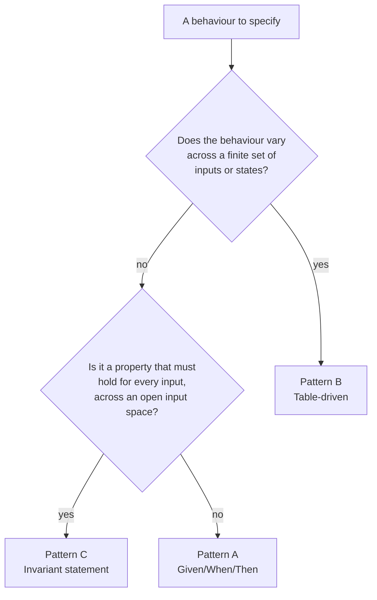

# Acceptance Criteria Authoring

An acceptance criterion in a story is the precise, verifiable statement that a slice of behaviour is
correct. Because the test for a criterion is derived directly from its wording, the criterion must be
written so that exactly one test can prove it pass or fail. A vague criterion produces a vague test that
passes when the behaviour is wrong.

Source of truth: `docs/v3_specification/14_Process_and_Traceability/05_ACCEPTANCE_CRITERIA_PATTERNS.md`.

Every acceptance criterion in every story uses **exactly one** of three sanctioned patterns: Given/When/Then
(Pattern A), Table-driven (Pattern B), or Invariant (Pattern C). There is no fourth pattern. If a behaviour
cannot be expressed in one of the three, the behaviour itself is under-specified — sharpen the spec, don't
invent a new pattern.

## Properties every criterion must have, regardless of pattern

- **Verifiable** — a test can decide pass or fail with no human judgement.
- **Single-concept** — it asserts one logical thing. Two concerns are two criteria (mirrors the testing rule
  that a test asserts exactly one logical concept).
- **Behavioural, not structural** — it states what the application *does*, not how the code is *shaped*.
  Structural rules belong to architecture tests, never to acceptance criteria.
- **Stable** — its identifier `STORY-NNN-AC-N` is permanent once assigned; never renumber or reuse it.
- **Self-contained** — it names its own precondition; it never depends on a sibling criterion having run
  first (tests run in randomised order).

## Decision tree: which pattern?



In words:

- Varies across a **finite, enumerable set** of inputs or states — a status, a mode, an enum, a small
  condition matrix — use **Pattern B**.
- Is a **universal property** that must hold for *every* input across an open or large input space — a
  round-trip, a bound, an ordering — use **Pattern C**.
- Is a **single concrete flow** — one trigger, one expected outcome, no enumerable variation, no universal
  claim — use **Pattern A**. This is the default and covers most UI-action and use-case criteria.

When two patterns seem to fit, prefer the more specific one: prefer a table over five near-identical
Given/When/Thens; prefer an invariant over a table that is secretly sampling an open space.

## Pattern A — Given/When/Then

One precondition, one action, one observable outcome. The default pattern.

```markdown
### STORY-NNN-AC-N
Given <the precondition / starting state>,
when <the single action or trigger>,
then <the single observable, asserted outcome>.
```

Worked example (from the spec):

```markdown
### STORY-017-AC-1
Given a run is in the in-memory RUNNING state,
when the user clicks Start,
then Start is a no-op and no second pipeline or run record is created.
```

Maps to one Arrange-Act-Assert test:

```python
def test_start_clicked_while_running_is_noop(mocker) -> None:
    # Arrange
    activity_store = make_activity_store()
    activity_store.try_acquire(InferenceActivity.BENCHMARK_RUN)  # a run is already RUNNING
    flow_api = make_flow_api(activity_store=activity_store)

    # Act
    flow_api.start(config=make_run_config())

    # Assert
    assert flow_api.active_run_count() == 1
```

A criterion has exactly one `when` and one `then`. Two `then` clauses means two criteria — split it.

## Pattern B — Table-driven

Use when the variation across a finite case set *is the point* — a per-status outcome, a per-mode
visibility rule, a per-enum default. One table-driven criterion replaces a scatter of near-identical
Given/When/Then criteria.

Worked example (from the spec):

```markdown
### STORY-042-AC-2
On resume, each persisted result row is treated per its status:

| Row status before resume | Action on resume |
|---|---|
| PENDING | re-run |
| RUNNING_INFERENCE | reset to PENDING, then re-run |
| AWAITING_KEYWORD_CHECK | re-run |
| AWAITING_COSINE_CHECK | re-run |
| AWAITING_JUDGE_CHECK | re-run |
| FAILED_INFERENCE | re-run only if the user selected it |
| FAILED_PROVIDER | re-run only if the user selected it |
| FAILED_TIMEOUT | re-run only if the user selected it |
| ERRORED | re-run only if the user selected it |
| COMPLETED (any verdict) | left untouched |
```

Maps to one `@pytest.mark.parametrize` test — **no loop inside the test body**:

```python
@pytest.mark.parametrize(
    "row_status,expect_rerun",
    [
        (ResultStatus.PENDING, True),
        (ResultStatus.RUNNING_INFERENCE, True),
        (ResultStatus.AWAITING_KEYWORD_CHECK, True),
        (ResultStatus.AWAITING_COSINE_CHECK, True),
        (ResultStatus.AWAITING_JUDGE_CHECK, True),
        (ResultStatus.COMPLETED, False),
    ],
    ids=["pending", "running_inference", "awaiting_keyword", "awaiting_cosine", "awaiting_judge", "completed"],
)
def test_resume_treats_row_per_status(row_status: ResultStatus, expect_rerun: bool) -> None:
    # Arrange
    row = make_result_row(status=row_status)

    # Act
    plan = build_resume_plan(rows=[row], retry_selection=set())

    # Assert
    assert (row.task_id in plan.tasks_to_rerun) is expect_rerun
```

The table must be **total** over its case space: every member of the enumerated set has a row. A status
enum with ten members gets ten rows; a `(mode, section)` matrix gets a row per cell. Totality is what lets
the criterion claim the behaviour is fully specified.

## Pattern C — Invariant statement

Use when the behaviour is a property that must hold for *every* input across an open or large input space.
Not checked by enumerating cases — checked by a Hypothesis property test (or a `RuleBasedStateMachine` for
a stateful invariant).

```markdown
### STORY-NNN-AC-N
For every <input drawn from its full domain>, <the property that must hold>.
```

Worked examples (from the spec):

```markdown
### STORY-055-AC-1
For every valid task file, parsing it and re-serialising it with the YAML
formatter yields a file that parses to the same task list — the round trip
is an identity on task content.

### STORY-061-AC-2
For every sequence of inference outcomes, the adaptive timeout the service
returns is always within the configured minimum and maximum timeout bounds,
inclusive.
```

Maps to a Hypothesis property test:

```python
from hypothesis import given, strategies as st

@given(outcomes=st.lists(st.sampled_from(["success", "timeout", "error"]), min_size=1, max_size=50))
def test_adaptive_timeout_stays_within_bounds(outcomes: list[str]) -> None:
    # Arrange
    service = make_adaptive_timeout_service(min_seconds=5, max_seconds=120)

    # Act
    timeouts = [service.next_timeout(outcome) for outcome in outcomes]

    # Assert
    assert all(5 <= t <= 120 for t in timeouts)
```

An invariant criterion names its input domain precisely, so the test's Hypothesis strategy can be derived
directly from the wording.

## From criterion to test — quick reference

| Pattern | Test shape | Typical tier |
|---|---|---|
| A — Given/When/Then | One Arrange-Act-Assert test function. | Unit, or integration when the flow crosses a real resource boundary. |
| B — Table-driven | One `@pytest.mark.parametrize` test; one row per case. | Unit, occasionally integration. |
| C — Invariant | One Hypothesis property test, or a `RuleBasedStateMachine` for a stateful invariant. | Unit (`property`-marked). |

The story's test plan names the test file and function for each criterion, and the test's docstring
declares `Proves: STORY-NNN-AC-N` so the traceability validator can build the criterion-to-test link.

## Anti-patterns

| Anti-pattern | Why it is wrong | Correct approach |
|---|---|---|
| A criterion with two `then` clauses | Two concerns hidden as one; a test must assert one concept. | Split into two criteria. |
| A Given/When/Then repeated five times with one word changed | The variation is the behaviour; five criteria hide a table. | One table-driven criterion. |
| A table-driven criterion with rows missing from the case space | The criterion no longer specifies the behaviour fully. | Make the table total over its enumerated set. |
| An invariant written as a single example | An example proves one input, not the property. | State the universal claim; the test is a Hypothesis property. |
| A criterion that asserts code structure ("the controller is split into four sub-controllers") | Structure is proven by architecture tests, not acceptance criteria. | State the behaviour; let an architecture test cover the structure. |
| A criterion that depends on a sibling criterion having run first | Tests run in randomised order; the dependency breaks. | Make each criterion name its own precondition. |
| A criterion phrased as a wish ("the export should be fast") | Not verifiable; no test can decide it. | State the underlying invariant (for example, "the export runs in an executor worker so the GUI loop is not blocked") and let an architecture or concurrency test cover it. |

## Cross-references

- `docs/v3_specification/14_Process_and_Traceability/02_STORY_FORMAT.md` — where criteria live in a story.
- `docs/v3_specification/14_Process_and_Traceability/03_TRACEABILITY.md` — how criterion-to-test links are validated.
- `docs/v3_specification/14_Process_and_Traceability/06_EDGE_CASE_TO_TEST_MAPPING.md` — edge cases map to one of these same three patterns; see the `edge-case-coverage` skill.
- `docs/v3_specification/16_Engineering_Standards/07_TESTING_STANDARD.md` — the Arrange-Act-Assert shape, `@pytest.mark.parametrize` rules, and Hypothesis profiles these tests must follow.
