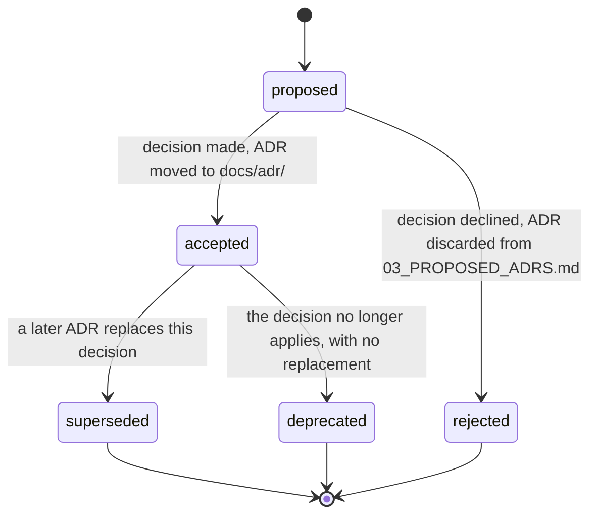

# ADR Authoring

An Architecture Decision Record (ADR) captures one architecturally significant decision — what was
decided, what alternatives were weighed, and what consequences follow — so the reasoning behind the
codebase survives the moment it was made. A later contributor reads the ADR before changing the decision,
and either accepts the existing reasoning or writes a new ADR that supersedes it.

Source of truth: `docs/v3_specification/14_Process_and_Traceability/04_ADR_FORMAT.md`.

## When to write an ADR

Write one when a decision meets **all three** of these tests:

- **Architecturally significant** — it affects module boundaries, a public contract, the concurrency
  model, the persistence shape, the dependency direction, or a cross-cutting policy.
- **Costly to reverse** — undoing it later would touch many modules or break a contract other modules
  rely on.
- **Not pre-settled by the specification** — the specification leaves a genuine choice, or implementation
  surfaced a choice the specification did not anticipate.

Do **not** write an ADR for a local, easily reversible coding choice — that belongs in a code comment or a
story note. Do not duplicate a rule the specification already fixes — cite the spec document instead.

A change to an Accepted specification clause that a `done` story depends on **requires** an ADR — the ADR
is the record that the contract changed and why.

## Where ADRs live

Accepted ADRs live in `docs/adr/`, one Markdown file per ADR, named `NNNN-short-slug.md` (for example
`docs/adr/0007-single-writer-runs-store-queue.md`). `docs/adr/` is a sibling of `docs/stories/`.

ADRs that are still *proposed* — drafted but not yet accepted — are held in
`docs/v3_specification/15_Risks_and_Open_Questions/03_PROPOSED_ADRS.md` until a decision is made. An ADR
file appears in `docs/adr/` only once its status is `accepted`.

## Identifier convention

Every ADR has a stable identifier `ADR-NNNN` — a zero-padded four-digit number assigned in creation order,
matching the filename's four-digit prefix. The identifier is **permanent**: once `ADR-0007` is assigned it
is never reused, never renumbered, never deleted. A superseded ADR keeps its identifier and its file. A
story may cite an ADR in its `adrs:` front-matter using the `ADR-NNNN` form.

## The template (verbatim)

The template is short by design — an ADR that needs more than two pages is recording more than one
decision and must be split.

```markdown
# ADR-NNNN — <decision title, one imperative phrase>

**Status:** proposed | accepted | superseded by ADR-MMMM | deprecated
**Date:** YYYY-MM-DD
**Deciders:** <roles or names>
**Supersedes:** ADR-MMMM   (omit when none)
**Superseded by:** ADR-MMMM   (added only when this ADR is later superseded)

## Context and problem statement
[Two or three paragraphs. The forces at play: what situation demands a
decision, what constraints bound it, what is at stake. State the problem as
a question.]

## Decision drivers
- [Bullet list: the criteria a good answer must satisfy — a performance
  budget, a module-boundary rule, a maintainability concern.]

## Considered options
- Option A — [one line]
- Option B — [one line]
- Option C — [one line]

## Decision outcome
Chosen option: **Option B**, because [the one or two sentences that tie the
choice to the decision drivers].

### Consequences
- Positive — [what becomes easier or safer]
- Negative — [what becomes harder, what is given up, what risk is accepted]
- Neutral — [a follow-on that is neither good nor bad but must be noted]

## Pros and cons of the options

### Option A — [name]
- Good — [point]
- Bad — [point]

### Option B — [name]
- Good — [point]
- Bad — [point]

### Option C — [name]
- Good — [point]
- Bad — [point]

## Links
- Related ADRs: ADR-MMMM
- Spec clauses: [spec files this decision implements or constrains]
- Stories: [STORY-NNN that apply this decision]
```

`Status`, `Date`, and `Deciders` are mandatory. `Supersedes` is present only when this ADR replaces an
earlier one. `Superseded by` is absent when the ADR is first written and is added later, in place, when a
replacement is accepted.

## Worked example

```markdown
# ADR-0012 — Replace the single-writer queue with a WAL write lock

**Status:** accepted
**Date:** 2026-04-02
**Deciders:** architect
**Supersedes:** ADR-0007
**Superseded by:** —

## Context and problem statement
ADR-0007 serialised all RunsStore writes through an in-process queue consumed by a
dedicated writer thread. Under WAL mode this added a scheduling hop with no
durability benefit, and queue back-pressure was invisible to callers awaiting a
write's completion. Should writes stay queued, or commit synchronously on the
calling thread under a single lock?

## Decision drivers
- A write must be durably committed when the calling store method returns.
- No second writer-thread lifecycle to start, monitor, and shut down cleanly.
- WAL mode already serialises writers at the SQLite level; a queue adds no
  additional safety.

## Considered options
- Option A — Keep the queue-and-dedicated-writer-thread model from ADR-0007.
- Option B — One write connection guarded by one `threading.Lock`, synchronous on
  the calling thread.
- Option C — A connection pool with per-write `BEGIN IMMEDIATE` retries on `SQLITE_BUSY`.

## Decision outcome
Chosen option: **Option B**, because it gives callers a synchronous durability
guarantee with no queue-introduced latency, and removes an entire thread
lifecycle to manage.

### Consequences
- Positive — A write is durably committed the instant the store call returns; no
  caller needs to poll or await a queue.
- Negative — A long-running write briefly blocks every other writer on the lock;
  acceptable because writes are small and `busy_timeout` absorbs callers.
- Neutral — `journal_size_limit` must be applied to the single write connection
  only, not to read connections.

## Pros and cons of the options

### Option A — Queue and dedicated writer thread
- Good — Decouples caller latency from write latency.
- Bad — A second thread lifecycle; durability is only as strong as queue delivery.

### Option B — Single write connection plus lock
- Good — Synchronous durability; no extra thread.
- Bad — Caller blocks for the duration of its own write.

### Option C — Connection pool with busy-retry
- Good — Higher apparent write concurrency.
- Bad — SQLite single-writer semantics make the pool a false promise; retries add
  unbounded tail latency.

## Links
- Related ADRs: ADR-0007
- Spec clauses: `docs/v3_specification/10_Domain_and_Data/03_PERSISTENCE_SCHEMA.md` §2.1
- Stories: STORY-118
```

## Status lifecycle



| Status | Meaning |
|---|---|
| `proposed` | Drafted, awaiting acceptance. Held in `03_PROPOSED_ADRS.md`. |
| `accepted` | The decision is in force. The file is in `docs/adr/`. The text is now immutable except for adding a `Superseded by` line. |
| `superseded by ADR-MMMM` | A later ADR replaces this decision. The file stays in `docs/adr/` for history. |
| `deprecated` | The decision no longer applies and has no replacement. The file stays in `docs/adr/`. |
| `rejected` | A `proposed` ADR whose decision was declined. Removed from `03_PROPOSED_ADRS.md`; no file is created. |

A `proposed -> rejected` ADR is **discarded** — nothing is ever created in `docs/adr/` for it.

An `accepted` ADR is immutable: a new insight never edits the old ADR's body; it produces a new ADR that
supersedes it.

## Supersession discipline

1. Write the new ADR with the next free `ADR-NNNN` identifier. Its `Supersedes:` line names the old ADR.
2. In the old ADR, change `Status:` to `superseded by ADR-NNNN` and add a `Superseded by: ADR-NNNN` line —
   this is the **only** edit ever made to an `accepted` ADR's body.
3. Leave the old ADR file in `docs/adr/`. It is never deleted.
4. Update the ADR index so the chain is visible at a glance.

Supersession forms a chain, not a tree: each ADR is superseded by at most one ADR, and supersedes at most
one ADR. A decision that splits into two later decisions is recorded as the old ADR being `deprecated` and
two new independent ADRs being written.

## The ADR index

`docs/adr/README.md` is the single index table, maintained whenever an ADR is accepted or its status
changes:

```markdown
| ADR | Title | Status | Supersedes | Superseded by |
|---|---|---|---|---|
| ADR-0001 | Adopt the hexagonal feature-first module layout | accepted | — | — |
| ADR-0007 | Serialise RunsStore writes through a single-writer queue | accepted | — | ADR-0012 |
| ADR-0012 | Replace the single-writer queue with a WAL write lock | accepted | ADR-0007 | — |
```

## Authoring checklist

- [ ] Records exactly one decision; a multi-decision draft is split.
- [ ] Follows the template, with `Status`, `Date`, and `Deciders` present.
- [ ] The problem is stated as a question, and at least two real options are weighed.
- [ ] The decision outcome ties the choice to the decision drivers.
- [ ] Consequences list at least one negative or accepted risk — an ADR with only upside is under-examined.
- [ ] `Links` cites the spec clauses the decision implements or constrains.
- [ ] If it supersedes an earlier ADR, the supersession steps above are followed and the index is updated.
- [ ] The identifier is the next free `ADR-NNNN` and matches the filename prefix.

## Cross-references

- `docs/v3_specification/14_Process_and_Traceability/02_STORY_FORMAT.md` — how a story cites an ADR.
- `docs/v3_specification/14_Process_and_Traceability/03_TRACEABILITY.md` — traceability links involving ADRs.
- `docs/v3_specification/15_Risks_and_Open_Questions/03_PROPOSED_ADRS.md` — staging area for proposed ADRs.
