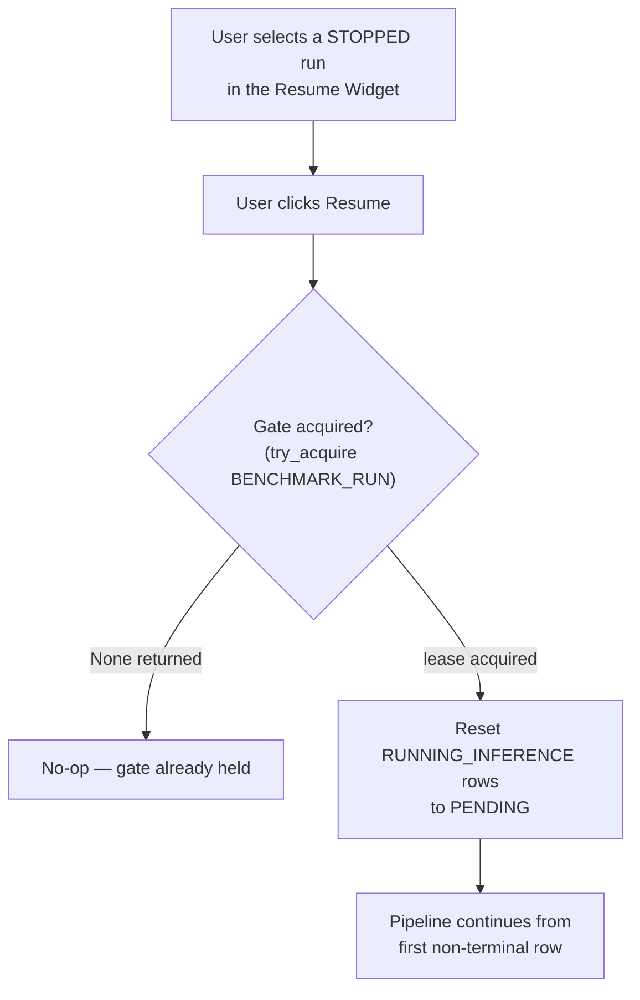
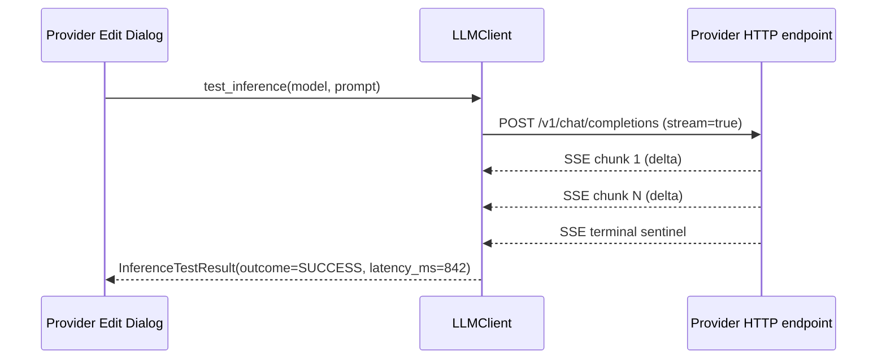
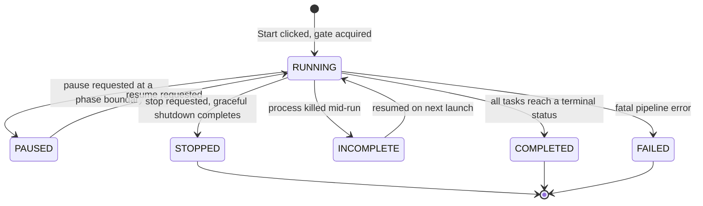
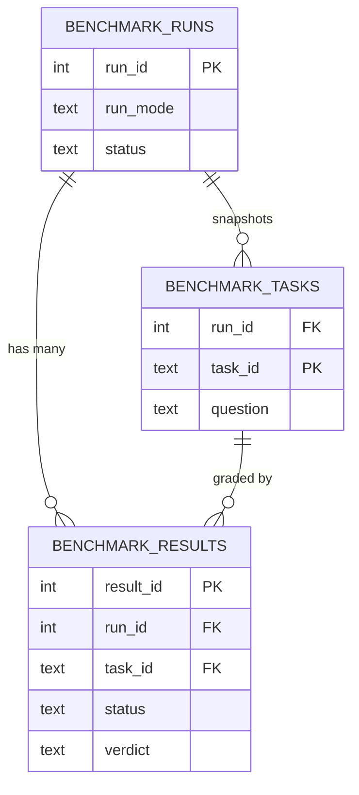

# Creating Mermaid Diagrams

All technical diagrams in this project — flow, state, sequence, entity-relationship, component — are
Mermaid. (UI surfaces such as windows, widgets, and dialogs are HTML mockups instead; that's a separate
concern.) This skill covers the four diagram types most relevant here: flowcharts for use-case flows,
sequence diagrams for request/response interactions, `stateDiagram-v2` for lifecycle state machines, and
`erDiagram` sketches for related tables.

## Validation checklist

Before treating a diagram as done:

- [ ] **Does it parse?** Mentally (or actually) run it through a Mermaid renderer. A single stray
      unescaped character (an unquoted `(`, `|`, or `#` inside a label) is the most common parse failure.
- [ ] **Are node labels readable?** Use `["Quoted label text"]` for any label containing spaces, slashes,
      or punctuation. Keep labels short — wrap long ones with ` ` rather than letting them overflow.
- [ ] **Is direction sensible?** `TD`/`TB` (top-down) for hierarchies and most flows; `LR` (left-right) for
      pipelines and sequences of stages; pick whichever reads naturally for the content, not by habit.
- [ ] **No orphan nodes.** Every node declared has at least one edge in or out, unless it is deliberately a
      single isolated start/end marker.
- [ ] **No duplicate node IDs with different meanings.** Reusing an ID silently merges two concepts into
      one node.

## Flowchart — a use-case flow

## Sequence diagram — a request/response interaction

## State diagram — a lifecycle (e.g. the benchmark run state machine)

## ER diagram — a couple of related tables

## Common pitfalls

| Pitfall | Fix |
|---|---|
| Unquoted label with parentheses or pipes breaks parsing | Wrap the label text in `"double quotes"` inside the brackets |
| A `stateDiagram-v2` transition with no label | Add a short label naming the trigger — an unlabeled arrow tells the reader nothing |
| Mixing diagram types in one block | One `mermaid` code fence per diagram; never combine `flowchart` and `sequenceDiagram` syntax |
| A flowchart that reads bottom-to-top because of `BT` direction by habit | Default to `TD` unless the content is genuinely a left-to-right pipeline (`LR`) |
| An `erDiagram` cardinality that doesn't match the actual foreign key | Match `||--o{` (one-to-many) vs `}o--o{` (many-to-many) to the real schema, not a guess |

## Cross-references

- The `project-docs` skill — where a Mermaid system-context diagram belongs in `README.md`.
- `docs/v3_specification/00_Foundation/01_README.md` — the documentation convention this project follows: all technical diagrams are Mermaid, all UI mockups are HTML.
