# Error Taxonomy and Redaction

Source of truth: `docs/v3_specification/11_Services_and_Algorithms/17_ERROR_TAXONOMY.md` (the four-category hierarchy and leaf catalogue) and `docs/v3_specification/10_Domain_and_Data/08_REDACTION_PATTERNS.md` (the two redaction surfaces).

## The four-category taxonomy

Every error in the application is an instance of exactly one class in one coherent hierarchy. Recoverable errors descend from `AppError` (which descends from `Exception`); the programmer-error root, `ProgrammerError`, descends from `BaseException` **outside** `Exception`, so it survives every `except Exception:` net and reaches the terminal hook.

| Category | Meaning | Retried? | Reaches the user? | Crashes the app? |
|---|---|---|---|---|
| **Transient** | A momentary failure likely to succeed on retry — timeout, connection reset, provider 5xx, rate limit, database lock. | Yes (bounded) | Only as a summary if it persists. | No |
| **Permanent** | A real failure retrying cannot fix — bad request, content-filter rejection, quota exhausted, disk full, unparseable output. | No | Yes | No |
| **User** | A condition the user can fix and re-run — invalid configuration, an unavailable model, a user-initiated cancellation. | No | Yes, with actionable guidance. | No |
| **Programmer-error** | A bug — a broken invariant, an impossible state, a contract violation. | No | Crash dialog only. | Yes |

### The leaf catalogue

```mermaid
flowchart TD
    BE["BaseException"]
    EXC["Exception"]
    BE --> EXC
    BE --> PROG["ProgrammerError (category: programmer)"]

    EXC --> APP["AppError (root of recoverable errors)"]
    APP --> TRANS["TransientError"]
    APP --> PERM["PermanentError"]
    APP --> USER["UserError"]

    TRANS --> HTTPT["HttpTimeoutError"]
    TRANS --> HTTPC["HttpConnectionError"]
    TRANS --> PRL["ProviderRateLimitedError"]
    TRANS --> PSE["ProviderServerError"]
    TRANS --> POVL["ProviderOverloadedError"]
    TRANS --> DBL["DatabaseLockedError"]

    PERM --> PBR["ProviderBadRequestError"]
    PERM --> PCF["ProviderContentFilterError"]
    PERM --> PQE["ProviderQuotaExhaustedError"]
    PERM --> PCL["ProviderContextLengthError"]
    PERM --> PARSE["LLMOutputParseError"]
    PERM --> DBF["DatabaseDiskFullError"]
    PERM --> EMBU["EmbeddingUnavailableError"]

    USER --> PAUTH["ProviderAuthError"]
    USER --> CFG["ConfigurationError"]
    USER --> MNA["ModelNotAvailableError"]
    USER --> MENV["MissingEnvVarError"]
    USER --> TFE["TaskFileError"]
    USER --> OSE["OsAdapterError"]
    USER --> CANCEL["TaskCancelledError"]

    PROG --> DBI["DatabaseIntegrityError"]
    PROG --> CONTRACT["ContractViolationError"]
    PROG --> VALERR["ValidationError"]
```



Full leaf list, grouped by category:

| Category | Leaves |
|---|---|
| Transient | `HttpTimeoutError`, `HttpConnectionError`, `ProviderRateLimitedError`, `ProviderServerError`, `ProviderOverloadedError`, `DatabaseLockedError` |
| Permanent | `ProviderBadRequestError`, `ProviderContentFilterError`, `ProviderQuotaExhaustedError`, `ProviderContextLengthError`, `LLMOutputParseError`, `DatabaseDiskFullError`, `EmbeddingUnavailableError` |
| User | `ProviderAuthError`, `ConfigurationError`, `ModelNotAvailableError`, `MissingEnvVarError`, `TaskFileError`, `OsAdapterError`, `TaskCancelledError` |
| Programmer-error | `DatabaseIntegrityError`, `ContractViolationError`, `ValidationError` |

### Mixed inheritance for multi-axis dispatch

Some leaves need dispatch on two axes simultaneously — *category* (drives retry) and *provider-surface meaning* (drives health indicator + the `LLMClient` contract). These leaves inherit from a category root **and** the `ProviderError` marker type, e.g. `ProviderAuthError(UserError, ProviderError)`. MRO is left-to-right, so the category root listed first determines `.category` — the retry filter matches it as a `UserError` (never retried) while the health dispatch matches it as a `ProviderError` (turns the indicator red), simultaneously. `ProviderError`-marked leaves: `HttpTimeoutError`, `HttpConnectionError`, `ProviderRateLimitedError`, `ProviderServerError`, `ProviderOverloadedError`, `ProviderBadRequestError`, `ProviderContentFilterError`, `ProviderQuotaExhaustedError`, `ProviderAuthError`, `ModelNotAvailableError`, `MissingEnvVarError`.

## The adapter-boundary translation pattern

Each provider adapter is the **sole** place its provider's raw SDK exceptions are allowed to exist. At the boundary, four steps happen in order:

```python
# Inside a provider adapter's chat() implementation
try:
    raw_response = self._sdk_client.chat.completions.create(...)
except sdk.AuthenticationError as exc:
    raise ProviderAuthError(
        message=redact(str(exc)),                 # 1. translate: redact, then wrap
        context=ErrorContext(provider_id=self._provider_id, attempt=attempt),
    ) from exc                                     # chain the original cause
except sdk.RateLimitError as exc:
    raise ProviderRateLimitedError(
        message=redact(str(exc)),
        retry_after=getattr(exc, "retry_after", None),
        context=ErrorContext(provider_id=self._provider_id, attempt=attempt),
    ) from exc
```

1. **Translate.** Catch the raw provider/SDK exception, pass its message string through `redact(text)`, and raise the matching application leaf with an `ErrorContext` and the now-redacted message on `AppError.message`. Chain the original cause with `from original` so the per-run log retains the full diagnostic (the chained original is logged to the `run.*` namespace, which has no redaction processor — only the wrapped, redacted message flows everywhere else). **Once redacted at this boundary, the message flows everywhere without further redaction.**
2. **Retry.** Transient leaves go through the retry policy.
3. **Break.** The call is wrapped by the circuit breaker.
4. **Surface upward.** Only the translated application error type ever reaches the service layer — no raw provider SDK exception type ever escapes the `LLMClient`. An architecture test asserts this for every provider adapter's `_internal/` package.

## Exactly two redaction surfaces — nowhere else

This codebase deliberately redacts in **only two places**. Getting this list wrong in either direction is a real defect — adding redaction elsewhere breaks the user's ability to read their own data; missing it at these two points leaks a credential.

1. **App log records — the `app.*` log namespace.** A structlog processor (`redact_for_log`) passes every record through redaction before it is written to `<app-data>/logs/app/app.log`. Rationale: third-party SDKs (`httpx`, `openai`, `anthropic`, `google-genai`) may dump raw HTTP request/response bodies — including `Authorization: Bearer ...` headers — when their own log level is DEBUG/TRACE. This processor is the catch-all that scrubs whatever the adapter-boundary wrap missed.
2. **Provider SDK error-message wrapping at the adapter boundary.** `redact(exc_message)` is applied to the SDK exception's message string before it's placed on `AppError.message`, as shown above. SDK exception messages occasionally echo back URL query strings, headers, or partial payloads carrying the key.

### Surfaces that are explicitly NOT redacted — and why

This is the single most counter-intuitive rule for anyone porting habits from a multi-tenant SaaS codebase: this is a **single-user desktop application**. The user runs it on their own machine, types their own prompts, and reads their own model's responses — that data is the user's own, on the user's own machine, and redacting it would be theatre, since the only person who could ever see or leak it is the user themselves.

Surfaces that are NOT redacted, by design:

- The **run-log panel display** (the Progress widget's run-log panel).
- The **run-log file** — the `run.*` namespace, `<app-data>/logs/run/run_<run_id>_<unix_ts>.log`.
- **CSV / Markdown table exports** (Summary, Details tabs).
- The **run-analysis Markdown export**.
- **HTML rendering** of the task-detail panel and Result widget content (HTML-escaped, not redacted — a distinct, unrelated concern).
- **Clipboard copy** of any of the above.
- The **Generate Analysis dialog's response-excerpt preview** and the **Test Inference outcome's `response_excerpt`**.

If you find yourself adding a `redact(...)` call on a UI display path, a CSV writer, a clipboard handler, or the run-log writer, stop — that is very likely the wrong place. The two surfaces above are exhaustive.

## What counts as a secret — and what doesn't

| Counts as a secret | Does NOT count as a secret |
|---|---|
| The **resolved value** of a provider API key — obtained by reading the environment variable whose *name* is stored on the provider | The environment-variable **name** itself, e.g. `OPENAI_API_KEY` — it names a secret without containing one |
| An `Authorization` header value or bearer token an HTTP client would send | A bare `api_key: OPENAI_API_KEY` line in a settings export — the value side is an env-var name, exempted by the pattern-8 rule |
| A vendor-formatted key string (`sk-...`, `sk-ant-...`, `AIza...`, etc.) found loose in free text such as an error message | A model name, a `correlation_id`, `run_id`, `result_id`, `task_id`, or model-digest field — these are exempt from value-shape redaction patterns by field name (the "safe-field exemption") so cross-referencing identifiers aren't accidentally scrubbed out of the `app.*` log |

This is codified in D-R-18: credentials are stored only as environment-variable *names*, never as literal secrets at rest — `ProviderConfig.api_key_raw` holds a name like `"OPENAI_API_KEY"`, not a key value. The resolved value exists only transiently in memory at call time.

## The `redact()` API surface

```python
def redact(text: str) -> str:
    """Mask every known secret pattern in `text`, then cap length at 4000 chars.

    Used by provider adapters when wrapping an SDK exception into AppError.message.
    """

def redact_for_log(record: ...) -> dict | str:
    """The structlog processor attached to the app.* namespace ONLY — never run.*.

    1. Never-log field replacement: any field named api_key, apikey, access_token,
       secret_key, secret, client_secret, authorization, auth, bearer, password,
       passwd, token, or x-api-key (case-insensitive) is replaced regardless of shape.
    2. Free-text scrubbing: the serialised log line is passed through the same
       regex denylist `redact()` uses, then length-capped.
    """
```

Both share one ordered regex denylist (OpenAI keys, Anthropic keys, Google keys, GitHub tokens, Azure 32-hex keys, Bearer tokens, `Authorization:` headers, `key: value` pairs, JWTs, and a 40+-char generic catch-all), one never-log field-name list, one placeholder token (`<redacted>`), and one 4000-character length cap. Two retired functions — `redact_for_display` and `redact_for_csv` — must never be reintroduced; if you see either name referenced, it is describing the old, superseded model.

## Quick checklist when raising/catching an exception

- [ ] Is this a raw SDK/library exception escaping a provider adapter's `_internal/` package? It must not — wrap it into the matching taxonomy leaf at the boundary.
- [ ] Did you `redact(str(exc))` before placing the message on `AppError.message`?
- [ ] Did you chain the cause with `raise NewError(...) from original`?
- [ ] Is this actually a *programmer* bug (broken invariant) rather than a recoverable condition? If so, it should be a `ProgrammerError` leaf, never caught.
- [ ] Are you about to add a `redact()` call somewhere other than the `app.*` log processor or a provider-adapter boundary wrap? If so, stop and reconsider — that surface is very likely user-owned data that should not be redacted.
- [ ] Are you about to mask an environment-variable *name*? Don't — only the *resolved value* is a secret.
