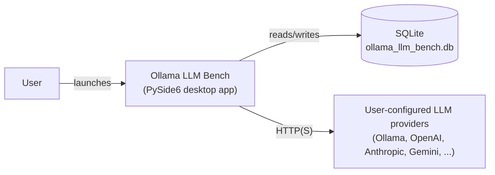

# Project Documentation

Covers the documentation that lives outside a story file: `README.md`, `CHANGELOG.md`, and the living
architecture overview under `docs/architecture/`. For ADRs see the `adr-authoring` skill; for diagrams
inside any of these documents see the `create-mermaid-diagrams` skill.

Grounding: `docs/v3_specification/16_Engineering_Standards/01_PROJECT_STRUCTURE.md` fixes the top-level
layout — `README.md` and `CHANGELOG.md` live at the repo root, `docs/architecture/`, `docs/adr/`, and
`docs/development/` live under `docs/`. `docs/v3_specification/14_Process_and_Traceability/` is the process
layer these documents stay consistent with (story format, traceability, ADRs) without duplicating it.

## README structure

Keep `README.md` user-facing and short — push detail into `docs/`. A README that grows past a few hundred
lines has stopped being an entry point.

1. **What is this?** — one or two sentences: what the application does, for whom.
2. **How does it fit in?** — a Mermaid diagram showing the system context: the user, the application
   process, the providers it talks to, the local SQLite file it writes. (See `create-mermaid-diagrams`.)
3. **Tech stack** — a short table: language, UI framework, package manager, database, key libraries.
4. **Quick start** — the minimum commands to install and run: `uv sync`, `uv run ollama_llm_bench`. Keep
   this to a handful of lines; anything more belongs in `docs/development/local-setup.md`.
5. **Documentation** — a table of links into `docs/`, so a reader who needs depth knows exactly where to
   go next instead of scrolling further in the README.

```markdown
## How does it fit in?


```

## CHANGELOG.md — Keep a Changelog

Follow [Keep a Changelog](https://keepachangelog.com/) exactly:

```markdown
## [Unreleased]

### Added
- Provider wire-stub contract tests for the Anthropic adapter.

### Fixed
- Resume no longer re-runs COMPLETED rows carrying a FAIL verdict.
```

- Entries are grouped under exactly these headings, only as needed: `Added`, `Changed`, `Deprecated`,
  `Removed`, `Fixed`, `Security`.
- New entries accumulate under `[Unreleased]` until a release is tagged, at which point that section is
  retitled with the version and date and a fresh empty `[Unreleased]` is opened above it.
- One project version, declared once in `pyproject.toml`; there is no per-module `CHANGELOG.md` or
  `__version__`.

## `docs/architecture/` — the living architecture overview

`docs/architecture/` holds the architecture documentation that describes the **as-built** system, as
opposed to the specification (which describes the **intended** system before/during implementation). Early
in this rewrite, before the NFR-closure phase produces the real content, this directory is a stub that
points at `docs/v3_specification/` rather than a duplicate or a guess:

```markdown
# Architecture Overview

This document is a stub. The authoritative architecture description during the v3 rewrite is the
specification under `docs/v3_specification/08_Cross_Cutting/` and `docs/v3_specification/16_Engineering_Standards/`.

This file will be rewritten with the as-built architecture during the NFR-closure phase of the rewrite.
```

Once written for real, keep it organized by reader's question, the same convention `docs/` uses elsewhere:
what does the system look like (`architecture/`), how do I build/test/modify it (`development/`), what is
the exact specification (`reference/`, where applicable). Do not let the architecture overview re-explain
what an ADR already states — link to the ADR instead of duplicating its reasoning.

## Writing standards (apply to all of the above)

- **Imperative mood, active voice.** "Run the command", "Create the file" — not "You should run..." or
  passive constructions.
- **Specific, not vague.** "The run logger does not propagate to the root logger" — not "logging is
  clean." A numeric threshold is stated as a number, never as "fast" or "small."
- **Real field names, not placeholders.** Use `api_key_raw`, `STORY-042-AC-2`, `ADR-0012` — never `foo`,
  `bar`, or `<thing>` where a real example is available.
- **Tables over bullet lists** for any structured, multi-column data — a settings reference, a status
  table, a comparison.
- **One sentence per line** in Markdown source where practical — produces cleaner diffs when a single
  sentence changes.
- **No duplicated information across files.** If a fact already has an authoritative home (a spec
  document, an ADR, the persistence schema), link to it rather than re-stating it — a re-statement is a
  second copy that can silently drift out of sync.

## Cross-references

- The `adr-authoring` skill — ADRs live in `docs/adr/`, a sibling of these documents, with their own format.
- The `create-mermaid-diagrams` skill — diagram syntax and validation for the README's system-context diagram and any architecture diagrams.
- `docs/v3_specification/16_Engineering_Standards/01_PROJECT_STRUCTURE.md` — the authoritative top-level repository layout these documents fit into.
