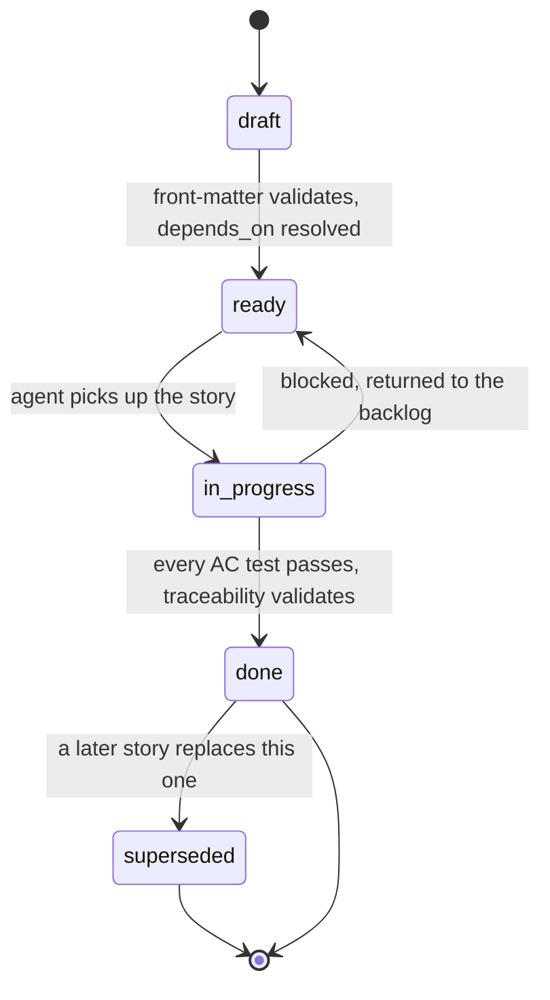

# Story Format and Traceability Workflow

Source of truth: `docs/v3_specification/14_Process_and_Traceability/02_STORY_FORMAT.md` (the story schema and lifecycle) and `docs/v3_specification/14_Process_and_Traceability/03_TRACEABILITY.md` (the generated record and its validation).

## What a story is

A story is a single Markdown file in `docs/stories/` — the unit of work an implementation agent executes. It has two parts: a **YAML front-matter block** (the machine-readable contract `trace.py` parses) and a **Markdown body** (the human/agent-readable narrative). A story is *complete* only when every acceptance criterion has a passing test that names the story id, and the traceability record validates with no orphans — a story is never partially landed.

Stories live flat in `docs/stories/`, one file per story, named `story-NNN-short-slug.md` (e.g. `docs/stories/story-042-resume-stopped-run.md`). There are no per-feature subdirectories — the `modules:` front-matter field, not file location, records which feature a story belongs to.

## Story identifiers — permanent, never reused

A story id has the form `STORY-NNN` (zero-padded three digits, assigned in creation order). Once `STORY-042` is assigned it is **never reused, never renumbered, never deleted**, even if later superseded — a superseded story keeps its id and links to its replacement. Acceptance criteria are `STORY-NNN-AC-N` (1-indexed within the story) and are equally permanent.

## The full front-matter schema

```yaml
---
id: STORY-042                       # string, pattern STORY-\d{3}, unique
title: Resume a stopped run from its persisted result rows
status: draft                       # one of: draft | ready | in-progress | done | superseded
spec_clauses:                       # >=1 entry; each a resolvable spec reference
  - 03_Resume_Benchmark_Widget/description.md#resume-action
  - 08_Cross_Cutting/08-I_edge_cases.md#EC-RUN-5
  - 11_Services_and_Algorithms/04_EVALUATION_PIPELINE.md#resume-selection
modules:                            # >=1 entry; each a path from 01_MODULE_INVENTORY.md
  - ui/resume_benchmark/
  - backend/benchmark_pipeline/
acceptance_criteria:                # >=1 entry; identifiers defined in the body
  - STORY-042-AC-1
  - STORY-042-AC-2
  - STORY-042-AC-3
edge_cases:                         # optional; EC ids from 08-I this story must satisfy
  - EC-RUN-5
  - EC-PERSIST-4
depends_on:                         # >=0 entries; story ids that must be done first
  - STORY-018
  - STORY-031
adrs:                               # optional; ADR ids whose decision this story applies
  - ADR-0007
owner: coder                        # the agent role responsible: arch | coder | tester
estimate: M                         # one of: S | M | L
---
```

| Field | Rule |
|---|---|
| `id` | Matches `STORY-\d{3}`; unique across `docs/stories/`. |
| `title` | One imperative sentence, no trailing period. |
| `status` | One of `draft`, `ready`, `in-progress`, `done`, `superseded`. |
| `spec_clauses` | At least one `<spec-file-path>#<anchor>` that resolves to a real file+heading under the specification tree. |
| `modules` | At least one module path that exists in `01_MODULE_INVENTORY.md`. |
| `acceptance_criteria` | At least one `STORY-NNN-AC-\d+` id (matching this story's own NNN), each defined in the body. |
| `edge_cases` | Optional; each matches an `EC-[A-Z]+-\d+[a-f]?` id defined in `08_Cross_Cutting/08-I_edge_cases.md` or a scoped catalog (`EC-IMP-*`, `EC-EXP-*`, `EC-FL-*`, `EC-RD-*`, `EC-M-*`). |
| `depends_on` | Zero or more story ids; the dependency graph must stay acyclic. |
| `adrs` | Optional; each an accepted ADR id. |
| `owner` | One of `arch`, `coder`, `tester`. |
| `estimate` | One of `S`, `M`, `L` (see sizing rules below). |

`trace.py` rejects a story whose front-matter omits a required field, adds an unknown field, or fails any value rule above — there is no "fix it later" path; a malformed story cannot reach `ready`.

## The fixed body section order

```markdown
# STORY-NNN — <title>

## Goal
[One paragraph: what capability this story delivers, in user-visible or
behavioural terms. No implementation detail.]

## In scope
- [Bullet list: exactly what this story creates or changes.]

## Out of scope
- [Bullet list: adjacent work this story deliberately does not do, with the
  story id that owns it where one exists.]

## Spec inputs
[The clauses from `spec_clauses:`, each with one line stating what the agent
must take from it.]

## Design constraints
- [Binding rules that apply: the threading rule of the touched modules, the
  public-surface limit, the no-Qt rule for a backend module, the module-split
  threshold.]

## Acceptance criteria
### STORY-NNN-AC-1
[criterion text]

### STORY-NNN-AC-2
[criterion text]

## Test plan
[For each acceptance criterion: the test tier (unit / integration / property /
architecture), the test file path, and the test function name. Edge cases map
to a test here too.]

## Definition of done
- [ ] Every acceptance criterion has a passing test that names this story id.
- [ ] Every edge case in `edge_cases:` has a passing test.
- [ ] `mypy --strict`, `ruff`, and `import-linter` pass for the touched modules.
- [ ] The traceability record validates with no orphan clause and no orphan test.
- [ ] The module inventory is unchanged, or the change is reflected in
      `14_Process_and_Traceability/01_MODULE_INVENTORY.md`.
```

This order is fixed so the implementation agent reads every story the same way, every time — never reorder these sections.

## Sizing rules — `S` / `M` / `L`

| Estimate | Bound |
|---|---|
| `S` | Touches one module; one to three acceptance criteria; no new public API. |
| `M` | Touches up to three modules; up to six acceptance criteria; may add one public API symbol. |
| `L` | Touches up to five modules; up to ten acceptance criteria; may add a sub-feature package. |

A story that would exceed the `L` bound must be **split into a parent story plus dependent child stories** linked through `depends_on` — never written as one oversized story. A story also never crosses the backend/UI boundary in a way that leaves either side unverifiable on its own: a UI story `depends_on` the backend story that supplies its Protocols, rather than implementing both halves at once.

## The full lifecycle



| Status | Entry condition |
|---|---|
| `draft` | Created in `docs/stories/`. |
| `ready` | Front-matter validates; every `depends_on` story is `done`; every `spec_clauses` entry resolves. |
| `in-progress` | Picked up from the `ready` set. |
| `done` | Every acceptance-criterion test passes; the traceability record validates with no orphans. |
| `superseded` | A replacement story exists and this story's body links to it; the file stays in `docs/stories/` permanently. |

A change to an already-`done` story's underlying spec clause requires a **new story plus an ADR** — never an edit to the original story file.

## Commands to run

```bash
just trace          # regenerate traceability.yaml from docs/stories/ + the test suite —
                     # run locally after ANY story or test change
just trace-check     # validate the record in the pull-request gate; MUST be zero gaps
                     # before marking a story done
```

`just trace` parses every story's front-matter, collects every test whose docstring declares `Proves: STORY-NNN-AC-N` on its first line, and writes the four cross-indexed maps (`stories`, `clauses`, `edge_cases`, `modules`) to `traceability.yaml` at the repo root. The generator is deterministic — the same stories and test suite always produce a byte-identical file — so a stale or hand-edited `traceability.yaml` is itself a build failure ("record fresh" check). `just trace-check` additionally fails on: an unresolvable spec clause, a `modules` entry not in the module inventory, an orphan clause (traceable but named by no story), an orphan story (names no clause, or a `done` AC with no test), an uncovered edge case, or a cycle in `depends_on`.

Every test that proves an acceptance criterion declares it on the first line of its docstring:

```python
def test_resume_selects_only_resumable_rows() -> None:
    """Proves: STORY-042-AC-2

    Re-runs only non-terminal rows and selected retryable failures; leaves
    every COMPLETED row untouched.
    """
    ...
```

## Worked example — a complete S-sized story end to end

```markdown
---
id: STORY-101
title: Retry a transient persistence write with bounded backoff
status: ready
spec_clauses:
  - 11_Services_and_Algorithms/18_RETRY_POLICY.md#persistence-retry
modules:
  - backend/retry/
acceptance_criteria:
  - STORY-101-AC-1
  - STORY-101-AC-2
owner: coder
estimate: S
---

# STORY-101 — Retry a transient persistence write with bounded backoff

## Goal
When a SQLite write hits `DatabaseLockedError`, retry it a bounded number of
times with backoff before surfacing failure, so a momentary lock contention
from another process does not fail an otherwise-healthy write.

## In scope
- `backend/retry/api.py`: a `with_retry(fn, *, policy)` wrapper usable by any
  persistence store.
- The retry policy's backoff schedule and max-attempt bound for
  `DatabaseLockedError` specifically.

## Out of scope
- Provider-call retry (timeouts, rate limits) — owned by the existing
  provider-adapter retry path, not this story.
- Circuit-breaker integration — out of scope for `backend/retry/` itself.

## Spec inputs
- `11_Services_and_Algorithms/18_RETRY_POLICY.md#persistence-retry` — the
  bounded-attempt, exponential-backoff schedule this story must implement
  verbatim for `DatabaseLockedError`.

## Design constraints
- `backend/retry/` is Qt-free; no PySide6 import (architecture-test enforced).
- `with_retry` is a pure function: it takes a callable and a policy, returns
  the callable's result or re-raises the final exception — no shared mutable
  state, no module-level globals.
- Only `DatabaseLockedError` (a `TransientError` leaf) is retried by this
  wrapper; any other exception propagates on the first attempt.

## Acceptance criteria

### STORY-101-AC-1
Given a callable that raises `DatabaseLockedError` twice then succeeds,
`with_retry` returns the success value and the callable was invoked exactly
three times.

### STORY-101-AC-2
Given a callable that always raises `DatabaseLockedError`, `with_retry`
re-raises `DatabaseLockedError` after exhausting the policy's max-attempt
bound, with the original exception chained as the cause.

## Test plan
- STORY-101-AC-1 — unit, colocated
  `src/ollama_llm_bench/backend/retry/tests/test_with_retry.py`,
  `test_with_retry_succeeds_after_transient_failures`.
- STORY-101-AC-2 — unit, same file,
  `test_with_retry_reraises_after_exhausting_attempts`.

## Definition of done
- [ ] Every acceptance criterion has a passing test naming STORY-101.
- [ ] `mypy --strict`, `ruff`, `import-linter` pass for `backend/retry/`.
- [ ] The traceability record validates with no orphans.
- [ ] The module inventory is unchanged.
```

## Authoring checklist before moving a story `draft` → `ready`

- [ ] Front-matter has every required field, no unknown field.
- [ ] Every `spec_clauses` entry resolves to a real file+heading under the specification tree.
- [ ] Every `modules` entry is a path listed in `01_MODULE_INVENTORY.md`.
- [ ] Every acceptance-criterion id in the front-matter is defined as a heading in the body.
- [ ] Every `depends_on` story exists and the dependency graph stays acyclic.
- [ ] The story fits its `estimate` bound — split into parent + children if not.
- [ ] Each acceptance criterion is independently verifiable and names its test in the Test plan.
- [ ] Each `edge_cases` entry has a corresponding test in the plan.
- [ ] After authoring or editing: run `just trace`, then `just trace-check` before marking the story `done`.
