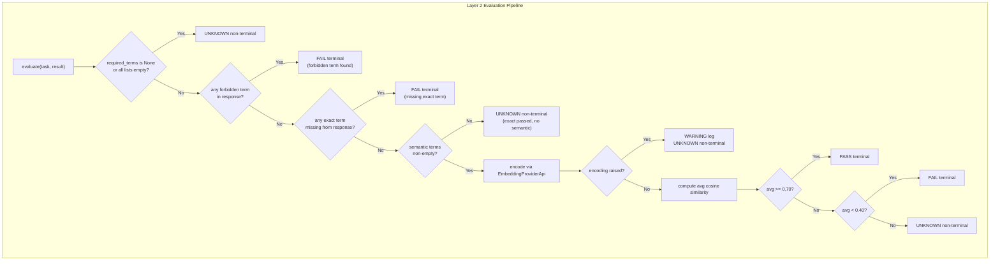

# Technical Design: KeywordEvaluator (Layer 2) — Phase 2 Task 7

## Status
DRAFT — Awaiting human review

## Context

Phase 2 of the V2 redesign implements a 4-layer evaluation pipeline. Tasks 1–6 are complete:
- Task 1: `EvalLayer`, `EvalVerdict`, `EvaluationResult`, and all event dataclasses in `models.py`
- Task 2: `EvaluatorApi`, `EmbeddingProviderApi`, and other protocols in `interfaces.py`
- Task 6: `RuleBasedEvaluator` (Layer 1) in `services/evaluators/`, including the package `__init__.py`

`KeywordEvaluator` is Layer 2 in the pipeline. It is invoked only when Layer 1 returns a non-terminal `UNKNOWN`. It checks `BenchmarkTask.required_terms` — forbidden terms, exact must-have terms, and optionally semantic similarity via the embedding provider. No existing files require modification; this task is purely additive.

Key constraints confirmed by reading the codebase:
- `BenchmarkResult` is `frozen=True`, so `KeywordEvaluator` cannot write to its fields. It returns `EvaluationResult` only.
- `RequiredTerms` uses `tuple[str, ...]` fields (not `list`), confirmed from `models.py` line 124–131.
- `EmbeddingProviderApi.encode(texts: list[str]) -> list[list[float]]` — takes a list, returns a list of float vectors.
- `RuleBasedEvaluator` uses `_fail()` helper and module-level constants — same pattern applies here.
- The `evaluators/` package `__init__.py` already exists (created in Task 6).
- No new third-party dependencies are needed — `math` is stdlib.

## Problem Statement

Implement `KeywordEvaluator` to satisfy:
1. Returns `EvalVerdict.UNKNOWN` (non-terminal) when `required_terms` is absent or all lists are empty.
2. Returns terminal `EvalVerdict.FAIL` when any forbidden term appears in the response (case-insensitive).
3. Returns terminal `EvalVerdict.FAIL` when any required exact term is missing from the response (case-insensitive).
4. Optionally computes average cosine similarity across semantic terms and returns `PASS`, `FAIL`, or `UNKNOWN` based on thresholds.
5. Handles embedding errors gracefully — logs WARNING, returns `UNKNOWN` non-terminal.
6. All checks use `result.sanitized_response or result.raw_response or ""` as the response text.
7. Conforms to `EvaluatorApi` Protocol — `isinstance(evaluator, EvaluatorApi)` returns `True`.

**Success criteria:**
- `uv run ruff check src/ tests/` — zero violations
- `uv run ruff format --check src/ tests/` — zero formatting issues
- `uv run mypy src/` — zero errors (full strict mode)
- `uv run pytest tests/unit/services/evaluators/test_keyword_evaluator.py -v` — 14+ tests pass
- `uv run pytest tests/unit/` — no regressions

## Alternatives Considered

### Option A: Single class with all logic inline in `evaluate()`

- **Approach:** All forbidden, exact, and semantic checks written directly inside `evaluate()` with no helper methods. Single responsibility stretched across one method.
- **Pros:** Minimal file structure, easy to scan top to bottom.
- **Cons:** Violates the 50-line limit rule; `evaluate()` would exceed it. Harder to test individual check branches in isolation. Inconsistent with `RuleBasedEvaluator` which extracts `_fail()`.
- **Effort:** Low

### Option B: Class with private helper methods per check (selected)

- **Approach:** `evaluate()` orchestrates; each check type extracted to a private method: `_check_forbidden()`, `_check_exact()`, `_check_semantic()`. A shared `_fail()` and `_unknown()` constructor helper mirrors `RuleBasedEvaluator`. `_cosine_similarity()` is a module-level function.
- **Pros:** Matches existing `RuleBasedEvaluator` pattern exactly. Each method stays under 20 lines. Private helpers are individually testable by testing their observable effects via `evaluate()`. `_cosine_similarity` as module-level function allows import in test for pure math verification.
- **Cons:** Slightly more code surface than Option A.
- **Effort:** Low

### Option C: Separate `_KeywordChecks` dataclass to hold check logic

- **Approach:** Extract all check methods into a frozen dataclass or strategy object injected at construction time.
- **Pros:** Maximum SRP compliance.
- **Cons:** Over-engineered for a service with no variation point; the evaluator pipeline already provides the variation point. Inconsistent with Layer 1.
- **Effort:** Medium

## Decision

Selected **Option B** because it directly mirrors the `RuleBasedEvaluator` pattern (consistency), keeps `evaluate()` well under 50 lines, and makes the check ordering explicit without over-engineering.

## Architecture



## Data Structures

No new dataclasses or enums are introduced. All types are consumed from existing models:

**Consumed (read-only):**
- `BenchmarkTask.required_terms: RequiredTerms | None` — from `models.py`
- `RequiredTerms.exact: tuple[str, ...]` — forbidden/exact/semantic term lists
- `RequiredTerms.semantic: tuple[str, ...]`
- `RequiredTerms.forbidden: tuple[str, ...]`
- `BenchmarkResult.sanitized_response: str | None`
- `BenchmarkResult.raw_response: str | None`
- `EvaluationResult` — the return type (frozen dataclass already defined)
- `EvalVerdict.PASS / FAIL / UNKNOWN` — StrEnum values
- `EvalLayer.KEYWORD` — StrEnum value

**DI wiring:** `KeywordEvaluator` is injected with `embedding_service: EmbeddingProviderApi`. It is wired in `app_context.py` (Task 12) as:
```
keyword_evaluator = KeywordEvaluator(embedding_service=embedding_provider)
```
This task does NOT touch `app_context.py` — that is Task 12's responsibility.

**Module-level constants (in `keyword_evaluator.py`):**
- `_SEMANTIC_PASS_THRESHOLD: float = 0.70`
- `_SEMANTIC_FAIL_THRESHOLD: float = 0.40`

**Module-level function:**
- `_cosine_similarity(a: list[float], b: list[float]) -> float` — pure math, no side effects, uses `math.sqrt` and `zip`.

## Implementation Steps

### Step 1: Create `keyword_evaluator.py`

- **File:** `src/ollama_llm_bench/backend/services/evaluators/keyword_evaluator.py`
- **Action:** Create

**Description:**

The file structure follows the `rule_based_evaluator.py` pattern exactly:

1. Module docstring describing Layer 2 purpose.
2. Imports: `import logging`, `import math`, then local imports from `ollama_llm_bench.backend.core.interfaces` (`EmbeddingProviderApi`) and `ollama_llm_bench.backend.core.models` (`BenchmarkResult`, `BenchmarkTask`, `EvalLayer`, `EvaluationResult`, `EvalVerdict`).
3. `logger = logging.getLogger(__name__)` at module level.
4. Module-level constants: `_SEMANTIC_PASS_THRESHOLD = 0.70` and `_SEMANTIC_FAIL_THRESHOLD = 0.40`.
5. Module-level function `_cosine_similarity(a: list[float], b: list[float]) -> float` using `math.sqrt`, `zip`, `sum`. Returns `0.0` when either norm is zero (guard: `if norm_a and norm_b else 0.0`).
6. Class `KeywordEvaluator` with:
   - Constructor: `def __init__(self, *, embedding_service: EmbeddingProviderApi) -> None` — stores `self._embedding_service = embedding_service`.
   - `@property def layer(self) -> EvalLayer` — returns `EvalLayer.KEYWORD`.
   - `def evaluate(self, task: BenchmarkTask, result: BenchmarkResult) -> EvaluationResult` — orchestrator:
     a. Extract `response = (result.sanitized_response or result.raw_response or "").lower()` for checks.
     b. Guard: if `task.required_terms is None` or all three tuple fields are empty → return `self._unknown("No required terms configured")`.
     c. Call `self._check_forbidden(task.required_terms.forbidden, response)` — returns `EvaluationResult | None`. If not `None`, return it.
     d. Call `self._check_exact(task.required_terms.exact, response)` — returns `EvaluationResult | None`. If not `None`, return it.
     e. If `task.required_terms.semantic` is non-empty: call `self._check_semantic(task.required_terms.semantic, result.sanitized_response or result.raw_response or "")` — returns `EvaluationResult`. Return it.
     f. All checks pass with no semantic terms → return `self._unknown("Exact terms matched; no semantic check configured")`.
   - `def _check_forbidden(self, forbidden: tuple[str, ...], response_lower: str) -> EvaluationResult | None` — iterates `forbidden`, returns `self._fail(f"Forbidden term found: '{term}'")` on first match, else `None`.
   - `def _check_exact(self, exact: tuple[str, ...], response_lower: str) -> EvaluationResult | None` — collects all missing terms; if any, returns `self._fail(f"Missing required terms: {missing}")`, else `None`. `missing` is a `list[str]` of the terms not found.
   - `def _check_semantic(self, semantic_terms: tuple[str, ...], response_text: str) -> EvaluationResult` — calls `self._embedding_service.encode([response_text, *semantic_terms])` inside a `try/except Exception`. On exception: logs `logger.warning("keyword_semantic_encode_failed", ...)` and returns `self._unknown("Semantic check skipped: embedding error")`. On success: computes `avg_sim` as average of `_cosine_similarity(term_vec, response_vec)` for each term vector. Compares against thresholds and returns appropriate `EvaluationResult`.
   - `def _fail(self, reasoning: str) -> EvaluationResult` — constructs terminal FAIL.
   - `def _unknown(self, reasoning: str) -> EvaluationResult` — constructs non-terminal UNKNOWN.

**Notes on `_check_semantic` embedding call:**
- `encode([response_text, *semantic_terms])` returns `[response_vec, term_vec_0, term_vec_1, ...]`.
- `response_vec = embeddings[0]`, `term_vecs = embeddings[1:]`.
- `avg_sim = sum(_cosine_similarity(tv, response_vec) for tv in term_vecs) / len(term_vecs)`.
- Guard: if `not term_vecs` (shouldn't happen since `semantic` is non-empty, but defensive): return `_unknown("No term embeddings returned")`.

**Note on `_check_forbidden` and `_check_exact`:** both receive `response_lower` (pre-lowercased string). The check is `term.lower() in response_lower` so term itself is also lowercased at point of comparison.

**Validation:**
```bash
uv run ruff check src/ollama_llm_bench/backend/services/evaluators/keyword_evaluator.py
uv run ruff format --check src/ollama_llm_bench/backend/services/evaluators/keyword_evaluator.py
uv run mypy src/ollama_llm_bench/backend/services/evaluators/keyword_evaluator.py
```

---

### Step 2: Create `test_keyword_evaluator.py`

- **File:** `tests/unit/services/evaluators/test_keyword_evaluator.py`
- **Action:** Create

**Description:**

The file structure mirrors `test_rule_based_evaluator.py`:

1. Module docstring.
2. Imports: `import pytest`, `from pytest_mock import MockerFixture`, `from unittest.mock import Mock`, then local imports for `EvaluatorApi`, `BenchmarkResult`, `BenchmarkTask`, `Difficulty`, `EvalLayer`, `EvalVerdict`, `RequiredTerms`, `ResponseScope`, `TaskType`, and from the implementation `_SEMANTIC_FAIL_THRESHOLD`, `_SEMANTIC_PASS_THRESHOLD`, `_cosine_similarity`, `KeywordEvaluator`, and `EmbeddingProviderApi`.

**Helper factories (module-level functions):**

`_make_task(*, required_terms: RequiredTerms | None = None) -> BenchmarkTask` — returns a `BenchmarkTask` with fixed `task_id="t1"`, `category="cat"`, `sub_category="sub"`, `task_type=TaskType.FACTUAL_QA`, `question="What is X?"`, `golden_answer="X is Y"`, `pass_criteria=""`, `fail_criteria=""`, `difficulty=Difficulty.EASY`, `response_scope=ResponseScope.CONTAINS`, and the provided `required_terms`.

`_make_result(*, sanitized_response: str | None = None, raw_response: str | None = None) -> BenchmarkResult` — returns a minimal `BenchmarkResult` with only those two fields set (all others default). This intentionally uses only fields that `KeywordEvaluator` reads.

**Fixtures:**

```python
@pytest.fixture
def mock_embedding(mocker: MockerFixture) -> Mock:
    return mocker.Mock(spec=EmbeddingProviderApi)

@pytest.fixture
def evaluator(mock_embedding: Mock) -> KeywordEvaluator:
    return KeywordEvaluator(embedding_service=mock_embedding)
```

**Test classes and methods:**

`class TestLayerProperty`:
- `test_layer_returns_keyword` — asserts `evaluator.layer is EvalLayer.KEYWORD`.

`class TestInterfaceConformance`:
- `test_isinstance_check_passes` — asserts `isinstance(evaluator, EvaluatorApi) is True`.

`class TestEmptyRequiredTerms`:
- `test_required_terms_is_none_returns_unknown_non_terminal` — `_make_task(required_terms=None)`, assert UNKNOWN non-terminal, assert `mock_embedding.encode.call_count == 0`.
- `test_required_terms_all_empty_tuples_returns_unknown_non_terminal` — `_make_task(required_terms=RequiredTerms())`, same assertions. This distinguishes `None` vs `RequiredTerms()` — both must short-circuit.
- `test_required_terms_all_empty_does_not_call_embedding_service` — confirms `mock_embedding.encode` never called when all lists empty.

`class TestForbiddenTermCheck`:
- `test_forbidden_term_found_returns_terminal_fail` — task with `RequiredTerms(forbidden=("error",))`, result with `sanitized_response="An error occurred"`. Assert FAIL terminal, layer is KEYWORD.
- `test_forbidden_term_check_is_case_insensitive` — `forbidden=("ERROR",)`, response `"an error occurred"`. Assert FAIL.
- `test_forbidden_term_not_found_continues_pipeline` — `forbidden=("error",)`, response `"All good here with detailed content"`. Assert not a FAIL due to forbidden (pipeline continues to exact check). Since no exact terms, result is UNKNOWN.
- `test_forbidden_term_found_does_not_call_embedding_service` — assert `mock_embedding.encode.call_count == 0` on forbidden match.
- `test_first_forbidden_term_triggers_fail` — `forbidden=("foo", "bar")`, response contains `"foo"` but not `"bar"`. Assert FAIL terminal with `"foo"` in reasoning.

`class TestExactTermCheck`:
- `test_missing_exact_term_returns_terminal_fail` — `RequiredTerms(exact=("python",))`, response without "python". Assert FAIL terminal.
- `test_exact_term_check_is_case_insensitive` — `exact=("Python",)`, response `"using python here is great"`. Assert NOT FAIL (exact term found).
- `test_all_exact_terms_present_no_semantic_returns_unknown` — `RequiredTerms(exact=("python", "function"))`, response containing both, no semantic terms. Assert UNKNOWN non-terminal.
- `test_missing_exact_term_does_not_call_embedding_service` — assert `mock_embedding.encode.call_count == 0`.
- `test_multiple_exact_terms_one_missing_returns_fail` — `exact=("alpha", "beta", "gamma")`, response has alpha and beta but not gamma. Assert FAIL, assert `"gamma"` in reasoning.
- `test_exact_term_found_in_raw_response_when_sanitized_is_none` — task has `exact=("python",)`, `_make_result(sanitized_response=None, raw_response="python is great programming language")`. Assert not FAIL (found in raw).

`class TestSemanticCheck`:
- `test_semantic_avg_above_pass_threshold_returns_pass_terminal` — `RequiredTerms(semantic=("machine learning",))`. `mock_embedding.encode.return_value = [[1.0, 0.0], [1.0, 0.0]]` (identical vectors → cosine=1.0). Assert PASS terminal.
- `test_semantic_avg_below_fail_threshold_returns_fail_terminal` — `mock_embedding.encode.return_value = [[1.0, 0.0], [0.0, 1.0]]` (orthogonal vectors → cosine=0.0, below 0.40). Assert FAIL terminal.
- `test_semantic_avg_between_thresholds_returns_unknown_non_terminal` — construct vectors with cosine ≈ 0.55 (e.g., `[1.0, 0.5]` and `[0.5, 1.0]` → dot=1.0, norms≈1.118 each → sim≈0.8`... use values that produce 0.55). Use `[1.0, 1.0]` (response) and `[1.0, 0.0]` (term) → cosine = 1/√2 ≈ 0.707... which would be PASS. Better: use `[1.0, 0.8]` (response) and `[0.6, 1.0]` (term) → dot=1.4, norm_a=√1.64≈1.281, norm_b=√1.36≈1.166 → sim≈0.935 (too high). Safest approach: explicitly use values producing avg ~0.55. Use response vec `[1.0, 0.0, 0.0]` and term vec `[0.0, 1.0, 0.0]` → cosine=0.0 (too low). Use `[1.0, 1.0, 0.0]` (response) and `[0.8, 0.3, 0.0]` (term) → dot=1.1, norm_a=√2≈1.414, norm_b=√0.73≈0.854 → sim≈0.91 (too high). **Simplest**: directly patch `_cosine_similarity` at the call site using `mocker.patch("ollama_llm_bench.backend.services.evaluators.keyword_evaluator._cosine_similarity", return_value=0.55)`. Assert UNKNOWN non-terminal.
- `test_semantic_encoding_error_logs_warning_and_returns_unknown` — `mock_embedding.encode.side_effect = RuntimeError("model not loaded")`. Assert UNKNOWN non-terminal, assert `mock_embedding.encode.called`.
- `test_semantic_check_encodes_response_and_all_terms_together` — `RequiredTerms(semantic=("alpha", "beta"))`, `mock_embedding.encode.return_value = [[1.0], [1.0], [1.0]]`. Verify `mock_embedding.encode` called once with a list containing the response text AND both semantic terms. Assert `len(mock_embedding.encode.call_args[0][0]) == 3`.

`class TestCosineSimFunction`:
- `test_identical_vectors_return_one` — `_cosine_similarity([1.0, 0.0], [1.0, 0.0]) == pytest.approx(1.0)`.
- `test_orthogonal_vectors_return_zero` — `_cosine_similarity([1.0, 0.0], [0.0, 1.0]) == pytest.approx(0.0)`.
- `test_zero_norm_vector_returns_zero` — `_cosine_similarity([0.0, 0.0], [1.0, 0.0]) == pytest.approx(0.0)`.
- `test_both_zero_vectors_return_zero` — `_cosine_similarity([0.0, 0.0], [0.0, 0.0]) == pytest.approx(0.0)`.

`class TestResponseTextFallback`:
- `test_uses_sanitized_response_when_available` — task with `RequiredTerms(exact=("found",))`, `_make_result(sanitized_response="found it", raw_response="not here")`. Assert NOT FAIL (found in sanitized).
- `test_falls_back_to_raw_response_when_sanitized_is_none` — task with `RequiredTerms(exact=("found",))`, `_make_result(sanitized_response=None, raw_response="found it here in raw")`. Assert NOT FAIL.
- `test_empty_response_with_exact_terms_returns_fail` — `RequiredTerms(exact=("something",))`, both `sanitized_response=None` and `raw_response=None`. Assert FAIL (exact term missing from empty string).

`class TestThresholdConstants`:
- `test_pass_threshold_value` — `assert _SEMANTIC_PASS_THRESHOLD == 0.70`.
- `test_fail_threshold_value` — `assert _SEMANTIC_FAIL_THRESHOLD == 0.40`.

**Validation:**
```bash
uv run pytest tests/unit/services/evaluators/test_keyword_evaluator.py -v
```

---

### Step 3: Full suite regression check

- **File(s):** All existing test files (no changes)
- **Action:** Verify

**Description:** Run the complete unit test suite to confirm no regressions, then run the full lint/type pipeline.

**Validation:**
```bash
uv run ruff check src/ tests/
uv run ruff format --check src/ tests/
uv run mypy src/
uv run pytest tests/unit/ -v
```

## Security Considerations

None specific to this component. `KeywordEvaluator` only performs string containment checks and cosine math on float vectors. No user input reaches file system, network, or shell. The `embedding_service.encode()` call passes task-defined strings (loaded from YAML) — not user-supplied at runtime.

## Performance Considerations

- Forbidden and exact checks are O(n × m) string searches where n = number of terms and m = response length. Both are negligible in practice (n ≤ 20 terms, m ≤ ~16k chars).
- Semantic embedding: `encode()` is the only potentially slow call. It batches all terms and the response into a single API call — the design already minimises round-trips. This is acceptable because Layer 2 only runs when Layer 1 returns non-terminal, and embedding providers are already warmed up by Phase 1.
- `_cosine_similarity` uses stdlib `math.sqrt` and generator expressions — no numpy dependency, no import overhead.

## Rollback Plan

Both files created in this task are new — no existing files are modified. Rollback is simply deleting the two new files. No migrations, no schema changes, no DI wiring changes in this task.

## Open Questions

None. All types, interfaces, and patterns are confirmed from reading the codebase. The `embedding_service.encode()` call signature, `RequiredTerms` tuple field types, `BenchmarkResult` frozen constraint, and `EvaluatorApi` Protocol are all verified.
