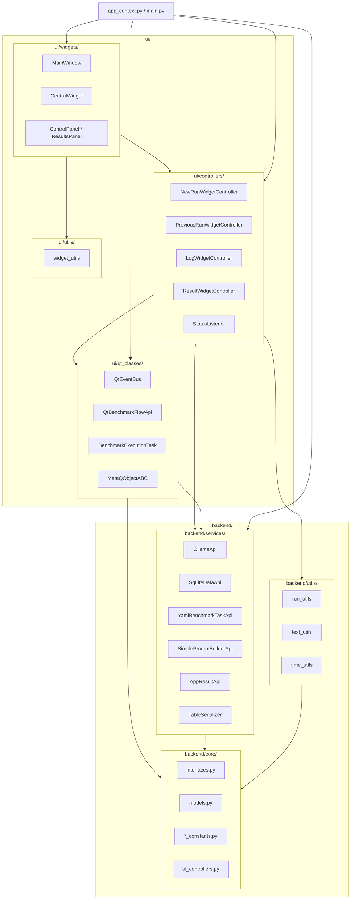

# Technical Design: Backend / UI Package Reorganization

## Status
DRAFT — Awaiting human review

## Context

The current package layout under `src/ollama_llm_bench/` mixes pure-Python code
with Qt-dependent code at the same directory level:

```
src/ollama_llm_bench/
├── core/          # pure Python — OK
├── services/      # pure Python — OK
├── utils/         # MIXED: text_utils/time_utils/run_utils are pure;
│                  #        widget_utils.py imports QComboBox — VIOLATION
├── qt_classes/    # Qt-dependent — lives beside pure-Python packages — confusing
├── ui/            # Qt-dependent
├── app_context.py # bridge/DI root
├── dataset/       # YAML files
└── main.py        # entry point
```

Two problems:
1. There is no visual or structural separation between the pure-Python backend
   and the PySide6-dependent frontend.
2. `utils/widget_utils.py` imports `QComboBox` while sitting in a package that
   is otherwise pure Python — this makes `utils/` importable only in a Qt
   environment and violates the layering rule that `core/` must be usable outside
   the GUI context.

## Problem Statement

Reorganise the package tree to make the backend/UI boundary explicit and
enforceable:

- **`backend/`** — all pure-Python packages (`core/`, `services/`, pure `utils/`)
- **`ui/`** — all PySide6-dependent packages (existing `ui/`, plus `qt_classes/`
  which moves here, plus a new `ui/utils/` for `widget_utils.py`)
- **`app_context.py`** and **`main.py`** remain at the root (they are the
  composition root and entry point by design)
- **`dataset/`** stays at the root (build target, no Python imports)

Success criteria:
1. `uv run ruff check . && uv run ruff format --check .` passes
2. `uv run mypy src/` passes
3. `uv run pyright src/` passes
4. `uv run pytest` passes (there are currently 0 tests, so this means "no import
   errors on collection")
5. `uv run ollama_llm_bench --help` starts without error
6. No file under `src/ollama_llm_bench/backend/` imports `PySide6`
7. No file under `src/ollama_llm_bench/backend/` imports from
   `ollama_llm_bench.ui`
8. Every internal import uses `ollama_llm_bench.backend.*` or
   `ollama_llm_bench.ui.*` (no remaining references to old paths)

## Alternatives Considered

### Option A: Flat rename only (no nesting)
- **Approach:** Rename `qt_classes/` to `ui/qt_classes/` and move
  `widget_utils.py` to `ui/utils/widget_utils.py`. Leave `core/`, `services/`,
  and `utils/` at root level. No `backend/` namespace.
- **Pros:** Minimal diff — only 3 file moves; all `core.*` / `services.*` imports
  unchanged; very low risk.
- **Cons:** Does not create the explicit `backend/` namespace the user asked for;
  no structural enforcement that core/services are "backend" and not Qt.
- **Effort:** Low

### Option B: Full backend/ui grouping with namespace packages (selected)
- **Approach:** Introduce `backend/` sub-package containing `core/`, `services/`,
  and `utils/` (pure). Move `qt_classes/` under `ui/`. Move `widget_utils.py` to
  `ui/utils/`. Update every internal import across 29 files. Update
  `pyproject.toml` coverage path. Update architecture docs.
- **Pros:** Achieves the explicit backend/UI separation requested; makes the no-Qt
  rule structurally obvious; enables import-linter contracts anchored on
  `backend.*`; clean conceptual model for future contributors.
- **Cons:** All 29 files with internal imports require mechanical import path
  updates; higher risk of a missed substitution; architecture docs need updating.
- **Effort:** Medium

### Option C: Separate installable distribution packages
- **Approach:** Split into two hatchling packages: `ollama_llm_bench_backend` and
  `ollama_llm_bench_ui`, each with its own `pyproject.toml`, linked via
  workspace.
- **Pros:** Hard boundary — backend cannot accidentally import Qt because it has
  no PySide6 dependency; enables independent testing.
- **Cons:** UV workspace support is experimental; adds significant build
  complexity for a single-developer desktop tool; out of scope for a visual
  grouping request.
- **Effort:** High

### Option D: Re-label with `__init__.py` re-exports only
- **Approach:** Keep all files where they are; add `backend/__init__.py` and
  `ui/__init__.py` that re-export everything from the existing sub-packages.
- **Pros:** Zero file moves; old import paths still work.
- **Cons:** Creates ambiguity — two valid paths for every name; defeats the
  purpose of the reorganisation; likely to confuse Mypy and Ruff.
- **Effort:** Low (but wrong)

## Decision

Selected **Option B** because:
- It directly achieves the user's stated goal of a clear `backend/` / `ui/`
  split.
- The import path updates are mechanical, not logical — all 29 files require
  find-and-replace style edits with no behaviour changes.
- Option A is a partial solution that does not create the `backend/` namespace.
- Options C and D are either over-engineered or semantically wrong.

The migration is purely structural. No logic changes, no new abstractions.

## Architecture

### Target directory tree

```
src/ollama_llm_bench/
├── backend/                         ← NEW namespace package
│   ├── __init__.py
│   ├── core/
│   │   ├── __init__.py
│   │   ├── interfaces.py
│   │   ├── models.py
│   │   ├── prompt_constants.py
│   │   ├── sql_constants.py
│   │   ├── stages_constants.py
│   │   └── ui_controllers.py
│   ├── services/
│   │   ├── __init__.py
│   │   ├── app_result_api.py
│   │   ├── ollama_llm_api.py
│   │   ├── simple_prompt_builder_api.py
│   │   ├── sq_lite_data_api.py
│   │   ├── table_serializer.py
│   │   └── yaml_benchmark_task_api.py
│   └── utils/
│       ├── __init__.py
│       ├── run_utils.py
│       ├── text_utils.py
│       └── time_utils.py
├── ui/                              ← EXPANDED (absorbs qt_classes + ui/utils)
│   ├── __init__.py
│   ├── main_window.py               ← unchanged location
│   ├── qt_classes/                  ← MOVED from root qt_classes/
│   │   ├── __init__.py
│   │   ├── meta_class.py
│   │   ├── qt_benchmark_execution_task.py
│   │   ├── qt_benchmark_flow.py
│   │   └── qt_event_bus.py
│   ├── utils/                       ← NEW (widget_utils only)
│   │   ├── __init__.py
│   │   └── widget_utils.py          ← MOVED from utils/widget_utils.py
│   ├── controllers/                 ← unchanged location
│   │   ├── __init__.py
│   │   ├── log_widget_controller.py
│   │   ├── new_run_widget_controller.py
│   │   ├── previous_run_widget_controller.py
│   │   ├── result_widget_controller.py
│   │   └── status_listener.py
│   └── widgets/                     ← unchanged location
│       ├── __init__.py
│       ├── central_widget.py
│       └── panels/
│           ├── __init__.py
│           ├── control_panel.py
│           ├── results_panel.py
│           ├── control/
│           │   ├── __init__.py
│           │   ├── control_tab_widget.py
│           │   ├── new_run_widget.py
│           │   └── previous_run_widget.py
│           └── result/
│               ├── __init__.py
│               ├── log_widget.py
│               ├── result_tab_widget.py
│               └── result_widget.py
├── app_context.py                   ← stays at root
├── main.py                          ← stays at root
└── dataset/                         ← stays at root
```

### Import path mapping (old → new)

| Old path prefix | New path prefix |
|---|---|
| `ollama_llm_bench.core.` | `ollama_llm_bench.backend.core.` |
| `ollama_llm_bench.services.` | `ollama_llm_bench.backend.services.` |
| `ollama_llm_bench.utils.run_utils` | `ollama_llm_bench.backend.utils.run_utils` |
| `ollama_llm_bench.utils.text_utils` | `ollama_llm_bench.backend.utils.text_utils` |
| `ollama_llm_bench.utils.time_utils` | `ollama_llm_bench.backend.utils.time_utils` |
| `ollama_llm_bench.utils.widget_utils` | `ollama_llm_bench.ui.utils.widget_utils` |
| `ollama_llm_bench.qt_classes.` | `ollama_llm_bench.ui.qt_classes.` |
| `ollama_llm_bench.ui.controllers.` | `ollama_llm_bench.ui.controllers.` (unchanged) |
| `ollama_llm_bench.ui.widgets.` | `ollama_llm_bench.ui.widgets.` (unchanged) |
| `ollama_llm_bench.ui.main_window` | `ollama_llm_bench.ui.main_window` (unchanged) |

### Layer diagram (after migration)



## Data Structures

No new or modified dataclasses, ABCs, or Protocols. This is a pure structural
reorganisation — all interfaces and models remain identical in content; only
their module paths change.

`pyproject.toml` requires two updates:
1. `[tool.hatch.build.targets.wheel] packages` — no change needed; hatchling
   discovers everything under `src/ollama_llm_bench/`.
2. `[tool.coverage.run] source` — no change needed; `src` is the source root.
3. `[tool.ruff.lint.isort] known-first-party` — no change needed; still
   `ollama_llm_bench`.

The `main.py` `resources.path("ollama_llm_bench", "dataset")` call is
unaffected — `dataset/` stays at the root of the package.

## Implementation Steps

Migration strategy: **move files first, fix imports second, validate last.**
Each step is self-contained; failing a step does not corrupt earlier steps.

---

### Step 1: Create backend/ package skeleton

- **File(s):**
  - `src/ollama_llm_bench/backend/__init__.py` — create, empty
  - `src/ollama_llm_bench/backend/core/__init__.py` — create, copy from existing `core/__init__.py`
  - `src/ollama_llm_bench/backend/services/__init__.py` — create, copy from existing `services/__init__.py`
  - `src/ollama_llm_bench/backend/utils/__init__.py` — create, copy from existing `utils/__init__.py`
- **Action:** Create
- **Description:** Create the `backend/` namespace package and the three
  sub-package `__init__.py` files. Do not delete the old packages yet — both
  old and new directories coexist during the migration. The `__init__.py` files
  can be empty or carry forward any existing content from the old counterparts
  (in practice all three are empty).
- **Validation:** `uv run python -c "import ollama_llm_bench.backend"`
  — must not raise ImportError.

---

### Step 2: Create ui/qt_classes/ and ui/utils/ package skeletons

- **File(s):**
  - `src/ollama_llm_bench/ui/qt_classes/__init__.py` — create, copy from existing `qt_classes/__init__.py`
  - `src/ollama_llm_bench/ui/utils/__init__.py` — create, empty
- **Action:** Create
- **Description:** Add the two new sub-package `__init__.py` files inside the
  existing `ui/` package. Old `qt_classes/` at root stays in place for now.
- **Validation:** `uv run python -c "import ollama_llm_bench.ui.qt_classes; import ollama_llm_bench.ui.utils"`

---

### Step 3: Move backend/core/ files

- **File(s):** Move (git mv) the following:
  - `src/ollama_llm_bench/core/interfaces.py`
    → `src/ollama_llm_bench/backend/core/interfaces.py`
  - `src/ollama_llm_bench/core/models.py`
    → `src/ollama_llm_bench/backend/core/models.py`
  - `src/ollama_llm_bench/core/prompt_constants.py`
    → `src/ollama_llm_bench/backend/core/prompt_constants.py`
  - `src/ollama_llm_bench/core/sql_constants.py`
    → `src/ollama_llm_bench/backend/core/sql_constants.py`
  - `src/ollama_llm_bench/core/stages_constants.py`
    → `src/ollama_llm_bench/backend/core/stages_constants.py`
  - `src/ollama_llm_bench/core/ui_controllers.py`
    → `src/ollama_llm_bench/backend/core/ui_controllers.py`
- **Action:** Move (do not copy — use `git mv` to preserve history)
- **Description:** Move all six files from `core/` to `backend/core/`. After
  this step the old `src/ollama_llm_bench/core/` directory should be empty
  except for `__init__.py`. Leave `core/__init__.py` in place temporarily.
  The moved files contain internal imports (`from ollama_llm_bench.core.models
  import ...`) that are now broken — this is expected and will be fixed in Step 6.
- **Validation:** `ls src/ollama_llm_bench/backend/core/` — should show 6 `.py`
  files plus `__init__.py`.

---

### Step 4: Move backend/services/ files

- **File(s):** Move (git mv) the following:
  - `src/ollama_llm_bench/services/app_result_api.py`
    → `src/ollama_llm_bench/backend/services/app_result_api.py`
  - `src/ollama_llm_bench/services/ollama_llm_api.py`
    → `src/ollama_llm_bench/backend/services/ollama_llm_api.py`
  - `src/ollama_llm_bench/services/simple_prompt_builder_api.py`
    → `src/ollama_llm_bench/backend/services/simple_prompt_builder_api.py`
  - `src/ollama_llm_bench/services/sq_lite_data_api.py`
    → `src/ollama_llm_bench/backend/services/sq_lite_data_api.py`
  - `src/ollama_llm_bench/services/table_serializer.py`
    → `src/ollama_llm_bench/backend/services/table_serializer.py`
  - `src/ollama_llm_bench/services/yaml_benchmark_task_api.py`
    → `src/ollama_llm_bench/backend/services/yaml_benchmark_task_api.py`
- **Action:** Move (git mv)
- **Description:** Move all six service implementation files. Imports inside
  these files are still broken; old `services/` directory now contains only
  `__init__.py`.
- **Validation:** `ls src/ollama_llm_bench/backend/services/` — should show 6
  `.py` files plus `__init__.py`.

---

### Step 5: Move backend/utils/ and ui/ files

- **File(s):** Move (git mv) the following:
  - `src/ollama_llm_bench/utils/run_utils.py`
    → `src/ollama_llm_bench/backend/utils/run_utils.py`
  - `src/ollama_llm_bench/utils/text_utils.py`
    → `src/ollama_llm_bench/backend/utils/text_utils.py`
  - `src/ollama_llm_bench/utils/time_utils.py`
    → `src/ollama_llm_bench/backend/utils/time_utils.py`
  - `src/ollama_llm_bench/utils/widget_utils.py`
    → `src/ollama_llm_bench/ui/utils/widget_utils.py`
  - `src/ollama_llm_bench/qt_classes/meta_class.py`
    → `src/ollama_llm_bench/ui/qt_classes/meta_class.py`
  - `src/ollama_llm_bench/qt_classes/qt_benchmark_execution_task.py`
    → `src/ollama_llm_bench/ui/qt_classes/qt_benchmark_execution_task.py`
  - `src/ollama_llm_bench/qt_classes/qt_benchmark_flow.py`
    → `src/ollama_llm_bench/ui/qt_classes/qt_benchmark_flow.py`
  - `src/ollama_llm_bench/qt_classes/qt_event_bus.py`
    → `src/ollama_llm_bench/ui/qt_classes/qt_event_bus.py`
- **Action:** Move (git mv)
- **Description:** Move the three pure utils, `widget_utils.py` to
  `ui/utils/`, and all four `qt_classes/` files to `ui/qt_classes/`.
  After this step the old `utils/` and `qt_classes/` directories contain only
  their `__init__.py` files. All internal imports are still broken.
- **Validation:** `ls src/ollama_llm_bench/backend/utils/` and
  `ls src/ollama_llm_bench/ui/qt_classes/` and
  `ls src/ollama_llm_bench/ui/utils/` — verify expected files present.

---

### Step 6: Update internal imports in moved backend/ files

- **File(s):** All files under `src/ollama_llm_bench/backend/`:
  - `backend/core/interfaces.py`
  - `backend/core/ui_controllers.py`
  - `backend/services/app_result_api.py`
  - `backend/services/ollama_llm_api.py`
  - `backend/services/simple_prompt_builder_api.py`
  - `backend/services/sq_lite_data_api.py`
  - `backend/services/table_serializer.py`
  - `backend/services/yaml_benchmark_task_api.py`
  - `backend/utils/run_utils.py`
- **Action:** Modify
- **Description:** Apply the following import path substitutions in every file
  listed:

  | Find | Replace with |
  |---|---|
  | `from ollama_llm_bench.core.` | `from ollama_llm_bench.backend.core.` |
  | `from ollama_llm_bench.utils.text_utils` | `from ollama_llm_bench.backend.utils.text_utils` |
  | `from ollama_llm_bench.utils.time_utils` | `from ollama_llm_bench.backend.utils.time_utils` |
  | `from ollama_llm_bench.utils.run_utils` | `from ollama_llm_bench.backend.utils.run_utils` |

  Note: `backend/core/models.py`, `prompt_constants.py`, `sql_constants.py`,
  `stages_constants.py` have no internal imports — skip them.
  `backend/utils/text_utils.py` and `time_utils.py` have no internal imports
  of their own — skip them.

  Detailed per-file changes:
  - `backend/core/interfaces.py` — 2 `from ollama_llm_bench.core.*` → `backend.core.*`
  - `backend/core/ui_controllers.py` — 1 `from ollama_llm_bench.core.models` → `backend.core.models`
  - `backend/services/app_result_api.py` — 2 lines: `core.interfaces` + `core.models`
  - `backend/services/ollama_llm_api.py` — 2 lines: `core.interfaces`, `core.models`; plus `utils.text_utils` → `backend.utils.text_utils`
  - `backend/services/simple_prompt_builder_api.py` — 3 lines: `core.interfaces`, `core.models`, `core.prompt_constants`
  - `backend/services/sq_lite_data_api.py` — 3 lines: `core.interfaces`, `core.models`, `core.sql_constants`
  - `backend/services/table_serializer.py` — 2 lines: `core.interfaces`, `core.models`
  - `backend/services/yaml_benchmark_task_api.py` — 2 lines: `core.interfaces`, `core.models`
  - `backend/utils/run_utils.py` — 1 line: `core.interfaces` → `backend.core.interfaces`

- **Validation:** `uv run python -c "from ollama_llm_bench.backend.core.interfaces import LLMApi; from ollama_llm_bench.backend.services.sq_lite_data_api import SqLiteDataApi"`

---

### Step 7: Update internal imports in moved ui/qt_classes/ files

- **File(s):**
  - `src/ollama_llm_bench/ui/qt_classes/qt_event_bus.py`
  - `src/ollama_llm_bench/ui/qt_classes/qt_benchmark_execution_task.py`
  - `src/ollama_llm_bench/ui/qt_classes/qt_benchmark_flow.py`
- **Action:** Modify
- **Description:** Apply import path substitutions:

  | Find | Replace with |
  |---|---|
  | `from ollama_llm_bench.core.` | `from ollama_llm_bench.backend.core.` |
  | `from ollama_llm_bench.utils.text_utils` | `from ollama_llm_bench.backend.utils.text_utils` |
  | `from ollama_llm_bench.utils.time_utils` | `from ollama_llm_bench.backend.utils.time_utils` |
  | `from ollama_llm_bench.qt_classes.meta_class` | `from ollama_llm_bench.ui.qt_classes.meta_class` |
  | `from ollama_llm_bench.qt_classes.qt_benchmark_execution_task` | `from ollama_llm_bench.ui.qt_classes.qt_benchmark_execution_task` |

  `meta_class.py` has no internal imports — skip it.

  Detailed per-file:
  - `ui/qt_classes/qt_event_bus.py` — `core.interfaces` → `backend.core.interfaces`; `core.models` → `backend.core.models`; `qt_classes.meta_class` → `ui.qt_classes.meta_class`
  - `ui/qt_classes/qt_benchmark_execution_task.py` — `core.interfaces` → `backend.core.interfaces`; `core.models` → `backend.core.models`; `core.stages_constants` → `backend.core.stages_constants`; `utils.text_utils` → `backend.utils.text_utils`; `utils.time_utils` → `backend.utils.time_utils`
  - `ui/qt_classes/qt_benchmark_flow.py` — `core.interfaces` → `backend.core.interfaces`; `core.models` → `backend.core.models`; `qt_classes.meta_class` → `ui.qt_classes.meta_class`; `qt_classes.qt_benchmark_execution_task` → `ui.qt_classes.qt_benchmark_execution_task`

- **Validation:** `uv run python -c "from ollama_llm_bench.ui.qt_classes.qt_event_bus import QtEventBus"`

---

### Step 8: Update internal imports in ui/controllers/ files

- **File(s):**
  - `src/ollama_llm_bench/ui/controllers/log_widget_controller.py`
  - `src/ollama_llm_bench/ui/controllers/new_run_widget_controller.py`
  - `src/ollama_llm_bench/ui/controllers/previous_run_widget_controller.py`
  - `src/ollama_llm_bench/ui/controllers/result_widget_controller.py`
  - `src/ollama_llm_bench/ui/controllers/status_listener.py`
- **Action:** Modify
- **Description:** Apply import path substitutions:

  | Find | Replace with |
  |---|---|
  | `from ollama_llm_bench.core.` | `from ollama_llm_bench.backend.core.` |
  | `from ollama_llm_bench.utils.run_utils` | `from ollama_llm_bench.backend.utils.run_utils` |

  Detailed per-file:
  - `log_widget_controller.py` — `core.interfaces` → `backend.core.interfaces`; `core.ui_controllers` → `backend.core.ui_controllers`
  - `new_run_widget_controller.py` — `core.interfaces` → `backend.core.interfaces`; `core.models` → `backend.core.models`; `core.ui_controllers` → `backend.core.ui_controllers`
  - `previous_run_widget_controller.py` — `core.interfaces` → `backend.core.interfaces`; `core.models` → `backend.core.models`; `core.ui_controllers` → `backend.core.ui_controllers`; `utils.run_utils` → `backend.utils.run_utils`
  - `result_widget_controller.py` — `core.interfaces` → `backend.core.interfaces`; `core.models` → `backend.core.models`; `core.ui_controllers` → `backend.core.ui_controllers`; `utils.run_utils` → `backend.utils.run_utils`
  - `status_listener.py` — `core.interfaces` → `backend.core.interfaces`; `core.models` → `backend.core.models`; `core.stages_constants` → `backend.core.stages_constants`; `utils.run_utils` → `backend.utils.run_utils`

- **Validation:** `uv run python -c "from ollama_llm_bench.ui.controllers.status_listener import StatusListener"`

---

### Step 9: Update internal imports in ui/widgets/ files

- **File(s):**
  - `src/ollama_llm_bench/ui/main_window.py`
  - `src/ollama_llm_bench/ui/widgets/central_widget.py`
  - `src/ollama_llm_bench/ui/widgets/panels/control_panel.py`
  - `src/ollama_llm_bench/ui/widgets/panels/results_panel.py`
  - `src/ollama_llm_bench/ui/widgets/panels/control/control_tab_widget.py`
  - `src/ollama_llm_bench/ui/widgets/panels/control/new_run_widget.py`
  - `src/ollama_llm_bench/ui/widgets/panels/control/previous_run_widget.py`
  - `src/ollama_llm_bench/ui/widgets/panels/result/log_widget.py`
  - `src/ollama_llm_bench/ui/widgets/panels/result/result_tab_widget.py`
  - `src/ollama_llm_bench/ui/widgets/panels/result/result_widget.py`
- **Action:** Modify
- **Description:** Apply import path substitutions:

  | Find | Replace with |
  |---|---|
  | `from ollama_llm_bench.core.` | `from ollama_llm_bench.backend.core.` |
  | `from ollama_llm_bench.utils.widget_utils` | `from ollama_llm_bench.ui.utils.widget_utils` |
  | `from ollama_llm_bench.utils.time_utils` | `from ollama_llm_bench.backend.utils.time_utils` |

  Detailed per-file (only files that actually import from these paths):
  - `main_window.py` — `core.interfaces` → `backend.core.interfaces`
  - `central_widget.py` — `core.interfaces` → `backend.core.interfaces`
  - `control_panel.py` — `core.interfaces` → `backend.core.interfaces`; `core.models` → `backend.core.models`; `utils.time_utils` → `backend.utils.time_utils`
  - `control_tab_widget.py` — `core.interfaces` → `backend.core.interfaces`
  - `new_run_widget.py` — `core.models` → `backend.core.models`; `core.ui_controllers` → `backend.core.ui_controllers`
  - `previous_run_widget.py` — `core.ui_controllers` → `backend.core.ui_controllers`; `utils.widget_utils` → `ui.utils.widget_utils`
  - `log_widget.py` — `core.ui_controllers` → `backend.core.ui_controllers`
  - `result_tab_widget.py` — `core.interfaces` → `backend.core.interfaces`
  - `result_widget.py` — `core.models` → `backend.core.models`; `core.ui_controllers` → `backend.core.ui_controllers`; `utils.widget_utils` → `ui.utils.widget_utils`
  - `results_panel.py` — `core.interfaces` → `backend.core.interfaces`

- **Validation:** `uv run python -c "from ollama_llm_bench.ui.widgets.panels.result.result_widget import ResultWidget"`

---

### Step 10: Update app_context.py and main.py

- **File(s):**
  - `src/ollama_llm_bench/app_context.py`
  - `src/ollama_llm_bench/main.py`
- **Action:** Modify
- **Description:** `app_context.py` imports from `core.*`, `services.*`,
  `qt_classes.*`, `utils.*`, and `ui.controllers.*`. Apply all substitutions:

  | Find | Replace with |
  |---|---|
  | `from ollama_llm_bench.core.` | `from ollama_llm_bench.backend.core.` |
  | `from ollama_llm_bench.services.` | `from ollama_llm_bench.backend.services.` |
  | `from ollama_llm_bench.qt_classes.` | `from ollama_llm_bench.ui.qt_classes.` |
  | `from ollama_llm_bench.utils.run_utils` | `from ollama_llm_bench.backend.utils.run_utils` |

  `main.py` imports `ContextProvider` from `app_context` (unchanged path) and
  `MainWindow` from `ui.main_window` (unchanged path) — no changes needed in
  `main.py`.

- **Validation:** `uv run python -c "from ollama_llm_bench.app_context import ApplicationContext, ContextProvider"`

---

### Step 11: Delete the now-empty old packages

- **File(s):** Remove the following directories (each contains only `__init__.py`
  after Steps 3-5):
  - `src/ollama_llm_bench/core/` (the entire directory including its `__init__.py`)
  - `src/ollama_llm_bench/services/` (the entire directory including its `__init__.py`)
  - `src/ollama_llm_bench/utils/` (the entire directory including its `__init__.py`)
  - `src/ollama_llm_bench/qt_classes/` (the entire directory including its `__init__.py`)
- **Action:** Delete
- **Description:** Use `git rm -r` so the deletion is tracked. After this step
  there are no stale import paths left in the codebase to cause confusion. Any
  remaining `from ollama_llm_bench.core.*` or `from ollama_llm_bench.qt_classes.*`
  reference will now produce an ImportError, making missed substitutions immediately
  visible.
- **Validation:** `uv run ruff check src/` — should report no missing-import
  errors. Then `uv run mypy src/` — all module-not-found errors should be zero.

---

### Step 12: Run full quality pipeline and fix any remaining issues

- **File(s):** Any files reported by the tools below
- **Action:** Modify (fix only; no logic changes)
- **Description:** Run the complete validation suite in order. Address any
  errors found:
  1. Ruff may flag `run_utils.py` for using `List`/`Tuple` from `typing`
     (it still uses legacy generics) — update to `list[...]` / `tuple[...]` if
     flagged as UP006/UP035 violations.
  2. Mypy strict mode may report `error: Cannot find implementation or library
     stub for module named "ollama_llm_bench.core"` — verify Step 11 completed
     and old `__init__.py` files are deleted.
  3. If pyright reports phantom errors on `qt_classes` paths in `app_context.py`,
     verify Step 10 was applied.
- **Validation:**
  ```
  uv run ruff check src/ && uv run ruff format --check src/
  uv run mypy src/
  uv run pyright src/
  uv run pytest
  ```

---

### Step 13: Update pyproject.toml and documentation

- **File(s):**
  - `pyproject.toml`
  - `.claude/architecture.md`
  - `CLAUDE.md` (the project-level CLAUDE.md under `.claude/`)
- **Action:** Modify
- **Description:**

  **pyproject.toml** — No package discovery changes required (hatchling uses
  `src/ollama_llm_bench` as the root, all sub-packages are discovered
  automatically). The `force-include` for `dataset/` is unaffected. However,
  update the `[tool.ruff.lint.isort]` `known-first-party` comment in the file
  if there are any clarifying comments about the package layout. Also update
  any import-linter contract stanzas if they reference `ollama_llm_bench.core`
  or `ollama_llm_bench.qt_classes` — replace with the new paths. (Currently
  no import-linter contracts exist in pyproject.toml, so this is a no-op unless
  contracts are being added.)

  **`.claude/architecture.md`** — Update the following sections:
  - "Package Layout" table: rename rows to `backend/core/`, `backend/services/`,
    `backend/utils/`, `ui/qt_classes/`, `ui/utils/`; update their descriptions.
  - The layer architecture Mermaid flowchart: replace subgraph labels and
    remove the old `qt_classes/` and `utils/` nodes; add `backend/` wrapper
    subgraph.
  - "Key Files Quick Reference" table: update all `core/`, `services/`,
    `qt_classes/`, `utils/` paths to their new `backend/` or `ui/` equivalents.
  - "Modification Scope Guide" table: update file paths referenced in the
    "Files to modify" column.
  - The `run_utils.py` type annotation from `List[Tuple[int, str]]` to
    `list[tuple[int, str]]` (legacy typing) — flag this as a follow-up cleanup
    rather than blocking this step.

  **`CLAUDE.md`** — Update the "Layer Architecture" section tables and any
  mention of `core/`, `services/`, `qt_classes/`, `utils/` paths.

- **Validation:** `uv run ruff check . && uv run ruff format --check .` — no
  regressions from doc changes. Manually review that architecture.md Mermaid
  renders without parse errors using the diagram syntax rules from
  `create-mermaid-diagrams` skill.

---

## Security Considerations

None — this is a pure package structure reorganisation. No change to
authentication, data access, or network behaviour.

## Performance Considerations

None — Python module discovery at import time is negligibly affected by adding
one extra `backend/` namespace level. The hot path (benchmark execution,
SQLite queries, Ollama inference) is entirely unaffected.

## Rollback Plan

Because all changes are tracked by `git mv` and `git rm`, the full migration
can be reverted atomically:

```
git checkout feature/pyside-migration  # or the branch name used
git reset --hard HEAD~N                # where N is the number of commits made
```

Alternatively, since there are 0 tests and the app requires Ollama to be
running for true E2E validation, the safest approach is to do the entire
migration in a single feature branch and merge only after Step 12 passes
cleanly. Do not make intermediate commits between Steps 3-11 if you want a
clean single-step revert option.

## Open Questions

1. **`run_utils.py` legacy typing** — the file uses `List[Tuple[int, str]]`
   from the `typing` module (UP006/UP035 violation). Should this be fixed as
   part of this migration (Step 12 cleanup) or in a separate PR? Recommend:
   fix in Step 12 since ruff will flag it anyway.

2. **`__init__.py` content** — the existing `core/__init__.py`,
   `services/__init__.py`, `utils/__init__.py`, and `qt_classes/__init__.py`
   are all empty. Confirm before Step 1 that none of them re-export symbols
   (i.e., confirm `grep -r "^from\|^import" src/ollama_llm_bench/core/__init__.py`
   returns nothing). If any do re-export, those re-exports must be replicated in
   the new `__init__.py` files.

3. **import-linter contracts** — the architecture doc references import-linter
   as a recommended tool but it is not yet configured in `pyproject.toml`. Should
   import-linter contracts enforcing the `backend/` → `ui/` direction be added
   as part of this migration? Recommend: add as a follow-up after this migration
   is merged, so the migration diff stays minimal.

4. **tests/ directory** — the `pyproject.toml` has `testpaths = ["tests"]` but
   the `tests/` directory does not exist. The pytest run in Step 12 will exit
   with "no tests ran" (exit code 5 by default). If `--strict-config` causes
   pytest to fail on the missing directory, add `tests/` with an empty
   `conftest.py` as a prerequisite, or add `required_plugins = []` and confirm
   the missing path does not block CI. Recommend: create `tests/__init__.py` and
   `tests/conftest.py` as empty files in Step 1.
