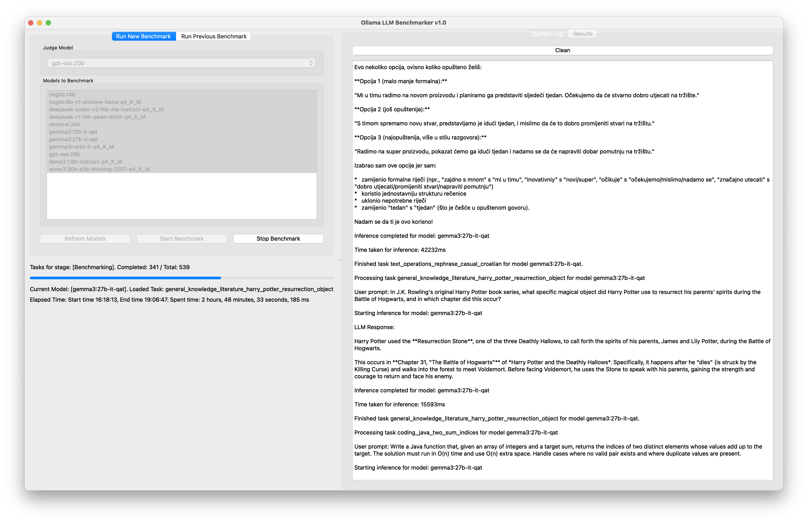
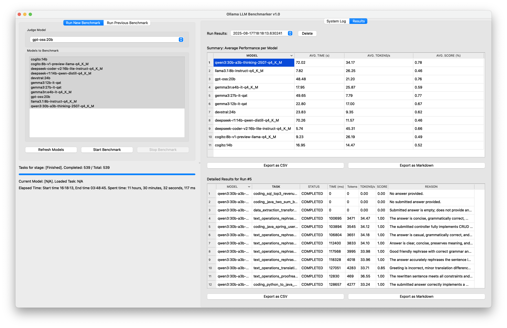

# Ollama LLM Benchmarker

**Cross-Platform Benchmarking Tool for Local Ollama Models**


*Main interface showing an active benchmark run in progress*

## Overview

The **Ollama LLM Benchmarker** is a desktop application for developers, researchers, and AI enthusiasts to
**systematically evaluate local LLMs served by [Ollama](https://ollama.com/)**.
It automates the full benchmarking lifecycle: running tasks, collecting performance metrics, and performing automated
quality judgments via a user-selected model.

Results are stored locally and can be compared across runs, providing actionable insights for model selection.

## Key Features

✅ **Dynamic Model Management**

* Auto-discovers available Ollama models on startup
* Manual refresh of the model list

✅ **Benchmark Lifecycle**

* Start new runs with multiple models and judge selection
* Pause, resume, and stop safely without data loss
* Continue unfinished benchmarks from history

✅ **Execution Metrics**

* Response time (ms)
* Tokens generated
* Throughput (tokens/second)

✅ **Automated Judging**

* Any model can serve as the **judge**
* Produces **0–100% quality scores** and **textual rationales**

✅ **History & Reporting**

* Local SQLite database persists all results
* Export results to **CSV** or **Markdown** for external analysis


*Results tab with per-model averages and judge reasoning*

## Prerequisites

Before using the application, ensure:

* [Ollama](https://ollama.com/) is installed with default settings
* Models you want to benchmark are **already pulled** into Ollama
* Ollama server is running

```bash
  ollama pull llama3:8b
  ollama pull gemma3:27b
  ollama pull mistral:instruct
```

* Python **3.13+** installed
* [Poetry](https://python-poetry.org/) **≥ 2.0** installed

## System Requirements

| Category     | Requirement                                        |
|--------------|----------------------------------------------------|
| OS           | macOS, Linux, Windows                              |
| Python       | ≥ 3.13 (tested with 3.13.5 and 3.13.6)             |
| Dependencies | Poetry ≥ 2.0 (tested with version 2.1.4)           |
| Ollama       | Installed & running with desired models pre-pulled |
| Chip         | Any modern CPU/GPU (Apple Silicon, NVIDIA, etc.)   |

## Quick Start

```bash
git clone https://github.com/sanyokkua/ollama_llm_bench.git
cd ollama_llm_bench
poetry install
poetry run ollama_llm_bench
```

Optional flags:

```bash
# Enable logging (by default logs are disabled; levels: info, debug, warning)
poetry run ollama_llm_bench --log-level info

# Use custom dataset path (you can create a folder with *.yaml files)
poetry run ollama_llm_bench -d /path/to/dataset_folder
```

## Supported Workflows

### 1. Running Benchmarks

* Select multiple models for benchmark and a judge model
* Start a **new run** or continue from history
* Pause, resume, or stop safely

### 2. Reviewing Results

* Interactive results tab with tables
* Judge rationales included for each task

> Judge results can be subjective and depend on the judge model. The better (larger) the model, the better the results.

### 3. Exporting

* Export full benchmark run data to **CSV**
* Export human-readable reports to **Markdown**

> Reports will be created in the same folder where the app is run

## Technical Stack

* **Core Language:** Python 3.13
* **UI Framework:** PyQt6
* **LLM Client:** [ollama-python](https://pypi.org/project/ollama)
* **Database:** SQLite
* **Task Definitions:** YAML
* **Dependency Management:** Poetry
* **Threading:** Qt `QThread` (signals/slots for UI safety)

## Directory Structure

```
.
├── LICENSE
├── README.md
├── docs/                  # Project documentation
├── dist/                  # Build artifacts
├── pyproject.toml         # Poetry project configuration
└── src/
    └── ollama_llm_bench
        ├── main.py        # Application entry point
        ├── app_context.py # Context and DI setup
        ├── core/          # Models, interfaces, controller
        ├── services/      # Data, Ollama, dataset services
        ├── ui/            # PyQt6 UI components
        ├── utils/         # Helpers, service provider
        └── dataset/       # YAML benchmark tasks
```

## Example Dataset Format

Each benchmark task is defined in YAML:

```yaml
- task_id: "java_hello_world"
  category: "Coding"
  sub_category: "Java"
  question: "Write a standard 'Hello, World!' program in Java."
  expected_answer:
    most_expected: "public class HelloWorld { public static void main(String[] args) { System.out.println(\"Hello, World!\"); } }"
    good_answer: "Contains 'public class', 'public static void main', and 'System.out.println'."
    pass_option: "Any snippet that prints 'Hello, World!'"
  incorrect_direction: "Uses Python syntax or prints wrong text."
```

> For your own tasks, use separate YAML files with a structure as above. Multiple items in one file are also acceptable,
> but they reduce readability.

## Performance Notes

* GPU acceleration depends on Ollama configuration.
* Judge models add overhead but provide **qualitative insights**.
* Large datasets may increase run time; results can always be paused (after execution of the current task) and resumed.
* It is not a fast process; the more tasks/models, the more time required.

## Additional Notes

* Results are stored locally in `db.sqlite`. (Will be created in the same folder where the app was run)
* Judge reasoning is included for transparency in model evaluation.
* The project is designed for **research and evaluation** purposes—verify results for production use cases.
* This is the first version of the app (PoC); bugs or mistakes are expected.

---
