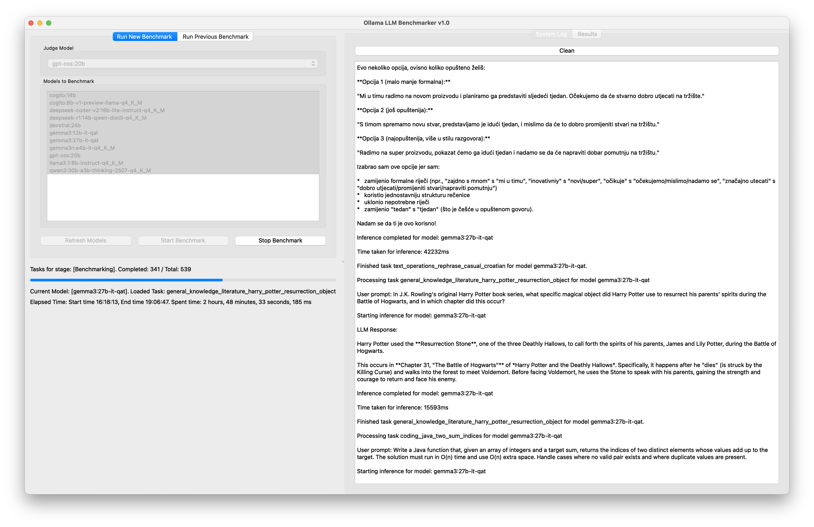
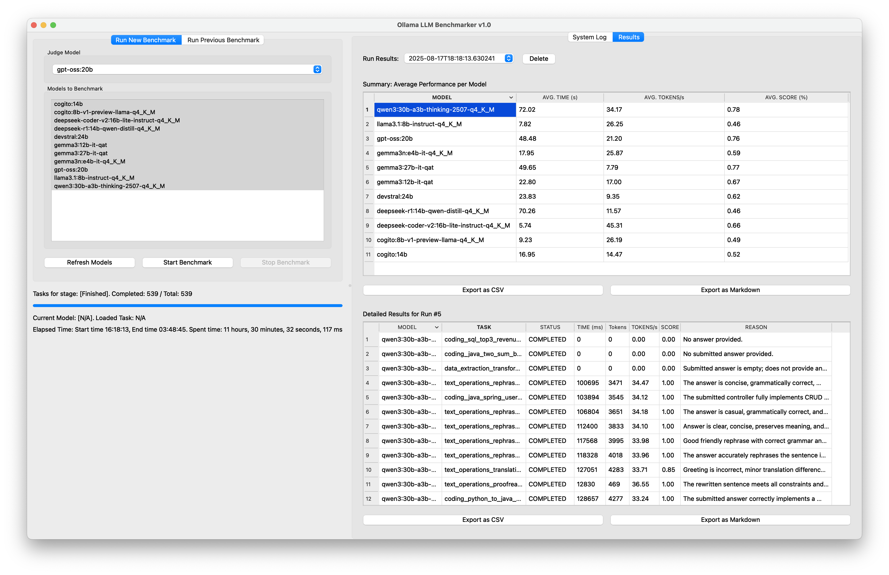

# Ollama LLM Benchmarker

**Cross-Platform Benchmarking Tool for Local LLMs (Ollama, LM Studio, llama.cpp) and Cloud Providers (OpenAI, Anthropic, Gemini, Azure)**


*Main interface showing an active benchmark run in progress*

## Overview

The **Ollama LLM Benchmarker** is a desktop application for developers, researchers, and AI enthusiasts to
**systematically evaluate LLMs across multiple providers**: [Ollama](https://ollama.com/), LM Studio, llama.cpp,
and OpenAI-compatible / Anthropic / Gemini / Azure cloud APIs.
It automates the full benchmarking lifecycle: running tasks, collecting performance metrics, and performing automated
quality judgments through a four-layer evaluation pipeline (rule-based, keyword, cosine similarity, and LLM-judge).

Results are stored locally and can be compared across runs, providing actionable insights for model selection.

## Key Features

✅ **Dynamic Model Management**

* Auto-discovers available Ollama models on startup
* Manual refresh of the model list

✅ **Benchmark Lifecycle**

* Start new runs with multiple models and judge selection
* Pause, resume, and stop safely without data loss
* Continue unfinished benchmarks from history

✅ **Execution Metrics**

* Response time (ms)
* Tokens generated
* Throughput (tokens/second)

✅ **Automated Judging**

* Any model can serve as the **judge**
* Produces **0–100% quality scores** and **textual rationales**

✅ **History & Reporting**

* Local SQLite database persists all results
* Export results to **CSV** or **Markdown** for external analysis


*Results tab with per-model averages and judge reasoning*

## Prerequisites

Before using the application, ensure:

* At least one LLM provider is reachable. Common options:
  * **Local**: [Ollama](https://ollama.com/), LM Studio, or llama.cpp running with desired models pulled.
    ```bash
    ollama pull llama3:8b
    ollama pull gemma3:27b
    ollama pull mistral:instruct
    ```
  * **Cloud**: API key for OpenAI / Anthropic / Gemini / Azure configured via the in-app **Settings** dialog or `providers.yaml`.
* Python **3.13+** installed
* [uv](https://docs.astral.sh/uv/) installed

## System Requirements

| Category     | Requirement                                        |
|--------------|----------------------------------------------------|
| OS           | macOS, Linux, Windows                              |
| Python       | ≥ 3.13 (tested with 3.13.5 and 3.13.6)             |
| Dependencies | uv (see [docs.astral.sh/uv](https://docs.astral.sh/uv/)) |
| Ollama       | Installed & running with desired models pre-pulled |
| Chip         | Any modern CPU/GPU (Apple Silicon, NVIDIA, etc.)   |

## Quick Start

```bash
git clone https://github.com/sanyokkua/ollama_llm_bench.git
cd ollama_llm_bench
uv sync
uv run ollama_llm_bench
```

Optional flags:

```bash
# Enable logging (by default logs are disabled; levels: info, debug, warning)
uv run ollama_llm_bench --log-level info

# Use custom dataset path (you can create a folder with *.yaml files)
uv run ollama_llm_bench -d /path/to/dataset_folder
```

## Supported Workflows

### 1. Running Benchmarks

* Select multiple models for benchmark and a judge model
* Start a **new run** or continue from history
* Pause, resume, or stop safely

### 2. Reviewing Results

* Interactive results tab with tables
* Judge rationales included for each task

> Judge results can be subjective and depend on the judge model. The better (larger) the model, the better the results.

### 3. Exporting

* Export full benchmark run data to **CSV**
* Export human-readable reports to **Markdown**

> Reports will be created in the same folder where the app is run

## Technical Stack

* **Core Language:** Python 3.13+
* **UI Framework:** PySide6
* **LLM Clients:** [openai](https://pypi.org/project/openai) (Ollama, LM Studio, llama.cpp, OpenAI, Azure via `/v1/`), [anthropic](https://pypi.org/project/anthropic), [google-genai](https://pypi.org/project/google-genai)
* **Database:** SQLite (stdlib `sqlite3`)
* **Task Definitions:** YAML
* **Dependency Management:** uv + hatchling
* **Threading:** Qt `QThreadPool` + `QRunnable` (signals/slots for UI safety)

## Directory Structure

```
.
├── LICENSE
├── README.md
├── docs/                       # Project documentation (architecture/, reference/)
├── pyproject.toml              # Project configuration (uv + hatchling)
└── src/
    └── ollama_llm_bench
        ├── main.py             # Application entry point
        ├── app_context.py      # Dependency-injection composition root
        ├── backend/
        │   ├── core/           # Frozen dataclasses, interfaces, constants
        │   ├── services/       # Provider registry, evaluators, persistence
        │   └── utils/          # Pure utility functions
        ├── ui/
        │   ├── qt_classes/     # QtEventBus, QRunnable workers, metaclass
        │   ├── controllers/    # UI ↔ services mediators
        │   ├── widgets/        # PySide6 widgets, panels, dialogs
        │   └── style/          # Themes, QSS, design tokens
        └── dataset/            # YAML benchmark tasks
```

## Example Dataset Format

Each benchmark task is defined in YAML:

```yaml
- task_id: "java_hello_world"
  category: "Coding"
  sub_category: "Java"
  question: "Write a standard 'Hello, World!' program in Java."
  expected_answer:
    most_expected: "public class HelloWorld { public static void main(String[] args) { System.out.println(\"Hello, World!\"); } }"
    good_answer: "Contains 'public class', 'public static void main', and 'System.out.println'."
    pass_option: "Any snippet that prints 'Hello, World!'"
  incorrect_direction: "Uses Python syntax or prints wrong text."
```

> For your own tasks, use separate YAML files with a structure as above. Multiple items in one file are also acceptable,
> but they reduce readability.

## Performance Notes

* GPU acceleration depends on Ollama configuration.
* Judge models add overhead but provide **qualitative insights**.
* Large datasets may increase run time; results can always be paused (after execution of the current task) and resumed.
* It is not a fast process; the more tasks/models, the more time required.

## Additional Notes

* Results are stored locally in `db.sqlite` under the OS-specific user data directory (`~/Library/Application Support/OllamaLLMBench/` on macOS, `%APPDATA%\OllamaLLMBench\` on Windows, `$XDG_DATA_HOME/OllamaLLMBench/` on Linux).
* Judge reasoning is included for transparency in model evaluation.
* The project is designed for **research and evaluation** purposes — verify results for production use cases.

---
