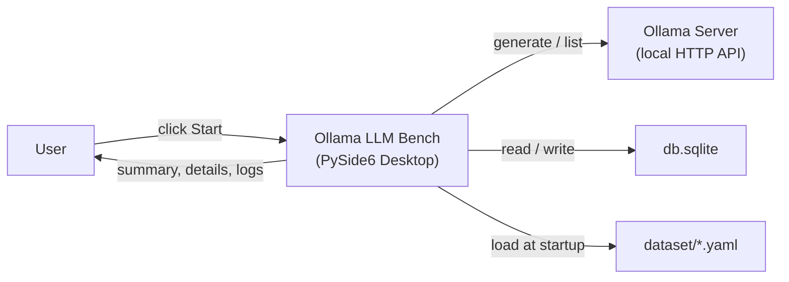

# Ollama LLM Bench — Documentation

**Ollama LLM Bench** is a PySide6 desktop application that benchmarks local LLMs served by a running [Ollama](https://ollama.com/) instance.
It runs a fixed set of YAML-defined tasks against every test model the user selects, asks a judge model to grade each response, and stores the results in a local SQLite database for side-by-side comparison.

This folder is the single source of truth for how the project actually works today.
When `CLAUDE.md` at the repository root disagrees with what you read here, [technical-debt.md](technical-debt.md) explains why — and the code is always authoritative.

## Documentation Index

### Start Here

| Document | What it answers |
|---|---|
| [architecture.md](architecture.md) | How is the system structured? What are the layers, the DI wiring, the EventBus, the threading model? |
| [glossary.md](glossary.md) | What do *run*, *result*, *task*, *stage*, *judge*, *warm-up* actually mean? |
| [technical-debt.md](technical-debt.md) | Where does `CLAUDE.md` drift from reality? What known issues and implementation quirks exist? |

### Deep Dives

| Document | What it answers |
|---|---|
| [data-model.md](data-model.md) | What's the SQLite schema? What frozen dataclasses live in `core/models.py`? How does a result transition through statuses? |
| [benchmark-pipeline.md](benchmark-pipeline.md) | What happens between *Start* and *Results*? How do scoring and warm-up work? How does cancellation flow through the worker? |
| [services-reference.md](services-reference.md) | API reference for every `ABC` in `core/interfaces.py` and its concrete service implementation. |
| [ui-architecture.md](ui-architecture.md) | What does the widget tree look like? Which controller owns which widget? How does a new benchmark flow through the UI? |
| [dataset-format.md](dataset-format.md) | What's the YAML schema for benchmark tasks? How do I add one? |
| [configuration.md](configuration.md) | What CLI flags, `pyproject.toml` sections, ruff rules, mypy config, and runtime paths exist? |

### Building on the Project

| Document | What it answers |
|---|---|
| [developer-guide.md](developer-guide.md) | How do I add a new dataclass, interface, service, EventBus signal, widget, background task? Patterns, pitfalls, migration checklist. |
| [testing-guide.md](testing-guide.md) | What's the target test layout, fixture pattern, mocking strategy? (The `tests/` folder is currently empty.) |

### Other Documents in this Folder

| Document | Purpose |
|---|---|
| [project_specification.md](project_specification.md) | Behavioural requirements spec, retained from the project's original documentation |
| [architecture/overview.md](architecture/overview.md) | Earlier single-file architecture doc — kept for reference; [architecture.md](architecture.md) is now the canonical version |

## Quick Start

```bash
# 1. Install dependencies (first time or after pulling)
uv sync

# 2. Make sure Ollama is running and has at least one model available
ollama list

# 3. Launch the app with the bundled dataset
uv run ollama_llm_bench

# 4. Or with logs and a custom dataset folder
uv run ollama_llm_bench --log-level info -d /path/to/tasks
```

Inside the app:

1. In the **Run New Benchmark** tab, pick a judge model and tick one or more test models.
2. Click **Start Benchmark**. The app will switch to the log tab and begin executing.
3. Wait for the progress bar to finish. The app will automatically switch the view to the **Results** tab, where you can export summary and detailed tables as CSV or Markdown.

## Tech Stack

| Component | Technology |
|---|---|
| Language | Python 3.13+ |
| UI framework | PySide6 |
| Package manager | UV with `hatchling` build backend |
| Storage | SQLite via stdlib `sqlite3` |
| LLM client | `ollama` Python package |
| Dataset format | YAML (`pyyaml`) |
| Linter / formatter | Ruff |
| Type checker | Mypy (authoritative), Pyright (IDE-only) |
| Test framework | pytest + pytest-mock + pytest-cov (no tests yet) |

Full dependency list: see [configuration.md](configuration.md) and `pyproject.toml`.

## Development Commands

```bash
# Quality pipeline (in the mandatory order)
uv run ruff check --output-format=concise src/ tests/
uv run ruff format --check src/ tests/
uv run pyright src/
uv run mypy src/
uv run pytest -q --tb=short --no-header

# Or via the helper script
./scripts/ai-check.sh
```

## System Context



Nothing leaves the user's machine: Ollama, the SQLite file, and the YAML dataset are all local.

## AI-Assisted Development

The repository contains a `.claude/` directory with agent instructions, project rules, and skill definitions used by Claude Code.
Start with `CLAUDE.md` at the repository root for the AI-assisted workflow, then treat this `docs/` folder as the ground-truth reference.
Discrepancies between `CLAUDE.md` and the current code are tracked in [technical-debt.md](technical-debt.md).

## License

MIT — see `LICENSE` at the repository root.
