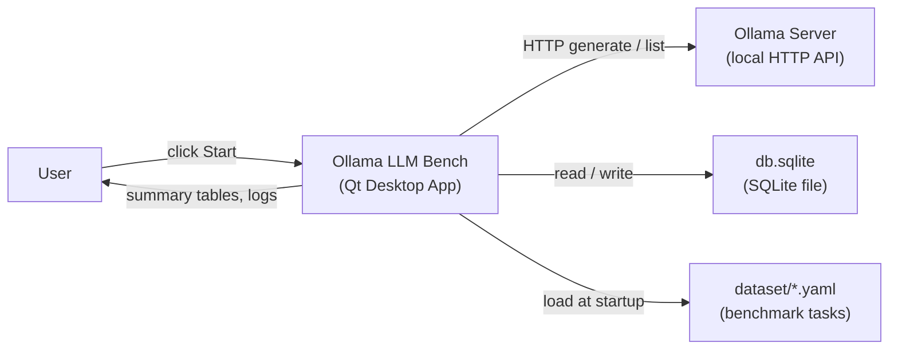
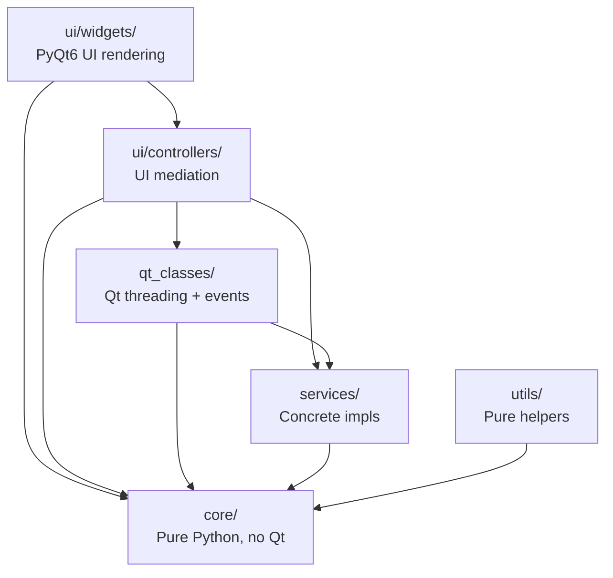
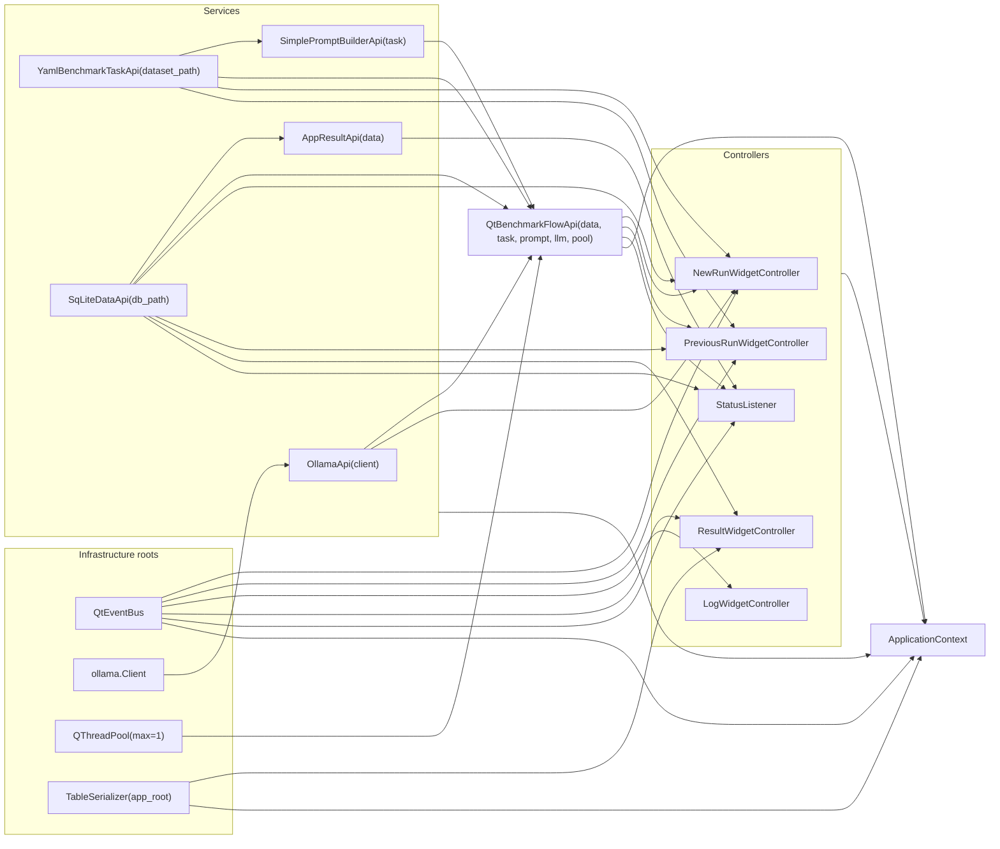
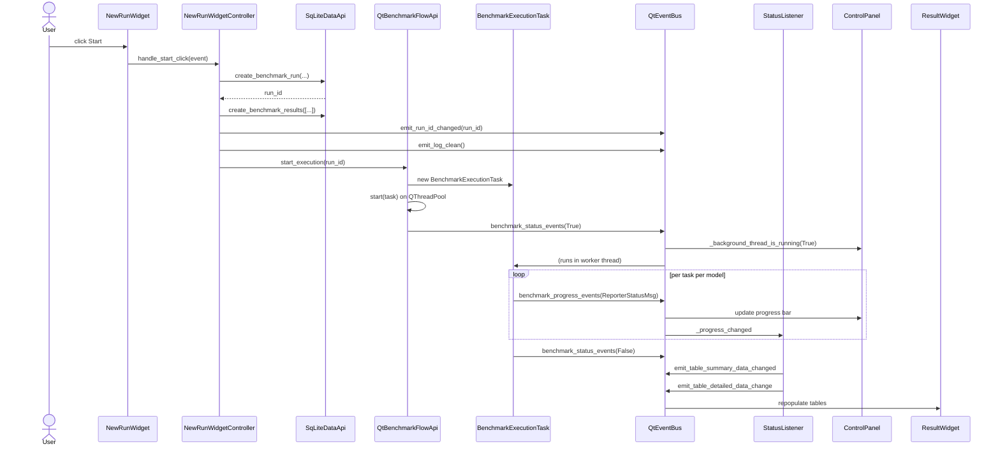

# System Architecture

Ollama LLM Bench is a single-process PySide6 — *actually* PyQt6; see [technical-debt.md](technical-debt.md) — desktop application.
The user selects a judge model plus one or more test models, clicks Start, and the app runs every benchmark task against every test model, scores the responses with the judge model, and persists everything to SQLite.

This document is the canonical architectural reference.
It maps every component to a concrete file path under `src/ollama_llm_bench/`.

## High-Level System Context



Nothing leaves the user's machine: Ollama, the SQLite file, and the YAML dataset are all local.

## Layer Architecture

The codebase is split into six packages with a strict inward-pointing dependency rule.
Arrows point *from* a layer *to* the layer it is allowed to import.



### Invariants

1. **`core/` never imports any Qt module.** It holds only `@dataclass(frozen=True)`, `StrEnum`, `ABC` definitions, SQL strings, prompt templates, and stage constants.
2. **`services/` never imports Qt.** Concrete implementations (`OllamaApi`, `SqLiteDataApi`, etc.) live in `services/` and must be unit-testable without a `QApplication`.
3. **All threaded work lives in `qt_classes/`.** Nothing outside that package creates a `QRunnable` or a `QThreadPool`.
4. **Widgets talk to the backend only through controllers.** No widget directly instantiates a service or touches SQLite.
5. **All background-to-UI communication flows through `QtEventBus`.** No `QMetaObject.invokeMethod`, no direct widget mutation from worker threads.

## Package Breakdown

### `core/`

Pure Python. No Qt, no third-party deps beyond stdlib.

| File | Responsibility |
|---|---|
| `core/interfaces.py` | 9 `ABC` classes: `LLMApi`, `DataApi`, `ResultApi`, `BenchmarkTaskApi`, `PromptBuilderApi`, `BenchmarkFlowApi`, `EventBus`, `AppContext`, `ITableSerializer` |
| `core/models.py` | 9 frozen dataclasses and 2 `StrEnum`s — see [data-model.md](data-model.md) |
| `core/sql_constants.py` | `DB_SCHEMA` DDL + 13 query string constants |
| `core/prompt_constants.py` | `SYSTEM_PROMPT` + `USER_PROMPT` template for the judge |
| `core/stages_constants.py` | 5 stage string constants |
| `core/ui_controllers.py` | 4 controller ABCs (`NewRunWidgetControllerApi`, `PreviousRunWidgetControllerApi`, `LogWidgetControllerApi`, `ResultWidgetControllerApi`) |

**Allowed imports**: stdlib only.
**Forbidden imports**: `PyQt6`, `PySide6`, `ollama`, `yaml`.

### `services/`

Concrete service implementations. Pure Python — no Qt.

| File | Class | Implements |
|---|---|---|
| `services/ollama_llm_api.py` | `OllamaApi` | `LLMApi` — wraps `ollama.Client(timeout=300)` |
| `services/sq_lite_data_api.py` | `SqLiteDataApi` | `DataApi` — opens a fresh `sqlite3.connect` per call |
| `services/app_result_api.py` | `AppResultApi` | `ResultApi` — aggregation and projection |
| `services/yaml_benchmark_task_api.py` | `YamlBenchmarkTaskApi` | `BenchmarkTaskApi` — caches YAML tasks after first load |
| `services/simple_prompt_builder_api.py` | `SimplePromptBuilderApi` | `PromptBuilderApi` — template substitution |
| `services/table_serializer.py` | `TableSerializer` | `ITableSerializer` — CSV + Markdown export |

**Allowed imports**: stdlib, `ollama`, `yaml`, `core/`.
**Forbidden imports**: any Qt module.

### `qt_classes/`

Qt threading and event infrastructure.
This is the only place that may create `QRunnable`, `QThreadPool`, or `pyqtSignal`.

| File | Class | Notes |
|---|---|---|
| `qt_classes/meta_class.py` | `MetaQObjectABC` | Metaclass merging `type(QObject)` and `ABCMeta`. Required because `QObject`'s metaclass is incompatible with `ABCMeta` by default. |
| `qt_classes/qt_event_bus.py` | `QtEventBus(QObject, EventBus)` | 11 `pyqtSignal` definitions; implements the `EventBus` ABC. |
| `qt_classes/qt_benchmark_execution_task.py` | `BenchmarkExecutionTask(QRunnable)` | The pipeline worker. Contains a nested `Signals(QObject)` class because `QRunnable` does not inherit `QObject` and therefore cannot emit signals directly. |
| `qt_classes/qt_benchmark_flow.py` | `QtBenchmarkFlowApi(QObject, BenchmarkFlowApi)` | Owns the current `BenchmarkExecutionTask`, forwards its signals onto its own `benchmark_*_events` signals, hands the task to the thread pool. |

**Allowed imports**: stdlib, `PyQt6`, `core/`, `services/`, `utils/`.

### `ui/`

All user-facing code.

#### `ui/controllers/` — Widget Controllers

Controllers are plain (non-Qt) classes that hold references to services and the event bus.
They are the glue between widget events and backend state mutation.

| File | Class | Widget(s) managed |
|---|---|---|
| `ui/controllers/new_run_widget_controller.py` | `NewRunWidgetController` | `NewRunWidget` |
| `ui/controllers/previous_run_widget_controller.py` | `PreviousRunWidgetController` | `PreviousRunWidget` |
| `ui/controllers/log_widget_controller.py` | `LogWidgetController` | `LogWidget` |
| `ui/controllers/result_widget_controller.py` | `ResultWidgetController` | `ResultWidget` |
| `ui/controllers/status_listener.py` | `StatusListener` | None — it bridges `BenchmarkFlowApi` progress events into `EventBus` table-update emissions |

#### `ui/widgets/` and `ui/main_window.py` — PyQt6 Widgets

| File | Widget | Purpose |
|---|---|---|
| `ui/main_window.py` | `MainWindow(QMainWindow)` | Top-level window, 1200×800, title "Ollama LLM Benchmarker v1.0". Owns the `AppContext`, subscribes to `_global_event_msg` for `QMessageBox` dialogs |
| `ui/widgets/central_widget.py` | `CentralWidget(QWidget)` | Horizontal `QSplitter` with 20/80 weight split between control and results panels |
| `ui/widgets/panels/control_panel.py` | `ControlPanel` | Left pane; hosts the control tabs plus a progress bar, task counter, status label, elapsed-time label |
| `ui/widgets/panels/control/control_tab_widget.py` | `ControlTabWidget(QTabWidget)` | Two tabs: "Run New Benchmark" and "Run Previous Benchmark" |
| `ui/widgets/panels/control/new_run_widget.py` | `NewRunWidget` | Judge dropdown, multi-select list of test models, Refresh/Start/Stop buttons |
| `ui/widgets/panels/control/previous_run_widget.py` | `PreviousRunWidget` | Dropdown of unfinished runs, Refresh/Start/Stop buttons |
| `ui/widgets/panels/results_panel.py` | `ResultsPanel` | Right pane; hosts the results tabs |
| `ui/widgets/panels/result/result_tab_widget.py` | `ResultTabWidget(QTabWidget)` | Two tabs: "System Log" and "Results". Auto-switches to the log tab when a benchmark starts |
| `ui/widgets/panels/result/log_widget.py` | `LogWidget` | Read-only `QTextEdit` with a Clear button |
| `ui/widgets/panels/result/result_widget.py` | `ResultWidget` | Run-selection dropdown, summary `QTableWidget`, detailed `QTableWidget`, CSV/MD export buttons. Contains the nested `SortableNumericItem` for numeric column sorting |

See [ui-architecture.md](ui-architecture.md) for the full widget tree diagram and user journeys.

### `utils/`

Pure helpers. No Qt imports *except* for `widget_utils.py`, which is a tiny exception.

| File | Functions |
|---|---|
| `utils/text_utils.py` | `extract_json_object`, `sanitize_json_string`, `parse_judge_response`, `sanitize_text` (strips `<think>...</think>`) |
| `utils/time_utils.py` | `calculate_elapsed_time`, `format_elapsed_time`, `format_elapsed_time_interval` |
| `utils/run_utils.py` | `get_benchmark_runs` — sorts all runs newest-first |
| `utils/widget_utils.py` | `set_benchmark_run_on_dropdown` — single `QComboBox` helper (only file in `utils/` that imports Qt) |

## Dependency Injection

### Composition Root

`src/ollama_llm_bench/app_context.py` is the only module that knows how to wire concrete implementations together.
The factory function `_create_app_context(app_root, dataset_path)` constructs every service and controller in strict dependency order:



Constructor injection is used everywhere.
Every service and controller receives its dependencies via **keyword-only arguments** — see any `__init__(self, *, ...)` signature in `services/` or `ui/controllers/`.

### `ContextProvider` Singleton

```python
class ContextProvider:
    _context: ApplicationContext | None = None
    _initialized = False
    _mutex = QMutex()

    @classmethod
    def initialize(cls, app_root: Path, dataset_path: Path = None) -> None: ...

    @classmethod
    def get_context(cls) -> ApplicationContext: ...
```

- **Why a singleton?** The Qt `MainWindow` is constructed deep in `main.py` after argument parsing, and needs a reference to every controller. Passing the full context through constructors everywhere would be noisy. The singleton is write-once (raises `RuntimeError` on re-init) and read-many.
- **Why `QMutex` instead of `threading.Lock`?** Consistency with the rest of the Qt event model. The mutex only guards the *initialization* path; post-init reads are lock-free.
- **Called from**: `src/ollama_llm_bench/main.py:main` → `ContextProvider.initialize(app_root, dataset_path)` → `ContextProvider.get_context()` passes the context into `MainWindow(ctx)`.

### `ApplicationContext`

An immutable `__slots__`-bound holder (defined in `app_context.py`).
Implements the `AppContext` ABC from `core/interfaces.py` with getter methods per service.
Holds 13 references (all 6 services, the benchmark flow, the event bus, 4 controllers, the status listener, and the table serializer).

## EventBus

### Role

`QtEventBus` (`qt_classes/qt_event_bus.py`) is the only asynchronous, loosely-coupled communication channel in the app.
It is a `QObject` subclass whose attributes are `pyqtSignal` instances; the `EventBus` ABC exposes `subscribe_to_*` and `emit_*` methods that wrap `connect` / `emit`.

Qt signals are thread-safe by default: a worker thread can call `emit_*` and Qt will queue the call onto the main thread for each slot that lives on the main thread.
This is how all background-to-UI communication is kept safe.

### Signal Catalogue

| Signal attribute | Payload | Public `emit_*` method | Purpose |
|---|---|---|---|
| `_run_id_changed` | `int` | `emit_run_id_changed(Optional[int])` | Active run selection changed. `None` is transported as `-1` because `pyqtSignal(int)` cannot carry `None`. |
| `_run_ids_changed` | `list` | `emit_run_ids_changed(list[tuple[int, str]])` | The set of runs known to the UI has changed (after create/delete). |
| `_models_test_changed` | `list` | `emit_models_test_changed(list[str])` | Test-model list refreshed from Ollama. |
| `_models_judge_changed` | `str` | `emit_models_judge_changed(str)` | Default judge model changed. Currently has no subscribers (unused) — see [technical-debt.md](technical-debt.md). |
| `_log_clean` | *(none)* | `emit_log_clean()` | Request to clear the log panel. |
| `_log_append` | `str` | `emit_log_append(str)` | Append one line to the log panel. |
| `_table_summary_data_changed` | `list` | `emit_table_summary_data_changed(list[AvgSummaryTableItem])` | Refresh the summary table. |
| `_table_detailed_data_change` | `list` | `emit_table_detailed_data_change(list[SummaryTableItem])` | Refresh the detailed table. |
| `_background_thread_is_running` | `bool` | `emit_background_thread_is_running(bool)` | Benchmark worker started / stopped. |
| `_background_thread_progress_changed` | `object` (`ReporterStatusMsg`) | `emit_background_thread_progress(ReporterStatusMsg)` | Progress heartbeat during execution. |
| `_global_event_msg` | `str` | `emit_global_event_msg(str)` | Show a modal information dialog via `MainWindow._show_global_message`. |

### Publisher / Subscriber Map

| Signal | Emitters | Subscribers |
|---|---|---|
| `_run_id_changed` | `NewRunWidgetController.handle_start_click`; `PreviousRunWidgetController.handle_item_change` / `handle_refresh_click`; `ResultWidgetController.handle_run_selection_change` / `handle_delete_click`; `StatusListener._progress_changed`; `ApplicationContext.send_initialization_events` | `PreviousRunWidgetController`; `ResultWidgetController`; `ResultWidget`; `StatusListener` |
| `_run_ids_changed` | `PreviousRunWidgetController`; `ResultWidgetController.handle_delete_click`; `StatusListener._progress_changed`; `ApplicationContext.send_initialization_events` | `PreviousRunWidget` (dropdown); `ResultWidget` (dropdown) |
| `_models_test_changed` | `NewRunWidgetController.handle_refresh_click`; `ApplicationContext.send_initialization_events` | `NewRunWidget` |
| `_models_judge_changed` | `ApplicationContext.send_initialization_events` | *(none)* |
| `_log_clean` | `LogWidgetController` (on benchmark start); `NewRunWidgetController.handle_start_click` | `LogWidget` |
| `_log_append` | The lambda in `_create_app_context` that bridges `QtBenchmarkFlowApi.benchmark_output_events` into `emit_log_append` — which in turn is fed by `BenchmarkExecutionTask.Signals.log_message` | `LogWidget` |
| `_table_summary_data_changed` | `StatusListener._post_tables_update` | `ResultWidget` |
| `_table_detailed_data_change` | `StatusListener._post_tables_update` | `ResultWidget` |
| `_background_thread_is_running` | Lambda in `_create_app_context` bridging `QtBenchmarkFlowApi.benchmark_status_events` | `ControlPanel`; `ResultTabWidget` (forces log tab); all 4 controllers |
| `_background_thread_progress_changed` | Lambda in `_create_app_context` bridging `QtBenchmarkFlowApi.benchmark_progress_events` | `ControlPanel`; `StatusListener` |
| `_global_event_msg` | `NewRunWidgetController`; `PreviousRunWidgetController`; `ResultWidgetController` (error paths + export success/failure) | `MainWindow._show_global_message` (`QMessageBox.information`) |

### Start-Run Sequence



## Threading Model

The application uses **exactly one** background `QThreadPool` and caps it at one thread:

```python
thread_pool = QThreadPool()
thread_pool.setMaxThreadCount(1)
```

(`src/ollama_llm_bench/app_context.py:310`)

### Consequences

- There is **at most one** `BenchmarkExecutionTask` running at any time. `QtBenchmarkFlowApi.start_execution` guards this explicitly via `is_running()`.
- Task execution order within a run is deterministic: tasks are grouped by model (`BenchmarkExecutionTask._group_tasks_by_model`), then each model's tasks run sequentially, then the judging stage runs all `WAITING_FOR_JUDGE` rows through the judge model.
- No locking is needed between background and UI code because all UI updates flow through queued Qt signals (the main thread processes them in its event loop).
- `ContextProvider._mutex` only guards one-time initialization.

### Thread Ownership Map

| Thread | Runs |
|---|---|
| Main (Qt event loop) | All widgets, all controller methods, all slot handlers, `SqLiteDataApi` calls from controllers |
| Thread pool worker | `BenchmarkExecutionTask.run` and everything it calls synchronously (including `OllamaApi.inference`, `OllamaApi.warm_up`, and `SqLiteDataApi` updates from the task) |

Because `SqLiteDataApi` opens a fresh connection per call, both threads can touch it without coordination.
Because `BenchmarkExecutionTask` never reaches into a widget, there is no cross-thread widget mutation.

## `MetaQObjectABC`

Defined in `qt_classes/meta_class.py`:

```python
from abc import ABCMeta
from PyQt6.QtCore import QObject

class MetaQObjectABC(type(QObject), ABCMeta):
    """Metaclass combining QObject and ABCMeta."""
```

### Why it exists

`QObject`'s metaclass (`sip.wrappertype` under PyQt6) is incompatible with `ABCMeta`, so a class cannot simply inherit from both `QObject` and `ABC`.
`MetaQObjectABC` explicitly merges them so that a Qt-aware class can also declare `@abstractmethod` members from an ABC.

### Who uses it

| Class | File | Parents |
|---|---|---|
| `QtEventBus` | `qt_classes/qt_event_bus.py` | `QObject`, `EventBus`, `metaclass=MetaQObjectABC` |
| `QtBenchmarkFlowApi` | `qt_classes/qt_benchmark_flow.py` | `QObject`, `BenchmarkFlowApi`, `metaclass=MetaQObjectABC` |

`BenchmarkExecutionTask` extends `QRunnable` (not `QObject`), so it does **not** use the metaclass — instead it nests a `Signals(QObject)` inner class to own its signals.

## Entry Point

`src/ollama_llm_bench/main.py`:

1. Parse CLI flags (`--log-level`, `--dataset`).
2. Configure the stdlib root logger (or disable it if no level was given).
3. Resolve the dataset path — `--dataset` wins, otherwise use `importlib.resources` to find the packaged `ollama_llm_bench/dataset` folder, otherwise fall back to the development source path.
4. Call `ContextProvider.initialize(app_root=Path.cwd(), dataset_path=...)`.
5. Retrieve the context, construct `QApplication(sys.argv)`, construct `MainWindow(ctx)`, call `main_window.show()`, enter `app.exec()`.
6. On any exception during bootstrap, print the traceback to `stderr` (not through the logger, since logging might not be configured) and exit with code 1.

The `ollama_llm_bench` console script entry point is defined in `pyproject.toml`:

```toml
[project.scripts]
ollama_llm_bench = "ollama_llm_bench.main:main"
```

## Related Documents

- [data-model.md](data-model.md) — tables, dataclasses, enums
- [benchmark-pipeline.md](benchmark-pipeline.md) — how a run actually executes
- [ui-architecture.md](ui-architecture.md) — the widget tree in detail
- [services-reference.md](services-reference.md) — service interface catalogue
- [technical-debt.md](technical-debt.md) — where the code diverges from CLAUDE.md's stated target state
- [architecture/overview.md](architecture/overview.md) — legacy single-file architecture doc (retained for reference)
