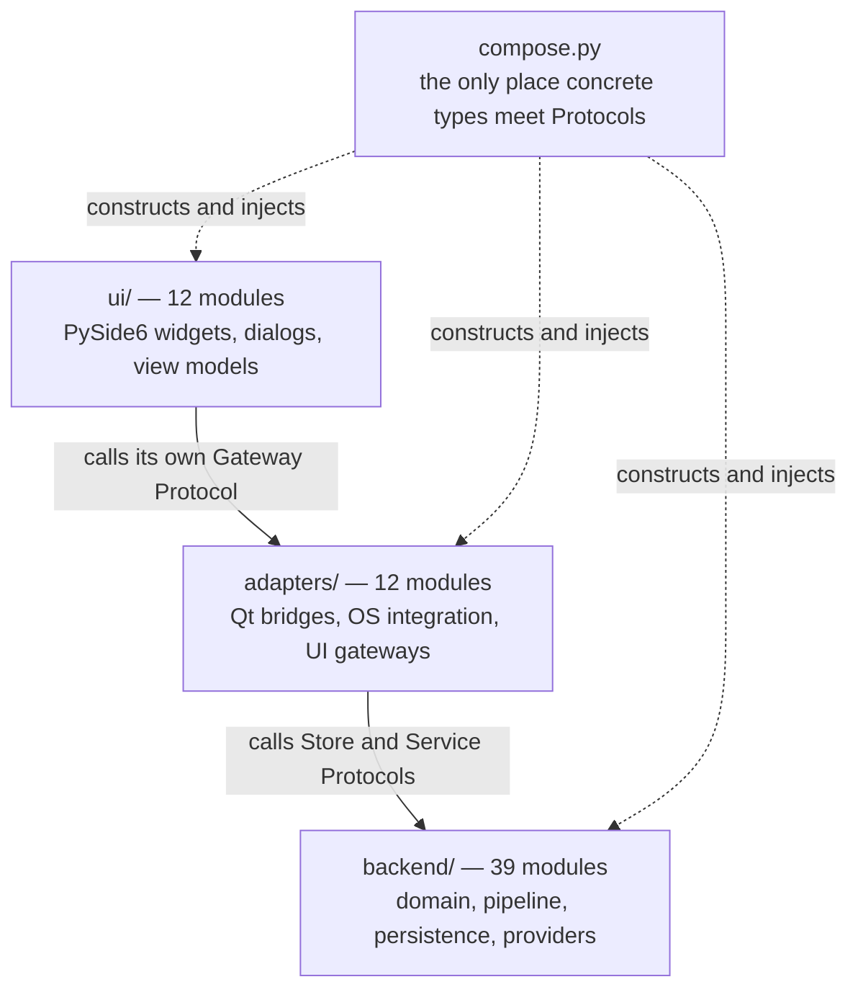
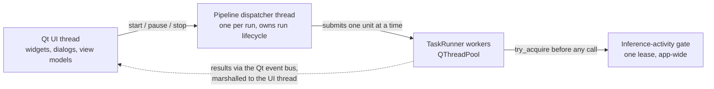

# Architecture

This directory describes the **as-built** system. The specification at
[`docs/v3_specification/`](../v3_specification/) describes the **intended** system and remains the
authority: where the two disagree, the specification is right and the difference is a defect.
This document does not restate the specification — it says what the code actually looks like and
links to the clause that governs each part.

| Document                             | Answers                                                             |
| ------------------------------------ | ------------------------------------------------------------------- |
| This file                            | How is the application layered, wired, and threaded?                |
| [`data-model.md`](data-model.md)     | What does it persist, in which tables, under what write discipline? |
| [`../adr/`](../adr/)                 | Why was a specific costly-to-reverse decision made?                 |
| [`../development/`](../development/) | How is a change verified before it lands?                           |

## The three layers

Every module belongs to exactly one of three layers, and dependencies point inward only.

`backend/` is the largest layer and the only one that is Qt-free. It holds the domain model, the
benchmark pipeline, the six persistence stores, the provider clients, and the cross-cutting
services (errors and redaction, logging, concurrency primitives, circuit breaker, evaluation).
It never imports PySide6, so every rule in it is testable without a running `QApplication`.

`adapters/` translates between Qt and the backend. It carries the Qt event bus, the store-to-Qt
signal bridge, the `QThreadPool`-backed task runner, the Qt table models, the OS integrations
(clipboard, native pickers, notifications), and — since
[ADR-0014](../adr/0014-house-ui-adapter-gateways-in-one-adapters-module.md) — the concrete
implementations of every widget's Gateway Protocol in `adapters/ui_gateways/`.

`ui/` holds the widgets. A widget controller depends on exactly one thing outside its own module:
the Gateway Protocol its module declares. It never holds a backend Store or Service Protocol
directly, so a widget can be tested against a fake gateway with no database and no provider.

The canonical module list is the specification's
[module inventory](../v3_specification/14_Process_and_Traceability/01_MODULE_INVENTORY.md). The
counts above are that inventory's row counts; treat the inventory, not this sentence, as current.

## What enforces the layering

Five `import-linter` contracts (`pyproject.toml:161-245`), run by `just import-check`:

| Contract                                | Type           | Prevents                                                      |
| --------------------------------------- | -------------- | ------------------------------------------------------------- |
| Backend layer is Qt-free                | `forbidden`    | Any `backend/` module importing PySide6                       |
| Module internals are private            | `forbidden`    | Reaching past a module's public surface into its `_internal/` |
| Provider adapters are independent       | `independence` | One provider client importing another                         |
| Only compose.py wires concrete adapters | `forbidden`    | A second wiring site growing outside the composition root     |
| Adapters never import the UI layer      | `forbidden`    | An inward-pointing edge becoming a cycle                      |

Contracts catch import edges. The rules they cannot express are architecture tests under
[`tests/architecture/`](../../tests/architecture/) — that a widget controller holds no backend
Protocol, that only the dispatcher thread calls the stability service, that every DTO crossing a
boundary is a `msgspec.Struct` rather than a `@dataclass`.

## The module public surface

Depth varies with a module's complexity; the public surface does not. Every module exposes at most
the files below and hides everything else, per
[`16_Engineering_Standards/01_PROJECT_STRUCTURE.md`](../v3_specification/16_Engineering_Standards/01_PROJECT_STRUCTURE.md).

| File           | Holds                                                                   |
| -------------- | ----------------------------------------------------------------------- |
| `__init__.py`  | Docstring, a literal `__all__`, re-exports from `.api` — no logic       |
| `api.py`       | Public functions and factories, each carrying `icontract` decorators    |
| `models.py`    | The module's `msgspec.Struct` DTOs and event types                      |
| `protocols.py` | `typing.Protocol` swap points — present only when the module offers one |
| `_internal/`   | All implementation; private                                             |

Consumers import from the package root — `from ollama_llm_bench.backend.csv_export import write_rows` — never through `.api` or `._internal`. Tests live beside the code they test, in the
module's own `tests/` directory; cross-module tests live under the repository's top-level
[`tests/`](../../tests/).

## Composition

`src/ollama_llm_bench/compose.py` is the single composition root: the one place a concrete class
is bound to a Protocol. Everything else receives its collaborators by injection and names only
Protocols, which is what makes the layering testable rather than merely documented.

The root is kept small deliberately. `tests/architecture/test_compose_line_budget.py` fails the
build if `compose.py` leaves a 50–450 line budget, so growth has to be a decision rather than an
accident. Helper shims extracted to stay inside that budget live in `_compose_shims.py`;
`build_app` remains the sole wiring site. See
[ADR-0010](../adr/0010-phase-11-composition-root-and-entry-point-structure.md).

## Concurrency

The application is single-window and single-user, and runs **at most one LLM inference call in
flight application-wide**. Three mechanisms carry that.

- **`TaskRunner`** is a backend Protocol (`backend/concurrency/protocols.py`) whose only
  production implementation is the `QThreadPool` wrapper in `adapters/qt_runnables/`. The backend
  submits work without knowing Qt exists.
- **One dispatcher thread per run** owns the run lifecycle and is the only thread permitted to
  call the stability service — pinned by
  `tests/architecture/test_stability_dispatcher_thread_only.py`.
- **`CancellationToken` is two-level and per-run** (`backend/concurrency/_internal/`): a soft
  cancel asks the pipeline to stop at the next phase boundary, a hard cancel fires registered
  hooks to tear a call down immediately. One token is constructed per run and threaded through
  every unit of it — never a process-wide singleton, never reused across runs.

`asyncio`, `anyio`, and `qasync` are banned from `src/` outright. Cross-thread delivery goes
through the Qt event bus and the store-to-Qt bridge, and nothing else; both modules are audited by
their own architecture tests, and `tests/conftest.py`'s Qt parity rig fails a test that provokes a
Qt threading warning.

Anything that touches this area is the highest-risk change in the codebase. Read
[`08_Cross_Cutting/`](../v3_specification/08_Cross_Cutting/) before changing it, and run the full
gate rather than the module's own tests.

## Cross-cutting rules worth knowing before reading code

| Rule                                                                                                   | Where it is defined                                                                                                                                              |
| ------------------------------------------------------------------------------------------------------ | ---------------------------------------------------------------------------------------------------------------------------------------------------------------- |
| DTOs crossing a boundary are `msgspec.Struct(frozen=True, kw_only=True, gc=False)`, never `@dataclass` | `tests/architecture/test_dtos.py`                                                                                                                                |
| Every public `api.py` function carries at least one `icontract` decorator                              | `16_Engineering_Standards/`                                                                                                                                      |
| All styling lives in `ui/theme/`; `setStyleSheet()` is banned elsewhere                                | `tests/architecture/test_ui_theme_style_authority.py`                                                                                                            |
| Secrets are redacted on two egress surfaces and nowhere else                                           | `10_Domain_and_Data/08_REDACTION_PATTERNS.md`, and the R-013 row of [`../development/risk_mitigation_checklist.md`](../development/risk_mitigation_checklist.md) |
| The schema has one writer and no migrations                                                            | [`data-model.md`](data-model.md)                                                                                                                                 |
| No telemetry, no auto-update, no network call the user did not configure                               | `12_Quality_and_NFRs/`                                                                                                                                           |
