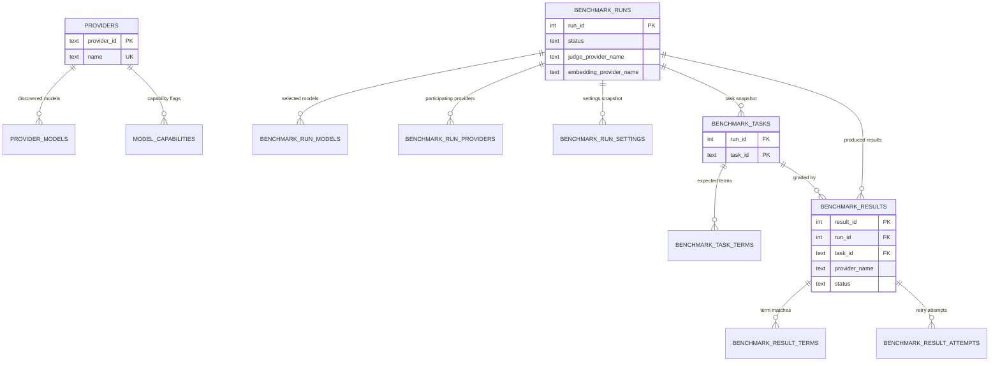

# Data model

The application persists everything to one SQLite file. This document describes the schema **as
built**: which tables exist, which store owns each one, how they reference each other, and the
write discipline that keeps the file consistent.

The authoritative definitions are
[`10_Domain_and_Data/03_PERSISTENCE_SCHEMA.md`](../v3_specification/10_Domain_and_Data/03_PERSISTENCE_SCHEMA.md)
and
[`08_Cross_Cutting/08-O_persistence_schema.md`](../v3_specification/08_Cross_Cutting/08-O_persistence_schema.md).
Column-level detail lives there and is not repeated here. The executable form is
`src/ollama_llm_bench/backend/persistence/app_settings/_internal/schema_ddl.py`, which is what
actually runs at launch.

## The fourteen tables

Every `CREATE TABLE` statement lives in `schema_ddl.py`, in foreign-key dependency order, and
every one uses `IF NOT EXISTS`.

| Table                       | `schema_ddl.py` | Owning store         | Holds                                                             |
| --------------------------- | --------------- | -------------------- | ----------------------------------------------------------------- |
| `app_meta`                  | `:32`           | `app_settings`       | One row (`CHECK (id = 1)`) carrying `schema_version`              |
| `providers`                 | `:39`           | `providers`          | Configured providers, keyed by a TEXT `provider_id` UUID          |
| `provider_models`           | `:74`           | `providers`          | Models discovered per provider                                    |
| `app_settings`              | `:83`           | `app_settings`       | Key/value application settings                                    |
| `model_capabilities`        | `:90`           | `model_capabilities` | Per-provider, per-model capability flags                          |
| `benchmark_runs`            | `:104`          | `runs`               | One row per run: mode, status, timestamps, judge/embedding choice |
| `benchmark_run_models`      | `:133`          | `runs`               | Models selected for a run, by role                                |
| `benchmark_run_providers`   | `:146`          | `runs`               | Providers participating in a run                                  |
| `benchmark_run_settings`    | `:163`          | `runs`               | The settings snapshot a run executed under                        |
| `benchmark_tasks`           | `:172`          | `tasks`              | The task set snapshotted into the run                             |
| `benchmark_task_terms`      | `:198`          | `tasks`              | Expected/forbidden terms per task                                 |
| `benchmark_results`         | `:210`          | `results`            | One row per task × model: status, verdict, metrics                |
| `benchmark_result_terms`    | `:271`          | `results`            | Per-result term matches                                           |
| `benchmark_result_attempts` | `:284`          | `results`            | Per-result retry attempts                                         |

Six stores own these fourteen tables, and ownership is exclusive: a store reads and writes only
its own tables. Nothing else in the application issues SQL.

Indexes are declared separately from line `:305`, covering the access paths the Result and Resume
widgets use — runs by timestamp and status, results by run, run+status, run+task, and run+model.

## How the tables relate

`app_meta`, `app_settings`, and `provider_models` are omitted from the diagram's attribute blocks
for legibility; their relationships are as the table above describes.

Two shapes in this graph are deliberate and easy to misread:

**Run-scoped composite keys.** `benchmark_tasks` is keyed `(run_id, task_id)`, not by `task_id`
alone, and `benchmark_task_terms` and `benchmark_results` both carry the composite foreign key.
A task belongs to the run that snapshotted it; the same task id in two runs is two rows.

**Every child cascades.** Every foreign key is `ON DELETE CASCADE`, so deleting a run removes its
models, providers, settings, tasks, terms, results, result terms, and attempts in one statement.

## Snapshots, not joins

A completed run is a historical record, and history must not change when configuration does.
The schema therefore denormalises deliberately:

- `benchmark_results.provider_name` is `TEXT NOT NULL` (`schema_ddl.py:215`) — the provider's name
  **at execution time**, not a join back to `providers`.
- `benchmark_runs.judge_provider_name` (`:118`) and `embedding_provider_name` (`:120`) do the same
  for the judge and embedding roles, each paired with its id by a nullability `CHECK` so the two
  cannot drift apart.
- `benchmark_run_settings` and `benchmark_tasks` snapshot the settings and task set the run
  executed under.

Renaming or deleting a provider therefore cannot rewrite what a finished run reports. The columns
exist; nothing yet tests the rename scenario end to end — see the R-015 row of
[`../development/risk_mitigation_checklist.md`](../development/risk_mitigation_checklist.md).

## Write discipline

**One writer.** A single write connection exists for the process, owned by the `app_settings`
store ([ADR-0004](../adr/0004-single-db-writer-owned-by-app-settings-store.md)). Every mutation
in every store goes through it, serialised by a lock. Read connections are separate and may be
opened per caller. `tests/integration/persistence/test_single_writer.py:20` pins the invariant.

**Explicit immediate transactions.** Writers open with `BEGIN IMMEDIATE` rather than relying on
Python's implicit transaction handling, taking the write lock up front so a busy database fails
fast and predictably instead of mid-statement.

**Pragmas, applied on every connection** (`app_settings/_internal/pragmas.py:18-24`):

| Pragma                      | Why                                                       |
| --------------------------- | --------------------------------------------------------- |
| `journal_mode = WAL`        | Readers never block the writer                            |
| `synchronous = NORMAL`      | Durability appropriate to WAL without an fsync per commit |
| `busy_timeout = 5000`       | Wait 5 s for a lock rather than failing instantly         |
| `foreign_keys = ON`         | The cascades above are actually enforced                  |
| `temp_store = MEMORY`       | Temporary b-trees stay off disk                           |
| `wal_autocheckpoint = 1000` | Bound WAL growth during a long run                        |

The write connection additionally sets `journal_size_limit`, and quit checkpoints the WAL with
`TRUNCATE` (`tests/integration/test_quit_sequence.py:78`).

**Results are persisted one at a time.** The pipeline writes each result before starting the next
unit and never batches to the end of a run, so a crash costs at most the unit in flight
(`backend/benchmark_pipeline/tests/test_serial_execution.py:28`).

## No migrations

There is no migration framework and no upgrade path. `app_meta.schema_version` is compared against
`EXPECTED_SCHEMA_VERSION` (`app_settings/models.py:20`, currently `1`) at launch. A mismatch
**aborts startup and leaves the database untouched** — it does not attempt a repair
(`tests/integration/test_launch_schema_check.py:55`).

This is a deliberate constraint of a single-user local application, not an omission. Changing the
schema means bumping the constant and accepting that existing databases stop opening.

## Crash recovery

A process killed mid-run leaves result rows in a non-terminal status. `recover_in_flight_results`
(`backend/persistence/results/protocols.py:81`) resets those rows so the run can be resumed.

It runs at two points: once at startup from the composition root (`compose.py:284`), and again
from the pipeline's own lifecycle before a resume
(`backend/benchmark_pipeline/_internal/lifecycle.py:498`).

The sweep resets **only** the mid-flight statuses and leaves every terminal row alone — a
completed result is never re-run — and it is idempotent, so running it twice changes nothing the
first pass did not (`tests/integration/persistence/test_crash_recovery_sweep.py:126`, `:159`).
