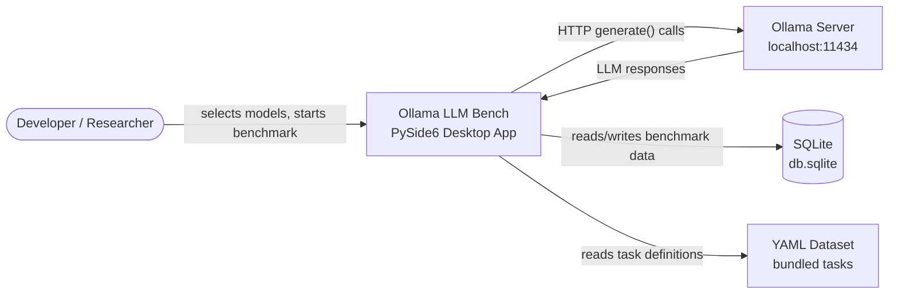
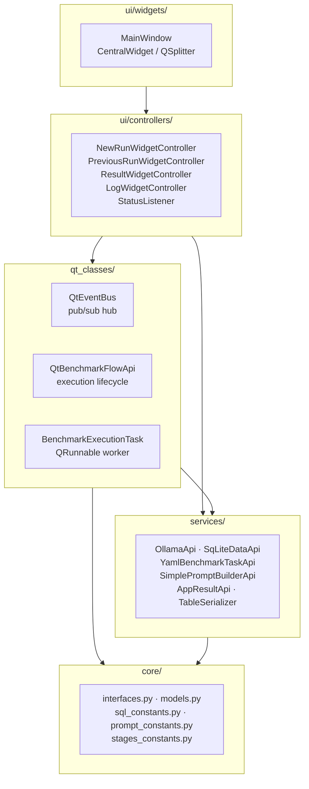
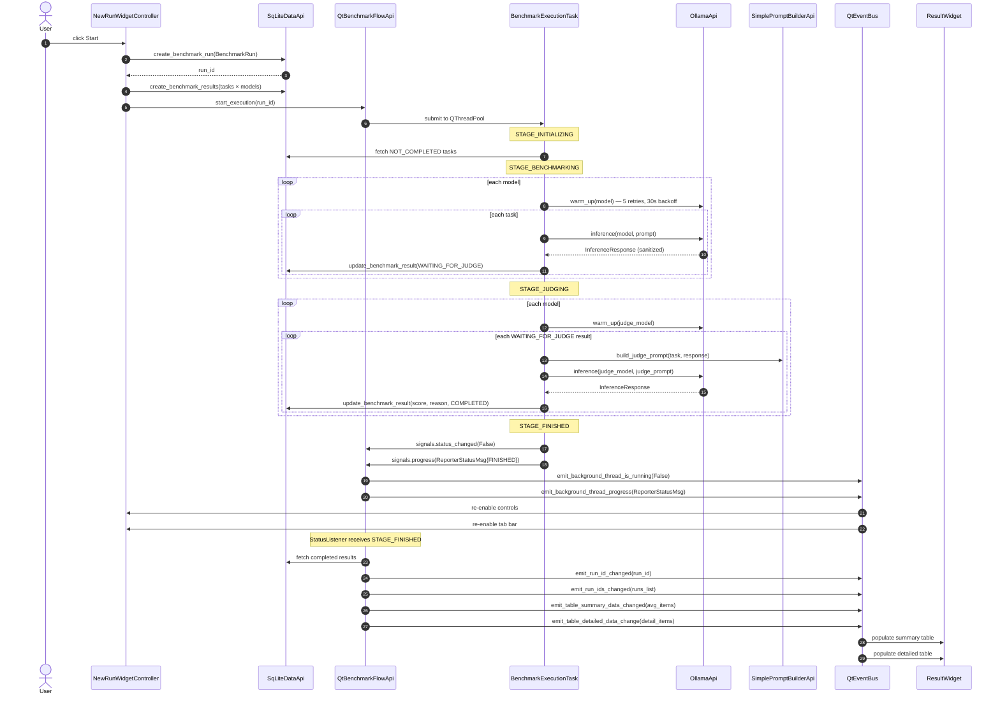
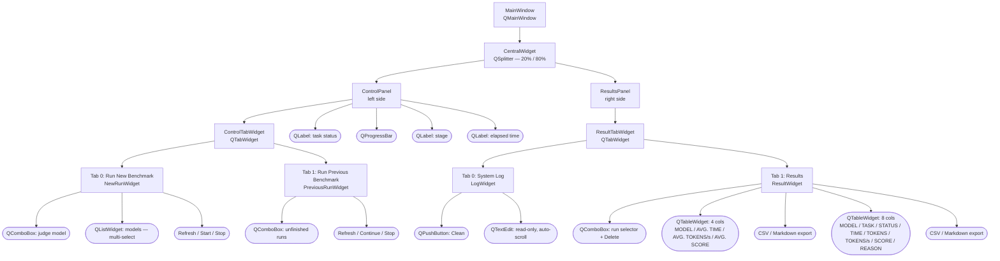

# Architecture Overview

This document describes the architecture of Ollama LLM Bench for developers onboarding
to the codebase.
It covers the system context, layer model, component inventory, data flow, and key
design decisions.
For behavioral requirements and acceptance criteria, see
[`docs/project_specification.md`](../project_specification.md).

---

## System Context

Ollama LLM Bench is a desktop application that benchmarks local LLMs served by Ollama.
The user selects which models to test and which model to use as judge.
The app sends inference requests to the local Ollama server, persists every result in
SQLite, and displays sortable summary and detailed tables.



---

## Layer Architecture

Dependencies point strictly inward.
`core/` has zero Qt dependencies and is usable outside the GUI context.
`qt_classes/` bridges the pure-Python service layer to the Qt event loop.



| Layer | Responsibility |
|:---|:---|
| `core/` | Frozen dataclasses, ABCs, StrEnums, SQL schema, prompt templates, stage constants. No Qt. |
| `services/` | Concrete service implementations: Ollama client, SQLite CRUD, YAML loader, prompt builder, result aggregation, CSV/MD export. |
| `qt_classes/` | Qt threading infrastructure: `QRunnable` worker, execution lifecycle manager, EventBus pub/sub. |
| `ui/controllers/` | Mediate between widgets and services; contain all business-flow logic for the UI layer. |
| `ui/widgets/` | PySide6 widgets that render data and emit user events. No business logic. |
| `utils/` | Pure utility functions: text sanitization, time formatting, run sorting, combobox helpers. |

---

## Component Inventory

| Component | File | Implements | Role |
|:---|:---|:---|:---|
| `OllamaApi` | `services/ollama_llm_api.py` | `LLMApi` | Wraps `ollama.Client`; 5-retry warm-up; strips `<think>` tags from every response |
| `SqLiteDataApi` | `services/sq_lite_data_api.py` | `DataApi` | SQLite CRUD; fresh `connect()` per method call |
| `YamlBenchmarkTaskApi` | `services/yaml_benchmark_task_api.py` | `BenchmarkTaskApi` | Loads `.yaml`/`.yml` files; in-memory cache after first load |
| `SimplePromptBuilderApi` | `services/simple_prompt_builder_api.py` | `PromptBuilderApi` | Fills judge prompt template via `str.replace()` |
| `AppResultApi` | `services/app_result_api.py` | `ResultApi` | Groups `BenchmarkResult` records by model; computes average metrics |
| `TableSerializer` | `services/table_serializer.py` | `ITableSerializer` | Exports summary and detailed tables to `.csv` and `.md` |
| `MetaQObjectABC` | `qt_classes/meta_class.py` | — | Metaclass resolving MRO conflict between `type(QObject)` and `ABCMeta` |
| `QtEventBus` | `qt_classes/qt_event_bus.py` | `EventBus` | 11 `pyqtSignal` pub/sub signals; all cross-thread UI updates route through it |
| `QtBenchmarkFlowApi` | `qt_classes/qt_benchmark_flow.py` | `BenchmarkFlowApi` | Creates `BenchmarkExecutionTask`; bridges worker signals to `EventBus` |
| `BenchmarkExecutionTask` | `qt_classes/qt_benchmark_execution_task.py` | `QRunnable` | Background pipeline worker; never throws — errors stored in model fields |
| `NewRunWidgetController` | `ui/controllers/new_run_widget_controller.py` | `NewRunWidgetControllerApi` | Handles model selection and benchmark start from the "Run New Benchmark" tab |
| `PreviousRunWidgetController` | `ui/controllers/previous_run_widget_controller.py` | `PreviousRunWidgetControllerApi` | Handles run selection and resume from the "Run Previous Benchmark" tab |
| `ResultWidgetController` | `ui/controllers/result_widget_controller.py` | `ResultWidgetControllerApi` | Populates summary/detailed tables; triggers CSV/MD export |
| `LogWidgetController` | `ui/controllers/log_widget_controller.py` | `LogWidgetControllerApi` | Appends and clears log lines in the log widget |
| `StatusListener` | `ui/controllers/status_listener.py` | — | Listens for `STAGE_FINISHED`; triggers DB read and table-data signals |
| `MainWindow` | `ui/widgets/main_window.py` | `QMainWindow` | Root window; receives `ApplicationContext`; fires initialization events on first paint |
| `CentralWidget` | `ui/widgets/central_widget.py` | `QWidget` | Horizontal `QSplitter` (20% control / 80% results) |

---

## Core Data Models

All domain objects are `@dataclass(frozen=True)` and live in `core/models.py`.

### Enums

| Enum | Values |
|:---|:---|
| `BenchmarkRunStatus` | `NOT_COMPLETED`, `COMPLETED`, `FAILED` |
| `BenchmarkResultStatus` | `NOT_COMPLETED`, `WAITING_FOR_JUDGE`, `COMPLETED`, `FAILED` |

The `WAITING_FOR_JUDGE` state is the handoff point between the benchmark stage and the
judge stage.
It enables resumability: if the process is interrupted after inference but before judging,
the pipeline picks up from `WAITING_FOR_JUDGE` without re-running inference.

### Key Dataclasses

| Class | Key Fields | Notes |
|:---|:---|:---|
| `BenchmarkTask` | `task_id`, `category`, `sub_category`, `question`, `expected_answer`, `incorrect_direction` | Loaded from YAML; immutable once cached |
| `BenchmarkTaskAnswer` | `most_expected`, `good_answer`, `pass_option` | Three-tier answer system (see below) |
| `BenchmarkRun` | `run_id`, `timestamp`, `judge_model`, `status` | One row per execution session |
| `BenchmarkResult` | `result_id`, `run_id`, `task_id`, `model_name`, `status`, `llm_response`, `time_taken_ms`, `tokens_generated`, `evaluation_score`, `evaluation_reason`, `error_message` | One row per model-task combination |
| `InferenceResponse` | `llm_response`, `time_taken_ms`, `tokens_generated`, `has_error`, `error_message` | Transient; not persisted directly |
| `ReporterStatusMsg` | `current_run_id`, `current_stage`, `current_model`, `current_task`, `tasks_total`, `tasks_completed`, `start_time_ms`, `end_time_ms` | Emitted on every task transition; drives progress bar and status labels |
| `AvgSummaryTableItem` | `model_name`, `avg_time_ms`, `avg_tokens_per_second`, `avg_score` | One row per model in the summary table |
| `SummaryTableItem` | `model_name`, `task_id`, `task_status`, `time_ms`, `tokens`, `tokens_per_second`, `score`, `score_reason` | One row per model-task combination in the detailed table |

### Three-Tier Answer System

`BenchmarkTaskAnswer` encodes three quality thresholds for the judge to compare against:

| Field | Meaning | Score range |
|:---|:---|:---|
| `most_expected` | Ideal answer — full credit | 0.85–1.00 |
| `good_answer` | Acceptable — partial credit | 0.65–0.84 |
| `pass_option` | Minimal passing answer | 0.30–0.64 |

The `incorrect_direction` field in `BenchmarkTask` describes what a wrong answer looks
like, giving the judge rubric a negative anchor to calibrate against.

---

## Benchmark Pipeline

The pipeline runs entirely in `BenchmarkExecutionTask` on `QThreadPool(maxThreadCount=1)`.
It never throws — all errors are captured in `BenchmarkResult.error_message`.



**Resumability.** If the app is closed mid-run, the pipeline resumes from the correct
point on re-open:
tasks in `NOT_COMPLETED` are re-run through inference;
tasks in `WAITING_FOR_JUDGE` skip inference and go straight to judging;
tasks in `COMPLETED` are skipped entirely.

---

## EventBus Architecture

`QtEventBus` is the sole communication channel between background threads and the UI.
No component holds a direct reference to any other component through the EventBus —
publishers emit to named signals and subscribers register callbacks.
This enforces Qt thread safety for all cross-thread updates.

All signals are private fields.
Each is exposed through a matching `subscribe_to_X(callback)` / `emit_X(value)` pair.

| Signal field | Payload type | Purpose |
|:---|:---|:---|
| `_run_id_changed` | `int` (`-1` encodes `None`) | Active run selection changed |
| `_run_ids_changed` | `list[tuple[int, str]]` | Full runs list refreshed |
| `_models_test_changed` | `list[str]` | Available test models updated |
| `_models_judge_changed` | `str` | Judge model selection changed |
| `_log_clean` | none | Clear all log content |
| `_log_append` | `str` | Append one log line |
| `_table_summary_data_changed` | `list[AvgSummaryTableItem]` | Summary table data refreshed |
| `_table_detailed_data_change` | `list[SummaryTableItem]` | Detailed table data refreshed |
| `_background_thread_is_running` | `bool` | Background thread started or stopped |
| `_background_thread_progress_changed` | `ReporterStatusMsg` | Per-task progress update |
| `_global_event_msg` | `str` | Modal notification message |

**`-1` encoding.** `pyqtSignal(int)` cannot carry Python `None`.
`emit_run_id_changed(None)` coerces to `-1` before emission.
All subscribers must treat `-1` as "no selection."

**`StatusListener` role.** `StatusListener` subscribes to
`_background_thread_progress_changed`.
When it receives a `ReporterStatusMsg` with `current_stage == STAGE_FINISHED`, it reads
completed results from `SqLiteDataApi`, calls `AppResultApi` to compute averages, then
emits the four table-data signals.
Remove or bypass `StatusListener` and the result tables will not update after a run.

---

## UI Widget Hierarchy



---

## Database Schema

SQLite via stdlib `sqlite3`. Schema defined in `core/sql_constants.py`.
Database file: `<cwd>/db.sqlite`.

```sql
CREATE TABLE IF NOT EXISTS benchmark_runs (
  run_id       INTEGER PRIMARY KEY AUTOINCREMENT,
  timestamp    TEXT NOT NULL,
  judge_model  TEXT NOT NULL,
  status       TEXT NOT NULL
);

CREATE TABLE IF NOT EXISTS results (
  result_id         INTEGER PRIMARY KEY AUTOINCREMENT,
  run_id            INTEGER NOT NULL REFERENCES benchmark_runs(run_id),
  task_id           TEXT    NOT NULL,
  model_name        TEXT    NOT NULL,
  status            TEXT    NOT NULL,
  llm_response      TEXT,
  time_taken_ms     INTEGER,
  tokens_generated  INTEGER,
  evaluation_score  REAL,
  evaluation_reason TEXT,
  error_message     TEXT
);
```

**Notable constraints:**

- The `REFERENCES benchmark_runs(run_id)` FK is declared but not enforced — `PRAGMA foreign_keys = ON` is never issued.
- `SqLiteDataApi` opens a fresh `sqlite3.connect()` per method call; there is no connection pool.
- Cascade delete is application-level: `delete_benchmark_run()` deletes child `results` rows before deleting the parent `benchmark_runs` row.

---

## Dataset Structure

50 YAML benchmark tasks live in `src/ollama_llm_bench/dataset/`.
`YamlBenchmarkTaskApi` iterates all `.yaml` and `.yml` files in the configured folder
and caches them in memory after first load.

**Category breakdown:**

| Category | Task count | Description |
|:---|:---|:---|
| Coding | 9 | Java, JavaScript, Python, SQL tasks |
| Text Operations | 30 | Rephrase (5 tones × 3 languages), proofreading, translation |
| General Knowledge | 10 | AI/LLM concepts, literature, history |
| Data Extraction and Transformation | 7 | Text → JSON, CSV, XML, Markdown |

**Example task structure (condensed):**

```yaml
task_id: coding_python_001
category: Coding
sub_category: Python
question: "Write a Python function that reverses a string."
expected_answer:
  most_expected: "def reverse_string(s): return s[::-1]"
  good_answer: "def reverse_string(s): return ''.join(reversed(s))"
  pass_option: "A function using a loop to reverse characters"
incorrect_direction: "Returning the original string unchanged or raising an error"
```

The judge compares the model's sanitized response against all three answer tiers and
`incorrect_direction` using the rubric in `core/prompt_constants.py`.
Output must be `{"reason": "...", "grade": 0.00}`.
A grade of `1.00` is an exact match; `≤0.29` is incorrect.

---

## Design Decisions

| Decision | Rationale |
|:---|:---|
| `QRunnable` + `QThreadPool(maxThreadCount=1)` over `QThread` | The pool manages worker lifecycle; `maxThreadCount=1` enforces serial execution and prevents concurrent requests from saturating the Ollama server. |
| EventBus pub/sub for all cross-thread updates | Decouples senders from receivers and guarantees that all widget mutations happen on the main thread via Qt's queued connection mechanism. |
| `@dataclass(frozen=True)` for all domain objects | Prevents accidental mutation as objects cross layer boundaries; enables safe sharing between background thread and main thread. |
| Constructor injection + `ContextProvider` singleton | Eliminates hidden dependencies, makes units testable in isolation, and keeps the entire wiring visible in one place (`app_context.py`). |
| `sanitize_text()` strips `<think>` tags | DeepSeek-R1 and similar reasoning models emit chain-of-thought inside `<think>...</think>` blocks. Judging the raw output would penalize good answers that happen to show their reasoning. |
| `str.replace()` in `SimplePromptBuilderApi` | `.format()` raises `KeyError` when the template string contains literal curly braces, which is common in coding-task prompts that include code examples. |
| Resumable pipeline via `NOT_COMPLETED` / `WAITING_FOR_JUDGE` / `COMPLETED` | Allows recovery from interrupted runs without re-running completed tasks. Inference is expensive; discarding completed work on crash is unacceptable. |
| `MetaQObjectABC` metaclass | Python's MRO requires a single metaclass per class. `type(QObject)` and `ABCMeta` conflict; `MetaQObjectABC` merges them so `QtEventBus` and `QtBenchmarkFlowApi` can be both `QObject` subclasses and ABC implementations. |
