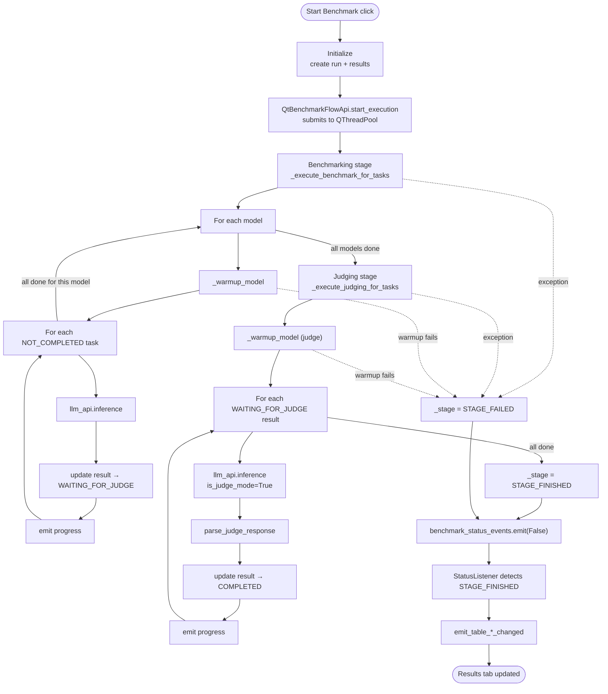
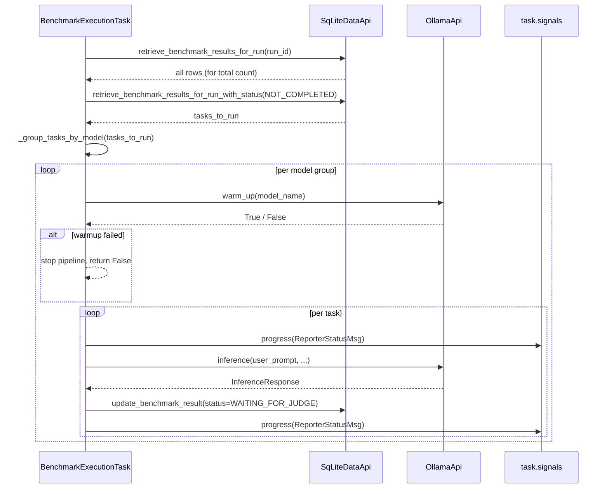

# Benchmark Pipeline

This document traces exactly what happens between the user clicking **Start Benchmark** and the results appearing in the Results tab.
The authoritative source for every step is `src/ollama_llm_bench/qt_classes/qt_benchmark_execution_task.py`.

## Pipeline Overview

A benchmark run has four conceptual stages:

1. **Initialize** — create the run row and pre-populate `results` rows for every `(model, task)` pair.
2. **Benchmark** — run inference for every `NOT_COMPLETED` result.
3. **Judge** — evaluate every `WAITING_FOR_JUDGE` result with the judge model.
4. **Finalize** — emit final progress, flip status to `FINISHED` or `FAILED`, refresh the Results tables.

Errors never escape the worker thread: every failure mode is captured in a model field (`BenchmarkResult.error_message`, `InferenceResponse.has_error`, or the run-level `_stage = STAGE_FAILED`).
The `run()` method is the only `except Exception` in the pipeline — inner exceptions are caught, logged, and attached to the failing row.



## Stage 1 — Initialize

The "initialize" stage is **not** inside `BenchmarkExecutionTask`.
It runs synchronously on the main thread inside `NewRunWidgetController.handle_start_click` (`src/ollama_llm_bench/ui/controllers/new_run_widget_controller.py:68`) before the task is even created.

Sequence:

1. Validate that a benchmark isn't already running (`benchmark_flow_api.is_running()`).
2. Validate that every selected model (judge + test models) appears in `llm_api.get_models_list()`.
3. Validate that at least one test model is selected.
4. Insert a new `BenchmarkRun` with `status = NOT_COMPLETED`, capturing the `run_id` from `cursor.lastrowid`.
5. Call `task_api.load_tasks()` to get the full task list.
6. Build `m × n` `BenchmarkResult` rows (one per `(model, task)` pair), all with default status `NOT_COMPLETED`, and bulk-insert via `data_api.create_benchmark_results(results)`.
7. Emit `_run_id_changed(run_id)` and `_log_clean()`.
8. Call `benchmark_flow_api.start_execution(run_id)`.

On any validation failure the controller emits `_global_event_msg(...)` (which triggers a `QMessageBox`) and aborts.

## Stage 2 — Scheduling (main thread → worker thread)

`QtBenchmarkFlowApi.start_execution(run_id)` performs:

1. Re-check `is_running()` (guard against double-click).
2. Re-validate that the persisted run is still `NOT_COMPLETED` — otherwise raise `ValueError`.
3. Disconnect any leftover signals from a previous task (`_disconnect_current_task`).
4. Construct `BenchmarkExecutionTask(run_id, data_api, task_api, prompt_builder_api, llm_api)`.
5. Connect the task's nested `Signals` (`status_changed`, `log_message`, `progress`) to the flow's public signals (`benchmark_status_events`, `benchmark_output_events`, `benchmark_progress_events`).
6. Store `self._current_task = task` and `self._current_run_id = run_id`.
7. `self._thread_pool.start(task)` — Qt hands the `QRunnable` to the single pool thread.
8. Emit `benchmark_status_events.emit(True)`.

From this point on, `task.run()` executes on the background thread.

## Stage 3 — `BenchmarkExecutionTask.run`

```python
def run(self) -> None:
    self._update_progress()
    try:
        self.signals.status_changed.emit(True)
        self._start_time = time.time()
        self._execute_benchmark()        # benchmarking + judging
        self._stage = STAGE_FINISHED
    except Exception as e:
        self._notify_warn(error_msg)
        self._stage = STAGE_FAILED
    finally:
        self._end_time = time.time()
        self._stop_requested = True      # defensive — ensure is_running() returns False
        self.signals.status_changed.emit(False)
        self._update_progress()
        self._notify(format_elapsed_time(self._start_time, self._end_time))
```

The `finally` block guarantees that the UI is always told the run has ended, even on unhandled exceptions.

## Stage 4 — Benchmarking (`_execute_benchmark_for_tasks`)



### Key details

- **Task grouping** (`_group_tasks_by_model`): uses `collections.defaultdict(list)` keyed by `model_name`. This means all of model A's tasks run before any of model B's — so model A is only ever loaded in GPU/RAM once.
- **Resumability**: only `NOT_COMPLETED` rows are picked up. If the user stopped a previous run mid-benchmark, already-executed rows are in `WAITING_FOR_JUDGE` and will be skipped by the benchmarking stage (they'll be picked up by the judging stage).
- **Per-task exception handling**: a `try/except Exception` around `_execute_benchmark_task` means a single task failure does not abort the stage. The failing row is flipped to `FAILED` via `_update_failed_task`, and the loop continues.
- **Stop check**: `self._should_stop()` is polled before each model and before each task. It is **not** polled during `llm_api.inference` — the Ollama call blocks the worker thread until completion.
- **Progress update**: `_update_progress` is called after each task (success or failure) inside the `finally` block of the inner `try`.

### `_execute_benchmark_task`

```python
user_prompt = self.prompt_builder_api.build_prompt(task.task_id)   # task.question verbatim
response = self.llm_api.inference(
    model_name=model_name,
    user_prompt=user_prompt,
    system_prompt="",                       # no system prompt during benchmarking
    on_llm_response=self._log_msg_to_global_logger,
    on_is_stop_signal=self.is_stopped,
)

updated_task = BenchmarkResult(
    result_id=task.result_id,
    run_id=task.run_id,
    task_id=task.task_id,
    model_name=task.model_name,
    status=BenchmarkResultStatus.WAITING_FOR_JUDGE,
    llm_response=response.llm_response,
    time_taken_ms=response.time_taken_ms,
    tokens_generated=response.tokens_generated,
    ...
)
self.data_api.update_benchmark_result(updated_task)
```

Because `BenchmarkResult` is frozen, the update is implemented as "construct a new one with the new status and overwrite the row".

## Stage 5 — Judging (`_execute_judging_for_tasks`)

The judging stage is structurally similar to benchmarking, but:

- It filters on `status == WAITING_FOR_JUDGE`.
- It warms up exactly **one** model: `benchmark_run.judge_model`, read from the run row.
- Each call uses `is_judge_mode=True`, which tells `OllamaApi.inference` to skip logging the (potentially huge) user prompt in the live log stream.
- The judge response is parsed with `parse_judge_response` (see [Scoring](#scoring-system)).
- On success the result transitions to `COMPLETED` with `evaluation_score` and `evaluation_reason` populated.
- On parse failure or inference exception the result transitions to `FAILED` with `error_message` set.

```python
user_prompt, system_prompt = self.prompt_builder_api.build_judge_prompt(task)
response = self.llm_api.inference(
    model_name=judge_model,
    user_prompt=user_prompt,
    system_prompt=system_prompt,
    on_llm_response=self._log_msg_to_global_logger,
    on_is_stop_signal=self.is_stopped,
    is_judge_mode=True,
)
has_error, grade, reason = parse_judge_response(response.llm_response)
```

## Prompt Construction

### Benchmark Prompt

`SimplePromptBuilderApi.build_prompt(task_id)` returns `task.question` unchanged.
The test model sees the exact question from the YAML file — no preamble, no system prompt.
Rationale: the benchmark measures how the model behaves out of the box, not how well it responds to an orchestrated prompt.

### Judge Prompt

`SimplePromptBuilderApi.build_judge_prompt(benchmark_result)` returns a `(user_prompt, system_prompt)` tuple.

- **System prompt** is `core/prompt_constants.py:SYSTEM_PROMPT` — the static scoring rubric (39 lines).
- **User prompt** is the `USER_PROMPT` template with 8 placeholders filled via `str.replace`:

| Placeholder | Source |
|---|---|
| `{question}` | `task.question` |
| `{most_expected}` | `task.expected_answer.most_expected` |
| `{good_answer}` | `task.expected_answer.good_answer` |
| `{pass_option}` | `task.expected_answer.pass_option` |
| `{incorrect_direction}` | `task.incorrect_direction` |
| `{answer}` | `benchmark_result.llm_response or ""` |
| `{category}` | `task.category` |
| `{sub_category}` | `task.sub_category` |

Substitution is linear (`for key, value in format_data.items(): user_prompt = user_prompt.replace("{"+key+"}", value)`).
Because substitutions are sequential, a placeholder appearing inside a substituted value could theoretically be expanded again.
In practice this is impossible because the dataset never contains curly-braced placeholder names.

## Scoring System

The judge model is asked to emit **one** JSON object of the shape:

```json
{"reason": "<one concise sentence>", "grade": <float 0.00-1.00 with two decimals>}
```

`parse_judge_response(json_string)` (`src/ollama_llm_bench/utils/text_utils.py:60`) performs:

1. **Sanitize** — strip `<start_of_turn>` / `<end_of_turn>` markers and ```` ```json ```` code fences.
2. **Extract** — slice from the first `{` to the last `}` (tolerant of trailing commentary).
3. **Parse** — `json.loads`.
4. **Validate**:
   - `reason` must be a string.
   - `grade` must be present, numeric, and in `[0, 100]`.
5. Return `(has_error: bool, grade: float, reason: str)`.

**Scoring-scale caveat**: the prompt tells the model to emit `0.00–1.00` but `parse_judge_response` validates `0 <= grade <= 100`.
Both ranges pass validation.
In practice the judge models emit 0.0–1.0, and `TableSerializer` multiplies by 100 when rendering CSV/MD output (`round(item.avg_score * 100, 2)`).
See [technical-debt.md](technical-debt.md) for the debt item.

### Rubric (paraphrased from `SYSTEM_PROMPT`)

The judge computes per-category weighted subscores:

| Category hint | Weights |
|---|---|
| Default | correctness 0.50, constraints/format 0.25, completeness 0.15, clarity 0.10 |
| Coding / Debugging | correctness 0.50, constraints 0.25, robustness 0.15, style 0.10 |
| Translation | fidelity 0.60, fluency 0.25, entities 0.10, style 0.05 |
| Data extraction / formatting | correctness 0.50, format 0.35, completeness 0.10, clarity 0.05 |
| Short factual Q | accuracy 0.70, appropriateness 0.20, clarity 0.10 |
| Proofreading / Rephrase | corrections 0.50, grammar 0.30, fidelity 0.20 |

Tiered mapping (target ranges communicated to the judge):

| Tier | Condition | Target score |
|---|---|---|
| 1 | Exact match to `most_expected` | 1.00 |
| 2 | Meets `good_answer` semantics | 0.85 – 0.95 |
| 3 | Minimally meets `pass_option` | 0.65 – 0.79 |
| Mixed | Partially correct | 0.30 – 0.60 |
| Negative | Follows `incorrect_direction` or violates core requirements | ≤ 0.29 |
| Empty / off-topic | — | 0.00 |

The rubric is enforced *by the judge model*, not by code.
Code only validates that a numeric grade and a string reason are returned.

## Warm-up

`OllamaApi.warm_up(model_name)` issues `client.generate(model=..., prompt="Say Hello")` and retries up to **5** times with **30 s** `time.sleep` between failures.
It returns `True` on the first successful response, `False` on total failure.

`BenchmarkExecutionTask._warmup_model` wraps this:

```python
def _warmup_model(self, model_name: str) -> bool:
    try:
        if not self.llm_api.warm_up(model_name):
            self._notify_warn(f"Failed to warm up model: {model_name}")
            self._log_stop_requested()
            return False
    except Exception as e:
        self._notify_warn(f"Error warming up model {model_name}: {e}")
        self._log_stop_requested()
        return False
    return True
```

Warm-up failure aborts the enclosing stage (benchmarking or judging).
The pipeline then flows into the `finally` block of `run()`, emits `STATUS: False`, and ends without running the remaining stage.

**Worst case timing**: full warm-up failure blocks the worker for `5 × 30 s = 150 s` per model, and `time.sleep` does not check `_stop_requested`.
This is a known issue — see [technical-debt.md](technical-debt.md).

## Progress Reporting

`_update_progress()` builds a fresh `ReporterStatusMsg` on every call:

```python
status_msg = ReporterStatusMsg(
    current_run_id=self.run_id,
    current_task=self._current_task_id,
    current_model=self._current_model,
    current_stage=self._stage,
    tasks_total=self._total_tasks,
    tasks_completed=self._completed_tasks,
    start_time_ms=self._start_time,
    end_time_ms=self._end_time if self._end_time > 0 else time.time(),
)
self.signals.progress.emit(status_msg)
```

`_update_progress` is called:

- Once at the start of `run()`.
- Once when entering `_execute_benchmark_for_tasks` (after counting tasks).
- After each task within the benchmarking loop.
- Once when entering `_execute_judging_for_tasks`.
- After each task within the judging loop.
- Once in the `finally` block of `run()`.

Subscribers (`ControlPanel`, `StatusListener`) receive the updates on the main thread via the queued-connection semantics of Qt signals.

## Cancellation

The user cancels by clicking the **Stop** button in either control widget.
The click calls `benchmark_flow_api.stop_execution()`, which calls `self._current_task.stop()`.
`stop()` sets `self._stop_requested = True`.

Cancellation is cooperative:

- `_should_stop()` is polled before each model, before each task within a stage, and at every stage boundary.
- `run()` does **not** interrupt a blocking `llm_api.inference` call — the current task finishes fully before the loop exits.
- `_stop_requested` is not checked during `time.sleep` inside warm-up retries.

Partial progress is preserved: tasks with `status = WAITING_FOR_JUDGE` remain in that state when the run stops and will be picked up by the judging stage when the run resumes later via the Previous Runs tab.

## Finalization

After `_execute_benchmark` returns (cleanly or via exception), the `finally` block in `run()`:

1. Resets `_current_task_id` and `_current_model` to empty strings.
2. Captures `_end_time = time.time()`.
3. Sets `_stop_requested = True` — this makes `is_running()` on `QtBenchmarkFlowApi` return `False`.
4. Emits `status_changed(False)`.
5. Emits one final `_update_progress()` so the UI sees the terminal `STAGE_FINISHED` or `STAGE_FAILED` state.
6. Emits a single `format_elapsed_time(start, end)` log line.

`StatusListener._progress_changed` observes `STAGE_FINISHED` / `STAGE_FAILED` on the main thread and triggers:

- `emit_run_id_changed(run_id)` — re-selects the same run so the UI refreshes.
- `emit_run_ids_changed(runs_list)` — refreshes the runs dropdown (in case the run's timestamp changed).
- `emit_table_summary_data_changed(...)` and `emit_table_detailed_data_change(...)` — repopulate the Results tables via `AppResultApi`.

## Error Propagation Summary

| Error location | Captured as | Visible where |
|---|---|---|
| `OllamaApi.inference` raises | `InferenceResponse(has_error=True, error_message=...)` returned; benchmarking `except` path flips row to `FAILED` | `results.error_message` column, Detailed table `STATUS` column |
| `_execute_benchmark_task` raises | `_update_failed_task` flips row to `FAILED` | same |
| `_judge_task` raises | `_update_judge_failed` flips row to `FAILED` with `Evaluation failed: ...` | same |
| `parse_judge_response` parse error | returns `(True, 0.0, error_string)` — row still transitions to `COMPLETED` with `score=0.0` | `evaluation_score = 0.0`, `evaluation_reason = <error>` |
| Warm-up fails all retries | stage returns `False`; `_log_stop_requested()` logs; run stops | Log panel message, stage transitions to `FAILED` |
| `run()` catches anything else | `_stage = STAGE_FAILED`, traceback logged | Progress panel shows `STAGE_FAILED` |

The pipeline itself never raises to the caller.

## Related Documents

- [architecture.md](architecture.md) — threading model and EventBus
- [data-model.md](data-model.md) — `BenchmarkResult` status lifecycle
- [services-reference.md](services-reference.md) — `LLMApi`, `DataApi`, `PromptBuilderApi`
- [technical-debt.md](technical-debt.md) — known pipeline issues (warm-up blocking, scoring scale)
