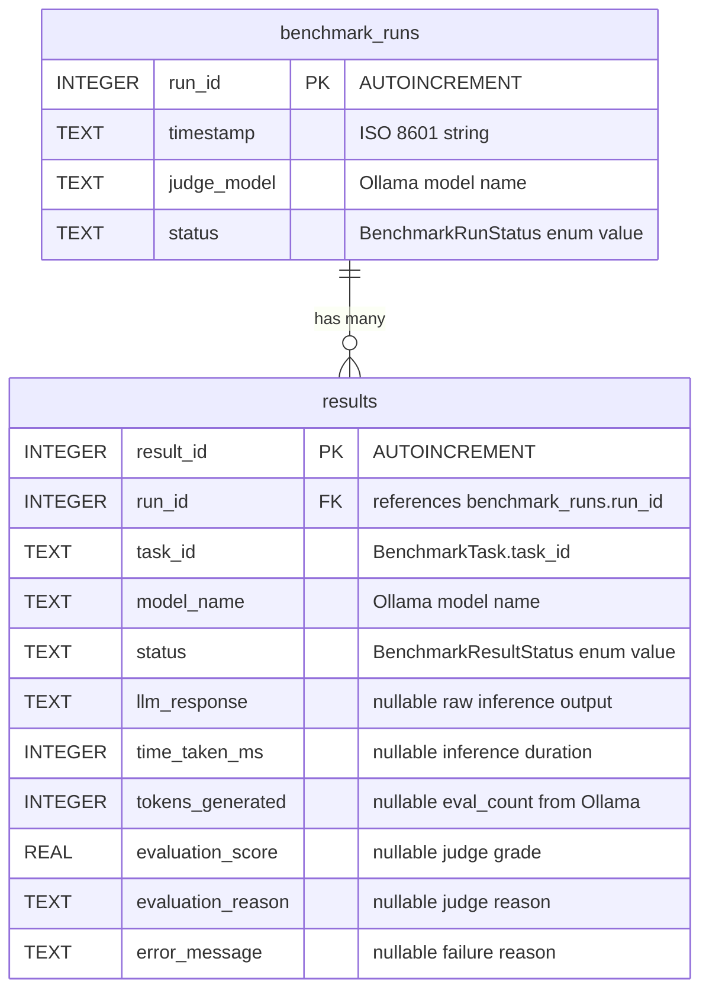
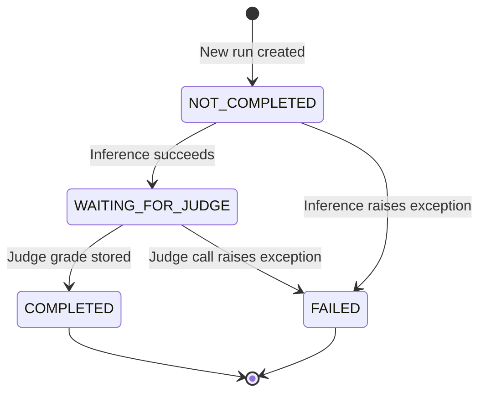

# Data Model & Database Schema

All persistent state lives in a single SQLite file (`db.sqlite` relative to the process working directory).
Two tables store runs and their per-task results.
In memory, data flows between layers as frozen dataclasses defined in `src/ollama_llm_bench/core/models.py`.

## Database Overview

- **Engine**: SQLite via stdlib `sqlite3`.
- **Location**: `Path.cwd() / "db.sqlite"` (constructed in `app_context.py:_create_app_context`, constant `_DB_FILE_NAME = "db.sqlite"`).
- **Schema DDL**: `src/ollama_llm_bench/core/sql_constants.py` (`DB_SCHEMA`).
- **Initialization**: `SqLiteDataApi._init_db()` runs the DDL via `conn.executescript` on first access; `CREATE TABLE IF NOT EXISTS` makes it idempotent.
- **Connection lifecycle**: Every `SqLiteDataApi` method opens a fresh `sqlite3.connect(self.db_path)` via `with` context manager. No connection pool.
- **Foreign key enforcement**: `results.run_id` declares `REFERENCES benchmark_runs(run_id)` but `PRAGMA foreign_keys = ON` is **not** issued, so cascading deletes are not enforced by SQLite — see [technical-debt.md](technical-debt.md).

## Entity-Relationship Diagram

## Table Reference

### `benchmark_runs`

One row per benchmark run initiated by the user.

| Column | Type | Constraints | Description |
|---|---|---|---|
| `run_id` | `INTEGER` | `PRIMARY KEY AUTOINCREMENT` | Unique run identifier. |
| `timestamp` | `TEXT` | `NOT NULL` | ISO 8601 timestamp set at creation time (`datetime.now().isoformat()` in `NewRunWidgetController.handle_start_click`). Sorting by this column descending yields newest-first run list. |
| `judge_model` | `TEXT` | `NOT NULL` | Name of the Ollama model used to score this run's inference outputs. Cannot be changed after run creation. |
| `status` | `TEXT` | `NOT NULL` | `BenchmarkRunStatus` enum value: `NOT_COMPLETED`, `COMPLETED`, or `FAILED`. |

### `results`

One row per `(run, task, model)` triple.
A run with `m` test models and `n` tasks inserts `m × n` rows during the initialization stage, all with status `NOT_COMPLETED`.

| Column | Type | Constraints | Description |
|---|---|---|---|
| `result_id` | `INTEGER` | `PRIMARY KEY AUTOINCREMENT` | Unique result identifier. |
| `run_id` | `INTEGER` | `NOT NULL REFERENCES benchmark_runs(run_id)` | Parent run. |
| `task_id` | `TEXT` | `NOT NULL` | Matches `BenchmarkTask.task_id` loaded from the dataset YAML. |
| `model_name` | `TEXT` | `NOT NULL` | Name of the test model that produced this row. |
| `status` | `TEXT` | `NOT NULL` | `BenchmarkResultStatus`: `NOT_COMPLETED`, `WAITING_FOR_JUDGE`, `COMPLETED`, or `FAILED`. Drives the resumability logic. |
| `llm_response` | `TEXT` | nullable | Raw text returned by the test model, after `sanitize_text` stripping of `<think>...</think>` tags. |
| `time_taken_ms` | `INTEGER` | nullable | Wall-clock inference time in milliseconds (main inference, not judging). |
| `tokens_generated` | `INTEGER` | nullable | `response.eval_count` from the Ollama client. |
| `evaluation_score` | `REAL` | nullable | Grade emitted by the judge model, float in `[0.00, 1.00]` (see scoring caveat in [technical-debt.md](technical-debt.md)). |
| `evaluation_reason` | `TEXT` | nullable | One-sentence justification emitted by the judge. |
| `error_message` | `TEXT` | nullable | Non-null iff the row's status is `FAILED`. |

## SQL Query Catalogue

All queries are string constants in `src/ollama_llm_bench/core/sql_constants.py`.
`SqLiteDataApi` never constructs SQL at runtime.

| Constant | Operation |
|---|---|
| `DB_SCHEMA` | Idempotent `CREATE TABLE IF NOT EXISTS` block |
| `INSERT_BENCHMARK_RUN` | Insert new run |
| `SELECT_BENCHMARK_RUN_BY_ID` | Fetch one run |
| `SELECT_ALL_BENCHMARK_RUNS` | Fetch all runs |
| `SELECT_BENCHMARK_RUNS_BY_STATUS` | Fetch runs by status |
| `UPDATE_BENCHMARK_RUN` | Update run fields |
| `DELETE_BENCHMARK_RUN` | Delete run |
| `INSERT_RESULT` | Insert new result |
| `SELECT_RESULT_BY_ID` | Fetch one result |
| `SELECT_RESULTS_BY_RUN_ID` | Fetch all results for a run |
| `SELECT_RESULTS_BY_RUN_ID_AND_STATUS` | Fetch results by run and status (drives resume logic) |
| `UPDATE_RESULT` | Update result fields |
| `DELETE_RESULT` | Delete result |

## Frozen Dataclass Catalogue

Every data-carrying type is declared in `src/ollama_llm_bench/core/models.py` as `@dataclass(frozen=True)`.
Frozen semantics are load-bearing: they guarantee no component mutates state that another component has observed via the EventBus.

### `BenchmarkTaskAnswer`

Three-tier reference answers.
Inlined inside `BenchmarkTask`; not persisted directly.

| Field | Type | Purpose |
|---|---|---|
| `most_expected` | `str` | Tier 1 — ideal answer (target score 0.85 – 1.00) |
| `good_answer` | `str` | Tier 2 — acceptable answer (0.65 – 0.84) |
| `pass_option` | `str` | Tier 3 — minimum to pass (0.30 – 0.64) |

### `BenchmarkTask`

A task loaded from a dataset YAML file; immutable after load.
Not persisted to SQLite — tasks live in the YAML dataset and are cached by `YamlBenchmarkTaskApi`.

| Field | Type | Purpose |
|---|---|---|
| `task_id` | `str` | Unique identifier used as foreign key in `results.task_id` |
| `category` | `str` | High-level category (Coding, Text Operations, General Knowledge, Data Extraction) |
| `sub_category` | `str` | Subcategory refinement (e.g., Java, Python, Literature) |
| `question` | `str` | The prompt text sent verbatim to test models |
| `expected_answer` | `BenchmarkTaskAnswer` | Three-tier reference answers |
| `incorrect_direction` | `str` | Negative anchor — patterns to penalize |

### `BenchmarkRun`

Row of `benchmark_runs`.

| Field | Type | Maps to column |
|---|---|---|
| `run_id` | `int` | `run_id` (0 before insert, set by `cursor.lastrowid`) |
| `timestamp` | `str` | `timestamp` |
| `judge_model` | `str` | `judge_model` |
| `status` | `BenchmarkRunStatus` | `status` (stored as `.value`) |

### `BenchmarkResult`

Row of `results`.
Default values mean new results can be inserted with minimal boilerplate: only `result_id`, `run_id`, `task_id`, `model_name` are required at creation time; the remaining fields are populated during execution.

| Field | Type | Default | Maps to column |
|---|---|---|---|
| `result_id` | `int` | — | `result_id` (0 before insert) |
| `run_id` | `int` | — | `run_id` |
| `task_id` | `str` | — | `task_id` |
| `model_name` | `str` | — | `model_name` |
| `status` | `BenchmarkResultStatus` | `NOT_COMPLETED` | `status` |
| `llm_response` | `Optional[str]` | `None` | `llm_response` |
| `time_taken_ms` | `Optional[int]` | `None` | `time_taken_ms` |
| `tokens_generated` | `Optional[int]` | `None` | `tokens_generated` |
| `evaluation_score` | `Optional[float]` | `None` | `evaluation_score` |
| `evaluation_reason` | `Optional[str]` | `None` | `evaluation_reason` |
| `error_message` | `Optional[str]` | `None` | `error_message` |

### `InferenceResponse`

Return type of `LLMApi.inference`.
Not persisted — its fields are copied into the matching `BenchmarkResult` columns.

| Field | Type | Default |
|---|---|---|
| `llm_response` | `str` | `''` |
| `time_taken_ms` | `int` | `0` |
| `tokens_generated` | `int` | `0` |
| `has_error` | `bool` | `False` |
| `error_message` | `Optional[str]` | `None` |

### `AvgSummaryTableItem`

Computed row for the Summary table in the Results tab.
Produced by `AppResultApi.retrieve_avg_benchmark_results_for_run`; not persisted.

| Field | Type | Default | Aggregation |
|---|---|---|---|
| `model_name` | `str` | `''` | Grouping key |
| `avg_time_ms` | `float` | `0.0` | `sum(time_taken_ms) / count` |
| `avg_tokens_per_second` | `float` | `0.0` | `(sum(tokens_generated) / sum(time_taken_ms)) * 1000` |
| `avg_score` | `float` | `0.0` | `sum(evaluation_score) / count` |

### `SummaryTableItem`

Computed row for the Detailed table in the Results tab.
One row per `(task, model)` combination for the selected run.

| Field | Type | Default | Source |
|---|---|---|---|
| `model_name` | `str` | `''` | `BenchmarkResult.model_name` |
| `task_id` | `str` | `''` | `BenchmarkResult.task_id` |
| `task_status` | `str` | `''` | `str(BenchmarkResult.status)` |
| `time_ms` | `int` | `0` | `BenchmarkResult.time_taken_ms or 0` |
| `tokens` | `int` | `0` | `BenchmarkResult.tokens_generated or 0` |
| `tokens_per_second` | `float` | `0.0` | `tokens / time_ms * 1000` |
| `score` | `float` | `0.0` | `BenchmarkResult.evaluation_score or 0.0` |
| `score_reason` | `str` | `''` | `BenchmarkResult.evaluation_reason or ''` |

### `ReporterStatusMsg`

Progress heartbeat emitted by `BenchmarkExecutionTask._update_progress()`.
Consumed by `ControlPanel` (live progress display) and `StatusListener` (triggers table refresh on completion).

| Field | Type | Default |
|---|---|---|
| `current_run_id` | `int` | — |
| `current_stage` | `str` | `''` (one of `STAGE_*` constants) |
| `current_model` | `str` | `''` |
| `current_task` | `str` | `''` |
| `tasks_total` | `int` | `0` |
| `tasks_completed` | `int` | `0` |
| `start_time_ms` | `float` | `0` |
| `end_time_ms` | `float` | `0` |

### `NewRunWidgetStartEvent`

Event payload emitted by `NewRunWidget` when the user clicks Start.
Flows via controller call, not via EventBus.

| Field | Type |
|---|---|
| `judge_model` | `str` |
| `models` | `tuple[str, ...]` |

## Enum Catalogue

### `BenchmarkRunStatus` (StrEnum)

Stored in `benchmark_runs.status`.

| Value | Meaning |
|---|---|
| `NOT_COMPLETED` | Run is queued, in progress, or stopped mid-way. Eligible to resume via the Previous Runs tab. |
| `COMPLETED` | Every result row reached `COMPLETED` or `FAILED`. |
| `FAILED` | The pipeline aborted due to an unrecoverable error. |

> **Note**: The code does not currently flip a run from `NOT_COMPLETED` to `COMPLETED` automatically — the status on disk reflects the last explicit update.
> New runs are always persisted as `NOT_COMPLETED`; resumability depends on per-result statuses rather than the run-level status.

### `BenchmarkResultStatus` (StrEnum)

Stored in `results.status`. Drives the resume logic in `BenchmarkExecutionTask`.

| Value | Meaning | Used by |
|---|---|---|
| `NOT_COMPLETED` | Inference not yet attempted | Benchmarking stage picks these up |
| `WAITING_FOR_JUDGE` | Inference done, judging pending | Judging stage picks these up |
| `COMPLETED` | Evaluation finished successfully | Terminal state |
| `FAILED` | Unrecoverable error — `error_message` is set | Terminal state |

## Stage Constants

String constants in `src/ollama_llm_bench/core/stages_constants.py`, carried in `ReporterStatusMsg.current_stage`:

| Constant | Value |
|---|---|
| `STAGE_INITIALIZING` | `"Initializing"` |
| `STAGE_BENCHMARKING` | `"Benchmarking"` |
| `STAGE_JUDGING` | `"Judging"` |
| `STAGE_FINISHED` | `"Finished"` |
| `STAGE_FAILED` | `"Failed"` |

## Prompt Constants

`src/ollama_llm_bench/core/prompt_constants.py` defines two multi-line templates used by `SimplePromptBuilderApi.build_judge_prompt`:

- `SYSTEM_PROMPT` — instructs the judge how to score, including category-specific weight rubrics and the tiered score mapping.
- `USER_PROMPT` — contains `{question}`, `{most_expected}`, `{good_answer}`, `{pass_option}`, `{incorrect_direction}`, `{answer}`, `{category}`, `{sub_category}` placeholders, filled by `str.replace`.

See [benchmark-pipeline.md](benchmark-pipeline.md#prompt-construction) for how these are assembled.

## Data Lifecycle — One Result

Transitions are performed by `BenchmarkExecutionTask` in `src/ollama_llm_bench/qt_classes/qt_benchmark_execution_task.py`:

- `_execute_benchmark_task` transitions `NOT_COMPLETED → WAITING_FOR_JUDGE` by building a fresh `BenchmarkResult` with the new status and calling `data_api.update_benchmark_result`.
- `_update_failed_task` transitions `NOT_COMPLETED → FAILED` on inference errors.
- `_judge_task` transitions `WAITING_FOR_JUDGE → COMPLETED`.
- `_update_judge_failed` transitions `WAITING_FOR_JUDGE → FAILED` on judge errors.

Because `BenchmarkResult` is frozen, every status change is implemented by constructing a new instance and passing it to `update_benchmark_result`.

## Summary Aggregation

`AppResultApi.retrieve_avg_benchmark_results_for_run(run_id)` performs the following steps (see `src/ollama_llm_bench/services/app_result_api.py:28`):

1. Fetch all `BenchmarkResult` rows for the run.
2. Group by `model_name` using `collections.defaultdict(list)`.
3. For each group, compute:
   - `avg_time = total_time_ms / count`
   - `avg_score = total_score / count`
   - `avg_tokens_per_second = (total_tokens / total_time_ms) * 1000` (guarded against division by zero)
4. Return one `AvgSummaryTableItem` per model.

`retrieve_detailed_benchmark_results_for_run(run_id)` is a straight row-wise projection without aggregation.

## Related Documents

- [architecture.md](architecture.md) — where this data flows
- [services-reference.md](services-reference.md) — `DataApi` method reference
- [benchmark-pipeline.md](benchmark-pipeline.md) — how statuses transition over time
- [dataset-format.md](dataset-format.md) — YAML → `BenchmarkTask` mapping
