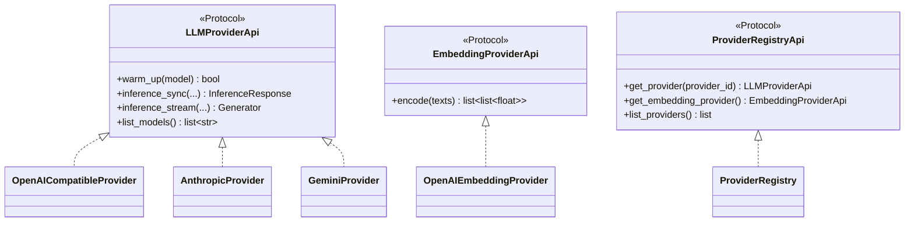
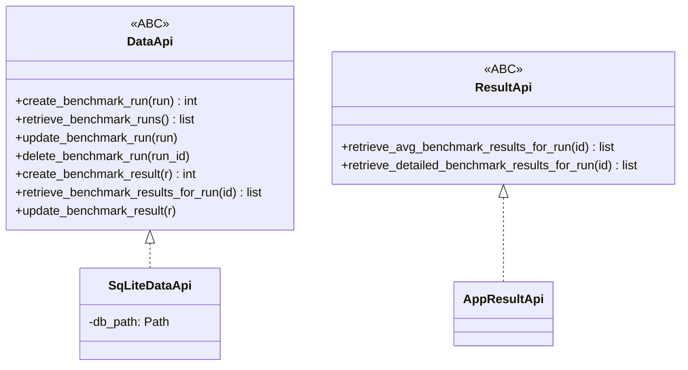
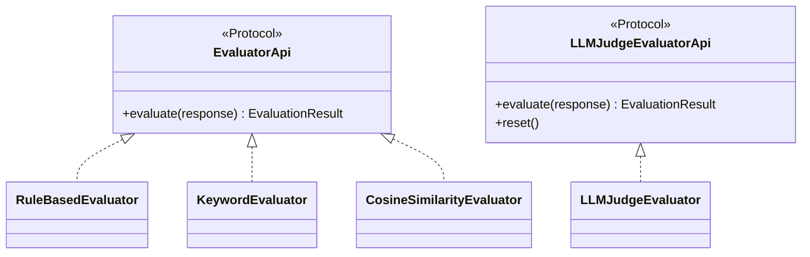
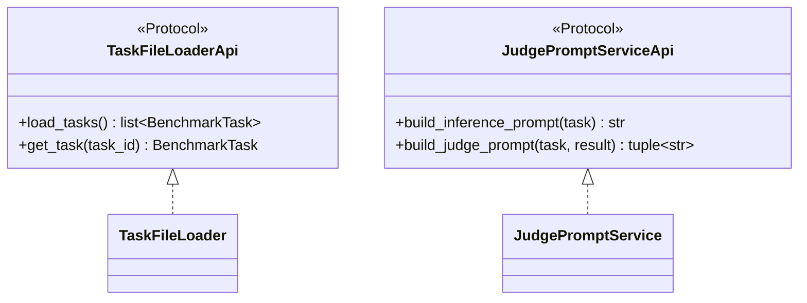
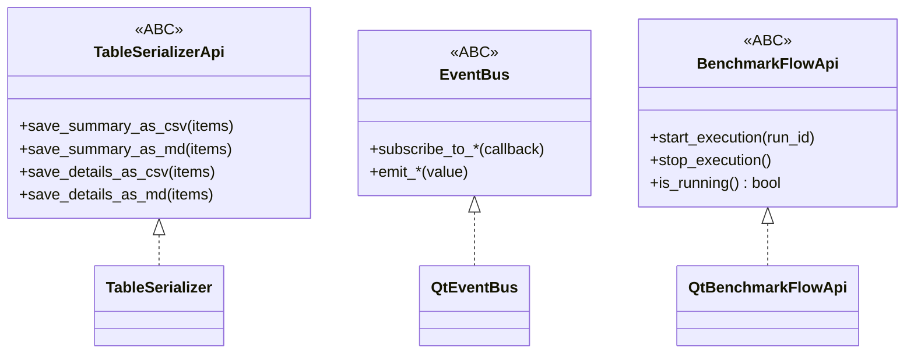

# Services API Reference

This document lists every service interface (ABC and Protocol) in `src/ollama_llm_bench/core/interfaces.py` alongside its concrete implementations.
Docstrings are in the source and the coding rules require Google-style summaries; this document provides the cross-reference and usage notes you cannot derive by reading a single file.

## V2 Provider Layer (Multi-Provider Support)



## Core Service Layer (Data + Results)



## Evaluation Pipeline



## Task + Prompt Services



## Infrastructure + Export



## `LLMProviderApi` (Protocol)

- **Protocol**: `src/ollama_llm_bench/core/interfaces.py` (`class LLMProviderApi`).
- **Implementations**: 
  - `OpenAICompatibleProvider` — OpenAI, Ollama, LM Studio, llama.cpp, Azure `/v1/` endpoints
  - `AnthropicProvider` — Anthropic Claude models
  - `GeminiProvider` — Google Gemini models
- **Dependencies**: Provider-specific client libraries (openai, anthropic, google-genai).

### Methods

| Method | Signature | Notes |
|---|---|---|
| `warm_up` | `(model: str) -> bool` | Issue a minimal inference to warm up the model. Retry logic varies by provider. Returns `True` on success, `False` if all retries exhaust. |
| `inference_sync` | `(*, model, prompt, system_prompt="", ...) -> InferenceResponse` | Synchronous inference request. Measures wall-clock time, tokenizes response, captures errors in `InferenceResponse.has_error`. |
| `inference_stream` | `(*, model, prompt, system_prompt="") -> Generator[StreamChunk, None, None]` | Streaming inference. Yields `StreamChunk` objects; used for real-time log updates. |
| `list_models` | `() -> list[str]` | Return sorted list of available model names for this provider. |

### Usage Pattern

```python
provider = provider_registry.get_provider(model_name)
if not provider.warm_up(model_name):
    return  # bail — provider is unresponsive

response = provider.inference_sync(
    model=model_name,
    prompt=user_prompt,
    system_prompt="",
)
```

### Callers

- `BenchmarkExecutionTask._execute_benchmark_task` — benchmarking inference
- `BenchmarkExecutionTask._judge_task` — judging inference
- `BenchmarkExecutionTask._warmup_model` — pre-flight warm-up
- `RunConfigController.refresh_models` — populate model lists
- `ProviderHealthChecker` — periodic provider connectivity checks

## `DataApi` → `SqLiteDataApi`

- **ABC**: `core/interfaces.py` (`class DataApi`).
- **Implementation**: `src/ollama_llm_bench/services/sq_lite_data_api.py`.
- **Dependency**: a `Path` to the SQLite file.

### Connection Semantics

Every method opens a fresh connection via `with sqlite3.connect(self.db_path) as conn`.
No pooling, no persistent cursor.
This makes the service trivially thread-safe *for this project's access patterns*: the worker thread writes status updates while the main thread reads rows, and SQLite handles the coordination at the file level.

### Method Reference

#### Benchmark Runs

| Method | Purpose |
|---|---|
| `create_benchmark_run(run) -> int` | Insert a `BenchmarkRun`; returns `cursor.lastrowid` |
| `retrieve_benchmark_run(run_id) -> BenchmarkRun` | Fetch one; raises `ValueError` if not found |
| `retrieve_benchmark_runs() -> list[BenchmarkRun]` | Fetch all |
| `retrieve_benchmark_runs_with_status(status) -> list[BenchmarkRun]` | Filter by `BenchmarkRunStatus` |
| `update_benchmark_run(run)` | Update every field by `run_id` |
| `delete_benchmark_run(run_id)` | Delete by id; logs a warning if zero rows affected |

#### Benchmark Results

| Method | Purpose |
|---|---|
| `create_benchmark_result(result) -> int` | Insert one result |
| `create_benchmark_results(list)` | Bulk insert (used on run initialization to create `models × tasks` rows) |
| `retrieve_benchmark_result(result_id) -> BenchmarkResult` | Fetch one; raises `ValueError` if not found |
| `retrieve_benchmark_results_for_run(run_id) -> list[BenchmarkResult]` | All results for one run |
| `retrieve_benchmark_results_for_run_with_status(*, run_id, status) -> list[BenchmarkResult]` | Drives resumability — the benchmarking stage filters on `NOT_COMPLETED`, the judging stage filters on `WAITING_FOR_JUDGE` |
| `update_benchmark_result(result)` | Update every field by `result_id`; because `BenchmarkResult` is frozen, this is the only mutation path |
| `delete_benchmark_result(result_id)` | Delete by id |

### Callers

- Controllers call `create_*`, `retrieve_*`, `delete_*` synchronously on the main thread.
- `BenchmarkExecutionTask` calls `retrieve_*_for_run*` and `update_benchmark_result` from the worker thread.

## `ResultApi` → `AppResultApi`

- **ABC**: `core/interfaces.py` (`class ResultApi`).
- **Implementation**: `src/ollama_llm_bench/services/app_result_api.py`.
- **Dependencies**: `DataApi` (passed via `__init__(*, data_api)`).

### Methods

| Method | Returns | Notes |
|---|---|---|
| `retrieve_avg_benchmark_results_for_run(run_id)` | `list[AvgSummaryTableItem]` | One row per model. Groups with `defaultdict(list)`, computes `avg_time`, `avg_score`, and `avg_tokens_per_second = (sum_tokens / sum_time_ms) * 1000` with a guard for `sum_time_ms == 0`. |
| `retrieve_detailed_benchmark_results_for_run(run_id)` | `list[SummaryTableItem]` | One row per stored result. Computes per-row `tokens_per_second`. Handles `None` values via `or 0`. |

Both methods guard on `run_id <= 0` and return `[]`.
Both return `[]` on any exception (logged).

### Callers

- `StatusListener._get_summary_data` and `StatusListener._get_detailed_data` — called whenever the selected run changes or a benchmark stage transitions to `FINISHED` / `FAILED`.

## `TaskFileLoaderApi` (Protocol)

- **Protocol**: `core/interfaces.py` (`class TaskFileLoaderApi`).
- **Implementation**: `src/ollama_llm_bench/services/task_file_loader.py` (`class TaskFileLoader`).
- **Dependency**: `dataset_path: Path` (keyword-only), discovered at app startup.

### Methods

| Method | Returns | Notes |
|---|---|---|
| `load_tasks()` | `list[BenchmarkTask]` | Iterates `*.yaml` / `*.yml` in the dataset folder, parses with `yaml.safe_load`, accepts either single-object or list-of-objects shape, skips malformed entries with a warning. **Cached** — subsequent calls return `self._tasks_cache`. |
| `get_task(task_id)` | `BenchmarkTask` | Lazy-loads the cache if empty, then returns from an internal `dict`. Raises `ValueError` if `task_id` is missing. |

### Error Handling

- Missing required field (e.g. `task_id`) → logged as warning, task skipped.
- YAML parse error → logged as error, file skipped.
- Empty YAML → logged as debug, file skipped.

See [dataset-format.md](dataset-format.md) for the required field set.

### Callers

- `RunConfigController.handle_start_click` — calls `load_tasks()` to populate benchmark task set.
- `BenchmarkExecutionTask` — calls `get_task(task_id)` during inference to retrieve question text.
- `JudgePromptService.build_judge_prompt` — calls `get_task(task_id)` to retrieve expected answers.

## `JudgePromptServiceApi` → `JudgePromptService`

- **Protocol**: `core/interfaces.py` (`class JudgePromptServiceApi`).
- **Implementation**: `src/ollama_llm_bench/services/judge_prompt_service.py`.
- **Dependency**: none (stateless).

### Methods

| Method | Returns | Notes |
|---|---|---|
| `build_inference_prompt(task)` | `tuple[str, str]` — `(system_prompt, user_prompt)` | Returns the raw task question as the user prompt for test-model inference. System prompt is typically empty or minimal guidance. |
| `build_judge_prompt(task, result)` | `tuple[str, str]` — `(system_prompt, judge_prompt)` | Looks up the task, fills the judge `USER_PROMPT` template via `str.replace` over placeholders (`{question}`, `{most_expected}`, `{good_answer}`, `{pass_option}`, `{incorrect_direction}`, `{answer}`, `{category}`, `{sub_category}`), returns it alongside the static `SYSTEM_PROMPT`. |

The system prompt is the large rubric in `core/prompt_constants.py` and is always the same string.
The user prompt differs per task and per test model (because `{answer}` is the model's response).

### Callers

- `BenchmarkExecutionTask._execute_benchmark_task` — builds the benchmark prompt.
- `BenchmarkExecutionTask._judge_task` — builds the judge prompt.

## `BenchmarkFlowApi` → `QtBenchmarkFlowApi`

- **ABC**: `core/interfaces.py` (`class BenchmarkFlowApi`).
- **Implementation**: `src/ollama_llm_bench/qt_classes/qt_benchmark_flow.py` (`class QtBenchmarkFlowApi(QObject, BenchmarkFlowApi, metaclass=MetaQObjectABC)`).
- **Dependencies**: `data_api`, `task_api`, `prompt_builder_api`, `llm_api`, `thread_pool: QThreadPool`.

### Methods

| Method | Signature | Notes |
|---|---|---|
| `start_execution` | `(run_id: int) -> None` | Guards against re-entry (`is_running()`), validates that `benchmark_runs.status == NOT_COMPLETED` (raises `ValueError` otherwise), creates a new `BenchmarkExecutionTask`, wires its nested `Signals` to the three public signals, and submits it to the thread pool. |
| `stop_execution` | `() -> None` | No-op if nothing is running; otherwise calls `task.stop()` on the current task — which sets `_stop_requested = True` and is observed at the next task boundary. |
| `is_running` | `() -> bool` | `self._current_task is not None and not self._current_task.is_stopped()` |
| `get_current_run_id` | `() -> Optional[int]` | Returns the currently-executing run id or `None`. |

### Signals (public, forwarded onto the EventBus via lambdas in `_create_app_context`)

| Signal | Payload | Forwarded to EventBus signal |
|---|---|---|
| `benchmark_status_events` | `bool` | `_background_thread_is_running` |
| `benchmark_output_events` | `str` | `_log_append` |
| `benchmark_progress_events` | `ReporterStatusMsg` | `_background_thread_progress_changed` |

`subscribe_to_benchmark_status_events` fires an **immediate** callback with the current status at subscription time — so components added later in construction still learn the current state.

### Task Lifecycle

```mermaid
flowchart LR
    start["start_execution(run_id)"] --> validate["validate run<br/>status == NOT_COMPLETED"]
    validate --> mkTask["new BenchmarkExecutionTask"]
    mkTask --> connect["connect task.signals → self signals"]
    connect --> submit["thread_pool.start(task)"]
    submit --> emit["benchmark_status_events.emit(True)"]
    emit -.-> run["task.run() on worker thread"]
    run -.-> done["task finishes"]
    done -.-> emitStop["benchmark_status_events.emit(False)"]
```



## `EventBus` → `QtEventBus`

- **ABC**: `core/interfaces.py` (`class EventBus`).
- **Implementation**: `src/ollama_llm_bench/qt_classes/qt_event_bus.py` (`class QtEventBus(QObject, EventBus, metaclass=MetaQObjectABC)`).
- **Dependencies**: none (just `QObject.__init__`).

Eleven `Signal` attributes plus 22 public methods (11 subscribe, 11 emit).
See [architecture.md](architecture.md#eventbus) for the full signal catalogue and publisher/subscriber map.

**Usage convention**: components that need to *listen* receive the `EventBus` in their constructor and immediately call `subscribe_to_*` methods.
Components that need to *publish* hold the same reference and call `emit_*` methods.

## `TableSerializerApi` → `TableSerializer`

- **ABC**: `core/interfaces.py` (`class TableSerializerApi`).
- **Implementation**: `src/ollama_llm_bench/services/table_serializer.py`.
- **Dependency**: `root_dir: Path` (created if missing).

### Methods and Output Files

| Method | Output file | Unit conversions |
|---|---|---|
| `save_summary_as_csv(items)` | `<root>/summary.csv` | `avg_time_ms / 1000` → seconds, `avg_score * 100` → percentage, 3-decimal rounding |
| `save_summary_as_md(items)` | `<root>/summary.md` | same |
| `save_details_as_csv(items)` | `<root>/details.csv` | 3-decimal rounding on `tokens_per_second` and `score` |
| `save_details_as_md(items)` | `<root>/details.md` | same |

### Headers

```python
TABLE_SUMMARY_HEADER = ["MODEL", "AVG. TIME (s)", "AVG. TOKENS/s", "AVG. SCORE (%)"]
TABLE_DETAILED_HEADER = ["MODEL", "TASK", "STATUS", "TIME (ms)", "Tokens", "TOKENS/s", "SCORE", "REASON"]
```

### Callers

- `ResultWidgetController.handle_summary_export_csv_click` and the three sibling export handlers.

## Dependency Injection Summary

Every service has its dependencies fixed at construction time in `app_context._create_app_context()`:

| Service | Constructor arguments |
|---|---|
| `OpenAICompatibleProvider` | `*, provider_id, provider_type, base_url, api_key, name_parser` |
| `AnthropicProvider` | `*, provider_id, api_key, default_models, base_url` |
| `GeminiProvider` | `*, provider_id, api_key, default_models, base_url` |
| `ProviderRegistry` | `*, config_loader, providers_yaml_path` |
| `SqLiteDataApi` | `db_path: Path` |
| `AppResultApi` | `*, data_api: DataApi` |
| `TaskFileLoader` | *(none — stateless)* |
| `JudgePromptService` | *(none — stateless)* |
| `JudgeSummaryService` | `*, provider_registry` |
| `TableSerializer` | `root_dir: Path` |
| `QtBenchmarkFlowApi` | `*, data_api, thread_pool, event_bus, provider_registry, task_loader, judge_prompt_service, judge_summary_service, app_settings, rule_evaluator, keyword_evaluator, cosine_evaluator, llm_judge_evaluator, log_file_writer, perf_task_generator` |
| `QtEventBus` | *(none)* |

Controllers follow the same keyword-only-argument convention — see [developer-guide.md](developer-guide.md).

## Related Documents

- [architecture.md](architecture.md) — layer rules and package responsibilities
- [data-model.md](data-model.md) — the dataclasses these methods return
- [benchmark-pipeline.md](benchmark-pipeline.md) — how these services compose
- [developer-guide.md](developer-guide.md) — how to add a new service
