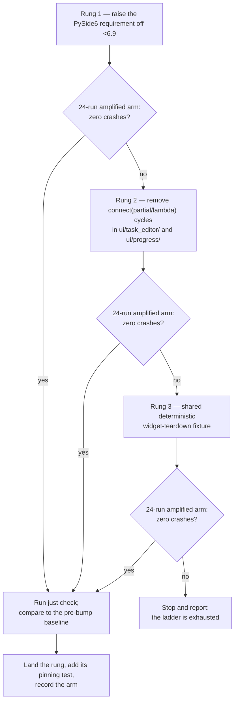

# STORY-121 — Eliminate the native crash caused by the PySide6 connection-registry use-after-free

## Goal

The full gate (`just check`) fails roughly one run in three with a native fault and **no failing
test** — the process dies with `Fatal Python error: Segmentation fault` and exits 139. It has done
so since at least 2026-08-05, it is not caused by any recent story, and because the reported Python
frame moves between runs it has repeatedly been mistaken for a regression in whatever work was in
flight. It has now been root-caused to a use-after-free inside PySide6 6.8.3. This story makes the
crash stop, using the remediation ladder ADR-0020 ratified: move off the `PySide6 <6.9` pin first,
and fall back to reducing the trigger only if that fails.

## What was root-caused

The investigation is `.superpowers/sdd/segfault-debug-report.md`; ADR-0020 records the decision it
led to. The short version an implementer needs:

- **The guilty frame is inside `libpyside6`, not this application.** CPython's cyclic GC invokes
  `PySide::onPysideReceiverSlotDestroyed` as a weakref-death callback, and that function erases from
  PySide6's process-global `QHash<PySide::ConnectionKey, QMetaObject::Connection>` after that hash's
  storage has already been freed. The frame is named in **15 of 24** macOS crash reports collected
  during the investigation, including `python3.13-2026-08-19-180314.ips` — which came from one of
  the three ORIGINAL, UNAMPLIFIED `just check` segfaults, so the diagnosis is not an artifact of the
  diagnostic configuration.
- **The Python-level crash site is a bystander and moves between runs.** The corrupted heap kills
  whatever runs next: a later GC traverse (`dict_traverse` / `set_traverse` under
  `deduce_unreachable`, 3 reports), a `QApplication::setStyleSheet` widget walk (3 reports), or a
  shiboken dealloc (2 reports). The crashes previously blamed on
  `tests/conftest.py::_isolate_qapp_appearance` are this same bug, not a second one.
- **The application's contribution is only that it makes the precondition common.** The defect fires
  when a sender `QObject` and its plain-Python receiver become unreachable in the same cyclic-GC
  pass. `connect(partial(...))` / `connect(lambda ...)` create Python reference cycles, so those
  widget trees can only ever be reclaimed by the cyclic collector.
  `src/ollama_llm_bench/ui/task_editor/_internal/field_editor.py:242`
  (`help_button.clicked.connect(partial(self._show_help, ...))`) is the representative example, and
  `field_editor.py` is the single most frequent Python-level crash site (line 250, `_build_row`).
- **It is pre-existing and `test_deadline.py` is cleared.** BASE `4f01baa` crashes at the same rate
  as the branch, at a character-for-character identical Python-level site, and the rate is unchanged
  with `backend/provider_openai_compatible/tests/test_deadline.py` removed entirely.

## The reproducer — use this, not the full gate

The crash lives in the colocated `src` suite, which runs in about 60 seconds (2347 passed) versus
30-plus minutes for the full gate:

```bash
uv run pytest src -q
```

Under CPython's `pymalloc` a freed object's memory stays mapped, so the dangling pointer usually
reads stale-but-valid bytes and the corruption stays silent. Switching to the system allocator with
macOS's scribble patterns turns the latent use-after-free into a hard, immediate fault. **This is
the single most valuable artifact from the investigation** — it converts a 30-minute coin flip into
a ~90-second measurement:

```bash
PYTHONMALLOC=malloc MallocScribble=1 MallocPreScribble=1 uv run pytest src -q
```

Per-run time rises to ~70–110 s and the crash rate rises from roughly 7 % to roughly 50 %.

A full arm, sequential, recording one exit code per line — never piped through `tail`, because
`tail` buffers until exit and has previously hidden a finished run's result for hours:

```bash
: > arm-summary.txt
for i in $(seq 1 24); do
  PYTHONMALLOC=malloc MallocScribble=1 MallocPreScribble=1 \
    uv run pytest src -q > "run-$i.log" 2>&1
  echo "run $i exit=$?" >> arm-summary.txt
done
```

How to read an exit code:

| Exit code         | Meaning                                                                  |
| ----------------- | ------------------------------------------------------------------------ |
| `0`               | Clean run.                                                               |
| `1`               | Ordinary test failures — **not** a crash. See the note below.            |
| `134`/`138`/`139` | `SIGABRT` / `SIGBUS` / `SIGSEGV` — a crash. This is what the arms count. |

Note on exit 1 under the amplifier: two `test_embed.py` failures appeared in exactly one amplified
run during the investigation and in none of the 32 normal runs. They were treated as an artifact of
`PYTHONMALLOC=malloc` and not investigated. If they reappear, record them and keep counting crashes
separately — they do not belong in the crash tally.

Measured baseline to beat:

| Arm                                                | Crashes / runs |
| -------------------------------------------------- | -------------- |
| Branch `43b198e`, normal                           | 1 / 11         |
| BASE `4f01baa`, normal                             | 1 / 21         |
| Branch, amplified                                  | 6 / 12         |
| Branch, amplified, only `test_deadline.py` ignored | 6 / 12         |
| BASE `4f01baa`, amplified                          | 6 / 12         |

## In scope

- **Rung 1 — raise the `PySide6` requirement in `pyproject.toml` off `<6.9` and refresh
  `uv.lock`**, then measure a 24-run amplified arm and record every exit code. This is the primary
  deliverable; ADR-0020 ratified it as the first attempt because the defect is inside `libpyside6`.
- **The full gate after the bump.** A Qt-binding minor-version change across a Qt-heavy codebase can
  carry its own fallout, so the bump is accepted only when `just check` is at least as green as the
  pre-bump baseline captured on the same machine.
- **A pinning test for whichever rung lands**, so the fix cannot silently regress — for rung 1, a
  test asserting the resolved `PySide6` version admits no build below 6.9.
- **Rung 2, only if rung 1's arm is dirty — remove the `connect(partial(...))` /
  `connect(lambda ...)` reference cycles in `ui/task_editor/` and `ui/progress/`**, so those widget
  trees are reclaimed by refcounting instead of by the cyclic collector, and re-measure.
- **Rung 3, only if rung 2's arm is dirty — a shared deterministic-widget-teardown fixture** for Qt
  tests, generalising
  `tests/integration/test_theme_reapply_on_save.py::_flush_pending_widget_deletions`, and
  re-measure.
- **A recorded evidence table in this story's closing notes** carrying every arm run: rung, exit
  code per run, machine, and the PySide6 build under test.

## Out of scope

- **Editing `docs/v3_specification/`.** The version table at `02_TOOLCHAIN.md` §8 records the
  `PySide6 >=6.8,<6.9` row and will be stale once the pin moves. ADR-0020's "Recommendation to the
  owner" asks for that row to be refreshed; this story proposes no edit to the vendored tree and
  must not make one.
- **Reading PySide6's own sources to confirm the exact lifetime rule violated.** `libpyside6` is not
  vendored here. The frame's *location* is certain from 15 independent reports; the internal
  mechanism is a strong inference and stays one.
- **Any change to `backend/provider_openai_compatible/`, including `test_deadline.py`.** The
  exclusion arms clear it (6/12 with and 6/12 without) and ADR-0019's read-timeout change is
  vindicated. Editing it would be a change that provably does nothing.
- **Reducing Qt object churn in the accessibility integration tests.** That is STORY-117, which
  pulls the same lever as rung 2 from a different direction. Neither story blocks the other, and
  this one does not absorb it.
- **Any suppression of the symptom** — `gc.disable()`, `-p no:randomly` (already measured not to
  prevent the crash), or skipping the tests that happen to be running when the fault lands.
  ADR-0020 rejects all three outright; none of them is an acceptable close for this story.
- **Re-measuring the full gate's own crash rate.** All 68 investigation runs are the `src` tier
  alone, and every rate quoted here is that tier's. The gate's rate is higher; establishing it
  precisely would cost days for no additional decision.

## Spec inputs

- `16_Engineering_Standards/02_TOOLCHAIN.md#7-dependency-version-policy` — the policy that makes
  rung 1 the default posture rather than an exception: dependencies are taken at the newest stable
  version at the time of work, there is no long-term version freezing, the lockfile is refreshed
  with `uv lock --upgrade`, and the version table in §8 is updated to record what is in use.
- `16_Engineering_Standards/02_TOOLCHAIN.md#8-consolidated-version-table` — the row this story
  moves: `PySide6 | >=6.8,<6.9`. It is also the row that goes stale, which is why ADR-0020 carries a
  recommendation to the owner rather than a silent edit.
- `16_Engineering_Standards/07_TESTING_STANDARD.md#8-testing-pyside6-widgets` — the widget-testing
  rules (`qtbot`, `QAbstractItemModelTester`, widget lifetime) that every widget suite must still
  satisfy after the binding changes, and which rung 3's shared teardown fixture would have to work
  within.
- `16_Engineering_Standards/07_TESTING_STANDARD.md#11-coverage-targets-and-time-budgets` — the
  per-tier time budgets and the requirement that the full pull-request suite completes inside four
  minutes. A run that dies on a signal produces no coverage numbers and no result at all, so this
  clause is unsatisfiable while the crash exists.
- `16_Engineering_Standards/07_TESTING_STANDARD.md#12-the-ci-test-environment` — the Qt parity rig:
  an autouse fixture in the root `conftest.py` fails any test that emits a Qt or PySide warning
  unless it is marked `@pytest.mark.allow_qt_warnings`. A 6.9.x deprecation warning therefore shows
  up as a test failure, which is exactly why AC-2 exists.

## Design constraints

- **Run the arms sequentially, one at a time, on one machine.** Two agents each running a full suite
  concurrently manufacture timing failures indistinguishable from real regressions — this repository
  has already had two independent agents report and agree on the same non-existent failure. An arm
  measured under contention is worthless.
- **Never pipe a long run's output through `tail`.** `tail` buffers until the producer exits, which
  has already hidden a finished gate's result for eleven hours here. Redirect each run to its own
  file, as the recipe above does.
- **Compare against a baseline captured in the same session on the same machine.** `just check` does
  not pin `QT_QPA_PLATFORM`, so some tests behave differently natively and offscreen; a bare "the
  gate is green" claim is not evidence. Capture the pre-bump failing-node-id set first, then compare.
- **A crash is not a test failure and must not be counted as one.** The signature is zero `FAILED`
  and zero `ERROR` lines plus `Fatal Python error: Segmentation fault` / `Bus error` and exit
  139/138/134. A run with even one `FAILED` line is a different problem.
- **The amplified configuration is a proxy, not the shipping configuration.** Every rate it produces
  is a proxy rate. Report it as such; do not present an amplified arm as the gate's true rate.
- **Rung 2, if reached, may not change behaviour.** Replacing a `connect(partial(...))` with a
  bound-method connection must preserve the exact arguments the slot receives; a widget that
  silently stops receiving a parameter would pass its own tests and fail in the application.
- **Rung 3, if reached, is the riskiest change in the story.** An autouse teardown across every Qt
  test is exactly the shape of shared-fixture change that has previously produced session-wide
  contamination here (a leaked Qt quit flag once produced dozens of unrelated failures). It also
  performs a `gc.collect()`, which is the operation that triggers the fault — expect it to move the
  crash rather than remove it, and say so if that is what the arm shows.
- **Reverting is a legitimate outcome of rung 1.** If 6.9.x brings compatibility fallout that
  outweighs the fix, restore the pin, record the fallout, and proceed to rung 2 — do not paper over
  new failures to keep the bump.

## Acceptance criteria

### STORY-121-AC-1

Given `pyproject.toml` requires a `PySide6` build of 6.9 or later and `uv.lock` resolves to one,
when 24 sequential runs of
`PYTHONMALLOC=malloc MallocScribble=1 MallocPreScribble=1 uv run pytest src -q` are executed on one
machine with no other test run in flight, then zero of the 24 runs exit with 134, 138, or 139.

*Why 24 runs.* The arm this must beat produced 6 crashes in 12 runs (~50 % per run). At that rate,
12 clean runs already has probability 0.5^12 ≈ 1 in 4096, so 12 would settle whether the measured
rate survives. The arm is doubled to 24 to also rule out a *partial* fix: 24 clean runs give roughly
a 92 % chance of catching a residual rate as low as 10 % per run (1 − 0.9^24), where 12 runs would
give only 72 %. A dirty arm — one or more crashes — falsifies rung 1 and sends the story to AC-3.

### STORY-121-AC-2

Given a pre-bump `just check` baseline captured on the same machine in the same session, when
`just check` is run to completion after the `PySide6` bump, then the set of failing test node ids it
reports is a subset of that baseline's set — no test that passed before the bump fails after it.

### STORY-121-AC-3

Given STORY-121-AC-1's arm recorded one or more crashes, and given no `connect(...)` call in
`ui/task_editor/` or `ui/progress/` any longer binds a `functools.partial` or a `lambda`, when a
fresh 24-run amplified arm is executed under the conditions of STORY-121-AC-1, then zero of the 24
runs exit with 134, 138, or 139.

### STORY-121-AC-4

Given STORY-121-AC-3's arm recorded one or more crashes, and given the shared
deterministic-widget-teardown fixture is active for every Qt test, when a fresh 24-run amplified arm
is executed under the conditions of STORY-121-AC-1, then zero of the 24 runs exit with 134, 138, or
139\.

## Test plan

Two of these criteria are settled by **measured crash rates**, not by a pass/fail test — no test can
assert "this suite does not segfault", because a segfaulting run produces no test result at all.
The evidence discipline for those is set out under "Recording the evidence" below, and each rung
additionally gets a permanent pinning test so the landed fix cannot silently regress.

- STORY-121-AC-1 — **measured evidence**, not a self-asserting test: the 24-line `arm-summary.txt`
  produced by the recipe above, pasted into this story's closing notes together with the PySide6
  build under test (`uv run python -c "import PySide6; print(PySide6.__version__)"`) and the machine
  it ran on. **Pinning test:** unit,
  `tests/architecture/test_dependency_floors.py::test_pyside6_is_at_least_6_9`, asserting the
  imported `PySide6.__version__` parses to `(6, 9)` or higher — so a lockfile refresh cannot quietly
  drop back to 6.8.x and re-arm the crash.
- STORY-121-AC-2 — **verification step**: the pre-bump and post-bump `just check` tails, both
  pasted, with the failing-node-id sets diffed explicitly. An empty post-bump set satisfies the
  criterion trivially; a non-empty one must be shown to be a subset of the baseline, per the
  exclusion-test discipline the project requires before any "pre-existing and unrelated" claim.
- STORY-121-AC-3 — **measured evidence** (a second `arm-summary.txt`, same format), executed only if
  AC-1's arm is dirty. **Pinning test:** architecture,
  `tests/architecture/test_no_partial_or_lambda_connections.py::test_ui_signal_connections_bind_no_cycle_creating_callable`,
  an AST scan over `ui/task_editor/` and `ui/progress/` asserting no argument to a `.connect(...)`
  call is a `functools.partial` construction or a `Lambda` node.
- STORY-121-AC-4 — **measured evidence** (a third `arm-summary.txt`), executed only if AC-3's arm is
  dirty. **Pinning test:** integration,
  `tests/integration/test_widget_teardown_fixture.py::test_live_widget_count_returns_to_baseline`,
  asserting that after a test that builds and drops a widget tree, the live `QWidget` count is back
  to its pre-test value.

## Definition of done

- [ ] Whichever rung landed has its arm recorded in full — 24 exit codes, the PySide6 build, the
  machine — in this story's closing notes, and the rungs not executed are recorded as not executed
  with the reason.
- [ ] The landed rung has its permanent pinning test passing and naming STORY-121 in its `Proves:`
  docstring line.
- [ ] `just check` is green, tail pasted, and its failing-node-id set diffed against the pre-bump
  baseline captured on the same machine — not asserted to be equivalent, shown to be.
- [ ] `mypy --strict`, `ruff`, and `import-linter` pass for every touched file, including the two
  cited UI modules if rung 2 was reached.
- [ ] `just trace` then `just trace-check` pass with no orphan clause and no orphan test.
- [ ] The module inventory is unchanged (see "Module-inventory note" below).
- [ ] ADR-0020's recommendation to refresh `02_TOOLCHAIN.md` §8's `PySide6` row is restated to the
  owner in the closing report, unresolved in code.
- [ ] `CHANGELOG.md` records the fix under `Fixed` — this is a crash in a shipped application, not
  an internal refactor.

## Recording the evidence

AC-1, AC-3, and AC-4 are settled by measurement, so the evidence has to be as reviewable as a test
result would be. For each arm executed, this story's closing notes must carry:

| Field                    | Example                                                    |
| ------------------------ | ---------------------------------------------------------- |
| Rung and date            | rung 1, 2026-08-20                                         |
| PySide6 build under test | `6.9.1`                                                    |
| Command, verbatim        | the amplified command from "The reproducer"                |
| Machine and concurrency  | one machine, sequential, no other suite in flight          |
| Per-run exit codes       | all 24 lines of `arm-summary.txt`, unedited                |
| Crash count              | `0 / 24`                                                   |
| Non-crash anomalies      | e.g. exit 1 in run 7 with the two `test_embed.py` failures |

Unedited exit codes matter more than the summary line: a truncated or hand-summarised arm cannot be
audited, and the whole reason this bug survived since 2026-08-05 is that its evidence kept being
summarised as "flaky".

## Module-inventory note

The primary change — the `PySide6` requirement in `pyproject.toml` and the refreshed `uv.lock` — has
no row in `14_Process_and_Traceability/01_MODULE_INVENTORY.md`, because the inventory enumerates
shipped source modules and not build configuration. The `modules:` front-matter therefore cites the
two UI modules the crash evidence actually implicates and that rung 2 would change:
`ui/task_editor/` (whose `_internal/field_editor.py` is the most frequent Python-level crash site and
carries the representative `connect(partial(...))` at line 242) and `ui/progress/` (whose
`ProgressView._build_current_task_panel` is a second recorded crash site). This is a deliberate
citation of the affected surface, not a claim that rung 1 edits those packages.

## How this story closes

The ladder is strictly ordered and stops at the first rung whose arm comes back clean:



If all three rungs are exhausted with dirty arms, that is a reportable result, not a failure of this
story: it would mean the defect fires without the reference-cycle precondition, which contradicts
the mechanism ADR-0020 records and is new information about an accepted decision. Stop and report
it; never resolve it silently by suppressing the symptom.

## Blocking note for whoever moves this story to `ready`

`adrs:` cites ADR-0020, and the project rule is that only an `accepted` ADR may be cited from a
story's front-matter. ADR-0020 is written as `accepted` on the strength of the owner having ratified
the remediation *ordering* — trying the binding bump first — which is what the decision is about;
whether 6.9.x actually fixes the crash is this story's job to measure and is recorded in ADR-0020 as
an explicit open uncertainty. If the owner would rather the ADR sit at `proposed` until that
measurement exists, this story stays `draft` until it is accepted, and the ADR index row moves with
it.
