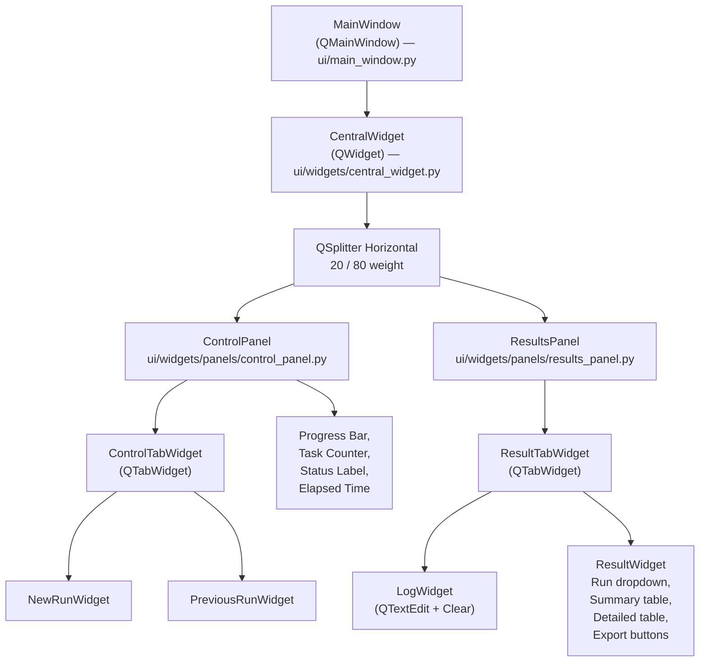
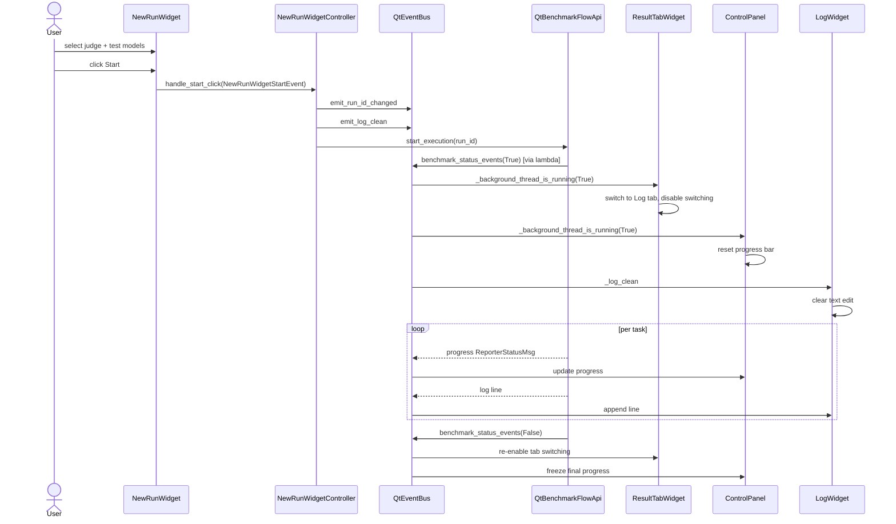
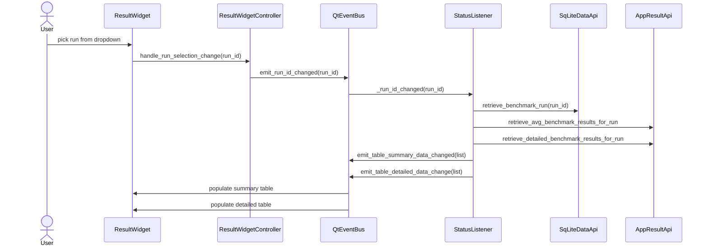

# UI Architecture

The UI is a classic two-pane Qt desktop application: configuration on the left, results and live log on the right.
Every widget is implemented with **PySide6**.

## Widget Tree



### File Map

| Widget | File |
|---|---|
| `MainWindow` | `src/ollama_llm_bench/ui/main_window.py` |
| `CentralWidget` | `src/ollama_llm_bench/ui/widgets/central_widget.py` |
| `ControlPanel` | `src/ollama_llm_bench/ui/widgets/panels/control_panel.py` |
| `ResultsPanel` | `src/ollama_llm_bench/ui/widgets/panels/results_panel.py` |
| `ControlTabWidget` | `src/ollama_llm_bench/ui/widgets/panels/control/control_tab_widget.py` |
| `NewRunWidget` | `src/ollama_llm_bench/ui/widgets/panels/control/new_run_widget.py` |
| `PreviousRunWidget` | `src/ollama_llm_bench/ui/widgets/panels/control/previous_run_widget.py` |
| `ResultTabWidget` | `src/ollama_llm_bench/ui/widgets/panels/result/result_tab_widget.py` |
| `LogWidget` | `src/ollama_llm_bench/ui/widgets/panels/result/log_widget.py` |
| `ResultWidget` | `src/ollama_llm_bench/ui/widgets/panels/result/result_widget.py` |

**Note**: the `MainWindow` class lives directly under `ui/`, **not** under `ui/widgets/`. Imports in `main.py` use `ollama_llm_bench.ui.main_window`.

## Framework Status

Every widget file imports from `PySide6.QtCore` and `PySide6.QtWidgets`.
All files use `PySide6` imports exclusively.

## MainWindow

```python
class MainWindow(QMainWindow):
    def __init__(self, ctx: AppContext) -> None:
        super().__init__()
        self._ctx = ctx
        self._setup_ui()
        self._setup_event_handlers()
```

- **Title**: `"Ollama LLM Benchmarker v1.0"` (constant `_WINDOW_TITLE`).
- **Size**: 1200 × 800 (constants `_WINDOW_WIDTH`, `_WINDOW_HEIGHT`).
- **Central widget**: an instance of `CentralWidget(ctx)`.
- **Platform-specific**: on macOS (`QApplication.platformName() == "darwin"`), it adds `Qt.WindowType.MacWindowToolBarButtonHint` to the window flags.
- **Event handlers**: calls `ctx.send_initialization_events()` at construction, then subscribes to `_global_event_msg` and shows any emitted string in a `QMessageBox.information` dialog parented to `QApplication.activeWindow() or self`.

## CentralWidget

```python
_CONTROL_PANEL_WEIGHT = 20   # percent
_RESULTS_PANEL_WEIGHT = 80
_MIN_SPLITTER_SIZE = 100     # px minimum for control panel
```

- Horizontal `QSplitter` with `Qt.Orientation.Horizontal`.
- Initial sizes calculated from the 20/80 ratio against a 1000px reference (`_calculate_splitter_sizes`).
- Zero margin, zero spacing `QVBoxLayout` wrapping the splitter.

## ControlPanel (Left Pane)

Hosts the control tabs and the live progress readout.

Progress components (emitted progress events, driven by `_background_thread_progress_changed`):

- `QProgressBar` — `tasks_completed / tasks_total`
- Task counter label — `"N / M"`
- Status label — `"<stage>: <current_model> / <current_task>"` (empty while idle)
- Elapsed-time label — formatted from `ReporterStatusMsg.start_time_ms` / `end_time_ms`

## ControlTabWidget

`QTabWidget` with two tabs:

1. **Run New Benchmark** → `NewRunWidget`
2. **Run Previous Benchmark** → `PreviousRunWidget`

Both tabs are disabled while a benchmark is running (driven by `_background_thread_is_running`).

## NewRunWidget

Used to configure a **fresh** benchmark run.

| Control | Type | Purpose |
|---|---|---|
| Judge model dropdown | `QComboBox` | Single-select: which model will judge the results |
| Test models list | `QListWidget` (multi-select) | The set of models to benchmark |
| Refresh button | `QPushButton` | Re-queries Ollama for the model list |
| Start button | `QPushButton` | Emits `NewRunWidgetStartEvent(judge_model, models)` to the controller |
| Stop button | `QPushButton` | Cancels the current run (shared state across tabs) |

### Controller Wiring

`NewRunWidgetController` (`ui/controllers/new_run_widget_controller.py`) exposes:

- `handle_refresh_click(_)` — calls `llm_api.get_models_list()` → `emit_models_test_changed(list)`.
- `handle_start_click(event: NewRunWidgetStartEvent)` — validates, creates run + results, calls `benchmark_flow_api.start_execution(run_id)`.
- `handle_stop_click(_)` — calls `benchmark_flow_api.stop_execution()`.
- `subscribe_to_models_change(callback)` — connects the widget's model-list refresh to the EventBus.
- `subscribe_to_benchmark_status_change(callback)` — connects the widget's enable/disable logic to `_background_thread_is_running`.

### Validation Rules

From `NewRunWidgetController.handle_start_click`:

1. `benchmark_flow_api.is_running()` → reject with `"Benchmark flow is already running"`.
2. Every selected model (judge + test) must be in the current Ollama model list → reject with `"Benchmark model <name> is not available"`.
3. Test model list must be non-empty → reject with `"No models selected"`.
4. `data_api.create_benchmark_run` must succeed → reject with `"Failed to create new benchmark run"`.
5. `data_api.create_benchmark_results` bulk insert must succeed → reject with `"Failed to initialize benchmark results"`.

Each rejection emits `_global_event_msg(...)`, which the `MainWindow` displays as a `QMessageBox.information`.

## PreviousRunWidget

Used to **resume** an unfinished run.

| Control | Type | Purpose |
|---|---|---|
| Unfinished runs dropdown | `QComboBox` | Shows runs with `BenchmarkRunStatus.NOT_COMPLETED`, newest first, populated by `get_benchmark_runs(data_api)` |
| Refresh button | `QPushButton` | Re-queries the runs list |
| Start button | `QPushButton` | Resumes execution of the selected run |
| Stop button | `QPushButton` | Cancels the current run |

The `PreviousRunWidgetController` uses the same `benchmark_flow_api.start_execution(run_id)` code path as `NewRunWidgetController` — the pipeline does not distinguish between "new" and "resumed" runs, only between `NOT_COMPLETED` / `WAITING_FOR_JUDGE` / `COMPLETED` result rows.

## ResultsPanel (Right Pane)

A thin container around `ResultTabWidget`.

## ResultTabWidget

`QTabWidget` with two tabs:

1. **System Log** → `LogWidget`
2. **Results** → `ResultWidget`

While a benchmark is running, the widget auto-switches to the log tab and disables tab switching (subscribed to `_background_thread_is_running`).
When the benchmark stops, tab switching re-enables and the user can inspect the freshly-populated Results tab.

## LogWidget

Minimal component:

- `QTextEdit` (read-only) showing a rolling log.
- `QPushButton` "Clean" clears the text.

Subscribes to `_log_append` and `_log_clean` via `LogWidgetController`.
The log source is `BenchmarkExecutionTask.Signals.log_message`, forwarded through `QtBenchmarkFlowApi.benchmark_output_events` and re-emitted by a lambda in `_create_app_context` as `_log_append`.

`LogWidgetController` additionally calls `emit_log_clean()` whenever `_background_thread_is_running` transitions to `True`, so the log is automatically cleared at the start of every run.

## ResultWidget

The most complex widget in the UI.

### Controls

- `QComboBox` listing all known runs (newest first) — selection triggers table refresh.
- Delete button — deletes the selected run (confirmation dialog via `_global_event_msg`).
- **Summary** `QTableWidget` — one row per model, 4 columns (`MODEL`, `AVG. TIME (s)`, `AVG. TOKENS/s`, `AVG. SCORE (%)`).
- Summary export buttons — `Export as CSV`, `Export as Markdown`.
- **Detailed** `QTableWidget` — one row per `(task, model)` pair, 8 columns (`MODEL`, `TASK`, `STATUS`, `TIME (ms)`, `Tokens`, `TOKENS/s`, `SCORE`, `REASON`).
- Detailed export buttons — `Export as CSV`, `Export as Markdown`.

### `SortableNumericItem`

Nested `QTableWidgetItem` subclass defined inside `result_widget.py`.
Overrides `__lt__` to produce numeric sorting for the time / tokens / score columns and handles `nan` safely.
Without this, Qt would do lexicographic sorting and `"10"` would appear before `"9"`.

### Controller Wiring

`ResultWidgetController` handles:

- Run selection changes → `emit_run_id_changed(run_id)` (triggers `StatusListener` to refresh both tables via `_table_*_changed`).
- Run deletion → `data_api.delete_benchmark_run(run_id)` → refresh runs list → `emit_global_event_msg("Run deleted")`.
- Export clicks → `table_serializer.save_*_as_*` → `emit_global_event_msg("Exported to <file>")`.

The widget itself does not talk to `AppResultApi` — that call happens in `StatusListener`, which fetches the summary/detailed data and pushes it through the EventBus.

## Screen Flow — Starting a New Benchmark



## Screen Flow — Viewing Previous Results



## Initialization Sequence

When `MainWindow` is constructed it calls `ctx.send_initialization_events()` (`app_context.py:169`):

1. Fetch all runs via `data_api.retrieve_benchmark_runs()`.
2. If any exist, emit `_run_id_changed(latest_run.run_id)` and `_run_ids_changed(sorted_list)`. Otherwise emit `None` and `[]`.
3. Fetch model list via `llm_api.get_models_list()`.
4. Emit `_models_test_changed(list)` and `_models_judge_changed(first_model or '')`.

Every exception is caught and logged; empty lists are emitted instead of propagating errors.
This means the UI comes up even if Ollama is unreachable or the database is empty.

## Visual Reference

The existing screenshots under `docs/` show the two main screens:

- `finished.png` — Results tab after a completed run.
- `running.png` — Log tab mid-run, with the progress bar and task counter animated.

These files are preserved from the project's original documentation; the content above reflects the current source code.

## Related Documents

- [architecture.md](architecture.md) — EventBus signal catalogue and DI wiring
- [benchmark-pipeline.md](benchmark-pipeline.md) — what happens after Start is clicked
- [services-reference.md](services-reference.md) — backend APIs the controllers call
- [developer-guide.md](developer-guide.md) — how to add a new widget + controller pair
