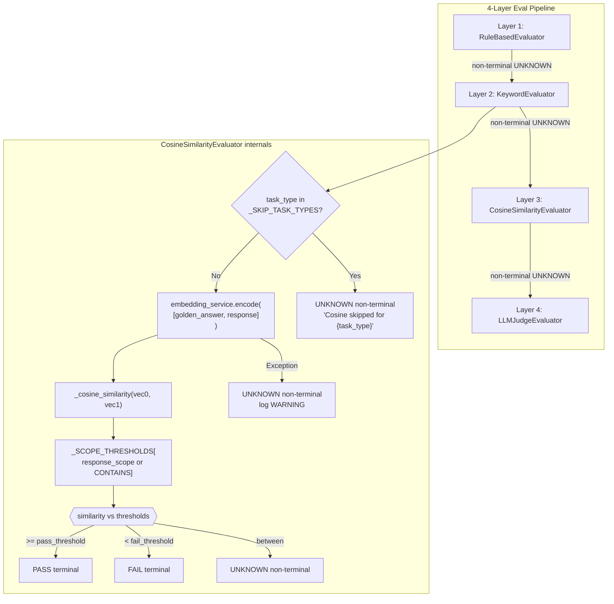

# Technical Design: CosineSimilarityEvaluator (Layer 3)

## Status
DRAFT — Awaiting human review

---

## Context

The V2 evaluation pipeline has four layers. Layers 1 (`RuleBasedEvaluator`) and 2 (`KeywordEvaluator`) are implemented and tested. Layer 3 is the **cosine similarity evaluator**: it encodes the task's `golden_answer` and the model's response into vectors via `EmbeddingProviderApi`, computes cosine similarity using pure Python, and maps the result to a pass/fail/unknown verdict based on `response_scope`-specific thresholds.

Existing files to follow as patterns:
- `src/ollama_llm_bench/backend/services/evaluators/rule_based_evaluator.py` — single-responsibility helper pattern, `_fail()` / `_unknown()` builders
- `src/ollama_llm_bench/backend/services/evaluators/keyword_evaluator.py` — `EmbeddingProviderApi` injection, `_cosine_similarity()` module-level function, try/except encoding guard
- `tests/unit/services/evaluators/test_keyword_evaluator.py` — class-per-scenario test layout, `_make_task()` / `_make_result()` factory helpers, mock with `spec=`

---

## Problem Statement

Implement `CosineSimilarityEvaluator` (Layer 3) and its complete test suite.

**Success criteria:**

1. `CosineSimilarityEvaluator` satisfies `EvaluatorApi` structurally (verified by `isinstance` check).
2. `layer` property returns `EvalLayer.COSINE`.
3. Skips evaluation for `CODE_GENERATION`, `CODE_REVIEW`, and `REASONING` task types, returning non-terminal `UNKNOWN`.
4. For non-skipped types: encodes `[golden_answer, response]` in a single `encode()` call.
5. Maps cosine similarity to `PASS`, `FAIL`, or non-terminal `UNKNOWN` using `_SCOPE_THRESHOLDS` keyed by `ResponseScope`.
6. When `task.response_scope is None`, defaults to `ResponseScope.CONTAINS` thresholds.
7. On `embedding_service.encode()` exception: logs `WARNING`, returns non-terminal `UNKNOWN` — does not raise.
8. `_cosine_similarity()` is a module-level function (replicated from `keyword_evaluator.py`, not imported).
9. `uv run mypy src/ollama_llm_bench/backend/services/evaluators/cosine_evaluator.py` passes clean.
10. `uv run pytest tests/unit/services/evaluators/test_cosine_evaluator.py -v` passes with full branch coverage.

---

## Alternatives Considered

### Option A: Import `_cosine_similarity` from `keyword_evaluator`

- **Approach:** Put `_cosine_similarity` in `keyword_evaluator.py` and import it in `cosine_evaluator.py`.
- **Pros:** Single source of truth for the math function.
- **Cons:** Creates an intra-package dependency between two sibling service modules. The function is seven lines of pure math — the coupling cost exceeds the deduplication benefit. Also contradicts the explicit task spec requirement "replicate, don't import."
- **Effort:** Low

### Option B: Extract to a shared `_embedding_utils.py` private module

- **Approach:** Create `services/evaluators/_embedding_utils.py` with `_cosine_similarity` and import from both evaluators.
- **Pros:** No duplication, no sibling coupling.
- **Cons:** Over-engineering for a seven-line function. Adds an undocumented private module to the package. The task spec is explicit that the function should be replicated.
- **Effort:** Low-Medium

### Option C: Replicate `_cosine_similarity` in `cosine_evaluator.py` (selected)

- **Approach:** Copy the identical function verbatim as a module-level private function. Both `keyword_evaluator.py` and `cosine_evaluator.py` own their copy.
- **Pros:** Zero coupling between sibling modules. Each module is self-contained. Matches spec intent. Consistent with existing `keyword_evaluator.py` pattern.
- **Cons:** Seven lines duplicated. Acceptable by the "rule of three" — two callsites of a micro-utility do not justify a shared module.
- **Effort:** Low

## Decision

Selected **Option C** because the task spec is unambiguous ("replicate, don't import"), the function is seven lines of pure arithmetic, and the coupling risk of Option A outweighs the cosmetic deduplication benefit.

---

## Architecture



---

## Data Structures

No new dataclasses or ABCs are required. All types consumed and produced are already defined.

**Types consumed** (all in `backend/core/models.py`):

| Name | Relevant fields used |
|---|---|
| `BenchmarkTask` | `task_type: TaskType`, `response_scope: ResponseScope | None`, `golden_answer: str` |
| `BenchmarkResult` | `sanitized_response: str | None`, `raw_response: str | None` |
| `EvaluationResult` | `verdict`, `score`, `reasoning`, `is_terminal`, `layer` |
| `EvalVerdict` | `PASS`, `FAIL`, `UNKNOWN` |
| `EvalLayer` | `COSINE` |
| `ResponseScope` | `EXACT`, `CONTAINS`, `COVERS` |
| `TaskType` | `CODE_GENERATION`, `CODE_REVIEW`, `REASONING` (skip set) |

**Protocol satisfied** (in `backend/core/interfaces.py`):

```
EvaluatorApi(Protocol):
    layer: EvalLayer   (property)
    evaluate(task: BenchmarkTask, result: BenchmarkResult) -> EvaluationResult
```

**Module-level constants in `cosine_evaluator.py`:**

| Constant | Type | Value |
|---|---|---|
| `_SKIP_TASK_TYPES` | `frozenset[TaskType]` | `{CODE_GENERATION, CODE_REVIEW, REASONING}` |
| `_SCOPE_THRESHOLDS` | `dict[ResponseScope, tuple[float, float]]` | See below |

`_SCOPE_THRESHOLDS` mapping — `(pass_threshold, fail_threshold)`:

| `ResponseScope` | `pass_threshold` | `fail_threshold` |
|---|---|---|
| `EXACT` | `0.90` | `0.70` |
| `CONTAINS` | `0.75` | `0.50` |
| `COVERS` | `0.65` | `0.40` |

**DI wiring:** No changes to `ApplicationContext` or `app_context.py` in this task — wiring is deferred to Task 12. `CosineSimilarityEvaluator` is a pure service instantiated with a single keyword arg: `embedding_service: EmbeddingProviderApi`.

---

## Implementation Steps

### Step 1: Create `cosine_evaluator.py`

- **File:** `src/ollama_llm_bench/backend/services/evaluators/cosine_evaluator.py`
- **Action:** Create
- **Description:**

  **File-level content outline** (in order):

  1. **Module docstring** — one-line: `"""Cosine similarity evaluator (Layer 3) — response vs golden_answer embedding comparison."""`

  2. **Imports** (standard library → third-party → local):
     ```
     import logging
     import math

     from ollama_llm_bench.backend.core.interfaces import EmbeddingProviderApi
     from ollama_llm_bench.backend.core.models import (
         BenchmarkResult,
         BenchmarkTask,
         EvalLayer,
         EvaluationResult,
         EvalVerdict,
         ResponseScope,
         TaskType,
     )
     ```

  3. **Module-level logger:**
     ```
     logger = logging.getLogger(__name__)
     ```

  4. **Constants** (in this order):
     ```
     _SKIP_TASK_TYPES: frozenset[TaskType] = frozenset({
         TaskType.CODE_GENERATION,
         TaskType.CODE_REVIEW,
         TaskType.REASONING,
     })

     _SCOPE_THRESHOLDS: dict[ResponseScope, tuple[float, float]] = {
         ResponseScope.EXACT:    (0.90, 0.70),
         ResponseScope.CONTAINS: (0.75, 0.50),
         ResponseScope.COVERS:   (0.65, 0.40),
     }
     ```

  5. **Module-level function** `_cosine_similarity(a: list[float], b: list[float]) -> float`:
     - Docstring: "Compute cosine similarity between two float vectors using pure Python. Returns 0.0 if either vector has zero norm."
     - Implementation identical to `keyword_evaluator._cosine_similarity` — `dot`, `norm_a`, `norm_b`, guard on zero norms.
     - Use `zip(a, b, strict=False)` consistent with the existing evaluator.

  6. **Class `CosineSimilarityEvaluator`**:

     - Class docstring: describe Layer 3 role, skip types, threshold table.

     - `def __init__(self, *, embedding_service: EmbeddingProviderApi) -> None` — stores `self._embedding_service = embedding_service`.

     - `@property def layer(self) -> EvalLayer` — returns `EvalLayer.COSINE`.

     - `def evaluate(self, task: BenchmarkTask, result: BenchmarkResult) -> EvaluationResult` — public entry point. Docstring covers Args/Returns. Implementation:
       1. Compute `response = result.sanitized_response or result.raw_response or ""`
       2. If `task.task_type in _SKIP_TASK_TYPES`: return `self._unknown(f"Cosine skipped for {task.task_type}")`
       3. Call `self._compute_similarity(task.golden_answer, response)` to get `(ok: bool, similarity: float)`. If not ok: return `self._unknown("Cosine skipped: embedding error")`
       4. Resolve thresholds: `scope = task.response_scope if task.response_scope is not None else ResponseScope.CONTAINS`; then `pass_t, fail_t = _SCOPE_THRESHOLDS[scope]`
       5. Verdict routing: `>= pass_t` → `_pass(similarity, scope)`, `< fail_t` → `_fail(similarity, scope)`, else → `_unknown(...)`.

     - `def _compute_similarity(self, golden: str, response: str) -> tuple[bool, float]` — private helper that calls `self._embedding_service.encode([golden, response])`, extracts `vecs[0]` and `vecs[1]`, calls `_cosine_similarity`, returns `(True, sim)`. On any exception: logs `WARNING` with `"cosine_encode_failed"` and returns `(False, 0.0)`. This isolates the try/except and keeps `evaluate()` flat.

     - `def _pass(self, similarity: float, scope: ResponseScope) -> EvaluationResult` — private builder for terminal PASS. `score=similarity`, reasoning: `f"Cosine {similarity:.3f} >= {_SCOPE_THRESHOLDS[scope][0]} ({scope})"`.

     - `def _fail(self, similarity: float, scope: ResponseScope) -> EvaluationResult` — private builder for terminal FAIL. `score=0.0`, reasoning: `f"Cosine {similarity:.3f} < {_SCOPE_THRESHOLDS[scope][1]} ({scope})"`.

     - `def _unknown(self, reasoning: str) -> EvaluationResult` — non-terminal builder. `verdict=EvalVerdict.UNKNOWN`, `score=0.5`, `is_terminal=False`, `layer=self.layer`.

  **Key implementation constraints:**
  - `evaluate()` must never raise — all exceptions are caught in `_compute_similarity`.
  - `_compute_similarity` calls `encode([golden, response])` — golden_answer first, response second (index 0 and 1 respectively). This is consistent but order does not affect cosine similarity since it is symmetric.
  - The `None` response_scope guard must use `is not None` (project rule for None checks).
  - All private methods prefixed with `_`.
  - No `Optional[T]` — use `T | None` syntax.

- **Validation:**
  ```bash
  uv run ruff check src/ollama_llm_bench/backend/services/evaluators/cosine_evaluator.py
  uv run ruff format --check src/ollama_llm_bench/backend/services/evaluators/cosine_evaluator.py
  uv run mypy src/ollama_llm_bench/backend/services/evaluators/cosine_evaluator.py
  ```

---

### Step 2: Create `test_cosine_evaluator.py`

- **File:** `tests/unit/services/evaluators/test_cosine_evaluator.py`
- **Action:** Create
- **Description:**

  **File-level content outline** (in order):

  1. **Module docstring** — `"""Unit tests for CosineSimilarityEvaluator — Layer 3 cosine similarity checks."""`

  2. **Imports:**
     ```
     import pytest
     from pytest_mock import MockerFixture

     from ollama_llm_bench.backend.core.interfaces import EmbeddingProviderApi, EvaluatorApi
     from ollama_llm_bench.backend.core.models import (
         BenchmarkResult,
         BenchmarkTask,
         Difficulty,
         EvalLayer,
         EvalVerdict,
         ResponseScope,
         TaskType,
     )
     from ollama_llm_bench.backend.services.evaluators.cosine_evaluator import (
         _SCOPE_THRESHOLDS,
         _SKIP_TASK_TYPES,
         CosineSimilarityEvaluator,
         _cosine_similarity,
     )
     ```

  3. **Helper factories** (module-level functions, not fixtures):

     `_make_task(*, task_type=TaskType.FACTUAL_QA, response_scope=ResponseScope.CONTAINS, golden_answer="Paris") -> BenchmarkTask`:
     - Returns a fully-constructed `BenchmarkTask` with sensible defaults for fields not under test.
     - Required fields for `BenchmarkTask`: `task_id`, `category`, `sub_category`, `task_type`, `question`, `golden_answer`, `pass_criteria`, `fail_criteria`.
     - All keyword-only.

     `_make_result(*, sanitized_response=None, raw_response=None) -> BenchmarkResult`:
     - Returns a `BenchmarkResult` with only `sanitized_response` and `raw_response` set (all other fields take dataclass defaults).

  4. **Test classes** — complete list with all method names:

     **`class TestLayerProperty`**
     - `test_layer_returns_cosine(self, mocker: MockerFixture) -> None`
       - Construct `CosineSimilarityEvaluator(embedding_service=mocker.Mock(spec=EmbeddingProviderApi))`.
       - Assert `evaluator.layer is EvalLayer.COSINE`.

     **`class TestInterfaceConformance`**
     - `test_isinstance_check_passes(self, mocker: MockerFixture) -> None`
       - Assert `isinstance(evaluator, EvaluatorApi)` is `True`.
       - Note: `EvaluatorApi` has `@runtime_checkable` — this verifies structural conformance at runtime.

     **`class TestSkippedTaskTypes`**
     - `test_code_generation_returns_unknown_non_terminal(self, mocker: MockerFixture) -> None`
     - `test_code_review_returns_unknown_non_terminal(self, mocker: MockerFixture) -> None`
     - `test_reasoning_returns_unknown_non_terminal(self, mocker: MockerFixture) -> None`
       - For each: construct task with the relevant `task_type`, call `evaluate()`, assert `verdict is EvalVerdict.UNKNOWN`, `is_terminal is False`.
     - `test_skipped_type_does_not_call_embedding_service(self, mocker: MockerFixture) -> None`
       - Use `TaskType.CODE_GENERATION`, call `evaluate()`, assert `mock_embedding.encode.assert_not_called()`.
     - `test_skipped_type_reasoning_contains_task_type_name(self, mocker: MockerFixture) -> None`
       - Assert the returned `reasoning` string contains the task type value (e.g., `"code_generation"`).

     **`class TestNonSkippedTaskTypes`**
     - `test_factual_qa_proceeds_to_embedding(self, mocker: MockerFixture) -> None`
       - Set `encode.return_value = [[1.0, 0.0], [1.0, 0.0]]`. Assert `encode` is called once.
     - `test_translation_proceeds_to_embedding(self, mocker: MockerFixture) -> None`
       - Same pattern with `TaskType.TRANSLATION`.
     - `test_summarization_proceeds_to_embedding(self, mocker: MockerFixture) -> None`
       - Same pattern with `TaskType.SUMMARIZATION`.

     **`class TestResponseScopeExact`**

     Three tests, each using `ResponseScope.EXACT` and `_SCOPE_THRESHOLDS[ResponseScope.EXACT]` = `(0.90, 0.70)`:

     - `test_exact_scope_above_pass_threshold_returns_pass_terminal(self, mocker: MockerFixture) -> None`
       - Use identical vectors (cosine = 1.0 >= 0.90). Assert `PASS`, `is_terminal=True`, `score >= 0.90`, `layer is EvalLayer.COSINE`.
     - `test_exact_scope_below_fail_threshold_returns_fail_terminal(self, mocker: MockerFixture) -> None`
       - Use orthogonal vectors (cosine = 0.0 < 0.70). Assert `FAIL`, `is_terminal=True`, `score == 0.0`.
     - `test_exact_scope_between_thresholds_returns_unknown_non_terminal(self, mocker: MockerFixture) -> None`
       - Patch `_cosine_similarity` to return `0.80` (between 0.70 and 0.90). Assert `UNKNOWN`, `is_terminal=False`.

     **`class TestResponseScopeContains`**

     Three tests using `ResponseScope.CONTAINS` thresholds `(0.75, 0.50)`:

     - `test_contains_scope_above_pass_threshold_returns_pass_terminal(self, mocker: MockerFixture) -> None`
       - Identical vectors → cosine = 1.0 >= 0.75. Assert `PASS`, `is_terminal=True`.
     - `test_contains_scope_below_fail_threshold_returns_fail_terminal(self, mocker: MockerFixture) -> None`
       - Orthogonal vectors → cosine = 0.0 < 0.50. Assert `FAIL`, `is_terminal=True`.
     - `test_contains_scope_between_thresholds_returns_unknown_non_terminal(self, mocker: MockerFixture) -> None`
       - Patch `_cosine_similarity` to return `0.60` (between 0.50 and 0.75). Assert `UNKNOWN`, `is_terminal=False`.

     **`class TestResponseScopeCovers`**

     Three tests using `ResponseScope.COVERS` thresholds `(0.65, 0.40)`:

     - `test_covers_scope_above_pass_threshold_returns_pass_terminal(self, mocker: MockerFixture) -> None`
       - Identical vectors → cosine = 1.0 >= 0.65. Assert `PASS`, `is_terminal=True`.
     - `test_covers_scope_below_fail_threshold_returns_fail_terminal(self, mocker: MockerFixture) -> None`
       - Orthogonal vectors → cosine = 0.0 < 0.40. Assert `FAIL`, `is_terminal=True`.
     - `test_covers_scope_between_thresholds_returns_unknown_non_terminal(self, mocker: MockerFixture) -> None`
       - Patch `_cosine_similarity` to return `0.50` (between 0.40 and 0.65). Assert `UNKNOWN`, `is_terminal=False`.

     **`class TestNoneResponseScope`**
     - `test_none_scope_defaults_to_contains_thresholds_pass(self, mocker: MockerFixture) -> None`
       - Task with `response_scope=None`. Use identical vectors. Assert `PASS` with `EvalLayer.COSINE` — confirming CONTAINS thresholds (0.75) were applied.
     - `test_none_scope_defaults_to_contains_thresholds_fail(self, mocker: MockerFixture) -> None`
       - Task with `response_scope=None`. Patch `_cosine_similarity` to return `0.30` (< 0.50). Assert `FAIL`, `is_terminal=True`.
     - `test_none_scope_defaults_to_contains_thresholds_unknown(self, mocker: MockerFixture) -> None`
       - Task with `response_scope=None`. Patch `_cosine_similarity` to return `0.60` (between 0.50–0.75). Assert `UNKNOWN`, `is_terminal=False`.

     **`class TestEmbeddingErrorFallback`**
     - `test_embedding_error_returns_unknown_non_terminal(self, mocker: MockerFixture) -> None`
       - `mock_embedding.encode.side_effect = RuntimeError("timeout")`. Assert `UNKNOWN`, `is_terminal=False`.
     - `test_embedding_error_does_not_raise(self, mocker: MockerFixture) -> None`
       - `mock_embedding.encode.side_effect = Exception("any error")`. Call `evaluate()` and assert no exception is raised.
     - `test_embedding_error_logs_warning(self, mocker: MockerFixture, caplog) -> None`
       - With `caplog.at_level(logging.WARNING)`, trigger an encode failure, assert a WARNING was logged.

     **`class TestResponseTextFallback`**
     - `test_uses_sanitized_response_when_available(self, mocker: MockerFixture) -> None`
       - Set both `sanitized_response="sanitized"` and `raw_response="raw"`. Assert `encode` receives `["Paris", "sanitized"]` (golden first, sanitized second).
     - `test_falls_back_to_raw_response_when_sanitized_is_none(self, mocker: MockerFixture) -> None`
       - `sanitized_response=None`, `raw_response="raw"`. Assert `encode` receives `["Paris", "raw"]`.
     - `test_uses_empty_string_when_both_responses_are_none(self, mocker: MockerFixture) -> None`
       - Both `None`. Assert `encode` receives `["Paris", ""]`.

     **`class TestEncodeCallStructure`**
     - `test_encode_called_with_golden_and_response_in_single_call(self, mocker: MockerFixture) -> None`
       - Assert `encode` is called exactly once with a list of exactly 2 elements: `[golden_answer, response]`. Use `assert_called_once_with(["Paris", "sanitized answer"])`.
     - `test_uses_index_zero_for_golden_and_index_one_for_response(self, mocker: MockerFixture) -> None`
       - Return distinct vectors: `encode.return_value = [[1.0, 0.0], [0.8, 0.6]]`. Patch `_cosine_similarity` to capture arguments. Assert `_cosine_similarity` was called with `[1.0, 0.0]` and `[0.8, 0.6]`.

     **`class TestCosineSimFunction`**
     - `test_identical_vectors_return_one(self) -> None` — `a = b = [1.0, 0.0, 0.0]`; assert `abs(result - 1.0) < 1e-9`.
     - `test_orthogonal_vectors_return_zero(self) -> None` — `[1.0, 0.0]`, `[0.0, 1.0]`; assert `abs(result) < 1e-9`.
     - `test_zero_norm_vector_returns_zero(self) -> None` — `[0.0, 0.0]`, `[1.0, 0.5]`; assert `result == 0.0`.
     - `test_both_zero_vectors_return_zero(self) -> None` — both `[0.0, 0.0]`; assert `result == 0.0`.
     - `test_known_angle_returns_expected_value(self) -> None` — `[1.0, 1.0]`, `[1.0, 0.0]`; cosine = 1/√2 ≈ 0.7071; assert `abs(result - 0.7071) < 1e-4`.

     **`class TestConstants`**
     - `test_skip_task_types_contains_code_generation(self) -> None` — `assert TaskType.CODE_GENERATION in _SKIP_TASK_TYPES`.
     - `test_skip_task_types_contains_code_review(self) -> None` — `assert TaskType.CODE_REVIEW in _SKIP_TASK_TYPES`.
     - `test_skip_task_types_contains_reasoning(self) -> None` — `assert TaskType.REASONING in _SKIP_TASK_TYPES`.
     - `test_skip_task_types_does_not_contain_factual_qa(self) -> None` — `assert TaskType.FACTUAL_QA not in _SKIP_TASK_TYPES`.
     - `test_scope_thresholds_has_all_three_scopes(self) -> None` — assert all three `ResponseScope` values are keys.
     - `test_exact_scope_thresholds_values(self) -> None` — assert `_SCOPE_THRESHOLDS[ResponseScope.EXACT] == (0.90, 0.70)`.
     - `test_contains_scope_thresholds_values(self) -> None` — assert `_SCOPE_THRESHOLDS[ResponseScope.CONTAINS] == (0.75, 0.50)`.
     - `test_covers_scope_thresholds_values(self) -> None` — assert `_SCOPE_THRESHOLDS[ResponseScope.COVERS] == (0.65, 0.40)`.
     - `test_pass_threshold_greater_than_fail_threshold_for_all_scopes(self) -> None` — parametrized or loop asserting `pass_t > fail_t` for every scope entry.

- **Validation:**
  ```bash
  uv run ruff check tests/unit/services/evaluators/test_cosine_evaluator.py
  uv run ruff format --check tests/unit/services/evaluators/test_cosine_evaluator.py
  uv run pytest tests/unit/services/evaluators/test_cosine_evaluator.py -v
  ```

---

### Step 3: Full suite regression check

- **File(s):** None (verification only)
- **Action:** Verify
- **Description:** Run the full test suite and the full linting pipeline to confirm no regressions were introduced and all quality gates pass.
- **Validation:**
  ```bash
  uv run ruff check --output-format=concise src/ tests/
  uv run ruff format --check src/ tests/
  uv run mypy src/ollama_llm_bench/backend/services/evaluators/cosine_evaluator.py
  uv run pytest tests/unit/services/evaluators/ -v
  uv run pytest tests/unit/ -q --tb=short
  ```

---

## Gotchas and Edge Cases

### 1. `None` `response_scope` requires an explicit guard

`BenchmarkTask.response_scope` is typed `ResponseScope | None`. Using it as a dict key directly in `_SCOPE_THRESHOLDS[task.response_scope]` will produce a `KeyError` at runtime if `None`. The guard must be:

```python
scope = task.response_scope if task.response_scope is not None else ResponseScope.CONTAINS
pass_t, fail_t = _SCOPE_THRESHOLDS[scope]
```

Do NOT use `task.response_scope or ResponseScope.CONTAINS` — `or` would also replace falsy string values, though none exist here. `is not None` is the required idiom per project rules.

### 2. `_cosine_similarity` is replicated, not imported

The function in `cosine_evaluator.py` is a verbatim copy of the one in `keyword_evaluator.py`. Tests for it live in `TestCosineSimFunction` within `test_cosine_evaluator.py`. Do not import from `keyword_evaluator` — this creates hidden coupling between two sibling evaluator modules.

### 3. `encode()` call order: golden first, response second

The spec says `encode([task.golden_answer, response])`. Index 0 is the golden answer vector, index 1 is the response vector. This ordering is load-bearing in the encode call structure tests (`TestEncodeCallStructure`). The cosine similarity function is symmetric so the math is order-independent, but the index assignment must match what the test expects.

### 4. Patching `_cosine_similarity` for between-threshold tests

Tests that need a specific similarity value (e.g., 0.60 for UNKNOWN in CONTAINS scope) must patch the function at the point of use:

```python
mocker.patch(
    "ollama_llm_bench.backend.services.evaluators.cosine_evaluator._cosine_similarity",
    return_value=0.60,
)
```

The mock must still set `encode.return_value` to a valid list of two vectors so the evaluator does not fail before reaching `_cosine_similarity`.

### 5. Warning log test uses `caplog`, not `mocker.patch`

The `test_embedding_error_logs_warning` test should use pytest's built-in `caplog` fixture:

```python
import logging

def test_embedding_error_logs_warning(
    self, mocker: MockerFixture, caplog: pytest.LogCaptureFixture
) -> None:
    with caplog.at_level(logging.WARNING, logger="ollama_llm_bench.backend.services.evaluators.cosine_evaluator"):
        ...
    assert any("cosine_encode_failed" in r.message or r.levelno == logging.WARNING for r in caplog.records)
```

### 6. `BenchmarkResult` default construction in `_make_result`

`BenchmarkResult` is a frozen dataclass with many fields, all of which have defaults. The `_make_result` factory only needs to pass `sanitized_response` and `raw_response`. All other fields use their dataclass defaults. This is safe because `CosineSimilarityEvaluator` only reads those two fields.

### 7. `has_inference_error` is NOT checked by Layer 3

Layer 1 (`RuleBasedEvaluator`) handles `has_inference_error`. Layer 3 does not check it — if Layer 1 is terminal for that condition, Layer 3 is never reached. Do not add a redundant check.

### 8. `EvaluatorApi` is `@runtime_checkable`

The `isinstance(evaluator, EvaluatorApi)` check in `TestInterfaceConformance` works because `EvaluatorApi` has `@runtime_checkable`. Structural Protocol conformance is checked at runtime against the `layer` property and `evaluate` method. The test validates that `CosineSimilarityEvaluator` correctly satisfies the protocol without inheriting from it.

---

## Security Considerations

None specific to this evaluator. The cosine similarity computation is pure arithmetic on float vectors — no user input reaches the math functions directly. The `encode()` call receives `task.golden_answer` (from trusted YAML) and the model response (untrusted, but passed as a string — no code execution path exists).

---

## Performance Considerations

- The `encode()` call is a single batch request: `[golden_answer, response]`. This is one round-trip to the embedding service per task, regardless of text length. No per-token or per-character iteration.
- `_cosine_similarity` is O(d) where d is the embedding dimension. For `bge-m3` (1024 dimensions), this is negligible.
- Skipping CODE_GENERATION, CODE_REVIEW, and REASONING avoids embedding calls for those task types entirely.

---

## Rollback Plan

This task introduces only new files. No existing files are modified. Rollback is simply deleting:
- `src/ollama_llm_bench/backend/services/evaluators/cosine_evaluator.py`
- `tests/unit/services/evaluators/test_cosine_evaluator.py`

The pipeline in `BenchmarkExecutionTask` is not wired to the new evaluator until Task 12 (ApplicationContext wiring), so no running code is affected.

---

## Open Questions

None. All design decisions are resolved by the task spec and existing codebase patterns.
