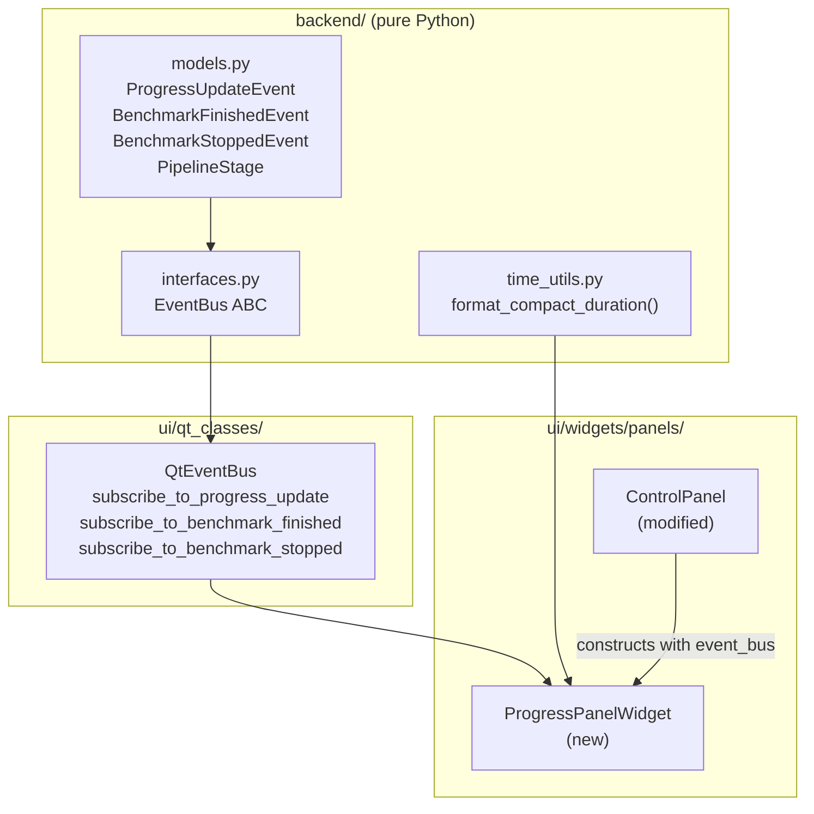
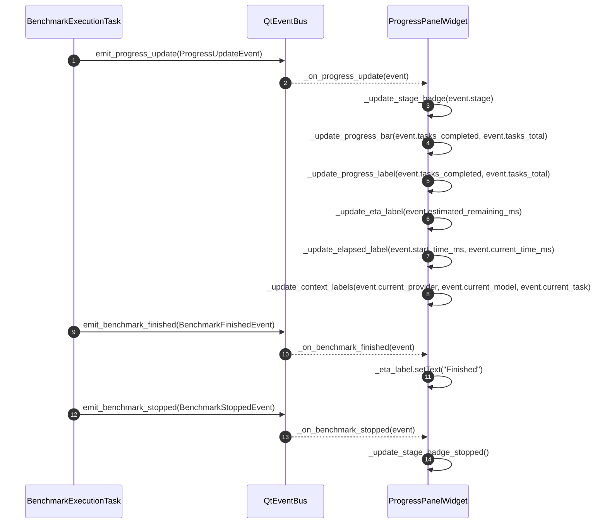

# Technical Design: Task 13 — ProgressPanelWidget (Structured)

## Status
DRAFT — Awaiting human review

## Context

The existing `ControlPanel` displays benchmark progress via four flat `QLabel`/`QProgressBar` widgets
that subscribe to the V1 `ReporterStatusMsg` event through `subscribe_to_background_thread_progress`.
This V1 event carries only a flat string stage name, model/task strings, and raw timestamps in ms.

V2 introduced `ProgressUpdateEvent`, `BenchmarkFinishedEvent`, and `BenchmarkStoppedEvent` — typed
frozen dataclasses emitted by the V2 pipeline.  No widget currently subscribes to these events.

The goal is to introduce a self-contained `ProgressPanelWidget` that consumes the V2 event stream
and renders a structured progress view (stage badge, progress bar, ETA, provider/model/task labels,
elapsed time).  The V1 flat progress section inside `ControlPanel` continues to exist during the
transition — it is not removed in this task.

## Problem Statement

**What must change:**

1. A new `ProgressPanelWidget(QWidget)` must be created at
   `src/ollama_llm_bench/ui/widgets/panels/progress_panel_widget.py`.
2. A pure-Python helper function `format_compact_duration(total_ms: float) -> str` that renders
   `"2h 48m 33s"` must be added to
   `src/ollama_llm_bench/backend/utils/time_utils.py`, because the existing
   `format_elapsed_time()` produces `"Spent time: X hours, Y minutes, …"` — the wrong format.
3. `ControlPanel` must be modified to instantiate `ProgressPanelWidget` (injecting `event_bus`)
   and include it in its layout below `ControlTabWidget`, so the widget is visible in the running
   application without requiring `CentralWidget` changes.
4. Unit tests must cover `format_compact_duration` and the pure formatting/logic helpers inside
   `ProgressPanelWidget`.

**Success criteria:**

- `ProgressPanelWidget` subscribes to `subscribe_to_progress_update`, `subscribe_to_benchmark_finished`,
  `subscribe_to_benchmark_stopped` and updates its child widgets correctly.
- Stage badge background colour matches the `PipelineStage` → hex colour mapping defined in the spec.
- Elapsed label renders in `"2h 48m 33s"` compact format.
- ETA label renders `"ETA: 14 min"` or `"ETA: –"` when `estimated_remaining_ms` is `None`.
- Task label text is truncated at 30 characters with `"…"` suffix; full ID is in tooltip.
- `uv run mypy src/` passes with no new errors.
- `uv run pytest tests/unit/widgets/` passes.

## Alternatives Considered

### Option A: New standalone widget, inserted into `ControlPanel`
- **Approach:** Create `ProgressPanelWidget` with its own `EventBus` constructor parameter.
  `ControlPanel.__init__` receives `event_bus` extracted from `ctx`, constructs the widget, and
  adds it to the existing vertical layout.  V1 flat progress labels are kept in place (no removal).
- **Pros:** Cleanest separation of concerns.  `ProgressPanelWidget` is independently unit-testable
  because it receives `EventBus` (an ABC) not `AppContext`.  Follows the constructor-DI pattern
  already used by every other widget.  Zero risk to V1 path.
- **Cons:** Requires a small modification to `ControlPanel` to add the new widget.
- **Effort:** Low

### Option B: Directly replace `ControlPanel` with a redesigned widget
- **Approach:** Gut `ControlPanel`, remove V1 flat labels, make it host only `ControlTabWidget` and
  the new structured progress section.
- **Pros:** Cleaner final state; no dead V1 code.
- **Cons:** Removes V1 progress reporting before V2 pipeline is fully wired.  Higher risk during the
  transition — if V2 pipeline does not emit events correctly, there is no fallback display.
- **Effort:** Medium

### Option C: New widget in `central_widget.py` as a third panel sibling
- **Approach:** `CentralWidget` constructs `ProgressPanelWidget` directly and adds it to the
  `QSplitter` as a new pane.
- **Pros:** Keeps `ControlPanel` untouched.
- **Cons:** The V2 UI design spec shows progress inside the left control panel, not as a separate
  pane.  Violates the intended layout.  `CentralWidget` would need to reach through to `EventBus`,
  which it already does via `ctx`.
- **Effort:** Low

## Decision

Selected **Option A** because:
- It is the only option that preserves the V1 path as a safe fallback during the migration.
- `ProgressPanelWidget` receiving `EventBus` directly (not `AppContext`) matches the DI pattern
  already applied to every service and controller; widgets must not depend on `AppContext` directly.
- `ControlPanel` already holds `self._event_bus: EventBus` so extracting it for the sub-widget is a
  one-line change.
- No layout restructuring needed in `CentralWidget`.

## Architecture





## Data Structures

No new dataclasses are introduced.  The following existing structures are consumed:

- `ProgressUpdateEvent` — fields: `stage: PipelineStage`, `current_provider: str`,
  `current_model: str`, `current_task: str`, `tasks_completed: int`, `tasks_total: int`,
  `start_time_ms: float` (ms epoch), `current_time_ms: float` (ms epoch),
  `estimated_remaining_ms: float | None` (ms duration).
- `BenchmarkFinishedEvent` — only the arrival matters; no fields read.
- `BenchmarkStoppedEvent` — only the arrival matters; no fields read.
- `PipelineStage` — `StrEnum` values: `INITIALIZING`, `BENCHMARKING`, `JUDGING`, `FINISHED`,
  `FAILED`.

**New helper function** added to `time_utils.py`:

```
format_compact_duration(total_ms: float) -> str
  Input:  total_ms — a duration in milliseconds (non-negative float)
  Output: compact human-readable string, e.g. "2h 48m 33s", "5m 4s", "47s"
  Rules:
    - Hours shown only when >= 1h
    - Minutes shown only when >= 1m (or when hours are shown)
    - Seconds always shown
    - No milliseconds (truncate, not round)
```

**Stage badge colour mapping** (module-level constant dict inside `progress_panel_widget.py`):

```
_STAGE_COLORS: dict[PipelineStage, str] = {
    PipelineStage.INITIALIZING: "#2196F3",
    PipelineStage.BENCHMARKING: "#FF9800",
    PipelineStage.JUDGING:      "#9C27B0",
    PipelineStage.FINISHED:     "#4CAF50",
    PipelineStage.FAILED:       "#F44336",
}
_STOPPED_COLOR: str = "#9E9E9E"
_TASK_LABEL_MAX_CHARS: int = 30
_PROGRESS_BAR_MAX: int = 100
_ETA_PLACEHOLDER: str = "ETA: –"
_ETA_FINISHED: str = "Finished"
_STOPPED_LABEL: str = "Stopped"
```

## Implementation Steps

### Step 1: Add `format_compact_duration` to `time_utils.py`

- **File:** `src/ollama_llm_bench/backend/utils/time_utils.py`
- **Action:** Modify
- **Description:**
  Add a new module-level constant `_MS_PER_SECOND: Final[int] = 1000` (already available as
  `MILLISECONDS_PER_SECOND`, reuse it).  Add the function after the existing helpers:

  ```
  def format_compact_duration(total_ms: float) -> str
  ```

  Implementation logic:
  1. Clamp `total_ms` to `max(0.0, total_ms)`.
  2. Convert to total integer seconds: `total_s = int(total_ms / MILLISECONDS_PER_SECOND)`.
  3. Extract hours via `divmod(total_s, 3600)` → `(hours, rem)`.
  4. Extract minutes via `divmod(rem, 60)` → `(minutes, seconds)`.
  5. Build string: include hours part only if `hours > 0`; include minutes part if `hours > 0` or
     `minutes > 0`; always include seconds.
  6. Examples: `0 ms` → `"0s"`, `4500 ms` → `"4s"`, `65000 ms` → `"1m 5s"`,
     `10143000 ms` → `"2h 49m 3s"`.

  The function must have a Google-style docstring with Args and Returns sections.

- **Validation:** `uv run pytest tests/unit/utils/test_time_utils.py -q --tb=short`

---

### Step 2: Create `ProgressPanelWidget`

- **File:** `src/ollama_llm_bench/ui/widgets/panels/progress_panel_widget.py`
- **Action:** Create
- **Description:**

  **Module-level constants** (all `Final`):
  - `_STAGE_COLORS: Final[dict[PipelineStage, str]]` — the five-entry hex map shown above.
  - `_STOPPED_COLOR: Final[str] = "#9E9E9E"`
  - `_TASK_LABEL_MAX_CHARS: Final[int] = 30`
  - `_PROGRESS_BAR_MAX: Final[int] = 100`
  - `_ETA_PLACEHOLDER: Final[str] = "ETA: –"`
  - `_ETA_FINISHED: Final[str] = "Finished"`
  - `_STOPPED_LABEL: Final[str] = "Stopped"`

  **Class:** `ProgressPanelWidget(QWidget)`

  **Constructor signature:**
  ```python
  def __init__(self, *, event_bus: EventBus, parent: QWidget | None = None) -> None
  ```

  Constructor phases (follow the three-phase widget pattern from the PySide6 skill):

  *Phase 1 — create all child widgets:*
  - `self._stage_badge: QLabel = QLabel("–")`
  - `self._progress_bar: QProgressBar = QProgressBar()`
  - `self._progress_label: QLabel = QLabel("0 / 0 (0%)")`
  - `self._eta_label: QLabel = QLabel(_ETA_PLACEHOLDER)`
  - `self._provider_label: QLabel = QLabel("–")`
  - `self._model_label: QLabel = QLabel("–")`
  - `self._task_label: QLabel = QLabel("–")`
  - `self._elapsed_label: QLabel = QLabel("0s")`

  *Phase 2 — configure widgets:*
  - `self._progress_bar.setRange(0, _PROGRESS_BAR_MAX)`
  - `self._progress_bar.setValue(0)`
  - `self._progress_bar.setTextVisible(False)`
  - Apply initial stage badge style by calling `self._apply_stage_style("#9E9E9E", "–")`.

  *Phase 3 — build layout:*
  - Use a single `QVBoxLayout` as the outer container.
  - Set `contentsMargins(8, 8, 8, 8)` and `spacing(6)`.
  - Add `_stage_badge` (row 1).
  - Add `_progress_bar` (row 2).
  - Add `_progress_label` (row 3).
  - Add `_eta_label` (row 4).
  - Add `_elapsed_label` (row 5).
  - Use a `QFormLayout` (or two-column `QGridLayout`) for the provider/model/task info rows to
    align labels cleanly:
    - Row A: `"Provider:"` QLabel → `_provider_label`
    - Row B: `"Model:"` QLabel → `_model_label`
    - Row C: `"Task:"` QLabel → `_task_label`
  - Add the form layout to the outer `QVBoxLayout`.
  - Set the outer layout via `self.setLayout(layout)`.

  *Phase 4 — subscribe to EventBus (after layout is set):*
  - `event_bus.subscribe_to_progress_update(self._on_progress_update)`
  - `event_bus.subscribe_to_benchmark_finished(self._on_benchmark_finished)`
  - `event_bus.subscribe_to_benchmark_stopped(self._on_benchmark_stopped)`

  **Private methods** (all must be under 30 lines each):

  `_on_progress_update(self, event: ProgressUpdateEvent) -> None`
  - Calls each of the five sub-update methods below in order.
  - Wraps in try/except `(ValueError, TypeError)` and logs error with `logger.error`.

  `_update_stage_badge(self, stage: PipelineStage) -> None`
  - Look up `_STAGE_COLORS.get(stage, _STOPPED_COLOR)`.
  - Call `self._apply_stage_style(colour, stage.value)`.

  `_apply_stage_style(self, colour: str, text: str) -> None`
  - `self._stage_badge.setText(text)`
  - `self._stage_badge.setStyleSheet(f"background-color: {colour}; color: #FFFFFF; padding: 2px 8px; border-radius: 4px; font-weight: bold;")`

  `_update_progress_bar(self, completed: int, total: int) -> None`
  - Guard: if `total <= 0`, call `self._progress_bar.setValue(0)` and return.
  - Calculate `pct = min(_PROGRESS_BAR_MAX, max(0, int(completed / total * 100)))`.
  - `self._progress_bar.setValue(pct)`.

  `_update_progress_label(self, completed: int, total: int) -> None`
  - Guard: if `total <= 0`, set text `"0 / 0 (0%)"` and return.
  - `pct = min(100, max(0, int(completed / total * 100)))`.
  - `self._progress_label.setText(f"{completed} / {total} ({pct}%)")`.

  `_update_eta_label(self, estimated_remaining_ms: float | None) -> None`
  - If `None`: `self._eta_label.setText(_ETA_PLACEHOLDER)`.
  - Else: convert to minutes `mins = int(estimated_remaining_ms / 60_000)`; if `mins < 1`, set
    `"ETA: < 1 min"`; else `f"ETA: {mins} min"`.

  `_update_elapsed_label(self, start_time_ms: float, current_time_ms: float) -> None`
  - `elapsed_ms = max(0.0, current_time_ms - start_time_ms)`.
  - Import and call `format_compact_duration(elapsed_ms)`.
  - `self._elapsed_label.setText(formatted)`.

  `_update_context_labels(self, provider: str, model: str, task: str) -> None`
  - `self._provider_label.setText(provider or "–")`.
  - `self._model_label.setText(model or "–")`.
  - Handle task truncation: if `len(task) > _TASK_LABEL_MAX_CHARS`, display
    `task[:_TASK_LABEL_MAX_CHARS] + "…"`; otherwise display `task`.
  - `self._task_label.setToolTip(task)`.

  `_on_benchmark_finished(self, event: BenchmarkFinishedEvent) -> None`
  - `self._eta_label.setText(_ETA_FINISHED)`.
  - Also call `_apply_stage_style(_STAGE_COLORS[PipelineStage.FINISHED], PipelineStage.FINISHED.value)`.

  `_on_benchmark_stopped(self, event: BenchmarkStoppedEvent) -> None`
  - `self._apply_stage_style(_STOPPED_COLOR, _STOPPED_LABEL)`.

  **Imports required** (absolute):
  - `from ollama_llm_bench.backend.core.interfaces import EventBus`
  - `from ollama_llm_bench.backend.core.models import BenchmarkFinishedEvent, BenchmarkStoppedEvent, PipelineStage, ProgressUpdateEvent`
  - `from ollama_llm_bench.backend.utils.time_utils import format_compact_duration`
  - Standard: `logging`, `typing.Final`
  - PySide6: `QFormLayout`, `QLabel`, `QProgressBar`, `QVBoxLayout`, `QWidget`

- **Validation:** `uv run mypy src/ollama_llm_bench/ui/widgets/panels/progress_panel_widget.py --strict`

---

### Step 3: Register `ProgressPanelWidget` in the panels `__init__.py`

- **File:** `src/ollama_llm_bench/ui/widgets/panels/__init__.py`
- **Action:** Modify
- **Description:**
  Add `ProgressPanelWidget` to the public exports of the package.  The file currently has a single
  blank line (length 1).  Add:
  ```python
  from ollama_llm_bench.ui.widgets.panels.progress_panel_widget import ProgressPanelWidget

  __all__ = ["ProgressPanelWidget"]
  ```
  If other panel classes are later added to `__init__.py`, include them in `__all__` as well.

- **Validation:** `uv run python -c "from ollama_llm_bench.ui.widgets.panels import ProgressPanelWidget; print('ok')"` (no `QApplication` needed for import-only check).

---

### Step 4: Integrate `ProgressPanelWidget` into `ControlPanel`

- **File:** `src/ollama_llm_bench/ui/widgets/panels/control_panel.py`
- **Action:** Modify
- **Description:**
  `ControlPanel.__init__` already stores `self._event_bus: EventBus = ctx.get_event_bus()`.

  1. Add an import at the top of the file:
     `from ollama_llm_bench.ui.widgets.panels.progress_panel_widget import ProgressPanelWidget`

  2. In `__init__`, after the existing widget attribute declarations, add:
     `self._progress_panel: ProgressPanelWidget = ProgressPanelWidget(event_bus=self._event_bus)`

  3. In `_setup_ui_layout`, within `main_layout` (below the `_tab_widget` line and above or below
     the existing `progress_layout` block), add:
     `main_layout.addWidget(self._progress_panel)`

  The existing V1 flat progress section (`_tasks_status`, `_progress_bar`, `_status_label`,
  `_time_label`, `_on_progress_changed`) is intentionally preserved.  No removal in this step.

  Order within `main_layout` (top to bottom):
  - `_tab_widget`
  - `_progress_panel`  ← new
  - `progress_layout` (V1 flat labels)

- **Validation:** `uv run ruff check src/ollama_llm_bench/ui/widgets/panels/control_panel.py`
  then `uv run mypy src/ollama_llm_bench/ui/widgets/panels/control_panel.py`

---

### Step 5: Write unit tests for `format_compact_duration`

- **File:** `tests/unit/utils/test_time_utils.py`
- **Action:** Modify (add new test function; file may or may not already exist)
- **Description:**
  If the file does not exist, create it with the standard module header and `conftest.py`-free
  fixtures (pure unit tests, no mocks required).

  Add `test_format_compact_duration_*` parametrized test covering:

  | Input ms | Expected output |
  |----------|----------------|
  | `0.0` | `"0s"` |
  | `999.9` | `"0s"` (truncates sub-second) |
  | `1000.0` | `"1s"` |
  | `59999.0` | `"59s"` |
  | `60000.0` | `"1m 0s"` |
  | `65000.0` | `"1m 5s"` |
  | `3599000.0` | `"59m 59s"` |
  | `3600000.0` | `"1h 0m 0s"` |
  | `10143000.0` | `"2h 49m 3s"` |
  | `-500.0` | `"0s"` (negative clamped) |

  Use `@pytest.mark.parametrize` with `ids=` matching the input description.
  All test functions must have return type `-> None` and full type hints.

- **Validation:** `uv run pytest tests/unit/utils/test_time_utils.py -q --tb=short`

---

### Step 6: Write unit tests for `ProgressPanelWidget` formatting helpers

- **File:** `tests/unit/widgets/test_progress_panel_widget.py`
- **Action:** Create
- **Description:**
  Create `tests/unit/widgets/__init__.py` (empty) if it does not exist, then create the test file.

  Because `ProgressPanelWidget` is a `QWidget`, tests that instantiate it require a `QApplication`.
  To keep these as true unit tests, **extract the pure logic** into module-level helper functions
  and test those without Qt.  However, if the coder follows the plan exactly, all the business
  logic (percentage calculation, ETA string, truncation) is inside private methods.  The tests
  should therefore test the *observable output* on a live widget via a `QApplication` fixture, or
  call the private helpers directly through the instance.

  Use the following `pytest` fixture at module level:
  ```python
  @pytest.fixture(scope="module")
  def qapp() -> QApplication:
      app = QApplication.instance() or QApplication([])
      return app  # type: ignore[return-value]
  ```

  Tests to include (all parametrized where possible):

  **Group A — progress label formatting** (test `_update_progress_label` effect on `_progress_label.text()`):
  - `0 / 0` → `"0 / 0 (0%)"`
  - `0 / 10` → `"0 / 10 (0%)"`
  - `5 / 10` → `"5 / 10 (50%)"`
  - `10 / 10` → `"10 / 10 (100%)"`

  **Group B — ETA label** (test `_update_eta_label` effect):
  - `None` → `"ETA: –"`
  - `0.0` ms → `"ETA: < 1 min"`
  - `59999.0` ms → `"ETA: < 1 min"`
  - `60000.0` ms → `"ETA: 1 min"`
  - `840000.0` ms (14 min) → `"ETA: 14 min"`

  **Group C — task label truncation** (test `_update_context_labels` effect):
  - 30-char task ID: displayed as-is, tooltip is the same.
  - 31-char task ID: displayed as first 30 chars + `"…"`, tooltip is full string.
  - Empty string: displayed as `"–"`.

  **Group D — stage badge** (test `_update_stage_badge` effect on `_stage_badge.text()` and stylesheet):
  - `PipelineStage.INITIALIZING` → text `"Initializing"`, stylesheet contains `"#2196F3"`.
  - `PipelineStage.BENCHMARKING` → text `"Benchmarking"`, stylesheet contains `"#FF9800"`.
  - `PipelineStage.FAILED` → text `"Failed"`, stylesheet contains `"#F44336"`.

  **Group E — stopped event** (test `_on_benchmark_stopped`):
  - After `_on_benchmark_stopped`, `_stage_badge.text()` is `"Stopped"` and stylesheet contains
    `"#9E9E9E"`.

  **Group F — finished event** (test `_on_benchmark_finished`):
  - After `_on_benchmark_finished`, `_eta_label.text()` is `"Finished"`.
  - `_stage_badge.text()` is `"Finished"`.

  Mock `EventBus` using `mocker.Mock(spec=EventBus)` so that no real Qt signals are involved.
  The mock must have `subscribe_to_progress_update`, `subscribe_to_benchmark_finished`, and
  `subscribe_to_benchmark_stopped` set up as no-ops.

- **Validation:** `uv run pytest tests/unit/widgets/test_progress_panel_widget.py -q --tb=short`

---

### Step 7: Full quality check

- **Files:** all modified files
- **Action:** Verify
- **Description:**
  Run the full validation pipeline in mandatory order:
  1. `uv run ruff check --output-format=concise src/ tests/`
  2. `uv run ruff format --check src/ tests/`
  3. `uv run mypy src/`
  4. `uv run pytest -q --tb=short`

  All four commands must exit with code 0.

- **Validation:** `uv run ruff check --output-format=concise src/ tests/ && uv run ruff format --check src/ tests/ && uv run mypy src/ && uv run pytest -q --tb=short`

---

## Security Considerations

No security concerns.  `ProgressPanelWidget` only reads from `EventBus` — it never writes to a
database, file, or network.  `setStyleSheet` is called with static hex literals and no user-supplied
data, so no QSS injection risk.

## Performance Considerations

- `ProgressUpdateEvent` is emitted once per completed task.  For large runs (hundreds of tasks) the
  handler runs at most a few Hz — no rate-limiting timer is needed.
- `setStyleSheet` on a single `QLabel` is cheap; it is called only when the stage changes (at most
  five times per run).
- `format_compact_duration` performs only integer arithmetic — no I/O.

## Rollback Plan

`ProgressPanelWidget` is additive.  If the widget is broken, remove the `addWidget` call from
`ControlPanel._setup_ui_layout` and the instantiation from `ControlPanel.__init__`.  The V1
`_on_progress_changed` path is not touched and continues to function.

## Open Questions

1. **ETA unit threshold** — The spec says `"14 min"`.  This plan renders minutes only.  If the
   product owner wants hours in ETA (e.g., `"2h 14m"`), `_update_eta_label` needs adjustment.
   Current design uses minutes only for simplicity; clarify before implementation if needed.

2. **`slots=True` on `ProgressPanelWidget`** — `QWidget` subclasses are not compatible with
   `__slots__` in Python's dataclass sense; this is not a dataclass so `slots` does not apply.
   The private attributes (`_stage_badge`, etc.) are standard instance attributes.

3. **`ControlPanel` constructor** — `ControlPanel.__init__` receives `ctx: AppContext`, not
   `EventBus` directly, which is fine because it already stores `self._event_bus` from
   `ctx.get_event_bus()`.  No interface change is needed.

4. **`tests/unit/widgets/` directory** — Does it already exist?  If not, the coder must create
   `tests/unit/widgets/__init__.py` as an empty file.  The plan covers this, but verify before
   running tests.
