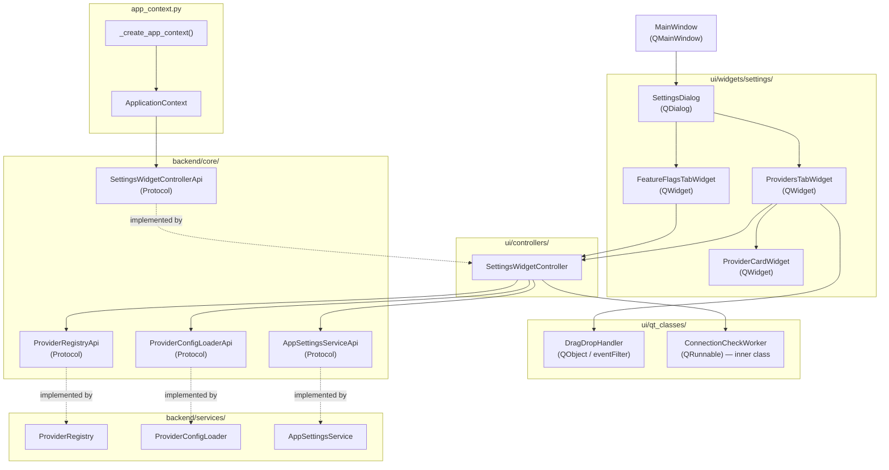

# Phase 4 — Settings & Feature Flags: Implementation Plan

**Generated**: 2026-04-16
**Source**: `docs/v2/v2-implementation-plan.md` sections 4.1, 4.2
**Scope**: Settings dialog with Providers tab (provider management, health testing, drag-and-drop YAML loading) and General tab (feature flags, benchmark event policies, logging, display settings). Includes DragDropHandler, design token module, controller and protocol additions, and full DI wiring into `app_context.py`.

---

## Prerequisites

All of these must be complete and passing before Phase 4 work begins:

- Phase 1 complete: `ProviderRegistry`, `ProviderConfigLoader`, `OpenAICompatibleProvider`, `AnthropicProvider`, `GeminiProvider`, `EmbeddingService`, `ModelNameParser` implemented and tested.
- Phase 2 complete: All four evaluators implemented and tested.
- Phase 3 complete: `CosineSimilarityEvaluator` implemented and tested.
- `backend/services/app_settings_service.py` — `AppSettingsService` exists with 9 constants.
- `backend/core/interfaces.py` — `ProviderRegistryApi` Protocol exists; does NOT yet expose `get_config()`.
- `backend/core/ui_controllers.py` — No `SettingsWidgetControllerApi` exists yet.
- `ui/main_window.py` — `MainWindow(QMainWindow)` exists; no menu bar or settings button yet.
- `ui/style/` — directory does NOT exist yet.
- `ui/qt_classes/drag_drop_handler.py` — does NOT exist yet.
- `app_context.py` — `ApplicationContext.__slots__` does NOT include `_settings_widget_controller`.
- `uv run pytest` passes on current branch.
- `uv run mypy src/` passes on current branch.

---

## Architecture Decisions

### Decision 1: `SettingsWidgetController` lives in `ui/controllers/` and owns threading

The provider connection test (`get_available_models()`) is a blocking network call. It must run off the main thread. Two options were considered:

**Option A**: Move threading into a new class in `ui/qt_classes/`, wire signals back through `SettingsWidgetController`.
**Option B**: `SettingsWidgetController` itself (in `ui/controllers/`) launches a one-shot `QRunnable` on `QThreadPool.globalInstance()` with a nested `Signals(QObject)` for the callback, keeping the controller the single coordination point.

Decision: **Option B**. `ui/controllers/` is explicitly allowed to use `QThreadPool` (it already does indirectly via `QtBenchmarkFlowApi`), and this keeps the controller self-contained. `QThreadPool.globalInstance()` avoids creating a second pool. The nested `Signals` pattern is established by `BenchmarkExecutionTask`.

### Decision 2: `DragDropHandler` reuses a single class for both settings and task-file panels

A generic `DragDropHandler(QObject)` emits `yaml_file_dropped = Signal(Path)` and can be installed on any widget. This avoids duplicating event filter logic. The handler is installed via `install_on(widget)`, not by subclassing, which means any widget can accept YAML drops without widget-hierarchy constraints.

### Decision 3: `get_config()` is added to `ProviderRegistryApi` Protocol

The settings UI needs to read `ProvidersConfig` directly (to build provider cards). Routing this through `ProviderRegistryApi` keeps the controller type-safe without exposing the concrete `ProviderRegistry` class to the UI layer. Adding `get_config()` to the Protocol is a pure additive change; all existing call sites remain unaffected because Protocol conformance is structural.

### Decision 4: No `theme_loader.py` or `.qss` files in Phase 4

Theme switching is a display concern. Phase 4 stores the theme setting in `app_settings` and emits an EventBus signal when the user changes it. The actual QSS application is deferred to a future task that builds the full QSS pipeline. Phase 4 only creates `ui/style/tokens.py` (the data layer of the token system) — no `.qss` files, no `theme_loader.py`.

### Decision 5: `save_providers_yaml` serializes `ProvidersConfig` manually to a plain dict

`ProviderConfig` and `ProvidersConfig` are frozen dataclasses. Serialization to YAML uses a manual conversion to a plain dict (matching the format `ProviderConfigLoader.load()` expects) before calling `yaml.dump()`. No new serialization library is required — `pyyaml` is already a project dependency.

---

## Component Interaction Diagram



---

## Implementation Steps

### Step 1: Extend `AppSettingsService` with missing setting constants

**Why this task exists**: Phase 4 introduces nine new user-configurable settings (theme, score format, cosine and keyword feature flags, cosine thresholds, reasoning effort, and auto-scroll). These are referenced by string keys from multiple call sites; centralizing them as module-level constants prevents key typos and enables import-time discovery.

**Files to modify**:
- `src/ollama_llm_bench/backend/services/app_settings_service.py`

**Files to update (tests)**:
- `tests/unit/services/test_app_settings_service.py`

**Action**: Modify

**Description**:

Add the following nine module-level string constants to `app_settings_service.py`, immediately after the existing nine constants (after line 17, before the class definition). The constants must match these exact string keys, as the `FeatureFlagsTabWidget` (Task 7) and `SettingsWidgetController` (Task 5) reference them by import:

```
SETTING_THEME = "ui.theme"
SETTING_SCORE_DISPLAY_FORMAT = "ui.score_display_format"
SETTING_COSINE_ENABLED = "feature.cosine_enabled"
SETTING_KEYWORD_ENABLED = "feature.keyword_enabled"
SETTING_COSINE_THRESHOLD_EXACT = "eval.cosine_threshold_exact"
SETTING_COSINE_THRESHOLD_CONTAINS = "eval.cosine_threshold_contains"
SETTING_COSINE_THRESHOLD_COVERS = "eval.cosine_threshold_covers"
SETTING_REASONING_EFFORT_DEFAULT = "feature.reasoning_effort_default"
SETTING_AUTO_SCROLL = "ui.auto_scroll"
```

Type annotation for each: `str`, consistent with the existing nine constants.

No changes to the `AppSettingsService` class body — only constants are added.

**Default value semantics** (documented in inline comments next to each constant):
- `SETTING_THEME`: `"dark"` or `"light"`; default `"dark"`
- `SETTING_SCORE_DISPLAY_FORMAT`: `"0_to_1"` or `"0_to_100"`; default `"0_to_1"`
- `SETTING_COSINE_ENABLED`: boolean as string `"true"`/`"false"`; default `"true"`
- `SETTING_KEYWORD_ENABLED`: boolean as string; default `"true"`
- `SETTING_COSINE_THRESHOLD_EXACT`: float as string; default `"0.9"`
- `SETTING_COSINE_THRESHOLD_CONTAINS`: float as string; default `"0.7"`
- `SETTING_COSINE_THRESHOLD_COVERS`: float as string; default `"0.6"`
- `SETTING_REASONING_EFFORT_DEFAULT`: `"low"`, `"medium"`, or `"high"`; default `"medium"`
- `SETTING_AUTO_SCROLL`: boolean as string; default `"true"`

**Test file updates** — add two new test methods to `TestProtocolConformance`:
1. `test_new_setting_constants_are_strings` — asserts `isinstance(SETTING_THEME, str)`, etc., for all nine new constants.
2. `test_new_setting_constant_keys_have_expected_prefixes` — asserts that `ui.*` constants start with `"ui."`, `feature.*` with `"feature."`, `eval.*` with `"eval."`, and `benchmark.*` with `"benchmark."`. This guards against accidental key renames.

**Validation**:
```bash
uv run pytest tests/unit/services/test_app_settings_service.py -q --tb=short
uv run mypy src/ollama_llm_bench/backend/services/app_settings_service.py
```

---

### Step 2: Create `ui/style/` package with `tokens.py`

**Why this task exists**: The settings dialog (Task 6, 7, 8) uses `setProperty()` with QSS attribute selectors for health dot colors (`live`, `down`, `unknown`). Those property values must map to colors that come from the token system — not hardcoded hex strings in widget Python code. Creating `tokens.py` now establishes this foundation so widget code in later tasks can import `get_tokens()` to read colors for `QPainter` use and for QSS template injection.

**Files to create**:
- `src/ollama_llm_bench/ui/style/__init__.py` — empty, marks package
- `src/ollama_llm_bench/ui/style/tokens.py`

**Action**: Create

**Description**:

`tokens.py` must be pure Python — zero PySide6 or Qt imports. It exports three dicts and one function.

`DARK_TOKENS: dict[str, str]` — all keys listed below with dark theme hex values.
`LIGHT_TOKENS: dict[str, str]` — same keys with light theme hex values.
`SHARED_TOKENS: dict[str, str]` — theme-independent values (fonts, spacing, radii).

The three dicts use these exact keys and values (derived from the PySide6-ui skill reference):

**DARK_TOKENS**:
```
bg_primary: "#111827"
bg_secondary: "#1F2937"
bg_card: "#263044"
bg_input: "#1F2937"
bg_hover: "#1A3A35"
text_primary: "#F9FAFB"
text_secondary: "#9CA3AF"
text_disabled: "#4B5563"
primary: "#14B8A6"
success: "#34D399"
warning: "#FBBF24"
failure: "#F87171"
border: "#374151"
border_focus: "#14B8A6"
```

**LIGHT_TOKENS**:
```
bg_primary: "#FDFDFD"
bg_secondary: "#F3F4F6"
bg_card: "#FFFFFF"
bg_input: "#FFFFFF"
bg_hover: "#F0FDFA"
text_primary: "#0F172A"
text_secondary: "#64748B"
text_disabled: "#9CA3AF"
primary: "#0D9488"
success: "#059669"
warning: "#D97706"
failure: "#DC2626"
border: "#D1D5DB"
border_focus: "#0D9488"
```

**SHARED_TOKENS**:
```
spacing_xs: "4px"
spacing_sm: "8px"
spacing_md: "12px"
spacing_lg: "16px"
spacing_xl: "24px"
radius_sm: "4px"
radius_md: "6px"
radius_lg: "8px"
```

Public function signature:
```python
def get_tokens(theme: str) -> dict[str, str]:
    """Return the merged token dict for the given theme name.

    Args:
        theme: Theme name — "dark" or "light". Falls back to "dark" for unknown values.

    Returns:
        Dict merging SHARED_TOKENS with the requested theme tokens.
        Theme tokens override SHARED_TOKENS for any key collision.
    """
```

Implementation: returns `{**SHARED_TOKENS, **DARK_TOKENS}` for `"dark"`, `{**SHARED_TOKENS, **LIGHT_TOKENS}` for `"light"`. For any unknown value, logs a `logger.warning` at module level and returns the dark tokens as the safe fallback.

No `__init__.py` exports — users import directly: `from ollama_llm_bench.ui.style.tokens import get_tokens, DARK_TOKENS`.

**Validation**:
```bash
uv run mypy src/ollama_llm_bench/ui/style/tokens.py
uv run ruff check src/ollama_llm_bench/ui/style/tokens.py
uv run pytest tests/unit/ -q --tb=short
```
(No dedicated test file for `tokens.py` — it is pure data with no logic other than the fallback branch. The `get_tokens` function is exercised by widget tests in Tasks 6 and 7.)

---

### Step 3: Create `DragDropHandler` in `ui/qt_classes/`

**Why this task exists**: Both the Providers tab (Task 6) and the task-file panel accept `.yaml`/`.yml` drag-and-drop. Extracting this into a reusable `QObject`-based event filter avoids duplicating `dragEnterEvent`/`dropEvent` logic in every widget that needs it. Installing via `eventFilter` means no widget subclassing is required.

**Files to create**:
- `src/ollama_llm_bench/ui/qt_classes/drag_drop_handler.py`

**Files to create (tests)**:
- `tests/unit/qt_classes/test_drag_drop_handler.py`

**Action**: Create

**Description**:

`DragDropHandler` is a `QObject` subclass. It does not use `MetaQObjectABC` (no ABC mixing needed). It lives in `ui/qt_classes/` because it is Qt infrastructure (event filtering), not business logic.

Class signature:
```python
class DragDropHandler(QObject):
    """Installable QObject event filter that emits yaml_file_dropped for .yaml/.yml drops."""

    yaml_file_dropped = Signal(Path)

    def __init__(self, parent: QObject | None = None) -> None: ...

    def install_on(self, widget: QWidget) -> None:
        """Enable drag-and-drop on widget by installing this handler as an event filter.

        Also sets acceptDrops(True) on widget — required for drop events to fire.

        Args:
            widget: The target widget that should accept YAML file drops.
        """

    @override
    def eventFilter(self, watched: QObject, event: QEvent) -> bool:
        """Intercept DragEnter and Drop events.

        Args:
            watched: The widget the event was sent to.
            event: The incoming event.

        Returns:
            True if the event was consumed; False to let it propagate.
        """
```

**`install_on` implementation details**:
- Call `widget.setAcceptDrops(True)` — required; without this, `DragEnter` events never fire.
- Call `widget.installEventFilter(self)`.

**`eventFilter` implementation details**:

For `QEvent.Type.DragEnter`:
- Cast event to `QDragEnterEvent`.
- Check `event.mimeData().hasUrls()`.
- Iterate `event.mimeData().urls()`. If any URL's `toLocalFile()` ends with `.yaml` or `.yml` (case-insensitive), call `event.acceptProposedAction()` and return `True`.
- Otherwise call `event.ignore()` and return `False`.

For `QEvent.Type.Drop`:
- Cast event to `QDropEvent`.
- Iterate `event.mimeData().urls()`. Take the first URL whose `toLocalFile()` ends with `.yaml` or `.yml`.
- Convert to `Path`, emit `self.yaml_file_dropped.emit(yaml_path)`.
- Call `event.acceptProposedAction()` and return `True`.
- If no matching URL, return `False`.

For all other event types: return `super().eventFilter(watched, event)`.

**Imports required**:
```python
from pathlib import Path
from typing import override

from PySide6.QtCore import QEvent, QObject, Signal
from PySide6.QtGui import QDragEnterEvent, QDropEvent
from PySide6.QtWidgets import QWidget
```

**Test file** (`tests/unit/qt_classes/test_drag_drop_handler.py`):

Must include a module-scope `qapp` fixture (identical to the pattern in `test_log_widget.py`).

Test classes and methods:

`TestInstallOn`:
- `test_install_on_enables_accept_drops` — after `handler.install_on(widget)`, `widget.acceptDrops()` is `True`.
- `test_install_on_is_registered_as_event_filter` — verifies the widget now has the filter; create a subclass widget and confirm `eventFilter` gets called by constructing a fake `QDragEnterEvent` (or test indirectly by checking `acceptDrops`).

`TestEventFilterDragEnter`:
- `test_drag_enter_with_yaml_url_accepts_event` — mock a `QDragEnterEvent` carrying a `.yaml` URL; assert `eventFilter` returns `True` and `event.isAccepted()` is `True`.
- `test_drag_enter_with_yml_url_accepts_event` — same for `.yml`.
- `test_drag_enter_with_non_yaml_url_ignores_event` — `.txt` URL; assert returns `False`.
- `test_drag_enter_without_urls_ignores_event` — no URLs in mime data.

`TestEventFilterDrop`:
- `test_drop_with_yaml_emits_signal` — connect `yaml_file_dropped` to a list accumulator; drop a `.yaml` URL; assert signal was emitted with the correct `Path`.
- `test_drop_with_yml_emits_signal` — same for `.yml`.
- `test_drop_picks_first_yaml_url` — multiple URLs, first is `.yaml`; confirm only one emission.

`TestEventFilterPassthrough`:
- `test_non_drag_event_passes_through` — send a `QEvent(QEvent.Type.MouseMove)`; assert returns `False` (passes through to default handler).

Note on testing drag events: In headless PySide6 tests, `QDragEnterEvent` and `QDropEvent` cannot be easily constructed. Use `mocker.Mock(spec=QDragEnterEvent)` with `event.type.return_value = QEvent.Type.DragEnter`, `event.mimeData.return_value = ...`, and call `handler.eventFilter(widget, event)` directly. This is acceptable because the test verifies the handler's logic, not Qt's event dispatch system.

**Validation**:
```bash
uv run pytest tests/unit/qt_classes/test_drag_drop_handler.py -q --tb=short
uv run mypy src/ollama_llm_bench/ui/qt_classes/drag_drop_handler.py
```

---

### Step 4: Extend `ProviderRegistryApi` and `ProviderRegistry` to expose raw config

**Why this task exists**: `SettingsWidgetController` (Task 5) needs to read the full `ProvidersConfig` — specifically the list of all `ProviderConfig` objects — to build provider cards in the UI. This data is currently private to `ProviderRegistry`. Adding `get_config()` to both the Protocol and the concrete class makes it accessible without exposing the concrete class to UI-layer code.

**Files to modify**:
- `src/ollama_llm_bench/backend/core/interfaces.py`
- `src/ollama_llm_bench/backend/services/provider_registry.py`

**Files to update (tests)**:
- `tests/unit/services/test_provider_registry.py`

**Action**: Modify

**Description**:

**`interfaces.py`** — add `get_config()` to the `ProviderRegistryApi` Protocol (around line 1018, after `get_embedding_provider`):

```python
def get_config(self) -> ProvidersConfig | None:
    """Return the currently loaded ProvidersConfig, or None if load() has not succeeded."""
    ...
```

No other change to `interfaces.py`.

**`provider_registry.py`** — add the `get_config()` method to `ProviderRegistry`, between `reload()` and `_guard_loaded()` (approximately after line 168):

```python
def get_config(self) -> ProvidersConfig | None:
    """Return the currently loaded ProvidersConfig.

    Returns:
        The loaded ProvidersConfig if load() has been called successfully,
        or None if load() has not been called or failed.
    """
    return self._config
```

No `_guard_loaded()` call here — the caller must handle `None`. This is intentional: the settings UI may call `get_config()` before `load()` has completed, and returning `None` is safer than raising.

**Test additions** to `test_provider_registry.py` — add a new `TestGetConfig` class:

- `test_get_config_returns_none_before_load` — create registry without calling `load()`; assert `get_config()` returns `None`.
- `test_get_config_returns_config_after_successful_load` — mock `config_loader.load()` to return a valid `ProvidersConfig`; call `registry.load()`; assert `get_config()` returns the same config.
- `test_get_config_returns_none_after_failed_load` — mock `config_loader.load()` to raise `ValueError`; call `registry.load()`; assert `get_config()` returns `None`.
- `test_get_config_updates_after_reload` — load once with config A, reload with config B (different provider list); assert `get_config()` returns config B after reload.

**Validation**:
```bash
uv run pytest tests/unit/services/test_provider_registry.py -q --tb=short
uv run mypy src/ollama_llm_bench/backend/core/interfaces.py src/ollama_llm_bench/backend/services/provider_registry.py
```

---

### Step 5: Create `SettingsWidgetControllerApi` Protocol and `SettingsWidgetController`

**Why this task exists**: The settings dialog widgets (Tasks 6, 7) need a single controller that encapsulates all settings-related business operations: reading/writing feature flags, managing the providers YAML file, triggering provider connection tests off the main thread, and reloading the registry. The Protocol in `ui_controllers.py` lets widgets type-check against an interface rather than the concrete class.

**Files to modify**:
- `src/ollama_llm_bench/backend/core/ui_controllers.py`

**Files to create**:
- `src/ollama_llm_bench/ui/controllers/settings_widget_controller.py`

**Files to create (tests)**:
- `tests/unit/widgets/test_settings_widget_controller.py`

**Action**: Create (controller), Modify (`ui_controllers.py`)

**Description**:

**`ui_controllers.py`** — add `SettingsWidgetControllerApi` Protocol after the existing `ResultWidgetControllerApi` class. Imports needed: `Path` from `pathlib`, `ProvidersConfig` from models. Since `ui_controllers.py` is in `backend/core/`, it must not import any PySide6 symbols. The `Callable[[bool, int], None]` type is already available via `collections.abc.Callable`.

```python
class SettingsWidgetControllerApi(Protocol):
    """Protocol for the settings dialog controller.

    Exposes provider config management and feature flag persistence
    without coupling the UI to concrete service implementations.
    """

    def get_providers_config(self) -> ProvidersConfig | None: ...

    def test_provider_connection(
        self,
        provider_id: str,
        on_result: Callable[[bool, int], None],
    ) -> None: ...

    def reload_providers(self) -> None: ...

    def load_providers_yaml(self, path: Path) -> bool: ...

    def save_providers_yaml(self, path: Path, config: ProvidersConfig) -> bool: ...

    def get_setting(self, key: str) -> str | None: ...

    def set_setting(self, key: str, value: str) -> None: ...

    def get_setting_bool(self, key: str, *, default: bool = False) -> bool: ...

    def get_setting_int(self, key: str, *, default: int = 0) -> int: ...
```

Add `ProvidersConfig` to the imports in `ui_controllers.py`:
```python
from ollama_llm_bench.backend.core.models import AvgSummaryTableItem, NewRunWidgetStartEvent, ProvidersConfig, SummaryTableItem
```

**`settings_widget_controller.py`** — full implementation:

```python
class SettingsWidgetController:
    """Controller for the settings dialog.

    Mediates between the settings UI and the provider registry,
    config loader, app settings service, and providers YAML file.
    Provider connection tests run on a background QThreadPool thread.
    """

    def __init__(
        self,
        *,
        provider_registry: ProviderRegistryApi,
        provider_config_loader: ProviderConfigLoaderApi,
        app_settings: AppSettingsServiceApi,
        providers_yaml_path: Path,
    ) -> None: ...
```

Method implementations:

**`get_providers_config(self) -> ProvidersConfig | None`**:
Delegates directly to `self._provider_registry.get_config()`. No error handling needed — the Protocol returns `None` on no-load.

**`test_provider_connection(self, provider_id: str, on_result: Callable[[bool, int], None]) -> None`**:
This method MUST run the blocking `get_available_models()` call off the main thread. Use the following nested QObject+QRunnable pattern (within the method body, not as module-level classes):

```python
class _Signals(QObject):
    done = Signal(bool, int)

class _Worker(QRunnable):
    def __init__(self, *, provider: LLMProviderApi, signals: _Signals) -> None:
        super().__init__()
        self._provider = provider
        self._signals = signals
        self.setAutoDelete(True)

    @Slot()
    def run(self) -> None:
        try:
            models = self._provider.get_available_models()
            self._signals.done.emit(True, len(models))
        except Exception:
            logger.exception("provider_connection_test_failed")
            self._signals.done.emit(False, 0)
```

Steps inside `test_provider_connection`:
1. Get the provider: `provider = self._provider_registry.get_provider(provider_id)`. If `ProviderNotFoundError` is raised, call `on_result(False, 0)` immediately on the main thread and return.
2. Create `signals = _Signals()`.
3. Connect `signals.done` to `on_result` using `signals.done.connect(on_result)`.
4. Create `worker = _Worker(provider=provider, signals=signals)`.
5. `QThreadPool.globalInstance().start(worker)`.

Note: `_Signals` must be stored as a local variable that outlives the worker (the signal connection keeps it alive via Qt's reference counting until the signal fires). After `done` fires once, the connection is automatically cleaned up.

**`reload_providers(self) -> None`**:
Calls `self._provider_registry.reload()`. Wraps in try/except; logs at `WARNING` on failure; does not re-raise.

**`load_providers_yaml(self, path: Path) -> bool`**:
1. `config = self._provider_config_loader.load(path)` — may raise `ValueError` or `OSError`.
2. On success: set `self._providers_yaml_path = path`, call `self._provider_registry.reload()`, return `True`.
3. On exception: log at `WARNING` with `logger.warning("load_providers_yaml_failed", extra={"path": str(path)})`; return `False`.

**`save_providers_yaml(self, path: Path, config: ProvidersConfig) -> bool`**:
1. Convert `ProvidersConfig` to a serializable dict:
   ```python
   raw: dict[str, object] = {
       "providers": [
           {
               "id": p.provider_id,
               "label": p.label,
               "type": p.provider_type.value,
               "api_key": p.api_key,
               "enabled": p.enabled,
               "base_url": p.base_url,
               "default_models": list(p.default_models),
           }
           for p in config.providers
       ],
       "embedding": {
           "provider_id": config.embedding.provider_id,
           "model": config.embedding.model,
       },
   }
   ```
2. Write with `path.write_text(yaml.dump(raw, default_flow_style=False, allow_unicode=True), encoding="utf-8")`.
3. On success: return `True`. On `OSError`: log at `WARNING`, return `False`.

**`get_setting`, `set_setting`, `get_setting_bool`, `get_setting_int`**:
Pure delegation to `self._app_settings`.

Required imports for `settings_widget_controller.py`:
```python
import logging
from collections.abc import Callable
from pathlib import Path

import yaml
from PySide6.QtCore import QObject, QRunnable, QThreadPool, Signal, Slot

from ollama_llm_bench.backend.core.interfaces import (
    AppSettingsServiceApi,
    LLMProviderApi,
    ProviderConfigLoaderApi,
    ProviderRegistryApi,
)
from ollama_llm_bench.backend.core.models import ProvidersConfig
from ollama_llm_bench.backend.services.provider_registry import ProviderNotFoundError
```

**Test file** (`tests/unit/widgets/test_settings_widget_controller.py`):

No `qapp` fixture needed for most tests — the controller is not a QWidget. However, `test_provider_connection_*` tests require `qapp` because they use `QThreadPool`. Use function-scope `qapp` for those tests.

Test classes:

`TestGetProvidersConfig`:
- `test_delegates_to_registry` — mock `ProviderRegistryApi`; assert `get_providers_config()` returns mock `get_config()` return value.
- `test_returns_none_when_registry_returns_none` — mock returns `None`; assert `None` returned.

`TestReloadProviders`:
- `test_calls_registry_reload` — mock registry; assert `reload()` called once.
- `test_swallows_exception_from_reload` — mock raises `RuntimeError`; assert no exception propagates.

`TestLoadProvidersYaml`:
- `test_returns_true_on_success` — mock loader succeeds; assert `True`.
- `test_calls_registry_reload_after_successful_load` — assert `reload()` called after successful load.
- `test_returns_false_on_value_error` — loader raises `ValueError`; assert `False`.
- `test_returns_false_on_os_error` — loader raises `OSError`; assert `False`.
- `test_does_not_call_reload_on_failure` — loader raises; assert `reload()` not called.

`TestSaveProvidersYaml`:
- `test_returns_true_and_writes_file` — pass `tmp_path / "out.yaml"`; assert returns `True` and file exists.
- `test_written_yaml_is_valid` — load written file with `yaml.safe_load`; assert `providers` key present.
- `test_returns_false_on_os_error` — mock `path.write_text` to raise `OSError`; assert returns `False`.

`TestGetSetSetting`:
- `test_get_setting_delegates_to_app_settings` — mock; assert delegation.
- `test_set_setting_delegates_to_app_settings` — mock; assert delegation.
- `test_get_setting_bool_delegates` — mock; assert delegation.
- `test_get_setting_int_delegates` — mock; assert delegation.

**Validation**:
```bash
uv run pytest tests/unit/widgets/test_settings_widget_controller.py -q --tb=short
uv run mypy src/ollama_llm_bench/backend/core/ui_controllers.py src/ollama_llm_bench/ui/controllers/settings_widget_controller.py
```

---

### Step 6: Create `ProviderCardWidget` and `ProvidersTabWidget`

**Why this task exists**: The Providers tab is the primary UI for viewing, testing, and editing provider configurations. `ProviderCardWidget` renders one row per provider with health status, edit capability, and a test-connection trigger. `ProvidersTabWidget` composes these cards in a scroll area and wires drag-drop YAML loading, file dialog buttons, and the embedding section.

**Files to create**:
- `src/ollama_llm_bench/ui/widgets/settings/__init__.py` — empty
- `src/ollama_llm_bench/ui/widgets/settings/provider_card_widget.py`
- `src/ollama_llm_bench/ui/widgets/settings/providers_tab_widget.py`

**Action**: Create

**Description**:

#### `provider_card_widget.py`

```python
class ProviderCardWidget(QWidget):
    """Card widget representing a single provider configuration entry.

    Displays provider label, type badge, base URL, health dot, and
    enable/disable toggle. Emits test_requested when the user clicks
    "Test Connection". Expands to show editable fields when "Edit" is clicked.
    """

    test_requested = Signal(str)
    %% provider_id passed as str

    def __init__(self, *, config: ProviderConfig) -> None: ...

    def set_health(self, *, is_live: bool) -> None:
        """Update the health dot property and re-polish the widget for QSS refresh.

        Args:
            is_live: True sets health to "live" (success color); False sets "down" (failure color).
        """

    def get_edited_config(self) -> ProviderConfig:
        """Return a new frozen ProviderConfig reflecting current field values.

        Returns:
            ProviderConfig with updated label, base_url, and api_key from the edit fields.
            provider_id, provider_type, enabled, and default_models are taken from the
            original config passed to __init__.
        """
```

**`__init__` implementation structure** — follow the three-phase pattern `_setup_ui()`, `_setup_signals()`:

`_setup_ui()`:
- Outer `QHBoxLayout` (the card row).
- **Health dot**: `QLabel` with `setFixedSize(12, 12)`. Set `setProperty("health", "unknown")` initially. The QSS selector `QLabel[health="unknown"]` maps to `text_secondary` token; `QLabel[health="live"]` maps to `success`; `QLabel[health="down"]` maps to `failure`.
- **Label + badge row**: `QVBoxLayout` containing a `QLabel` for the provider label (bold) and a small `QLabel` badge showing `provider_type.value` with `setProperty("role", "badge")`.
- **Base URL display**: `QLabel` showing `config.base_url or "(no base URL)"`, elided if too long (`setMaximumWidth(200)`, `Qt.TextElideMode.ElideMiddle` applied via `fontMetrics().elidedText()` or just truncation).
- **Enable toggle**: `QCheckBox` with no text, `setChecked(config.enabled)`.
- **"Test Connection" button**: `QPushButton("Test")` with `setProperty("size", "small")`.
- **"Edit" button**: `QPushButton("Edit")` with `setProperty("size", "small")`.
- **Expanded edit panel** (initially hidden via `setVisible(False)`): `QFrame` containing three `QLineEdit` widgets (label, base_url, api_key). The api_key field uses `setEchoMode(QLineEdit.EchoMode.Password)`. Pre-populate from `config`.

Store: `self._config = config` (the original, for fallback). Store references to: `self._health_dot`, `self._enable_checkbox`, `self._edit_panel`, `self._label_edit`, `self._base_url_edit`, `self._api_key_edit`.

`_setup_signals()`:
- Test button clicked → emit `self.test_requested.emit(self._config.provider_id)`.
- Edit button clicked → toggle `self._edit_panel.setVisible(not self._edit_panel.isVisible())`.

`set_health(*, is_live: bool)`:
```python
value = "live" if is_live else "down"
self._health_dot.setProperty("health", value)
self._health_dot.style().unpolish(self._health_dot)
self._health_dot.style().polish(self._health_dot)
```

`get_edited_config()`:
```python
return ProviderConfig(
    provider_id=self._config.provider_id,
    label=self._label_edit.text().strip() or self._config.label,
    provider_type=self._config.provider_type,
    api_key=self._api_key_edit.text(),
    enabled=self._enable_checkbox.isChecked(),
    base_url=self._base_url_edit.text().strip() or None,
    default_models=self._config.default_models,
)
```

#### `providers_tab_widget.py`

```python
class ProvidersTabWidget(QWidget):
    """Tab content for provider management in the settings dialog.

    Shows scrollable provider cards, file management buttons, and
    the embedding provider/model selection at the bottom.
    """

    def __init__(self, *, controller: SettingsWidgetControllerApi) -> None: ...
```

**`_setup_ui()` structure**:
- `QVBoxLayout` as root.
- **Button row** (`QHBoxLayout`): `QPushButton("Load Config")`, `QPushButton("Save Config")`, `QPushButton("Reload")`, then `addStretch()`.
- **Scroll area**: `QScrollArea` with `setWidgetResizable(True)`. Inner widget is a `QWidget` with `QVBoxLayout`. Provider cards are added to this inner layout. Store as `self._cards_layout` and `self._card_widgets: list[ProviderCardWidget]`.
- **Embedding section** (`QGroupBox("Embedding")`):
  - `QLabel("Provider:")` + `QComboBox` (populated with enabled provider IDs from config).
  - `QLabel("Model:")` + `QLineEdit` (default text: `"bge-m3"`).
  - Pre-populate from `controller.get_providers_config().embedding` if config is not `None`.

**`_setup_signals()` structure**:
- Load Config button clicked → `self._handle_load_config()`.
- Save Config button clicked → `self._handle_save_config()`.
- Reload button clicked → `self._handle_reload()`.
- Install drag-drop: `self._drag_handler = DragDropHandler(parent=self)` then `self._drag_handler.install_on(self)`. Connect `self._drag_handler.yaml_file_dropped.connect(self._handle_dropped_yaml)`.

**`_populate_providers()`**:
1. Get config: `config = self._controller.get_providers_config()`. If `None`, show a single `QLabel("No providers loaded.")` in the scroll area and return.
2. Clear `self._cards_layout` by removing all widgets (loop `self._card_widgets`, call `widget.setParent(None)` and `widget.deleteLater()`). Clear `self._card_widgets`.
3. For each `ProviderConfig` in `config.providers`: create `card = ProviderCardWidget(config=provider_config)`, connect `card.test_requested.connect(self._handle_test_connection)`, append to `self._card_widgets`, add to `self._cards_layout`.
4. `self._cards_layout.addStretch()`.
5. Refresh embedding combobox with enabled provider IDs.

**`_handle_test_connection(provider_id: str)`**:
1. Find the card with matching `provider_id` in `self._card_widgets` (by comparing `card._config.provider_id`).
2. If found, mark the card's health dot as `"unknown"` (testing in progress): `card._health_dot.setProperty("health", "unknown"); card._health_dot.style().unpolish(...); card._health_dot.style().polish(...)`.
3. Call `self._controller.test_provider_connection(provider_id, lambda ok, n: self._on_connection_result(provider_id, ok, n))`.

**`_on_connection_result(provider_id: str, is_live: bool, model_count: int)`**:
Find the card; call `card.set_health(is_live=is_live)`.

**`_handle_load_config()`**:
1. `path, _ = QFileDialog.getOpenFileName(self, "Load Providers Config", "", "YAML Files (*.yaml *.yml)")`
2. If `path` is empty, return.
3. `success = self._controller.load_providers_yaml(Path(path))`
4. If `success`: `self._populate_providers()`. Else: `QMessageBox.warning(self, "Load Failed", "Could not load the selected YAML file. Check the log for details.")`.

**`_handle_save_config()`**:
1. Collect edited configs from cards: `providers = tuple(card.get_edited_config() for card in self._card_widgets)`.
2. Get current embedding config: read from embedding combobox and model field. Build `EmbeddingConfig(provider_id=combo.currentText(), model=model_field.text() or "bge-m3")`.
3. Build `config = ProvidersConfig(providers=providers, embedding=embedding)`.
4. `path, _ = QFileDialog.getSaveFileName(self, "Save Providers Config", str(self._providers_yaml_path), "YAML Files (*.yaml *.yml)")`. The initial path hint requires storing `self._providers_yaml_path` (passed during `_populate_providers`; fall back to `"providers.yaml"` in CWD if config not loaded).
5. If `path` empty, return. Call `self._controller.save_providers_yaml(Path(path), config)`.

**`_handle_reload()`**:
`self._controller.reload_providers()` then `self._populate_providers()`.

**`_handle_dropped_yaml(path: Path)`**:
`self._controller.load_providers_yaml(path)` then `self._populate_providers()`.

**Required imports** for both files (representative):
```python
from pathlib import Path

from PySide6.QtWidgets import (
    QCheckBox, QComboBox, QFileDialog, QFrame, QGroupBox,
    QHBoxLayout, QLabel, QLineEdit, QMessageBox, QPushButton,
    QScrollArea, QVBoxLayout, QWidget,
)
from PySide6.QtCore import Signal

from ollama_llm_bench.backend.core.models import EmbeddingConfig, ProviderConfig, ProvidersConfig
from ollama_llm_bench.backend.core.ui_controllers import SettingsWidgetControllerApi
from ollama_llm_bench.ui.qt_classes.drag_drop_handler import DragDropHandler
```

No test file for this step — widget tests are expensive (require `qapp`). Coverage of widget state is included in the integration path through Task 8. Unit-testable logic (card field assembly, `get_edited_config()`) is tested implicitly via Step 5 controller tests.

**Validation**:
```bash
uv run mypy src/ollama_llm_bench/ui/widgets/settings/provider_card_widget.py \
           src/ollama_llm_bench/ui/widgets/settings/providers_tab_widget.py
uv run ruff check src/ollama_llm_bench/ui/widgets/settings/
uv run pytest tests/unit/ -q --tb=short
```

---

### Step 7: Create `FeatureFlagsTabWidget`

**Why this task exists**: All 18 user-configurable feature flags must be exposed as interactive controls grouped by concern. This widget is the sole UI surface for reading and writing `AppSettingsService` state. Keeping all flag controls in one widget class makes it straightforward to add or remove flags in future phases without touching other UI components.

**Files to create**:
- `src/ollama_llm_bench/ui/widgets/settings/feature_flags_tab_widget.py`

**Action**: Create

**Description**:

```python
class FeatureFlagsTabWidget(QWidget):
    """Tab content for feature flag and application setting configuration.

    Reads all settings from AppSettingsServiceApi on construction and on
    explicit reload. Writes settings back when the user clicks Save.
    Theme and auto-scroll changes emit immediate EventBus signals — all
    other setting changes take effect on the next benchmark run.
    """

    def __init__(self, *, controller: SettingsWidgetControllerApi) -> None: ...
```

**`_setup_ui()` structure**:

Root: `QVBoxLayout`. Content inside a `QScrollArea` (so the tab doesn't clip on small screens). Inside the scroll area: `QVBoxLayout` with five `QGroupBox` sections, then an `addStretch()`.

**Group 1 — Inference** (`QGroupBox("Inference")`):
- `QCheckBox("Enable streaming")` — key: `SETTING_STREAMING_ENABLED`
- `QComboBox` for reasoning effort — items: `["low", "medium", "high"]`; key: `SETTING_REASONING_EFFORT_DEFAULT`
- `QCheckBox("Enable model warmup")` — key: `SETTING_WARMUP_ENABLED`

Layout for each item: `QHBoxLayout(QLabel("..."), widget)` to align labels and controls.

**Group 2 — Evaluation** (`QGroupBox("Evaluation")`):
- `QCheckBox("Enable cosine similarity (Layer 3)")` — key: `SETTING_COSINE_ENABLED`
- `QCheckBox("Enable keyword checks (Layer 2)")` — key: `SETTING_KEYWORD_ENABLED`
- `QDoubleSpinBox` for cosine threshold exact — label `"Cosine threshold (exact scope):"`, range 0.0–1.0, step 0.05, decimals 2; key: `SETTING_COSINE_THRESHOLD_EXACT`
- `QDoubleSpinBox` for cosine threshold contains — label `"Cosine threshold (contains scope):"`, same range; key: `SETTING_COSINE_THRESHOLD_CONTAINS`
- `QDoubleSpinBox` for cosine threshold covers — label `"Cosine threshold (covers scope):"`, same range; key: `SETTING_COSINE_THRESHOLD_COVERS`

**Group 3 — Benchmark Events** (`QGroupBox("Benchmark Events")`):
- `QCheckBox("Pause on provider switch")` — key: `SETTING_PAUSE_ON_PROVIDER_SWITCH`
- `QCheckBox("Pause on model switch")` — key: `SETTING_PAUSE_ON_MODEL_SWITCH`
- `QCheckBox("Pause on stage switch")` — key: `SETTING_PAUSE_ON_STAGE_SWITCH`
- `QCheckBox("Stop on provider error")` — key: `SETTING_STOP_ON_PROVIDER_ERROR`

**Group 4 — Logging** (`QGroupBox("Logging")`):
- `QCheckBox("Log benchmark output to file")` — key: `SETTING_LOG_TO_FILE`
- `QComboBox` for log verbosity — items: `["DEBUG", "INFO", "WARNING"]`; key: `SETTING_LOG_VERBOSITY`
- `QSpinBox` for log buffer size — range 100–100000, step 100; key: `SETTING_LOG_MAX_LINES`
- `QCheckBox("Auto-scroll log panel")` — key: `SETTING_AUTO_SCROLL`

**Group 5 — Display** (`QGroupBox("Display")`):
- `QComboBox` for theme — items: `["dark", "light"]`; key: `SETTING_THEME`
- `QComboBox` for score display format — items: `["0_to_1", "0_to_100"]`, display text in `itemText` can be `"0–1 (decimal)"` / `"0–100 (percent)"`; key: `SETTING_SCORE_DISPLAY_FORMAT`

**Button row** at the bottom (outside the scroll area, always visible):
- `QPushButton("Save Settings")` — triggers `_save_settings()`.
- `QPushButton("Reset to Defaults")` — triggers `_reset_to_defaults()`.

Store widget references as private attributes using the pattern `self._streaming_checkbox`, `self._reasoning_combo`, etc. (one attribute per control).

**`_load_settings()`** — called from `__init__` after `_setup_signals()`:

For each widget, call `controller.get_setting(KEY)` and populate:
- `QCheckBox`: `checkbox.setChecked(controller.get_setting_bool(KEY, default=DEFAULT_BOOL))`
- `QComboBox`: find the index of the stored value; `combo.setCurrentIndex(combo.findText(value))` — if `-1`, default to index 0.
- `QDoubleSpinBox`: `spinbox.setValue(float(controller.get_setting(KEY) or "DEFAULT_FLOAT"))`
- `QSpinBox`: `spinbox.setValue(controller.get_setting_int(KEY, default=DEFAULT_INT))`

Default values per field (when the setting is absent from the DB):
- `SETTING_STREAMING_ENABLED`: `True`
- `SETTING_WARMUP_ENABLED`: `True`
- `SETTING_COSINE_ENABLED`: `True`
- `SETTING_KEYWORD_ENABLED`: `True`
- `SETTING_COSINE_THRESHOLD_EXACT`: `0.9`
- `SETTING_COSINE_THRESHOLD_CONTAINS`: `0.7`
- `SETTING_COSINE_THRESHOLD_COVERS`: `0.6`
- `SETTING_REASONING_EFFORT_DEFAULT`: `"medium"`
- `SETTING_AUTO_SCROLL`: `True`
- `SETTING_LOG_TO_FILE`: `False`
- `SETTING_LOG_VERBOSITY`: `"INFO"`
- `SETTING_LOG_MAX_LINES`: `10000`
- `SETTING_PAUSE_ON_PROVIDER_SWITCH`: `False`
- `SETTING_PAUSE_ON_MODEL_SWITCH`: `False`
- `SETTING_PAUSE_ON_STAGE_SWITCH`: `False`
- `SETTING_STOP_ON_PROVIDER_ERROR`: `False`
- `SETTING_THEME`: `"dark"`
- `SETTING_SCORE_DISPLAY_FORMAT`: `"0_to_1"`

**`_save_settings()`** — writes all current widget values back:
For each control, call `controller.set_setting(KEY, str(value))` where `value` is:
- `QCheckBox`: `"true"` if checked else `"false"`
- `QComboBox`: `combo.currentText()`
- `QDoubleSpinBox`: `f"{spinbox.value():.2f}"` — two decimal places
- `QSpinBox`: `str(spinbox.value())`

**`_reset_to_defaults()`**:
Call `_load_settings()` after resetting the controller storage. Since full reset logic (clearing DB rows) is not in scope, this method repopulates the widgets from their hardcoded defaults by temporarily ignoring stored values. Implementation: call `_load_settings()` with the knowledge that if `get_setting()` returns `None`, the defaults are used. A complete reset would require a dedicated `AppSettingsService.reset()` method — out of scope for Phase 4. Document this as a known limitation with a `# TODO` comment.

**`_setup_signals()`**:
No immediate-effect signal connections are wired in Phase 4 (theme switching and auto-scroll live application are deferred to the QSS pipeline task). The Save and Reset buttons are connected to their handler methods.

**Required imports**:
```python
from PySide6.QtWidgets import (
    QCheckBox, QComboBox, QDoubleSpinBox, QGroupBox,
    QHBoxLayout, QLabel, QPushButton, QScrollArea,
    QSpinBox, QVBoxLayout, QWidget,
)

from ollama_llm_bench.backend.core.ui_controllers import SettingsWidgetControllerApi
from ollama_llm_bench.backend.services.app_settings_service import (
    SETTING_AUTO_SCROLL,
    SETTING_COSINE_ENABLED,
    SETTING_COSINE_THRESHOLD_CONTAINS,
    SETTING_COSINE_THRESHOLD_COVERS,
    SETTING_COSINE_THRESHOLD_EXACT,
    SETTING_KEYWORD_ENABLED,
    SETTING_LOG_MAX_LINES,
    SETTING_LOG_TO_FILE,
    SETTING_LOG_VERBOSITY,
    SETTING_PAUSE_ON_MODEL_SWITCH,
    SETTING_PAUSE_ON_PROVIDER_SWITCH,
    SETTING_PAUSE_ON_STAGE_SWITCH,
    SETTING_REASONING_EFFORT_DEFAULT,
    SETTING_SCORE_DISPLAY_FORMAT,
    SETTING_STOP_ON_PROVIDER_ERROR,
    SETTING_STREAMING_ENABLED,
    SETTING_THEME,
    SETTING_WARMUP_ENABLED,
)
```

**Validation**:
```bash
uv run mypy src/ollama_llm_bench/ui/widgets/settings/feature_flags_tab_widget.py
uv run ruff check src/ollama_llm_bench/ui/widgets/settings/
uv run pytest tests/unit/ -q --tb=short
```

---

### Step 8: Create `SettingsDialog`, wire into `MainWindow`, update `ApplicationContext`

**Why this task exists**: The dialog, MainWindow entry point, and DI wiring are the final integration layer that makes the settings system accessible from the running application. Updating `ApplicationContext` ensures `SettingsWidgetController` is constructed once, properly injected, and available via the typed `AppContext` interface used by `MainWindow`.

**Files to create**:
- `src/ollama_llm_bench/ui/widgets/settings/settings_dialog.py`

**Files to modify**:
- `src/ollama_llm_bench/ui/main_window.py`
- `src/ollama_llm_bench/app_context.py`
- `src/ollama_llm_bench/backend/core/interfaces.py`
- `src/ollama_llm_bench/backend/core/ui_controllers.py` (import of `SettingsWidgetControllerApi` for `AppContext`)

**Action**: Create (dialog), Modify (MainWindow, app_context, interfaces)

**Description**:

#### `settings_dialog.py`

```python
class SettingsDialog(QDialog):
    """Modal settings dialog with Providers and Settings tabs.

    Opens modally from MainWindow. Does not close the application on close —
    uses QDialogButtonBox with a Close button only (no OK/Cancel).
    """

    def __init__(
        self,
        *,
        controller: SettingsWidgetControllerApi,
        parent: QWidget | None = None,
    ) -> None: ...
```

**`__init__` implementation**:
1. `super().__init__(parent)`.
2. `self.setWindowTitle("Settings")`.
3. `self.setMinimumSize(700, 500)`.
4. Root layout: `QVBoxLayout(self)` with `setContentsMargins(0, 0, 0, 0)`, `setSpacing(0)`.
5. `self._tab_widget = QTabWidget()`.
6. Add tabs:
   - `self._providers_tab = ProvidersTabWidget(controller=controller)` → `tab_widget.addTab(providers_tab, "Providers")`.
   - `self._flags_tab = FeatureFlagsTabWidget(controller=controller)` → `tab_widget.addTab(flags_tab, "Settings")`.
7. Add `tab_widget` to root layout.
8. Button box row: `QDialogButtonBox(QDialogButtonBox.StandardButton.Close)`. Connect `button_box.rejected.connect(self.close)`. Add to root layout.

**Required imports**:
```python
from PySide6.QtWidgets import QDialog, QDialogButtonBox, QTabWidget, QVBoxLayout, QWidget

from ollama_llm_bench.backend.core.ui_controllers import SettingsWidgetControllerApi
from ollama_llm_bench.ui.widgets.settings.feature_flags_tab_widget import FeatureFlagsTabWidget
from ollama_llm_bench.ui.widgets.settings.providers_tab_widget import ProvidersTabWidget
```

#### Modifications to `main_window.py`

Add two constants near the top of the file:
```python
_SETTINGS_MENU_LABEL: Final[str] = "Settings"
_FILE_MENU_LABEL: Final[str] = "File"
```

In `_setup_ui()`, after `self.setCentralWidget(central_widget)`, add a menu bar:
```python
menu_bar = self.menuBar()
file_menu = menu_bar.addMenu(_FILE_MENU_LABEL)
settings_action = file_menu.addAction(_SETTINGS_MENU_LABEL)
settings_action.triggered.connect(self._open_settings)
```

Add private method `_open_settings(self) -> None`:
```python
def _open_settings(self) -> None:
    """Open the settings dialog modally."""
    controller = self._ctx.get_settings_widget_controller()
    dialog = SettingsDialog(controller=controller, parent=self)
    dialog.exec()
```

Required new imports in `main_window.py`:
```python
from ollama_llm_bench.ui.widgets.settings.settings_dialog import SettingsDialog
```

The `self._ctx.get_settings_widget_controller()` call requires that `AppContext` exposes this method — added below.

#### Modifications to `interfaces.py`

Add `get_settings_widget_controller()` to the `AppContext` abstract class (after `get_log_file_writer()`):

```python
@abstractmethod
def get_settings_widget_controller(self) -> SettingsWidgetControllerApi:
    """Retrieve the settings dialog controller.

    Returns:
        SettingsWidgetControllerApi for provider and feature flag management.
    """
```

Required: add `SettingsWidgetControllerApi` to the import from `ui_controllers` at the top of `interfaces.py` (line 44–49):
```python
from ollama_llm_bench.backend.core.ui_controllers import (
    LogWidgetControllerApi,
    NewRunWidgetControllerApi,
    PreviousRunWidgetControllerApi,
    ResultWidgetControllerApi,
    SettingsWidgetControllerApi,
)
```

#### Modifications to `app_context.py`

**`ApplicationContext.__slots__`** — add `"_settings_widget_controller"`.

**`ApplicationContext.__init__`** — add parameter `settings_widget_controller: SettingsWidgetControllerApi` and set `self._settings_widget_controller = settings_widget_controller`.

**`ApplicationContext` method** — add:
```python
@override
def get_settings_widget_controller(self) -> SettingsWidgetControllerApi:
    """Retrieve the settings dialog controller.

    Returns:
        Configured SettingsWidgetControllerApi instance.
    """
    return self._settings_widget_controller
```

**Import additions to `app_context.py`**:
```python
from ollama_llm_bench.backend.core.ui_controllers import (
    LogWidgetControllerApi,
    NewRunWidgetControllerApi,
    PreviousRunWidgetControllerApi,
    ResultWidgetControllerApi,
    SettingsWidgetControllerApi,
)
from ollama_llm_bench.ui.controllers.settings_widget_controller import SettingsWidgetController
```

**`_create_app_context()` additions** — construct the controller and pass it to `ApplicationContext`. Add after the `status_listener` construction (before `return ApplicationContext(...)`):

```python
settings_widget_controller = SettingsWidgetController(
    provider_registry=registry,
    provider_config_loader=config_loader,
    app_settings=app_settings,
    providers_yaml_path=providers_yaml_path,
)
```

Then add `settings_widget_controller=settings_widget_controller` to the `ApplicationContext(...)` call.

**Validation**:
```bash
uv run mypy src/ollama_llm_bench/
uv run ruff check src/ollama_llm_bench/
uv run pytest tests/unit/ -q --tb=short
uv run ollama_llm_bench --help
```

The final `uv run ollama_llm_bench --help` verifies the application can import and initialize without errors from the DI wiring changes.

---

## Final Verification Checklist

Run each command in order. All must pass with zero errors before Phase 4 is considered complete.

```bash
# 1. Lint
uv run ruff check --output-format=concise src/ tests/

# 2. Format check
uv run ruff format --check src/ tests/

# 3. Type check (Mypy is authoritative)
uv run mypy src/

# 4. Full test suite
uv run pytest -q --tb=short --no-header

# 5. Smoke test — application starts without error
uv run ollama_llm_bench --help
```

### Per-file mypy scope check (run if full mypy is slow during development)

```bash
uv run mypy src/ollama_llm_bench/backend/services/app_settings_service.py
uv run mypy src/ollama_llm_bench/ui/style/tokens.py
uv run mypy src/ollama_llm_bench/ui/qt_classes/drag_drop_handler.py
uv run mypy src/ollama_llm_bench/backend/core/interfaces.py
uv run mypy src/ollama_llm_bench/backend/core/ui_controllers.py
uv run mypy src/ollama_llm_bench/backend/services/provider_registry.py
uv run mypy src/ollama_llm_bench/ui/controllers/settings_widget_controller.py
uv run mypy src/ollama_llm_bench/ui/widgets/settings/provider_card_widget.py
uv run mypy src/ollama_llm_bench/ui/widgets/settings/providers_tab_widget.py
uv run mypy src/ollama_llm_bench/ui/widgets/settings/feature_flags_tab_widget.py
uv run mypy src/ollama_llm_bench/ui/widgets/settings/settings_dialog.py
uv run mypy src/ollama_llm_bench/ui/main_window.py
uv run mypy src/ollama_llm_bench/app_context.py
```

### Functional acceptance criteria (manual verification)

After all automated checks pass, manually confirm:

1. Application launches. File menu contains "Settings" action.
2. Clicking "Settings" opens the `SettingsDialog` as a modal window; minimum size is 700 x 500.
3. Providers tab shows one card per provider in `providers.yaml`.
4. Clicking "Test Connection" on a card triggers the test; health dot changes to green (live) or red (down).
5. Clicking "Edit" on a card expands editable fields with the current values pre-populated.
6. Dropping a valid `.yaml` file onto the Providers tab triggers reload.
7. Clicking "Load Config" opens a file dialog; selecting a valid YAML reloads cards.
8. Settings tab shows all five groups; all controls are populated from stored settings.
9. Changing a setting and clicking "Save Settings" persists the value (verify by reopening the dialog).
10. Closing the dialog returns focus to the main window without error.

---

## Security Considerations

- API keys are stored as plaintext in `providers.yaml` and in the `ProviderConfig.api_key` field. The edit card's API key field uses `QLineEdit.EchoMode.Password` to prevent shoulder-surfing. This is display-only protection — keys are not encrypted at rest. This is consistent with Phase 1 behavior and out of scope for Phase 4.
- YAML drag-and-drop validates the file extension (`.yaml`/`.yml`) before loading. The actual content is validated by `ProviderConfigLoader.load()`, which raises `ValueError` on malformed content. The UI catches this and shows an error message — no untrusted input reaches the registry.
- `save_providers_yaml` uses `yaml.dump()` with `allow_unicode=True`. This is safe — `pyyaml.dump` does not execute code. Input is a validated `ProvidersConfig` dataclass, not raw user text.

## Performance Considerations

- Provider connection tests use `QThreadPool.globalInstance()`. The global pool shares threads with other background tasks. If a benchmark run is in progress when a connection test is triggered, the test may queue behind the benchmark worker. This is acceptable — settings are expected to be used outside of active benchmark runs.
- `_populate_providers()` destroys and recreates all `ProviderCardWidget` instances on every reload. For a typical `providers.yaml` with 3–10 providers this is imperceptible. If the file grows to hundreds of entries, a future task can adopt `QAbstractListModel`+`QListView`. This is not needed for Phase 4.
- `FeatureFlagsTabWidget._load_settings()` issues one `DataApi` query per setting (via `AppSettingsService.get()`). With 18 settings, this is 18 SQLite queries on dialog open. These are fast key-value lookups on an indexed column; no optimization is needed.

## Rollback Plan

All Phase 4 changes are additive:
- New files can be deleted.
- `app_context.py` changes: remove the `_settings_widget_controller` slot, constructor parameter, getter, and the `SettingsWidgetController` construction in `_create_app_context()`.
- `interfaces.py` changes: remove `get_settings_widget_controller()` from `AppContext` and remove `SettingsWidgetControllerApi` from the import.
- `main_window.py` changes: remove the menu bar addition and `_open_settings()` method.
- `app_settings_service.py` changes: remove the 9 new constants.
- `provider_registry.py` changes: remove `get_config()`.
- `interfaces.py` `ProviderRegistryApi` changes: remove `get_config()`.

No database schema changes are made in Phase 4 — the `app_settings` table already exists from Phase 0.

## Open Questions

1. **Thread safety of `_Signals` object in `test_provider_connection`**: The `_Signals(QObject)` instance is created on the main thread and its `done` signal fires back on the main thread (via Qt's signal queuing). However, Python's garbage collector may collect it before the signal fires if no other reference holds it. The signal connection itself holds a reference to the receiver (`on_result`) but not to the `_Signals` object. Mitigation: in `test_provider_connection`, store `signals` on `self` in a list (`self._pending_signals`) and remove it in the `done` callback. The coder should verify this with a test that checks the callback fires correctly under the `qapp` fixture.

2. **`QDialogButtonBox.StandardButton.Close` vs `QDialogButtonBox.StandardButton.Ok`**: The spec calls for a Close-only button box. `QDialogButtonBox.StandardButton.Close` connects to `rejected()` by default in Qt. The plan wires `rejected.connect(self.close)`. If Qt's default behavior changes this wiring, the dialog may not close. Coder should verify `dialog.close()` is triggered correctly in a manual smoke test.

3. **`SettingsWidgetControllerApi` in `ui_controllers.py` imports `ProvidersConfig`**: `ui_controllers.py` is in `backend/core/`. It imports from `backend/core/models`, which is the correct direction. However, adding `SettingsWidgetControllerApi` to `ui_controllers.py` introduces `Path` as a new import. `pathlib.Path` is stdlib — this is compliant with the `core/` pure-Python constraint.
