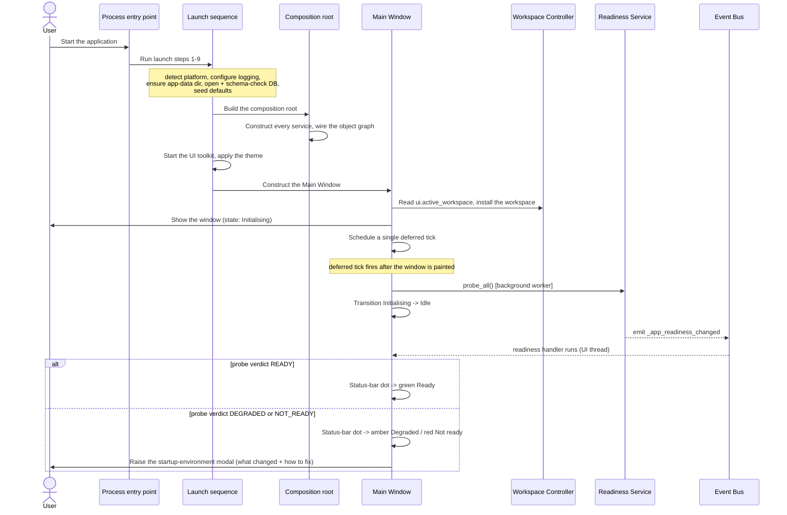
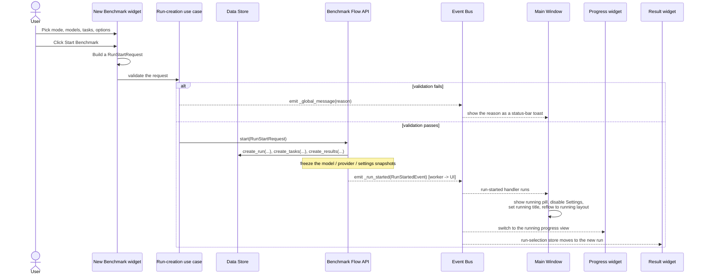
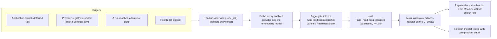
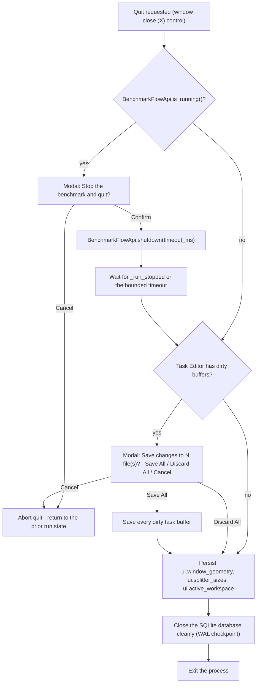
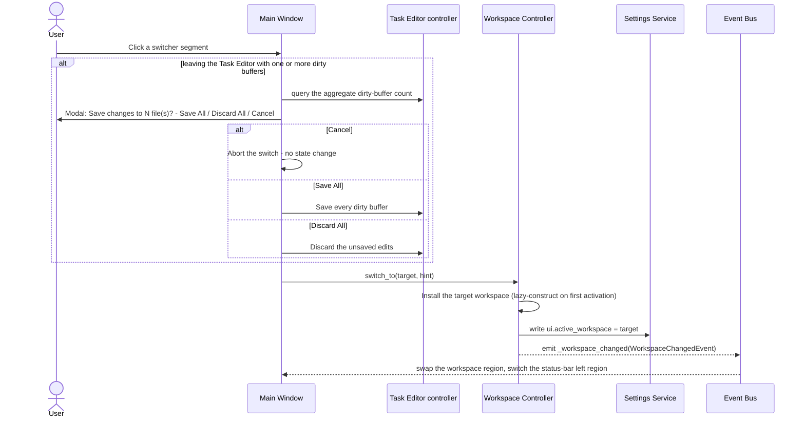
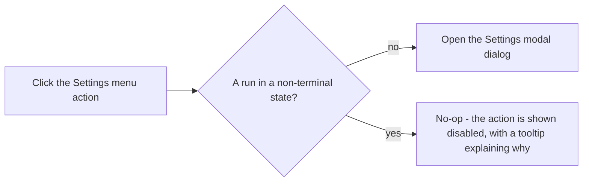

# Main Window — Flow Diagrams

**Status:** Draft
**Owner:** architect
**Audience:** coder, tester
**Last Updated:** 2026-05-22
**Cross-references:** `01_Main_Window/description.md`, `01_Main_Window/state_machine.md`, `08_Cross_Cutting/08-E_interfaces_contracts.md`, `08_Cross_Cutting/08-J_event_bus_catalog.md`, `08_Cross_Cutting/08-M_app_lifecycle.md`

This document gives the Mermaid sequence and flow diagrams for every major shell-level interaction of the Main Window: application launch, starting a benchmark, the status-bar readiness update, closing the window while a run is in progress, switching the workspace, and the blocked attempt to open Settings during a run. Each diagram names the concrete contract methods and Event Bus signals involved so the flows are directly testable. Threading callouts mark which steps run on a background worker.

---

## Table of Contents

1. Launch flow
2. Start-benchmark flow
3. Status-bar readiness update flow
4. Close-with-running-run flow
5. Workspace-switch flow
6. Settings-blocked-during-run flow

---

## 1. Launch flow

The launch sequence is the ordered set of steps from process start to the Main Window's `Idle` state. The full sequence is normative in `08-M_app_lifecycle.md` §2; the diagram below is the Main-Window-facing view.

A failure in launch steps 1 through 5 aborts launch with an explanatory modal before the Main Window is ever constructed (`08-M_app_lifecycle.md` §2). The deferred tick guarantees the readiness probe never delays the first paint; the window is interactive in the `Idle` state while the probe is still in flight.

## 2. Start-benchmark flow

The user configures a run in the left panel and clicks Start; the Main Window reacts to the resulting `_run_started` event.

The Main Window's only role in this flow is the shell reaction to `_run_started` — the running pill, the disabled Settings action, the running title, and the layout reflow. It does not build the request, validate it, or call `start(...)`; those belong to the New Benchmark widget and the run-creation use case (`08-E_interfaces_contracts.md` §11).

## 3. Status-bar readiness update flow

The status-bar health dot is repainted whenever the aggregate readiness changes.

Overlapping probes are coalesced by the Readiness Service so the dot does not flicker (`08-J_event_bus_catalog.md` §5.7; edge case EC-PERF-2). A health-dot click additionally opens the Settings dialog on the Providers tab — but only when no run is non-terminal; see §6.

## 4. Close-with-running-run flow

When both conditions hold, the running-benchmark prompt is shown first, then the unsaved-buffer prompt; a cancel at either step aborts the entire quit (`08-M_app_lifecycle.md` §7; edge cases EC-RUN-4 and EC-WS-2).

## 5. Workspace-switch flow

Switching the workspace never stops, pauses, or disturbs a benchmark run — the Benchmark Pipeline runs on a background worker independent of the active workspace. A click on the running pill is the same flow with `target = "benchmark"` and `hint = WorkspaceHint(focus_widget="progress")`, and no dirty-buffer prompt because it does not originate inside the Task Editor's leave path.

## 6. Settings-blocked-during-run flow

The same gate covers the status-bar health-dot click, which opens Settings on the Providers tab: while a run is non-terminal the click is ignored and a status-bar toast appears reading `Disabled - a benchmark is in progress.` (`08-H_app_modes.md` §10; edge case EC-SET-4). The Settings action is shown disabled in the menu bar so the user cannot reach the dialog during a run.
