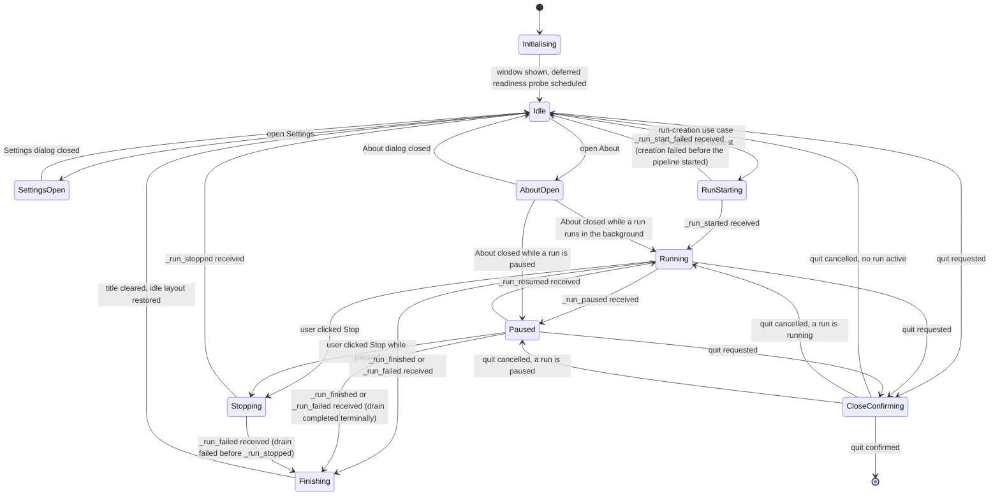

# Main Window — State Machine

**Status:** Draft
**Owner:** architect
**Audience:** coder, tester
**Last Updated:** 2026-05-22
**Cross-references:** `01_Main_Window/description.md`, `01_Main_Window/flow_diagram.md`, `08_Cross_Cutting/08-H_app_modes.md`, `08_Cross_Cutting/08-J_event_bus_catalog.md`, `08_Cross_Cutting/08-M_app_lifecycle.md`

This document defines the window-level state machine of the Main Window — the states the application shell occupies, the triggers that move it between them, and the shell affordances each state imposes. The Main Window does not poll the Benchmark Pipeline; every run-related transition is driven by a run-lifecycle event on the typed Event Bus. The states here are shell states, a refinement of the `Benchmark_Running` and `Benchmark_Terminal` nodes of the application mode diagram in `08-H_app_modes.md` §11.

---

## Table of Contents

1. State diagram
2. State semantics
3. Transition triggers
4. Blocked transitions
5. Notes
6. Edge cases

---

## 1. State diagram

## 2. State semantics

| State | Menu bar | Status bar | Benchmark layout | Window title |
|---|---|---|---|---|
| `Initialising` | Settings enabled | health dot `Checking` | idle (left panel populated from the Data Store) | `Ollama LLM Bench v{version}` |
| `Idle` | Settings enabled | health dot Ready / Degraded / Not ready | idle | `Ollama LLM Bench v{version}` |
| `SettingsOpen` | window dimmed behind the Settings modal | unchanged | unchanged | unchanged |
| `AboutOpen` | window dimmed behind the About modal | unchanged | unchanged | unchanged |
| `RunStarting` | Settings disabled | toast `Starting...` | transitioning — left panel being removed | `Ollama LLM Bench v{version}` |
| `Running` | Settings disabled; running pill shown | health dot live; result tabs live | running — left panel removed, centre expanded | `Ollama LLM Bench - Running: {effective_run_name}` |
| `Paused` | Settings disabled; running pill shown | health dot live | running (unchanged) | `Ollama LLM Bench - Paused: {effective_run_name}` |
| `Stopping` | Settings disabled; running pill shown | health dot live | running (unchanged) | running or paused title, unchanged until terminal |
| `Finishing` | Settings disabled until terminal | health dot live | running until the terminal event is applied | running title cleared on entry to `Idle` |
| `CloseConfirming` | window dimmed behind the quit-confirmation modal | unchanged | unchanged | unchanged |

The `Settings disabled` rows enforce `08-H_app_modes.md` §6 and §10: the Settings action is inert while a run is in a non-terminal state. The `running pill shown` rows enforce `08-L_ui_standardization.md` §2.2: the pill is present only while a run is non-terminal. `Initialising`, `Idle`, `SettingsOpen`, `AboutOpen`, and `CloseConfirming` with no active run are **terminal** run states; `RunStarting`, `Running`, `Paused`, `Stopping`, and `Finishing` are **non-terminal** run states.

## 3. Transition triggers

| Transition | Trigger | Source |
|---|---|---|
| `[*] -> Initialising` | Process launch reaches the show-main-window step | `08-M_app_lifecycle.md` §2 step 10 |
| `Initialising -> Idle` | The window is shown and the deferred readiness-probe tick is scheduled | window show handler |
| `Idle -> SettingsOpen` | Click the Settings menu-bar action | menu bar |
| `Idle -> AboutOpen` | Click the About menu-bar action | menu bar |
| `SettingsOpen -> Idle` | The Settings dialog closes (saved or cancelled) | Settings dialog |
| `AboutOpen -> Idle / Running / Paused` | The About dialog closes; the destination is whatever run state holds | About dialog |
| `Idle -> RunStarting` | The run-creation use case accepted a `RunStartRequest` | New Benchmark widget controller |
| `RunStarting -> Running` | `_run_started` event | Benchmark Pipeline |
| `RunStarting -> Idle` | Run creation failed before the pipeline started | run-creation use case |
| `Running -> Paused` | `_run_paused` event | Benchmark Pipeline pause handler |
| `Paused -> Running` | `_run_resumed` event | Benchmark Pipeline resume handler |
| `Running -> Stopping`, `Paused -> Stopping` | User clicked Stop in the Progress widget | Progress widget |
| `Stopping -> Idle` | `_run_stopped` event | Benchmark Pipeline stop handler |
| `Running -> Finishing` | `_run_finished` or `_run_failed` event | Benchmark Pipeline terminal handler |
| `Paused -> Finishing` | `_run_finished` or `_run_failed` event — the drained in-flight call settled terminally while paused (SPEC-026) | Benchmark Pipeline terminal handler |
| `Stopping -> Finishing` | `_run_failed` event — the draining in-flight call failed before a `_run_stopped` could be emitted | Benchmark Pipeline terminal handler |
| `Finishing -> Idle` | The Main Window has applied the terminal event — title cleared, idle layout restored | Main Window |
| `Idle / Running / Paused -> CloseConfirming` | Click the window close (X) control. Close is handled **only** from these three states; while a modal sub-dialog is open (`SettingsOpen`, `AboutOpen`) or a quit is already in flight (`CloseConfirming`), the close request is owned by that modal and a top-level close is deferred/ignored until it returns. `RunStarting`, `Stopping`, and `Finishing` are sub-perceptible transitional states that resolve to one of the three close-handling states before a close can take effect. | window close handler |
| `CloseConfirming -> [*]` | The quit sequence confirmations all resolved toward quitting | quit sequence |
| `CloseConfirming -> Idle / Running / Paused` | The user cancelled at a confirmation step | quit sequence |

Every run-related transition is driven by a run-lifecycle event from `08-J_event_bus_catalog.md` §5.1, delivered on the UI thread. The Main Window never reads the pipeline's in-memory state directly; it derives its state from the event stream and from `BenchmarkFlowApi.is_running()` at the moment a quit is requested.

## 4. Blocked transitions

| Blocked transition | Why | What the user sees |
|---|---|---|
| `Running -> SettingsOpen` | The Settings dialog cannot open while a run is non-terminal (`08-H_app_modes.md` §6) | Settings action disabled, with a tooltip reading `Disabled - a benchmark is in progress.` |
| `Paused -> SettingsOpen` | A paused run is still non-terminal — the same rule applies | Same as above |
| `Stopping -> SettingsOpen`, `Finishing -> SettingsOpen` | Both are non-terminal until the terminal event arrives | Same as above |

`Pausing` and `Resuming` are not separate states in this machine: `pause()` and `resume_paused()` are synchronous control calls (`08-E_interfaces_contracts.md` §11), and the visible state changes only when the corresponding `_run_paused` / `_run_resumed` event arrives. The transient interval between the call and the event is sub-perceptible and carries no distinct shell affordance.

## 5. Notes

- The `AboutOpen` state can be entered from `Idle`, `Running`, or `Paused` — the About dialog is never gated by run state — and returns to whichever run state held when it was opened.
- The `CloseConfirming` state composes the running-benchmark confirmation and the unsaved-buffer confirmation of `08-M_app_lifecycle.md` §7; the diagram shows it as a single node because both confirmations resolve to the same two outcomes — quit, or return to the prior run state.
- The Benchmark-workspace layout reflow (left panel removed in `Running` / `Paused` / `Stopping`, restored in `Idle`) is a deterministic function of the run state, not an independent transition; it is driven by entry into and exit from the non-terminal states.
- Switching the active workspace is orthogonal to this machine. It changes the workspace-region content but never changes the window-level run state — a run continues on its background worker regardless of the active workspace (`08-H_app_modes.md` §1).
- **Terminal-event invariant.** `_run_finished` and `_run_failed` are emitted by the pipeline's terminal handler regardless of whether the window is in `Running`, `Paused`, or `Stopping`. Because execution is strictly serial with at most one in-flight call (D-R-16, SPEC-026), the draining of a pause or a stop can itself settle terminally; the machine therefore routes these events to `Finishing` from `Running`, `Paused`, and (for `_run_failed`) `Stopping`. The names are the `_run_*` lifecycle events (`08-J_event_bus_catalog.md` §5.1), never `_benchmark_*`.
- **Close scope.** A top-level window close is handled only from `Idle`, `Running`, and `Paused`. It is intentionally not drawn from `SettingsOpen`, `AboutOpen`, or `CloseConfirming`: while a modal owns the window, the close request belongs to that modal, and a top-level close is deferred until the modal returns. The transitional states `RunStarting`, `Stopping`, and `Finishing` resolve to a close-handling state before a close can take effect, so no close edge is drawn from them. The diagram and the trigger table (§3) agree on this set.

## 6. Edge cases

| Reference | Concern | State-machine effect |
|---|---|---|
| EC-RUN-4 | Close requested while a run is non-terminal | `Running` or `Paused` → `CloseConfirming`; on confirm the pipeline is shut down before `[*]`. |
| EC-SET-4 | Settings open attempted mid-run | The blocked transition `Running/Paused -> SettingsOpen` (§4); the machine stays in its current state, and a tooltip on the disabled action explains why. |
| EC-WS-2 | Quit with dirty buffers and a running run | `CloseConfirming` runs both confirmations in sequence; a cancel at either returns to `Running`. |
| EC-PERF-2 | Overlapping readiness probes during `Initialising` or `Idle` | No state change; the Readiness Service coalesces the probes and emits a single coalesced `_app_readiness_changed`. |
| EC-PERSIST-1 | Database schema mismatch at launch | Launch aborts before `Initialising` is reached; the Main Window is never constructed. |
