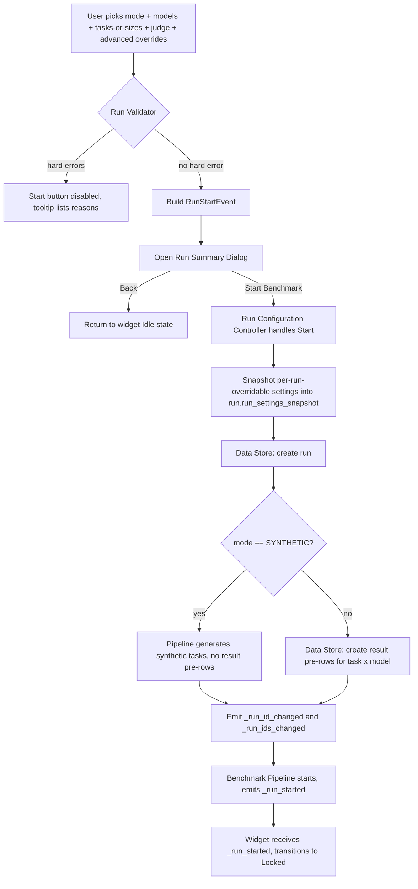
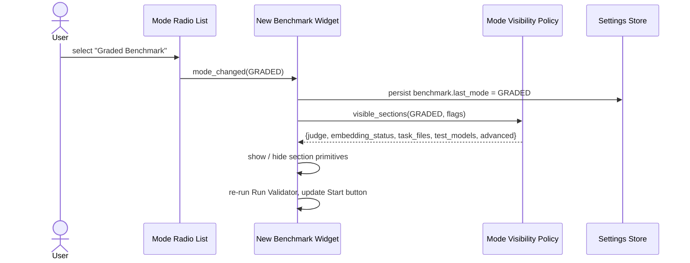
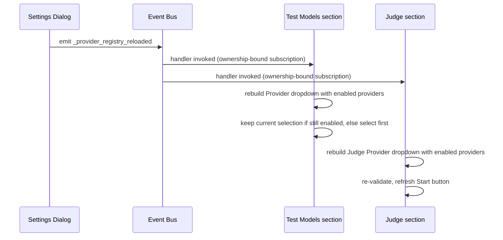
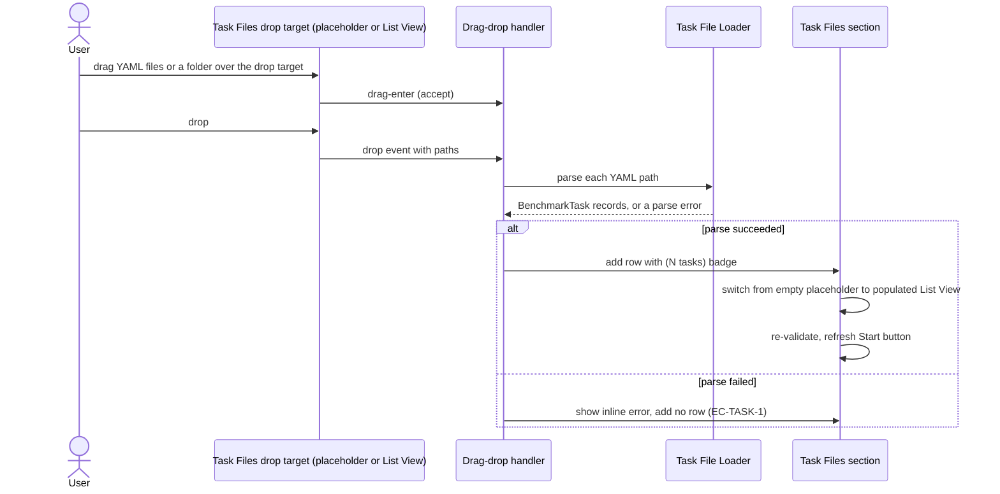
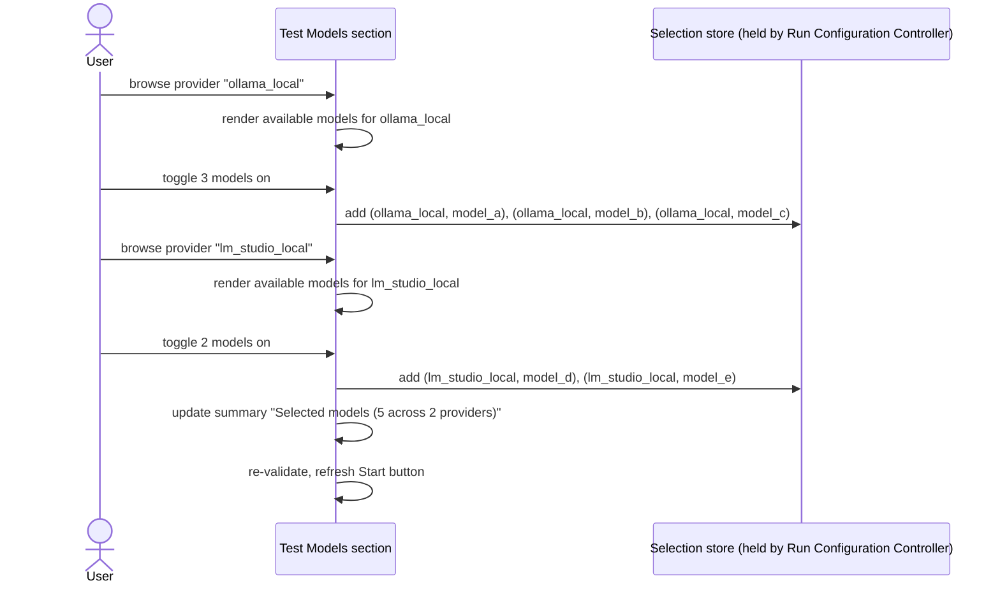
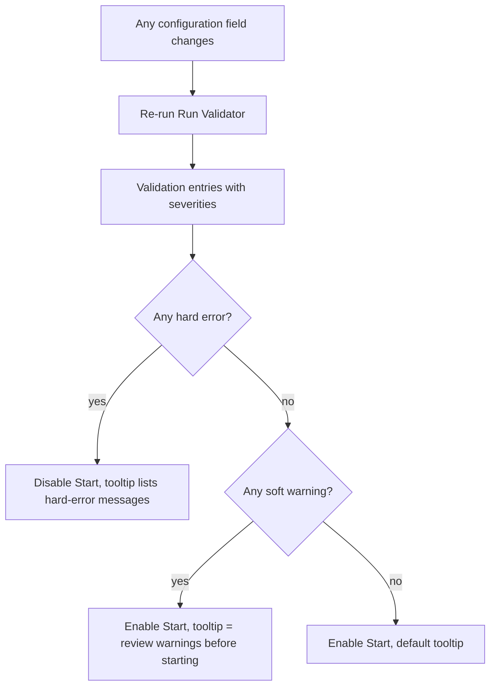
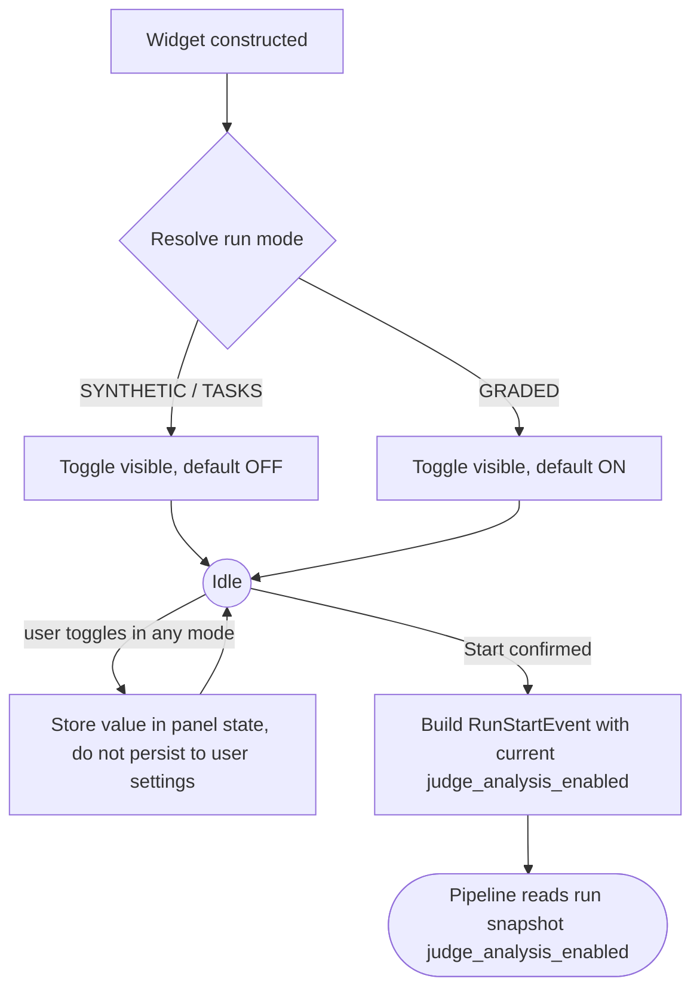

# New Benchmark Widget — Flow Diagrams

**Status:** Draft
**Owner:** coder
**Audience:** coder, tester
**Last Updated:** 2026-06-06
**Cross-references:**
`02_New_Benchmark_Widget/description.md`,
`02_New_Benchmark_Widget/state_machine.md`,
`07_Common_Dialogs/run_summary_dialog.md`,
`08_Cross_Cutting/08-E_interfaces_contracts.md`,
`08_Cross_Cutting/08-J_event_bus_catalog.md`,
`11_Services_and_Algorithms/10_MODE_VISIBILITY_POLICY.md`

This document contains the sequence and flow diagrams for the major user actions in the
New Benchmark widget: starting a run end-to-end, refreshing section visibility on a mode
change, refreshing provider lists after a Settings save, drag-dropping task files,
selecting models across multiple providers, the validation feedback loop, and the judge
analysis toggle interplay.

---

## Table of Contents

1. End-to-end Start flow
2. Mode-change visibility refresh
3. Provider-list refresh on Settings save
4. Drag-drop into Task Files
5. Multi-provider model selection
6. Validation feedback loop
7. Judge analysis toggle interplay

---

## 1. End-to-end Start flow

## 2. Mode-change visibility refresh

## 3. Provider-list refresh on Settings save

## 4. Drag-drop into Task Files

## 5. Multi-provider model selection

## 6. Validation feedback loop

## 7. Judge analysis toggle interplay

