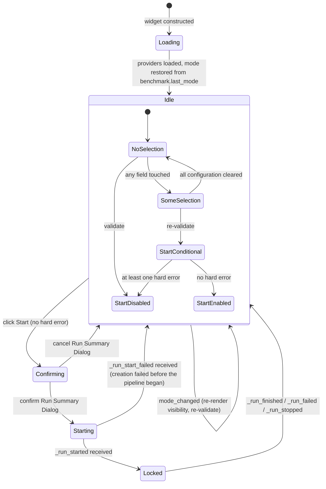
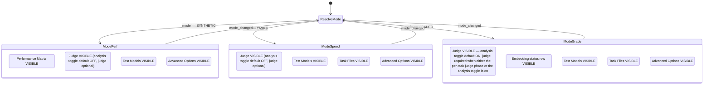
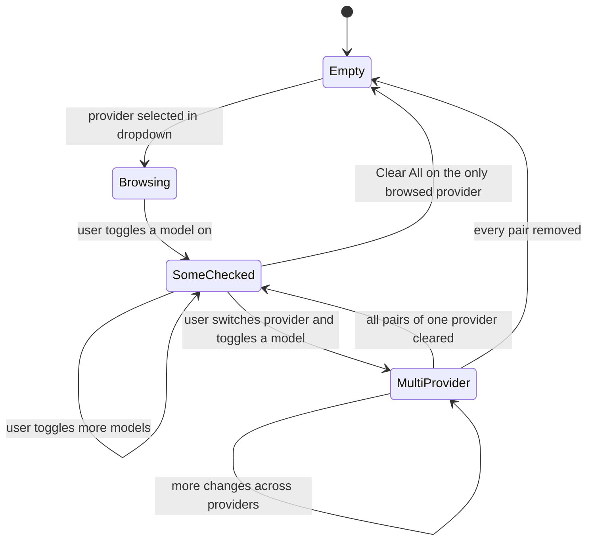
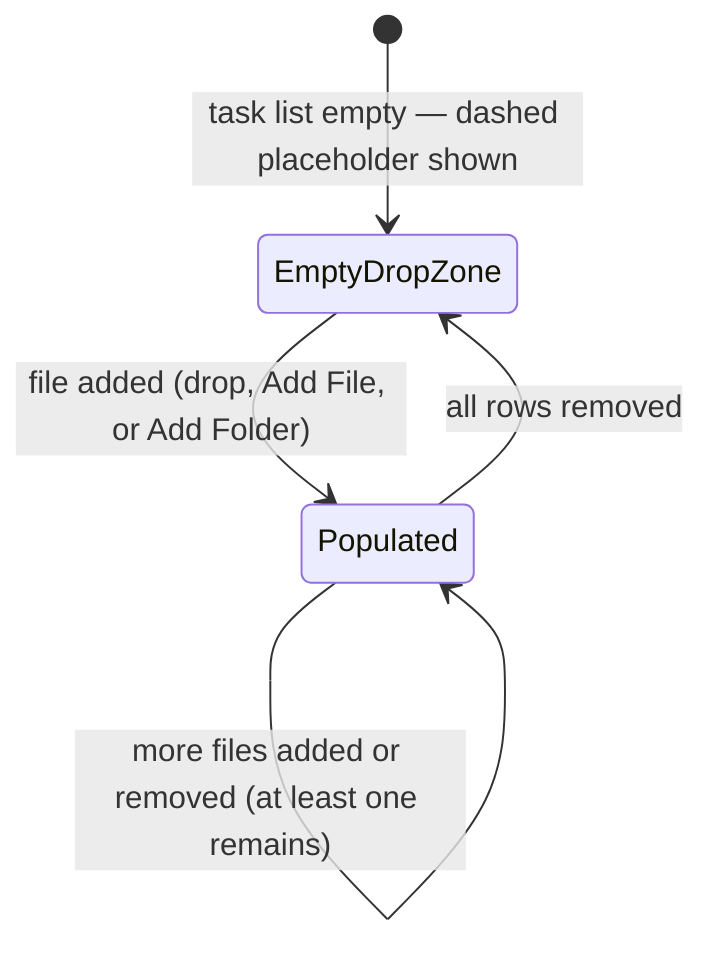
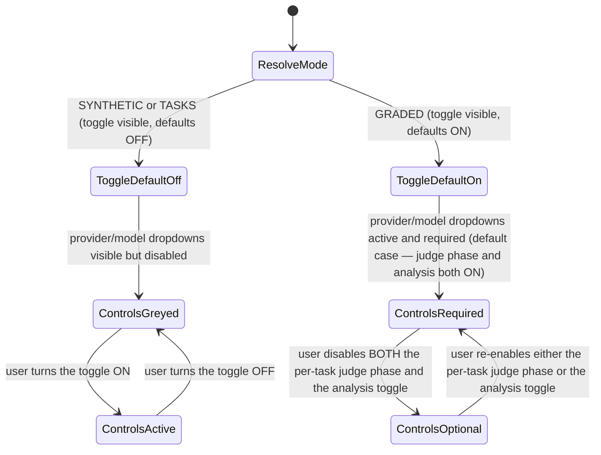

# New Benchmark Widget — State Machine

**Status:** Draft
**Owner:** coder
**Audience:** coder, tester
**Last Updated:** 2026-06-06
**Cross-references:**
`02_New_Benchmark_Widget/description.md`,
`02_New_Benchmark_Widget/flow_diagram.md`,
`08_Cross_Cutting/08-H_app_modes.md`,
`08_Cross_Cutting/08-J_event_bus_catalog.md`,
`11_Services_and_Algorithms/10_MODE_VISIBILITY_POLICY.md`

This document defines the lifecycle states of the New Benchmark widget and its
sub-machines. The widget-level machine covers loading, the interactive idle state, the
confirmation step, and the read-only lock that applies once a run starts. The sub-machines
describe section visibility per run mode, the multi-provider Test Models selection, the
Task Files empty/populated states, and the Judge section's enabled/disabled controls.

---

## Table of Contents

1. Widget-level state machine
2. Section-visibility sub-machine
3. Test Models multi-provider sub-machine
4. Task Files sub-machine
5. Judge section sub-machine
6. State affordances

---

## 1. Widget-level state machine

**Creation event sequence (MISS-15).** On `confirm Run Summary Dialog` the widget calls the adapter's `start_run(...)` command and enters **Starting**. Run creation — building and persisting the run snapshot (the `benchmark_runs` row, the model/provider/settings snapshot tables, the `PENDING` result rows) and scheduling the pipeline on the `TaskRunner` — then runs. Exactly one of two events follows and is the **only** way to leave Starting:

- `_run_started` — the pipeline has begun executing → **Starting → Locked**.
- `_run_start_failed` — creation failed *before* the pipeline began (a persistence write failed, the snapshot build raised, or the single-inference gate could not be acquired) → **Starting → Idle**. The widget re-enables its controls, restores the validated Start button, and surfaces the failure via a blocking error notification. No run is left half-created — creation is one atomic transaction (`12_Quality_and_NFRs/06_DATA_INTEGRITY.md`), so a failure rolls back and no `benchmark_runs` row persists.

This guarantees **Starting** can never be a terminal trap: `_run_start_failed` is distinct from `_run_failed` (the latter is a fatal error *during* an already-running pipeline, handled from **Locked**). Creation is also bounded by construction — the snapshot writes go through the single synchronous DB writer with no queue/back-pressure (DD-41), so the creation worker cannot wedge on write contention. As a **safety net** against any other stall (SPEC-112), entering **Starting** arms a bounded reconciliation watchdog (the same pattern as the Progress widget's draining sub-state, SPEC-098): on expiry the widget re-reads `BenchmarkFlowApi.is_running()` / the run's authoritative status and reconciles — proceeding to **Locked** if a run is active, or back to **Idle** with an error notice if not — so Starting can never hang indefinitely even if neither event is delivered.

## 2. Section-visibility sub-machine

The Mode Visibility Policy maps `(mode, flags)` to the visible section set. The widget
re-renders on every `mode_changed` event.

## 3. Test Models multi-provider sub-machine

Selected `(provider, model)` pairs persist across provider switches in the selection
store.

## 4. Task Files sub-machine

Applies only in `TASKS` and `GRADED`.

## 5. Judge section sub-machine

## 6. State affordances

| State | Interactive | Notes |
|---|---|---|
| Loading | No | Provider dropdowns and mode selector show a loading state until populated |
| Idle / NoSelection | Yes | Start disabled; tooltip lists missing inputs |
| Idle / SomeSelection / StartDisabled | Yes | Start disabled; tooltip lists hard errors |
| Idle / SomeSelection / StartEnabled | Yes | Start enabled; tooltip reflects soft warnings if any |
| Confirming | Partly | Underlying panel is non-interactive while the Run Summary Dialog is modal |
| Starting | No | Brief; awaiting `_run_started`/`_run_start_failed`, with a bounded reconciliation watchdog (SPEC-112) |
| Locked | No | Entire widget read-only for the duration of the run; see `08_Cross_Cutting/08-H_app_modes.md` |
