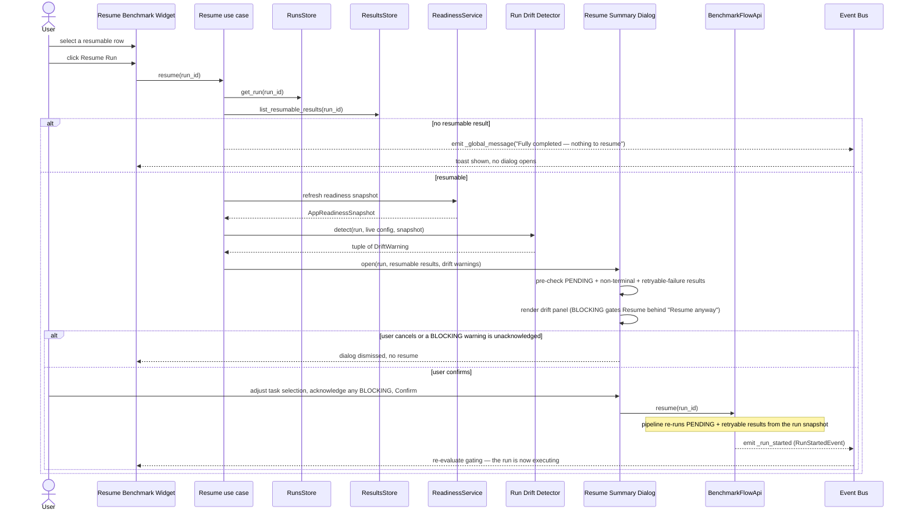
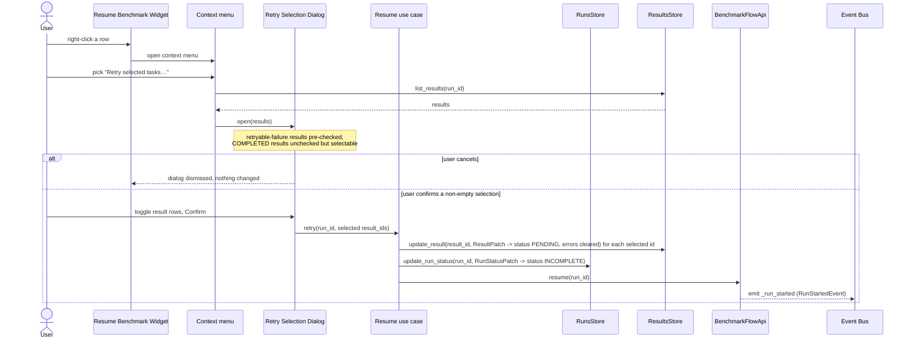
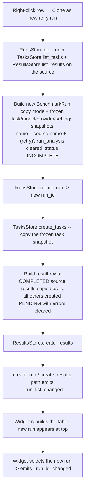
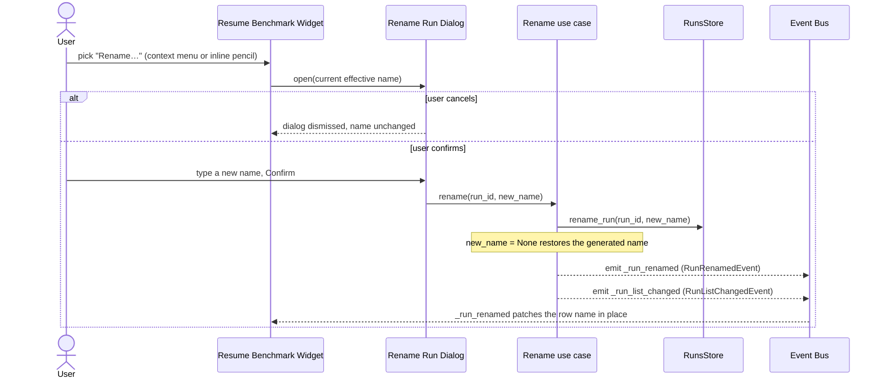
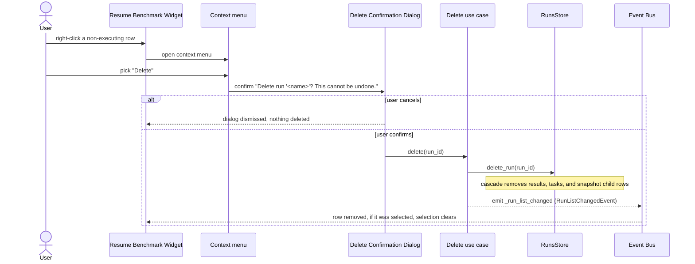
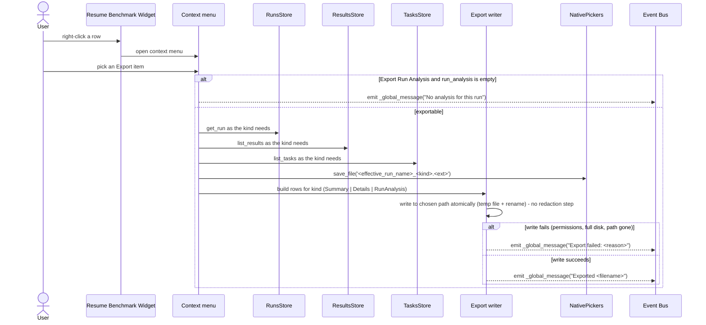
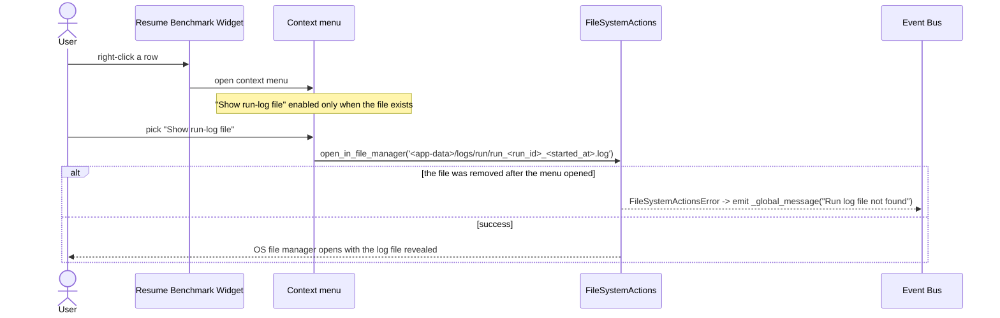
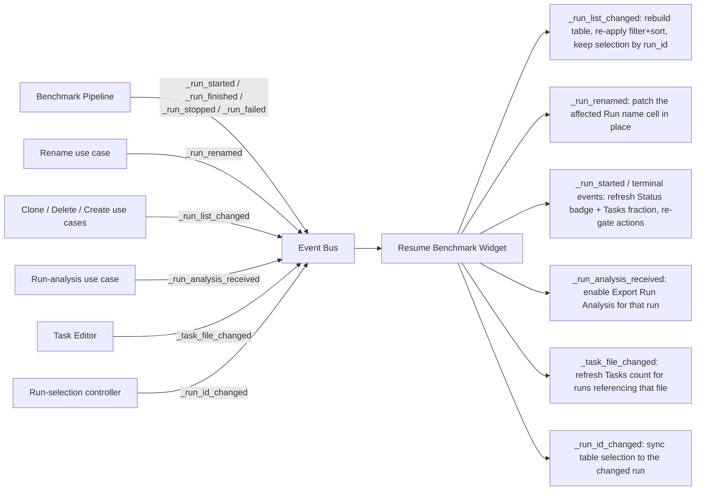

# Resume Benchmark Widget — Flow Diagrams

**Status:** Draft
**Owner:** coder
**Audience:** coder, tester
**Last Updated:** 2026-06-06
**Cross-references:** `03_Resume_Benchmark_Widget/description.md`, `03_Resume_Benchmark_Widget/state_machine.md`, `07_Common_Dialogs/`, `08_Cross_Cutting/08-E_interfaces_contracts.md`, `08_Cross_Cutting/08-J_event_bus_catalog.md`, `10_Domain_and_Data/05_EXPORT_FORMATS.md`, `11_Services_and_Algorithms/11_RUN_DRIFT_DETECTOR.md`

This document gives a Mermaid sequence or flow diagram for every major user action of the Resume Benchmark widget: resume a run, retry selected tasks, clone a run, rename a run, delete a run, export a run, show the run-log file, and the live-update path. Each diagram names the concrete Protocol methods and event-bus events involved; the definitions of those are in `08_Cross_Cutting/08-E_interfaces_contracts.md` and `08_Cross_Cutting/08-J_event_bus_catalog.md`.

---

## Table of Contents

1. Resume a run
2. Retry selected tasks
3. Clone as new retry run
4. Rename a run
5. Delete a run
6. Export a run
7. Show the run-log file
8. Live update

---

## 1. Resume a run

The user selects a resumable run and clicks Resume Run. The Resume use case runs the drift detector against a fresh readiness snapshot, the Resume Summary dialog surfaces drift and a task picker, and on confirm the pipeline resumes.

The pipeline resumes against the run's **frozen snapshot**, captured at the original run start — the providers, models, embedding selection, and settings the run was created with. The drift detector's job is to warn, before confirm, that the live environment no longer satisfies that snapshot; the resumed pipeline still uses the snapshot regardless. See `11_Services_and_Algorithms/11_RUN_DRIFT_DETECTOR.md`.

## 2. Retry selected tasks

A context-menu-only action that acts within the selected run. The user picks individual result rows in the Retry Selection dialog; those results are reset to `PENDING` and the run is resumed.

Retry is deliberately kept out of the footer to avoid confusing "select a different run in the table" with "re-run tasks within the selected run". Resetting a result writes a `ResultPatch` that sets `status = PENDING` and clears the `error_kind`, error-message, and in-flight columns; the subsequent `resume` then re-runs every `PENDING` result, exactly as a Resume does.

## 3. Clone as new retry run

A context-menu-only action that creates a new run from the selected run, preserving the original for comparison.

The clone reuses the source's snapshot verbatim, so it is reproducible against the same providers, models, and settings the original used. The clone is always resumable — it has `PENDING` results — and the user resumes it through the standard Resume flow (Section 1).

## 4. Rename a run

Context-menu item, or the inline pencil Icon Button on a row. The Resume Benchmark widget is the only surface that renames a non-executing run.

`_run_renamed` lets every single-name surface (the Result widget header, a tab label) update without rebuilding a list; `_run_list_changed` lets list surfaces rebuild their rows. The Resume Benchmark widget reacts to `_run_renamed` by patching just the affected Run name cell.

## 5. Delete a run

Context-menu item only. The Resume Benchmark widget is the only surface that deletes a run.

Delete is disabled for the run currently executing (application-modes contract). When the deleted run was the one shown in the centre and right panels, those panels return to their no-selection state once the row is removed.

## 6. Export a run

Context-menu items. Summary and Details export to CSV or Markdown; Run Analysis exports to Markdown only. The diagram covers all three; the per-format content is fixed by `10_Domain_and_Data/05_EXPORT_FORMATS.md`.

Exports write user-authored task content and user-machine model responses verbatim — the application does not apply a redaction step to exports (`10_Domain_and_Data/08_REDACTION_PATTERNS.md` §1, `11_Services_and_Algorithms/19_TABLE_SERIALIZATION.md` §6.5). API-key material is not a column of any export. The filename pattern, column order, escaping, and encoding are defined authoritatively in `10_Domain_and_Data/05_EXPORT_FORMATS.md` — this widget never redefines them.

## 7. Show the run-log file

Per-run log files live in their own `logs/run/` subfolder of the application data directory; the path layout is fixed in `10_Domain_and_Data/07_FILE_LAYOUT.md`.

## 8. Live update

The widget keeps its table consistent without polling by reacting to event-bus signals. Every subscription is owner-bound to the widget.

The widget also emits `_run_id_changed` when the user selects a row, and `_global_message` for toast-worthy outcomes (export results, refused resume, file-open failure).
