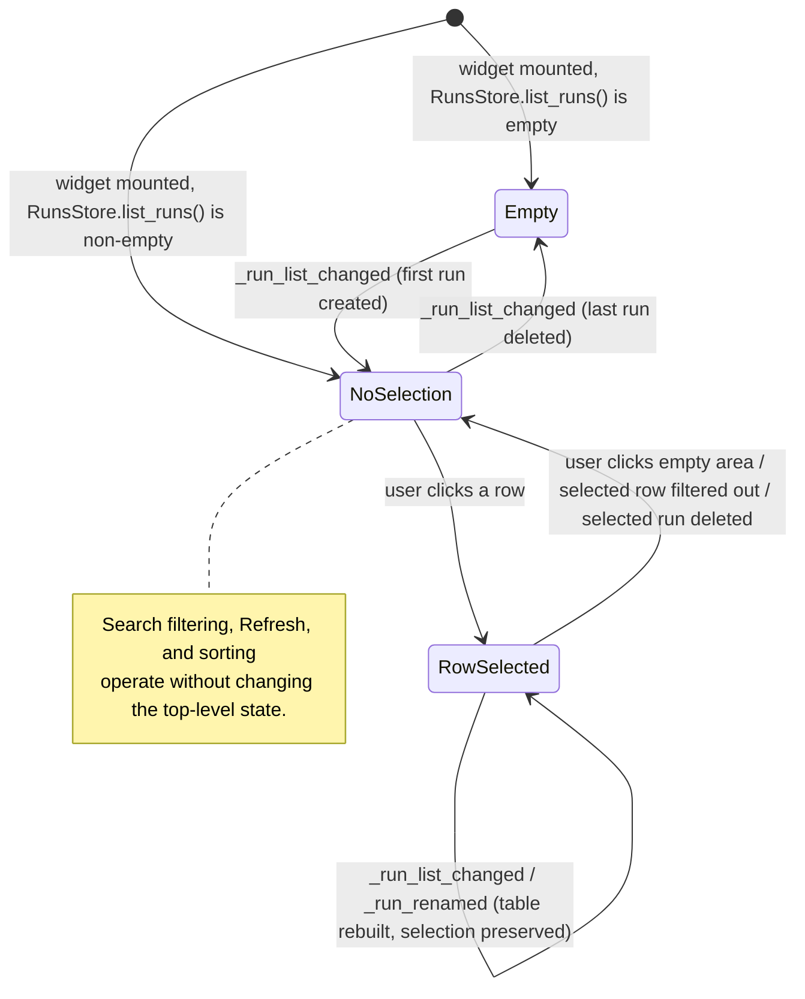

# Resume Benchmark Widget — State Machine

**Status:** Draft
**Owner:** coder
**Audience:** coder, tester
**Last Updated:** 2026-06-06
**Cross-references:** `03_Resume_Benchmark_Widget/description.md`, `03_Resume_Benchmark_Widget/flow_diagram.md`, `07_Common_Dialogs/`, `08_Cross_Cutting/08-H_app_modes.md`, `08_Cross_Cutting/08-J_event_bus_catalog.md`, `10_Domain_and_Data/02_DTOS_AND_ENUMS.md`, `11_Services_and_Algorithms/11_RUN_DRIFT_DETECTOR.md`

This document defines the state machine of the Resume Benchmark widget: the states it occupies, the triggers that move it between them, and the affordances available in each. It covers the widget's view-level states and the modal sub-states reached by Resume, Retry, Clone, Rename, and Delete. The behavioural detail of each action is in `description.md`; the step-by-step interaction sequences are in `flow_diagram.md`.

---

## Table of Contents

1. Top-level state machine
2. Row-selected sub-state machine
3. State affordance table
4. Status badge mapping
5. Notes

---

## 1. Top-level state machine

The widget is in exactly one of three top-level states: `Empty` (`RunsStore.list_runs()` returned no runs), `NoSelection` (runs are listed, none selected), and `RowSelected` (one run is selected). Live event-bus updates rebuild the table without leaving the current top-level state, except when the selected run is deleted.



## 2. Row-selected sub-state machine

While a run is selected, the widget classifies it as `Resumable` or `Terminal` and lets the user open one of the modal action dialogs. Each dialog is a sub-state; cancelling returns to the same selected-row classification, and confirming Resume or Retry hands off to the pipeline (the widget then receives `_run_started` and the run becomes the executing run).

```mermaid
stateDiagram-v2
    [*] --> Classify: a row is selected
    Classify --> Resumable: RunStatus in {INCOMPLETE, STOPPED, FAILED} AND ≥1 resumable result
    Classify --> Terminal: RunStatus == COMPLETED OR no resumable result

    Resumable: Resume Run enabled, Retry enabled
    Terminal: Resume Run disabled, Retry enabled (explicit re-run only)

    Resumable --> ResumeSummary: Resume Run (footer / menu / double-click)
    ResumeSummary --> ResumeSummary: drift detector runs, user adjusts task picker
    ResumeSummary --> Resumable: dialog cancelled
    ResumeSummary --> HandedOff: Confirm — BenchmarkFlowApi.resume(run_id) [admission gate acquired first; None = no-op]

    Resumable --> RetrySelection: Retry selected tasks…
    Terminal --> RetrySelection: Retry selected tasks…
    RetrySelection --> Resumable: dialog cancelled (run was resumable)
    RetrySelection --> Terminal: dialog cancelled (run was terminal)
    RetrySelection --> HandedOff: Confirm — BenchmarkFlowApi.resume(run_id) acquires the gate first, then resets the selected results [None = no-op, nothing reset]

    Resumable --> Cloning: Clone as new retry run
    Terminal --> Cloning: Clone as new retry run
    Cloning --> Classify: clone created, _run_list_changed, new run selected

    Resumable --> Renaming: Rename…
    Terminal --> Renaming: Rename…
    Renaming --> Resumable: dialog closed (run was resumable)
    Renaming --> Terminal: dialog closed (run was terminal)

    Resumable --> Deleting: Delete
    Terminal --> Deleting: Delete
    Deleting --> Resumable: deletion cancelled (run was resumable)
    Deleting --> Terminal: deletion cancelled (run was terminal)
    Deleting --> [*]: deletion confirmed (row removed, selection cleared)

    HandedOff --> [*]: pipeline started, Main Window enters its run-in-progress state

    note right of Terminal
        A COMPLETED run is not resumable. Retry is still
        offered so the user can explicitly re-run individual
        COMPLETED results from the Retry Selection dialog.
    end note
```

## 3. State affordance table

| State | Search | Refresh | Sort | Select row | Resume Run | Retry | Clone | Rename | Export | Show log | Delete |
|---|---|---|---|---|---|---|---|---|---|---|---|
| `Empty` | Yes | Yes | n/a | n/a | No | No | No | No | No | No | No |
| `NoSelection` | Yes | Yes | Yes | Yes | No | No | No | No | No | No | No |
| `RowSelected → Resumable` | Yes | Yes | Yes | Yes | Yes | Yes | Yes | Yes | Yes¹ | Yes² | Yes |
| `RowSelected → Terminal` | Yes | Yes | Yes | Yes | No | Yes³ | Yes | Yes | Yes¹ | Yes² | Yes |
| `RowSelected` where the selected run is **executing** | Yes | Yes | Yes | Yes | No | No | No | No | Yes¹ | Yes² | No |
| Any modal sub-state (`ResumeSummary`, `RetrySelection`, `Cloning`, `Renaming`, `Deleting`) | No | No | No | No | — modal dialog has focus — | | | | | | |

¹ Export Summary and Export Details are always available; Export Run Analysis is enabled only when `BenchmarkRun.run_analysis` is non-empty.
² Show run-log file is enabled only when the run's log file exists on disk.
³ Retry on a `Terminal` (fully `COMPLETED`) run starts with every result unchecked; the user must explicitly check the `COMPLETED` results they want re-run.

When the selected run is the run currently executing, the lifecycle-mutating actions (Resume, Retry, Clone, Rename, Delete) are disabled per the application-modes contract in `08_Cross_Cutting/08-H_app_modes.md`; read-only actions (Export, Show log, selecting another row) stay available.

## 4. Status badge mapping

The Status column renders `BenchmarkRun.status` — the four persisted `RunStatus` members — as a coloured badge.

| `RunStatus` | Badge colour | Badge label |
|---|---|---|
| `COMPLETED` | Success (green) | Done |
| `STOPPED` | Warning (amber) | Stopped |
| `FAILED` | Error (red) | Failed |
| `INCOMPLETE` | Muted (grey) | Pending |

The in-memory-only `RUNNING` and `PAUSED` pipeline states are not persisted statuses and never appear in this table; an executing run shows the badge of its persisted status (`INCOMPLETE`).

## 5. Notes

- **Retry, Clone, Rename, Delete, Export, and Show log are reachable from the right-click context menu only.** The footer carries only Refresh and Resume Run. This keeps "choose a different run in the table" cleanly separated from "operate on the chosen run".
- **The drift sub-state is inside `ResumeSummary`.** The Run Drift Detector runs as the Resume Summary dialog assembles; `BLOCKING` warnings gate the dialog's Resume button behind an explicit acknowledgement. The widget itself does not run the detector — it opens the dialog and the Resume use case drives the detector. See `11_Services_and_Algorithms/11_RUN_DRIFT_DETECTOR.md`.
- **Live updates never silently change the selection.** `_run_list_changed` and `_run_renamed` rebuild or patch the table while preserving the selected run by `run_id`; the selection clears only when the selected run is deleted or filtered out.
- **`Cloning` returns to `Classify`, not to the prior classification**, because the clone becomes the new selected run and must be re-classified (a clone is always `Resumable` — it has `PENDING` results).
