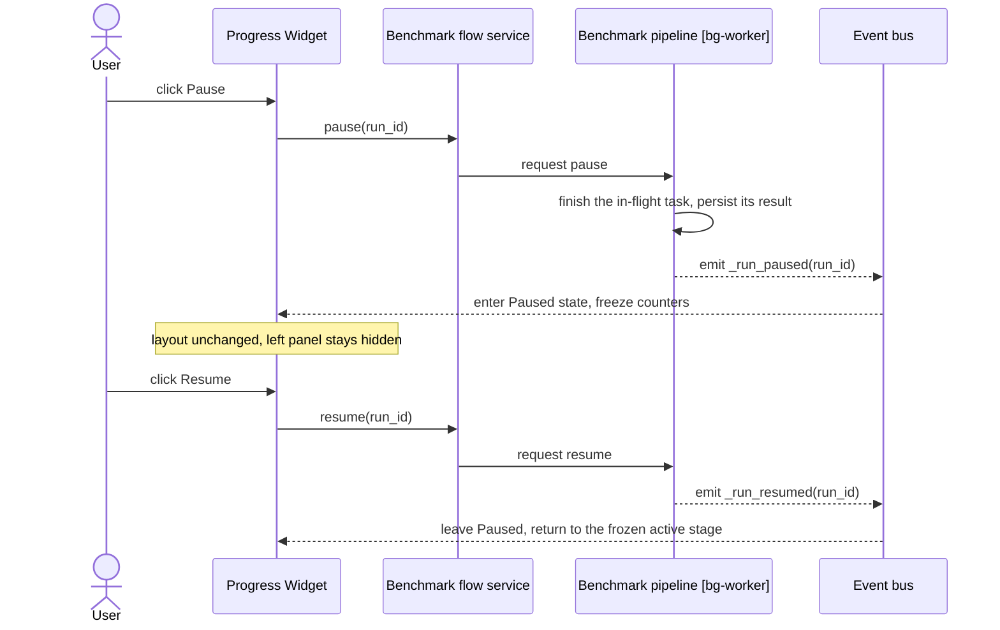
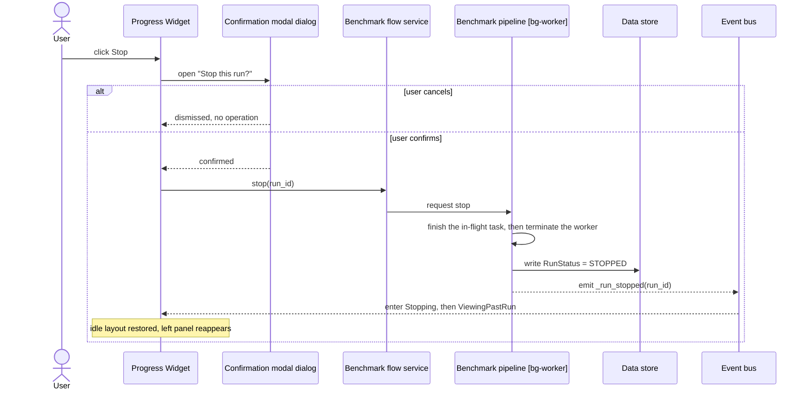
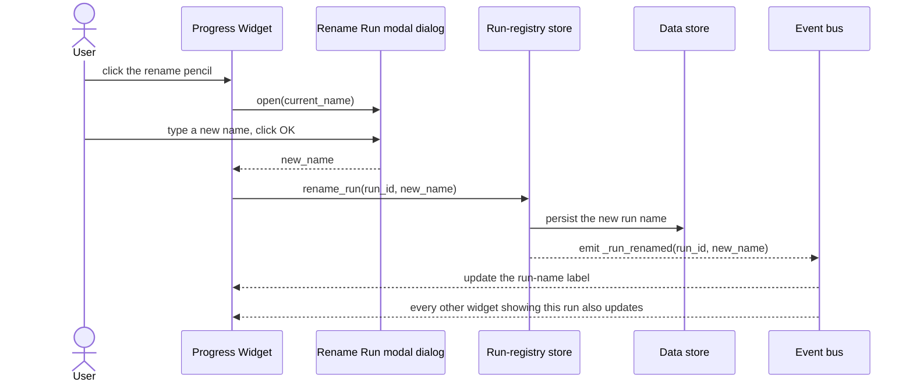
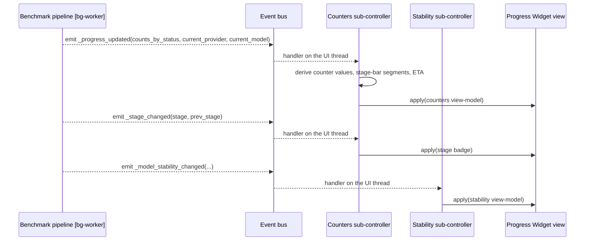
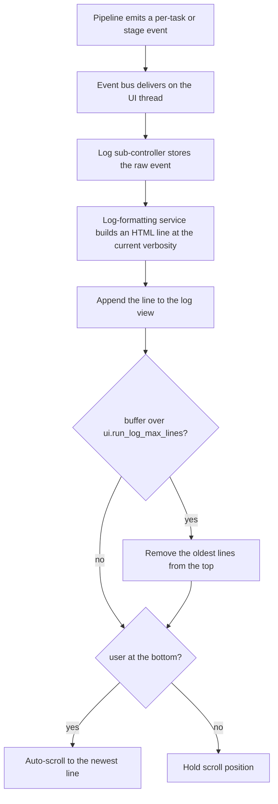
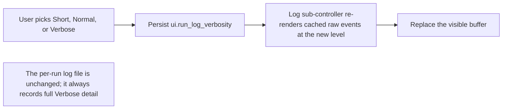
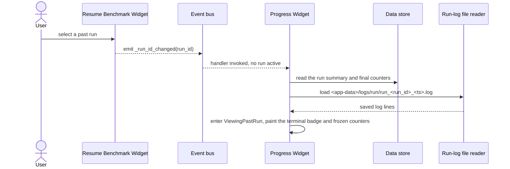
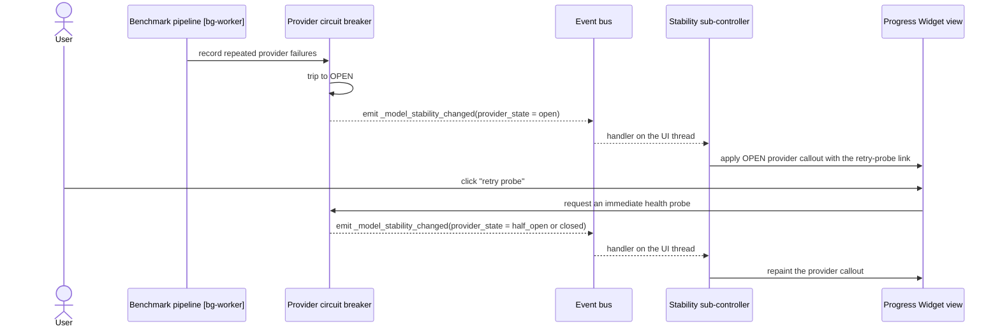

# Progress Widget — Flow Diagrams

**Status:** Draft
**Owner:** architect
**Audience:** coder, tester
**Last Updated:** 2026-06-06
**Cross-references:** `description.md`, `state_machine.md`, `implementation_structure.md`; `08_Cross_Cutting/08-B_benchmark_state_machine.md`; `08_Cross_Cutting/08-J_event_bus_catalog.md`; `11_Services_and_Algorithms/15_LOG_FORMATTING.md`

This document gives one sequence or flow diagram per major user action and per major live-update path of the Progress Widget. Each diagram names the participating actors, the trigger, and the method or event at each step. Background-worker steps are marked `[bg-worker]`; UI-thread steps run on the main thread.

---

## Table of Contents

1. Pause and Resume
2. Stop
3. Rename the running run
4. Live counter and stage update
5. Live log append
6. Verbosity change
7. Switch to a past run
8. Provider circuit-breaker trip and retry probe

---

## 1. Pause and Resume

Pause never aborts the in-flight task. The pipeline halts cleanly with no stale worker threads; only after the in-flight task is persisted does `_run_paused` fire.

## 2. Stop

## 3. Rename the running run

The pencil is reachable only while the displayed run is in a non-terminal stage; see `state_machine.md` section 5.

## 4. Live counter and stage update

Under high-rate completion the counters sub-controller coalesces consecutive `_progress_updated` events and applies the last payload; see `state_machine.md` section 6.

## 5. Live log append

The raw event is always cached so a later verbosity change can re-render without data loss; see flow 6.

## 6. Verbosity change

## 7. Switch to a past run

When a run is active the `_run_id_changed` handler is a no operation; the widget keeps showing the live run.

## 8. Provider circuit-breaker trip and retry probe

