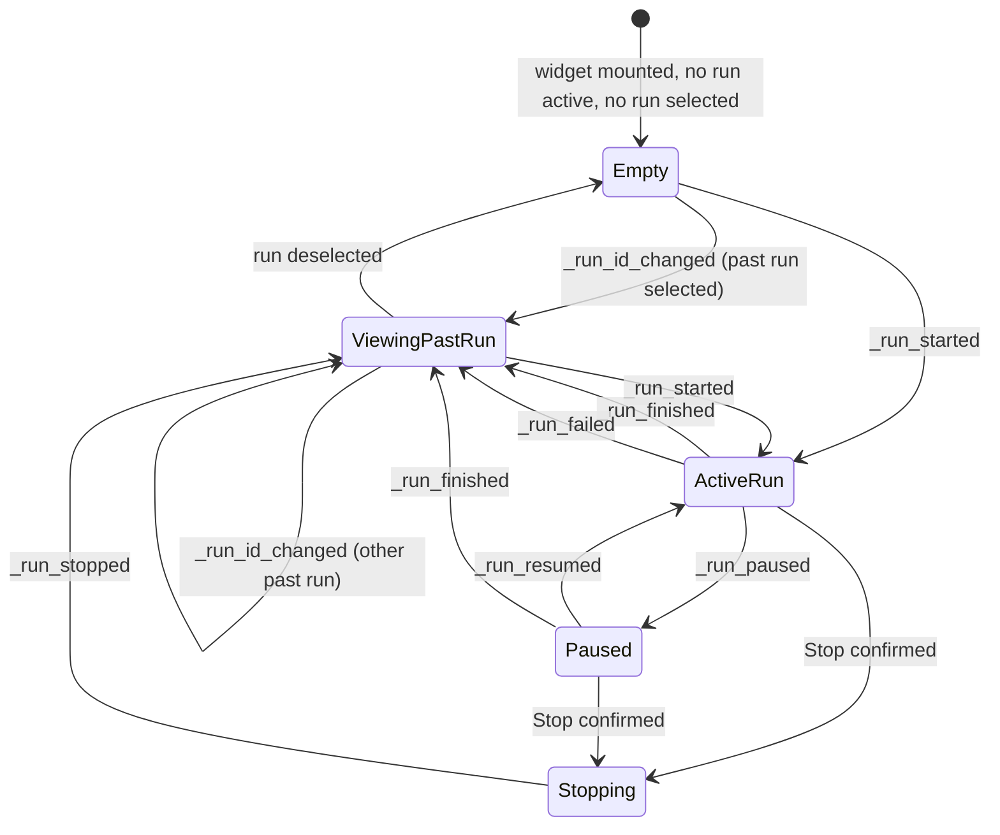
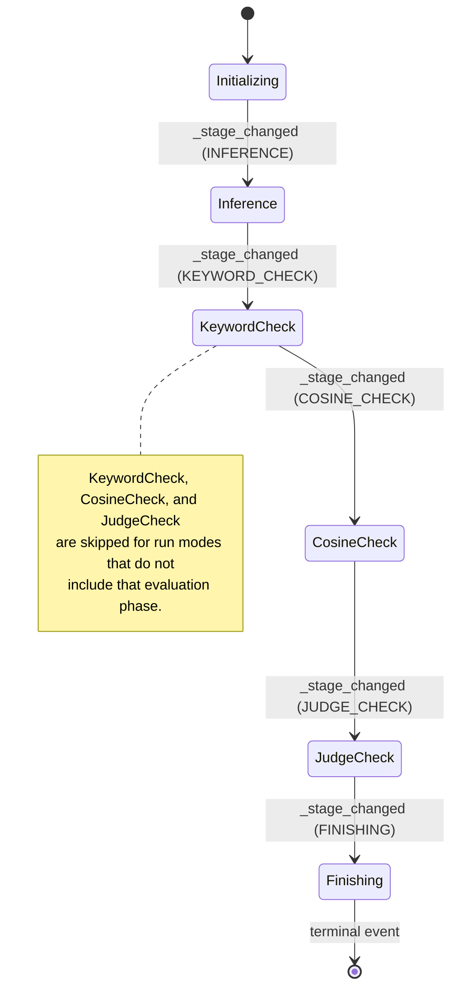
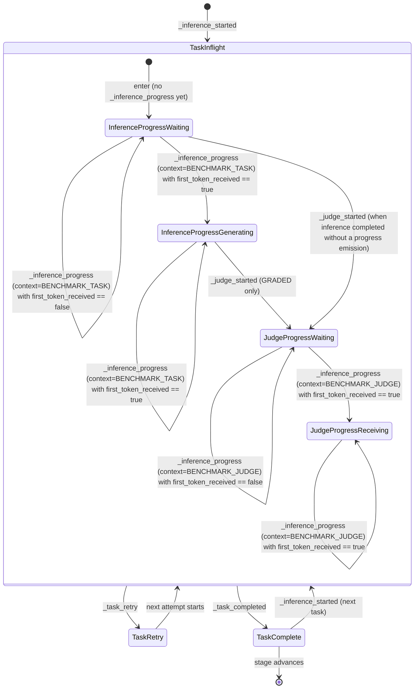
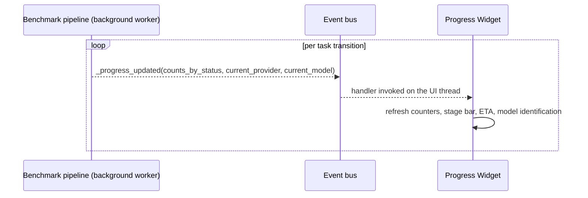

# Progress Widget — State Machine

**Status:** Draft
**Owner:** architect
**Audience:** coder, tester
**Last Updated:** 2026-06-06
**Cross-references:** `description.md`, `flow_diagram.md`; `08_Cross_Cutting/08-B_benchmark_state_machine.md`; `08_Cross_Cutting/08-J_event_bus_catalog.md`; `10_Domain_and_Data/02_DTOS_AND_ENUMS.md`

This document defines the widget-level state machine of the Progress Widget — the visual states the panel can be in, the events that drive transitions between them, and the affordances available in each state. The widget states mirror the pipeline states defined in `08_Cross_Cutting/08-B_benchmark_state_machine.md` but describe what the user sees, not how the pipeline runs.

---

## Table of Contents

1. Top-level state diagram
2. Active-run sub-states
3. Per-task sub-states
4. State affordances
5. Rename-pencil visibility rule
6. Counter update timing
7. Transition triggers

---

## 1. Top-level state diagram

`ActiveRun` is a composite state; its sub-states are defined in section 2. `RUNNING` and `PAUSED` are in-memory run states. The terminal events carry the persisted `RunStatus` value — `COMPLETED`, `FAILED`, or `STOPPED` — defined in `10_Domain_and_Data/02_DTOS_AND_ENUMS.md`. A run interrupted without a clean terminal event is persisted `INCOMPLETE` and renders in `ViewingPastRun` with its terminal badge.

## 2. Active-run sub-states

`ActiveRun` advances through the batched five-phase pipeline. Each `_stage_changed` event moves the widget to the next sub-state and repaints the stage badge.

A run mode that omits an evaluation phase skips the matching sub-state; the pipeline emits the next `_stage_changed` directly. `Initializing` and `Inference` always run.

## 3. Per-task sub-states

While the widget is in the `Inference` sub-state, the current-task section follows a small loop driven by per-task events.

`TaskRetry` shows the Retry line in `error` tone with the classified reason. `TaskComplete` clears the Retry line and increments the matching counter.

The progress sub-states inside `TaskInflight` are driven by the `_inference_progress` event (`08_Cross_Cutting/08-J_event_bus_catalog.md` §5.3) and are filtered by the event's `context` field (`InferenceContext`, `10_Domain_and_Data/02_DTOS_AND_ENUMS.md` §4.19a). The Current-task controller accepts only `BENCHMARK_TASK` and `BENCHMARK_JUDGE`; the other two contexts (`RUN_ANALYSIS`, `PROVIDER_TEST`) are routed to other widgets.

The four leaves are:

- `InferenceProgressWaiting` — no `BENCHMARK_TASK` snapshot yet, or the latest one has `first_token_received == false`.
- `InferenceProgressGenerating` — the latest `BENCHMARK_TASK` snapshot has `first_token_received == true`.
- `JudgeProgressWaiting` — entered on `_judge_started` for the active result; no `BENCHMARK_JUDGE` snapshot yet, or the latest one has `first_token_received == false`.
- `JudgeProgressReceiving` — the latest `BENCHMARK_JUDGE` snapshot for the active result has `first_token_received == true`.

`InferenceProgressWaiting` and `InferenceProgressGenerating` correspond to the two sub-states of the Current-task "Inference progress" sub-row in `description.md` §7.1.1; `JudgeProgressWaiting` and `JudgeProgressReceiving` correspond to the two sub-states of the Current-task "Judge progress" sub-row in `description.md` §7.1.2. The Inference progress sub-state is reset by each new `_inference_started` event; the Judge progress sub-state is reset by each new `_judge_started` event. Both sub-rows are hidden on `TaskComplete` and re-enter the `Waiting` leaf on the next `_inference_started` / `_judge_started` for the active result.

**Terminal `ResultStatus` values arriving on `_task_completed`.** A `TaskComplete` transition may carry any of the six terminal statuses defined in `10_Domain_and_Data/02_DTOS_AND_ENUMS.md` §4.3: `COMPLETED`, `FAILED_INFERENCE`, `FAILED_PROVIDER`, `FAILED_TIMEOUT`, `FAILED_JUDGE_TIMEOUT`, or `ERRORED`. The widget routes each to its tone and counter:

| Terminal `ResultStatus` | Counter | Tone | Event Log routing |
|---|---|---|---|
| `COMPLETED` (with `verdict`) | "passed" or "failed" depending on `verdict` | `success` (PASS) / `error` (FAIL) | `done` |
| `FAILED_INFERENCE` | "failed" | `error` | `failed` |
| `FAILED_PROVIDER` | "failed" | `error` | `failed` |
| `FAILED_TIMEOUT` | "failed" | `error` | `failed` (with the role=INFERENCE exclusion summary if the test model is excluded) |
| `FAILED_JUDGE_TIMEOUT` | "failed" | `error` | `task_judge_timeout` (`description.md` §8.3) |
| `ERRORED` | "failed" | `error` | `failed` |

In addition, the widget subscribes to `_judge_model_excluded` (`08_Cross_Cutting/08-J_event_bus_catalog.md` §5.2) and appends one `judge_excluded` Event Log entry on receipt — this event is independent of `_task_completed` and fires at most once per run.

## 4. State affordances

| State | Stage badge | Rename pencil | Pause / Stop | Counters | Current task | Log panel |
|---|---|---|---|---|---|---|
| Empty | hidden | hidden | hidden | dashes | empty placeholder | placeholder |
| Initializing | `INITIALIZING` | visible | Stop only | 0 of N | "(setting up)" | system messages |
| Inference | `INFERENCE` | visible | Pause and Stop | live | task id, retry line | per-task events |
| KeywordCheck | `KEYWORD_CHECK` | visible | Pause and Stop | live | keyword stage | keyword events |
| CosineCheck | `COSINE_CHECK` | visible | Pause and Stop | live | cosine stage | cosine events |
| JudgeCheck | `JUDGE_CHECK` | visible | Pause and Stop | live | judge stage | judge events |
| Paused | `PAUSED` | visible | Resume and Stop | frozen | "(paused — in-flight task finished and saved)" | last entry |
| Stopping | `STOPPED` | hidden | disabled | frozen | "(stopping)" | "Run stopped by user" |
| ViewingPastRun | terminal status | hidden | hidden | final values | "(complete)" | replayed from file |

In `Initializing` the Pause control is disabled because there is no in-flight task to finish; Pause becomes available once the first task starts in `Inference`.

## 5. Rename-pencil visibility rule

The rename pencil is visible only while the widget shows the run that is currently executing or paused — states `Initializing`, `Inference`, `KeywordCheck`, `CosineCheck`, `JudgeCheck`, and `Paused`. It is hidden in `Stopping`, `ViewingPastRun`, and `Empty`.

To rename a non-active run the user switches to the Resume Benchmark Widget and uses its context menu; see `03_Resume_Benchmark_Widget/description.md`. The pencil is the only rename affordance outside that widget.

## 6. Counter update timing

`_progress_updated` events are delivered on the UI thread. Under high-rate task completion the controller coalesces consecutive updates so the panel repaints at a bounded frequency; the last payload always wins.

## 7. Transition triggers

| From | To | Trigger |
|---|---|---|
| Empty | ActiveRun | `_run_started` |
| Empty | ViewingPastRun | `_run_id_changed` with a past run id |
| ViewingPastRun | ActiveRun | `_run_started` |
| ViewingPastRun | Empty | run deselected |
| ActiveRun | Paused | `_run_paused` (after the user clicks Pause) |
| Paused | ActiveRun | `_run_resumed` (after the user clicks Resume) |
| ActiveRun or Paused | Stopping | the user confirms the Stop dialog |
| Stopping | ViewingPastRun | `_run_stopped` |
| ActiveRun or Paused | ViewingPastRun | `_run_finished` |
| ActiveRun | ViewingPastRun | `_run_failed` |

Stage-internal transitions inside `ActiveRun` are driven by `_stage_changed`; per-task transitions are driven by `_inference_started`, `_inference_progress`, `_task_retry`, and `_task_completed` as shown in sections 2 and 3.
