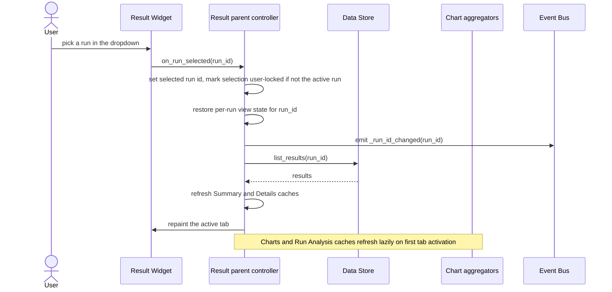
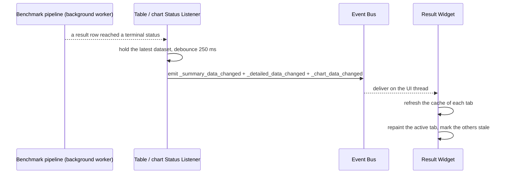
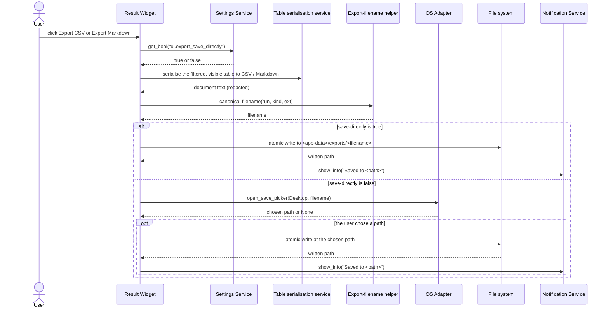
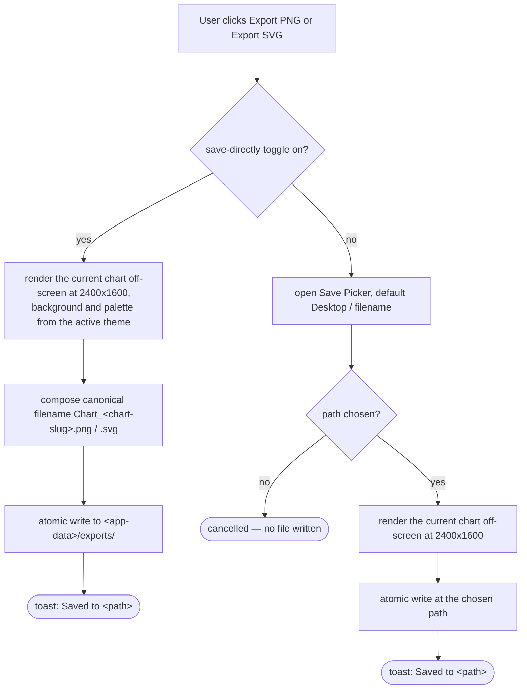
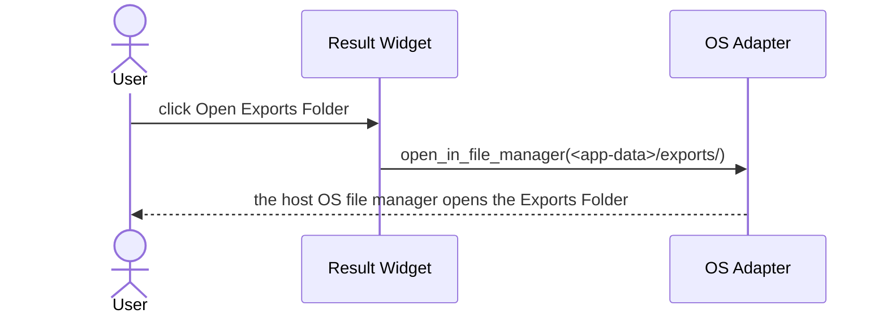
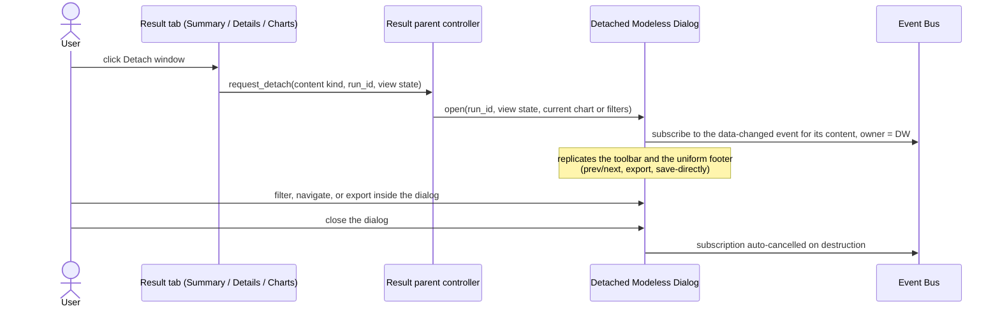
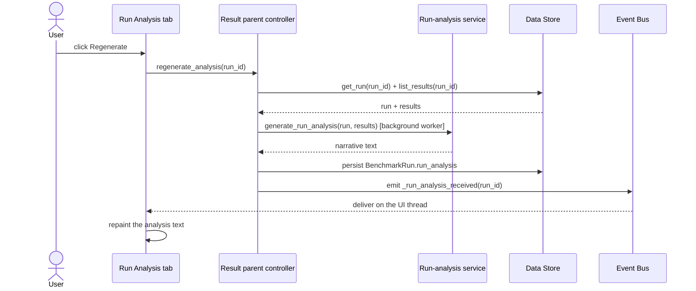
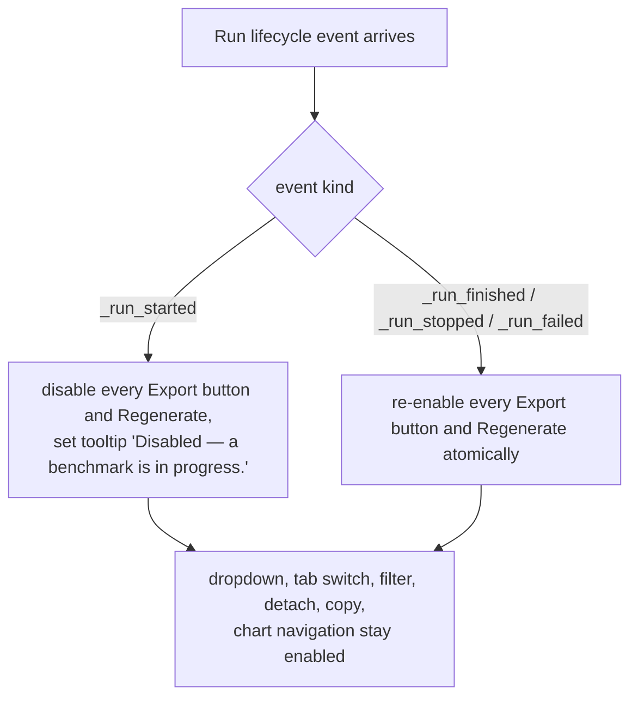

# Result Widget — Flow Diagrams

**Status:** Draft
**Owner:** architect
**Audience:** coder, tester
**Last Updated:** 2026-06-06
**Cross-references:** `description.md`, `state_machine.md`, `implementation_structure.md`; `08_Cross_Cutting/08-E_interfaces_contracts.md`; `08_Cross_Cutting/08-J_event_bus_catalog.md`; `10_Domain_and_Data/05_EXPORT_FORMATS.md`; `11_Services_and_Algorithms/13_CHART_AGGREGATORS.md`; `11_Services_and_Algorithms/19_TABLE_SERIALIZATION.md`; `11_Services_and_Algorithms/22_RUN_ANALYSIS_SERVICE.md`; `tabs/charts_tab.md`; `tabs/run_analysis_tab.md`

This document gives one sequence or flow diagram per major Result Widget action: switching the displayed run, the live update during an active run, exporting a table, exporting a chart, opening the Exports Folder, detaching a window, and regenerating the run analysis. Each flow names the services it calls; the abstract contracts are in `08_Cross_Cutting/08-E_interfaces_contracts.md`.

---

## Table of Contents

- A. Run-switch from the dropdown
- B. Live update during an active run
- C. Export a table tab (Summary or Details)
- D. Export a chart (PNG or SVG)
- E. Open the Exports Folder
- F. Detach a window
- G. Regenerate the run analysis
- H. Export gating while a run is in progress

---

## A. Run-switch from the dropdown

The user picks a different run; the parent controller refreshes the tab caches and announces the selection so the other workspace panels follow.

The Progress and Resume Benchmark widgets also subscribe to `_run_id_changed` and follow the same selection. When the change instead originates elsewhere, the same `_run_id_changed` handler updates the dropdown without re-emitting the event.

## B. Live update during an active run

While the active run is selected, the pipeline mutates result rows; the debounced data-changed events drive the tab repaints.

The 250 ms debounce window (see `08_Cross_Cutting/08-J_event_bus_catalog.md` §4) bounds the repaint rate regardless of how fast tasks resolve (EC-PERF-3). A past run selected during an active run does not receive these repaints — its tabs render frozen persisted data.

## C. Export a table tab (Summary or Details)

The footer Export button on a table tab. The save-destination toggle decides whether a picker appears.

The serialised document covers only the filtered rows and visible columns of the active table, in the fixed column order from `10_Domain_and_Data/05_EXPORT_FORMATS.md`. Every write is a temp-file-then-rename, so a failed write leaves no partial file; a failure raises an error modal through the Notification Service (EC-RES-5).

## D. Export a chart (PNG or SVG)

The Charts footer renders the current chart off-screen at a fixed resolution and writes the image. The save-destination branch is the same as flow C.

The exported image is the single chart currently shown, including its title, axes, legend, and labels. A detached chart window's Export produces the identical file (see `10_Domain_and_Data/05_EXPORT_FORMATS.md` §8 and §9).

## E. Open the Exports Folder

The `Open Exports Folder` Button reveals the Exports Folder; it is visible only while the save-destination toggle is on.

Turning the save-destination toggle off hides the Button immediately through the `_app_settings_changed` event; turning it on shows the Button on every tab footer and detached window at once.

## F. Detach a window

A tab's `Detach window` Button opens a Modeless Dialog that replicates the tab content and the uniform footer.

The detached window stays open when the user switches workspace (EC-WS-1). Export and Regenerate inside the dialog obey the same view-only-during-run rule as the main footer (flow H).

## G. Regenerate the run analysis

The Run Analysis tab's `Regenerate` Button asks the run-analysis service to produce a fresh consolidated narrative.

`Regenerate` is disabled while any run is non-terminal (flow H). The same `_run_analysis_received` event also delivers the first analysis the pipeline produces when a run finishes; the tab handles both identically.

## H. Export gating while a run is in progress

Every export and the Regenerate action are disabled while any run is non-terminal, regardless of which run is displayed.

The gate is "no run is in a non-terminal state", not "the selected run is non-terminal": selecting a finished past run while a different run is still executing keeps the exports disabled. The full composite blocked-states contract is in `08_Cross_Cutting/08-H_app_modes.md` §10.
