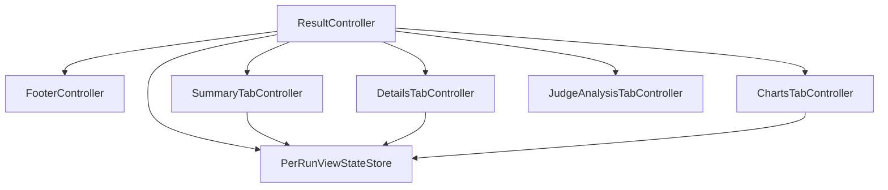

# Result Widget — Implementation Structure

**Status:** Draft
**Owner:** architect
**Audience:** architect, coder
**Last Updated:** 2026-06-06
**Cross-references:** `description.md`, `state_machine.md`, `flow_diagram.md`; `tabs/summary_tab.md`, `tabs/details_tab.md`, `tabs/charts_tab.md`, `tabs/run_analysis_tab.md`; `08_Cross_Cutting/08-E_interfaces_contracts.md`; `08_Cross_Cutting/08-G_feature_flags.md`; `08_Cross_Cutting/08-J_event_bus_catalog.md`; `10_Domain_and_Data/02_DTOS_AND_ENUMS.md`; `11_Services_and_Algorithms/13_CHART_AGGREGATORS.md`; `11_Services_and_Algorithms/19_TABLE_SERIALIZATION.md`; `11_Services_and_Algorithms/22_RUN_ANALYSIS_SERVICE.md`

This document defines the module layout, public factory, controller decomposition, view-model structs, dependency protocols, composition wiring, and test boundary for the Result Widget. The widget hosts four tabs that share one parent controller; the parent owns run selection and the per-run view-state store, and each tab is its own sub-module with a dedicated sub-controller.

---

## Table of Contents

1. Module path and file layout
2. Public API
3. Controller decomposition
4. Parent controller
5. Tab sub-controllers
6. View-model structs
7. View
8. Factory wiring example
9. Dependency protocols
10. Test boundary

---

## 1. Module path and file layout

```
src/ollama_llm_bench/ui/results/
    __init__.py
    api.py                          # make_result_widget(...) -> QWidget
    models.py                       # frozen view-model structs shared by the tabs
    _internal/
        view.py                     # ResultView QWidget subclass — header, tab strip, footer
        controller.py               # ResultController — run selection, view-state store, footer
        view_state_store.py          # PerRunViewStateStore — per-run filter/column/chart state
        footer.py                   # FooterController — export-button cluster + save-destination
        summary_tab/
            view.py                  # SummaryTabView
            controller.py            # SummaryTabController
            select.py                # pure (results) -> SummaryViewModel aggregation
        details_tab/
            view.py                  # DetailsTabView + the Task Detail Panel
            controller.py            # DetailsTabController
            select.py                # pure (results) -> DetailsViewModel row mapping
        charts_tab/
            view.py                  # ChartsTabView — chart canvas, toolbars
            controller.py            # ChartsTabController
            detached_window.py       # DetachedChartWindow Modeless Dialog
        run_analysis_tab/
            view.py                  # JudgeAnalysisTabView — Markdown body, toolbar
            controller.py            # JudgeAnalysisTabController
        detached.py                  # DetachedTableWindow for Summary and Details
    tests/
        conftest.py
        test_view.py
        test_controller.py
        test_view_state_store.py
        test_footer.py
        test_summary_tab.py
        test_details_tab.py
        test_charts_tab.py
        test_run_analysis_tab.py
```

The public surface stays small: `api.py` and `models.py` only. Each tab is a self-contained package under `_internal/`; its `view.py` and `controller.py` stay well below the size at which a module must be split, and its pure aggregation logic lives in a colocated `select.py`.

## 2. Public API

`api.py` exports one factory:

```python
def make_result_widget(
    *,
    bus: EventBus,
    gateway: ResultGateway,
    native_pickers: NativePickers,
    clipboard: Clipboard,
    file_system_actions: FileSystemActions,
    notifications: NotificationService,
    export_filenames: ExportFilenameHelper,
) -> QWidget:
    """Build the Result Widget. The caller mounts the returned QWidget."""
```

The factory builds `ResultView`, the `ResultController`, the `PerRunViewStateStore`, the `FooterController`, and the four tab sub-modules; it wires them and returns the view. Callers never instantiate the concrete classes; the factory is the swap point.

## 3. Controller decomposition

The Result Widget has one parent controller and four tab sub-controllers. The parent owns the concerns shared by every tab — run selection, the per-run view-state store, and the footer — and each tab sub-controller owns exactly the subscriptions and derived state of its own tab.



Each tab sub-controller reads and writes its own slice of the shared `PerRunViewStateStore`; no tab reads another tab's slice. The Run Analysis tab carries no persisted view state, so it does not touch the store.

## 4. Parent controller

`ResultController` is a thin parent. It:

- Holds the selected run id and the **user-locked-selection** flag (see `state_machine.md` section 4).
- Owns the `PerRunViewStateStore` and the `FooterController`.
- Constructs the four tab sub-controllers and owns the `Disposable` returned by every subscription.
- Subscribes to `_run_list_changed`, `_run_id_changed`, `_run_renamed`, `_run_started`, `_run_finished`, `_run_stopped`, `_run_failed`, and `_app_settings_changed`; routes each to the run-selector, the footer, or the tabs.
- Applies the top-level state transitions from `state_machine.md` — `Loading`, `NoRun`, `RunSelected`, and the orthogonal `live` flag.
- Emits `_run_id_changed` when the user changes the run-selector dropdown.

`PerRunViewStateStore` keys every entry by `run_id`. On a run-selection change it loads that run's stored slices and hands each tab its slice; on first selection of a run it supplies the built-in defaults for the run's mode (see `08_Cross_Cutting/08-G_feature_flags.md` section 10). It writes a slice back when a tab reports a filter, column, sort, or chart-view change.

`FooterController` owns the per-tab export-button cluster, the shared save-destination toggle bound to `ui.export_save_directly`, and the `Open Exports Folder` button. It re-reads the setting through `ResultGateway.get_setting` on `_app_settings_changed` and shows or hides the folder button on every footer at once. It enables or disables the export cluster from the parent's `live` flag.

## 5. Tab sub-controllers

### 5.1 SummaryTabController

| Property | Value |
|---|---|
| Concern | the per-`(provider_id, model_name)` aggregate table |
| Subscribes to | `_summary_data_changed` |
| Derives | one aggregate row per model group, the mode-offered column set, the filtered re-aggregation |
| Pushes | `SummaryViewModel` |
| View-state slice | filter chips, column visibility, column order, sort |

### 5.2 DetailsTabController

| Property | Value |
|---|---|
| Concern | the one-row-per-`BenchmarkResult` table and the Task Detail Panel |
| Subscribes to | `_detailed_data_changed` |
| Derives | the row set, the per-column filter, the selected row's detail payload |
| Pushes | `DetailsViewModel` |
| View-state slice | filter chips, per-column filters, column visibility, column order, sort |

### 5.3 ChartsTabController

| Property | Value |
|---|---|
| Concern | the single visible chart, prev/next navigation, per-chart filters, detached chart windows |
| Subscribes to | `_chart_data_changed` |
| Derives | the mode-offered chart list, the active chart's prepared `ChartData`/`HeatmapData` from the chart service, the empty-state structure |
| Pushes | `ChartsViewModel` |
| View-state slice | per-chart-kind filters, hidden legend series, last-opened chart kind, outlier-exclusion toggle |

### 5.4 JudgeAnalysisTabController

| Property | Value |
|---|---|
| Concern | the consolidated `run_analysis` narrative, generation metadata, regeneration |
| Subscribes to | `_run_analysis_received` |
| Derives | the rendered Markdown body, the generation-timing line, the empty/failed states |
| Pushes | `JudgeAnalysisViewModel` |
| View-state slice | none — the tab holds no persisted view state |

A tab sub-controller fetches lazily: it requests its data the first time it is shown for a run (see `state_machine.md` section 3). All chart aggregation runs on the background executor through the chart service; all run-analysis generation runs on a `QThreadPool` worker through the run-analysis service.

## 6. View-model structs

All view-models are `msgspec.Struct(frozen=True, kw_only=True, gc=False)`. A controller pushes a slice through a dedicated `apply_*` method; the view never reads stores.

```python
class FooterViewModel(msgspec.Struct, frozen=True, kw_only=True, gc=False):
    export_buttons: tuple[str, ...]      # ("Export CSV", "Export Markdown") etc.
    exports_enabled: bool
    save_directly: bool
    show_open_folder: bool
    disabled_tooltip: str | None         # set while a run is non-terminal

class SummaryViewModel(msgspec.Struct, frozen=True, kw_only=True, gc=False):
    columns: tuple[str, ...]             # mode-offered, visible, in order
    rows: tuple[tuple[str, ...], ...]    # one tuple per (provider, model) group
    empty_state_message: str | None

class DetailRowViewModel(msgspec.Struct, frozen=True, kw_only=True, gc=False):
    result_id: ResultId
    cells: tuple[str, ...]

class DetailsViewModel(msgspec.Struct, frozen=True, kw_only=True, gc=False):
    columns: tuple[str, ...]
    rows: tuple[DetailRowViewModel, ...]
    selected_result_id: ResultId | None
    detail_panel: ResultDetailViewModel | None
    empty_state_message: str | None

class ChartsViewModel(msgspec.Struct, frozen=True, kw_only=True, gc=False):
    chart_kind: ChartKind
    chart_index: int
    chart_count: int                     # the mode-offered count
    prev_enabled: bool
    next_enabled: bool
    empty_state_message: str | None

class JudgeAnalysisViewModel(msgspec.Struct, frozen=True, kw_only=True, gc=False):
    body_markdown: str | None
    generated_at_label: str | None
    generation_seconds_label: str | None
    analysis_model_label: str | None
    state: str                           # "empty" | "generating" | "ready" | "failed"
    failure_message: str | None
    regenerate_enabled: bool
    copy_enabled: bool

class ResultViewModel(msgspec.Struct, frozen=True, kw_only=True, gc=False):
    widget_state: str                    # one of state_machine.md states
    run_options: tuple[tuple[RunId, str], ...]   # (run_id, effective name)
    selected_run_id: RunId | None
    active_tab: str                      # "summary" | "details" | "charts" | "run_analysis"
    footer: FooterViewModel
```

`RunId`, `ResultId`, `ChartKind`, and the result records are the canonical types defined in `10_Domain_and_Data/02_DTOS_AND_ENUMS.md`; this widget does not redefine them. `ResultDetailViewModel` is the Task Detail Panel payload defined in `tabs/details_tab.md`.

## 7. View

`ResultView` is a `QWidget` subclass built programmatically with Qt Widgets. It exposes:

- `apply(vm: ResultViewModel) -> None` — the top-level render entry point for the header, tab strip, and footer; idempotent.
- `apply_summary(...)`, `apply_details(...)`, `apply_charts(...)`, `apply_run_analysis(...)` — slice methods so each tab repaints only its own body without a full re-render.

Each tab has its own `*TabView` `QWidget`. The views hold no business logic, import no stores, and emit widget-local signals only — dropdown change, tab click, filter change, column toggle, sort, chart navigation, detach, export click, regenerate, copy — which the controllers connect to service calls. A detached window (`DetachedTableWindow`, `DetachedChartWindow`) replicates one tab's body and the uniform footer in a Modeless Dialog and subscribes to its own data-changed event, owner-bound to itself.

## 8. Factory wiring example

```python
# src/ollama_llm_bench/compose.py (excerpt)
result = make_result_widget(
    bus=event_bus,
    gateway=result_gateway,
    native_pickers=native_pickers,
    clipboard=clipboard,
    file_system_actions=file_system_actions,
    notifications=notification_service,
    export_filenames=export_filename_helper,
)
benchmark_workspace.set_right_panel(result)
```

## 9. Dependency protocols

The widget consumes these interfaces; full method contracts live in `08_Cross_Cutting/08-E_interfaces_contracts.md`:

| Protocol | Used for |
|---|---|
| `EventBus` | owner-bound subscription to every live-update and run-lifecycle signal |
| `ResultGateway` | The adapter gateway (08-E §7b.5) exposing the widget's run/result/tab-data query+command surface: `list_runs`/`get_run` for the dropdown, `persist_run_analysis` (run-header patch), `list_results` for the tab caches, `list_tasks` for per-task metadata, `get_setting`/`set_setting` for `ui.last_result_tab` / `ui.export_save_directly` / `ui.score_display_format`, `regenerate_run_analysis`, `chart_data(...)`, and `serialize_table(...)`; wraps `RunsStore`, `ResultsStore`, `TasksStore`, `SettingsStore`, `RunAnalysisService`, `ChartService`, and `TableSerializationService` (D-R-06). |
| `NativePickers` | `save_file` for the indirect-save export flow |
| `Clipboard` | `copy_text` for the "copy as Markdown" action and the Details panel's per-field copy affordances |
| `FileSystemActions` | `open_in_file_manager` for `Open Exports Folder` |
| `NotificationService` | export-success toasts and export-failure modals |
| `ExportFilenameHelper` | compose the canonical export filename per `10_Domain_and_Data/05_EXPORT_FORMATS.md` |

**Adapter boundary (D-R-06).** The parent controller and the four tab sub-controllers depend only on `ResultGateway` for backend data and commands (plus the Event Bus and the retained UI helpers `NativePickers`, `Clipboard`, `FileSystemActions`, `NotificationService`, `ExportFilenameHelper`, and the widget-local `PerRunViewStateStore`), never on a backend Protocol — no `RunsStore`, `ResultsStore`, `TasksStore`, `SettingsStore`, `RunAnalysisService`, `ChartService`, or `TableSerializationService` reaches the controllers (08-A §5/§6); the adapter holds those behind the gateway. The `PerRunViewStateStore` persists its slices through the gateway's `get_setting`/`set_setting`.

The parent controller subscribes to eight event-bus signals and each tab to one; the parent's count is at the soft store-fanout limit, which is why the footer and the view-state store are extracted as separate collaborators rather than folded into the parent.

## 10. Test boundary

| Target | Location | Tested with |
|---|---|---|
| `select.py` aggregation functions (Summary, Details) | colocated `tests/` | plain pytest, no Qt |
| `PerRunViewStateStore` | colocated `tests/test_view_state_store.py` | fake `ResultGateway` (its `get_setting`/`set_setting` stubbed); new-run-defaults vs reopened-run-restore |
| `FooterController` | colocated `tests/test_footer.py` | fake `ResultGateway` (its `get_setting`/`set_setting`), fake `NativePickers`, fake `FileSystemActions`, fake `NotificationService` |
| Each tab sub-controller | colocated `tests/test_*_tab.py` | fake `EventBus`, a fake `ResultGateway`, and the retained UI-helper fakes from each module's `testing.py` |
| `ResultView.apply` and slice methods | colocated `tests/test_view.py` | pytest-qt `qtbot`, asserting rendered text per view-model |
| Full widget assembly | top-level integration tests | qtbot driving a fake pipeline through a real event bus, asserting the state transitions from `state_machine.md` |

Per-area test scenarios:

- **ResultController** — `Loading` resolves to `NoRun` or `RunSelected`; the dropdown auto-jumps only on a run's first appearance and never overrides a user-locked selection; `_run_id_changed` from another widget updates the dropdown without re-emitting; a terminal run-lifecycle event re-enables every export and the Regenerate action atomically.
- **PerRunViewStateStore** — a first-opened run uses the mode default slice; a reopened run restores its exact stored slice; no slice crosses between runs (per-run view-state restoration; this is a Result-widget view-state rule, not the unrelated CSV-quoting EC-EXP-2 — D-R-08 fixed the prior dangling legacy export-tab citation here).
- **FooterController** — the export cluster matches the active tab's content kind; the `Open Exports Folder` button shows only while `ui.export_save_directly` is true; every export is disabled while the parent's `live` flag is set and carries the "Disabled — a benchmark is in progress." tooltip.
- **Tab sub-controllers** — each tab fetches lazily on first activation; each re-renders on its own debounced data-changed event; the Charts tab forks a detached window's filter state at open time; the Run Analysis tab handles the `empty`, `generating`, `ready`, and `failed` states (RA-06, RA-10 of the run-analysis service).
