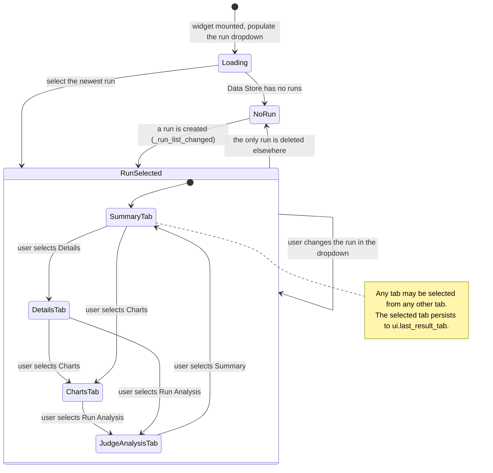
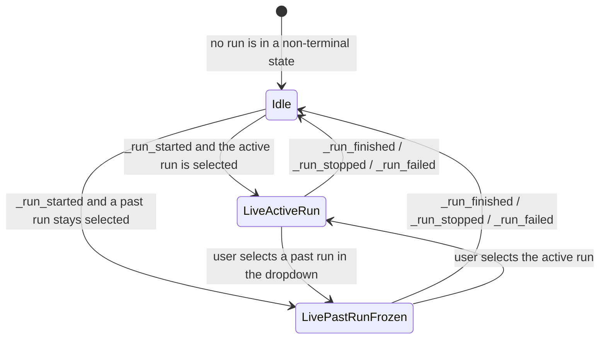
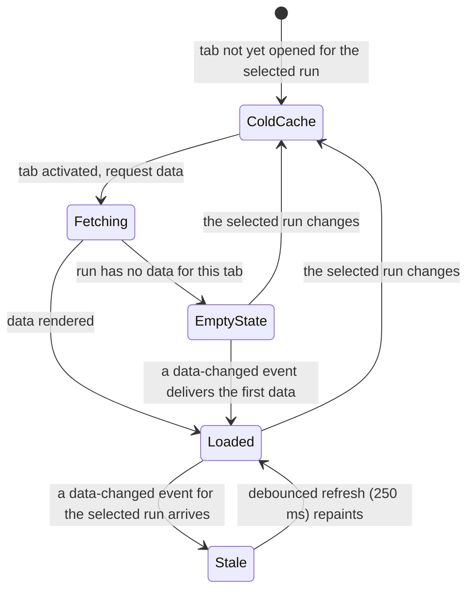
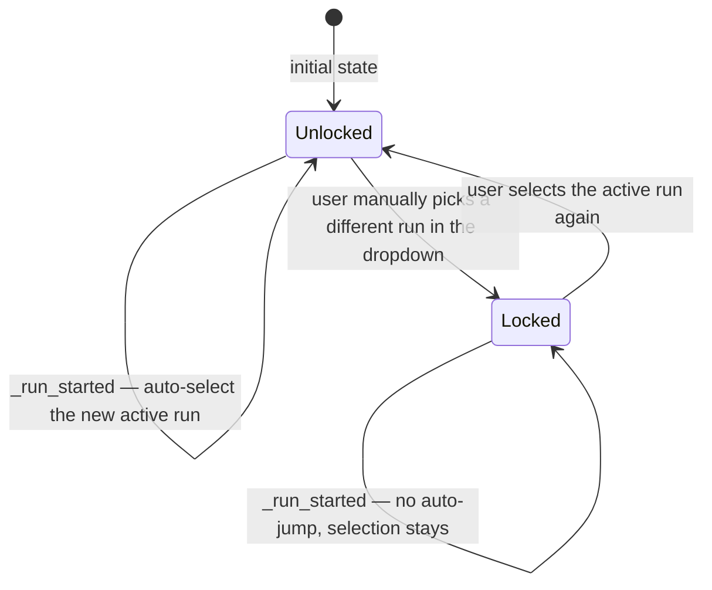
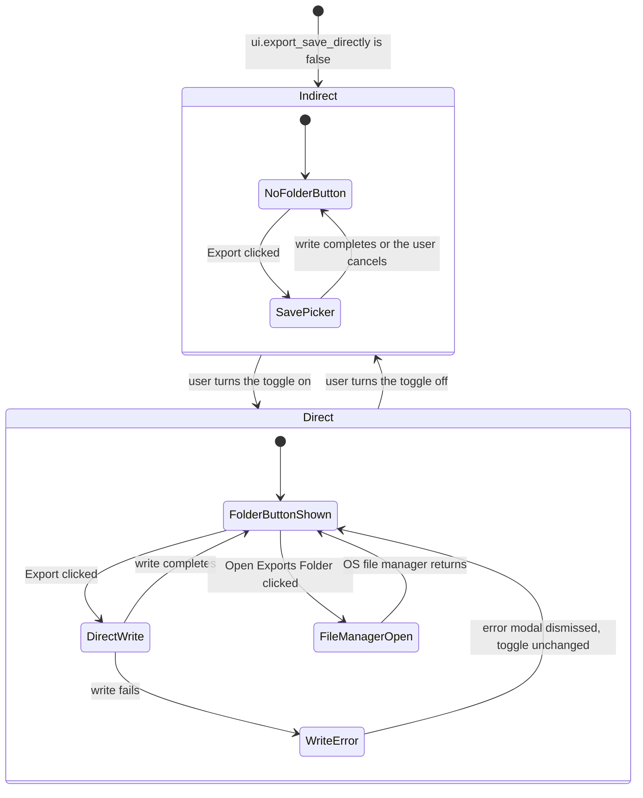
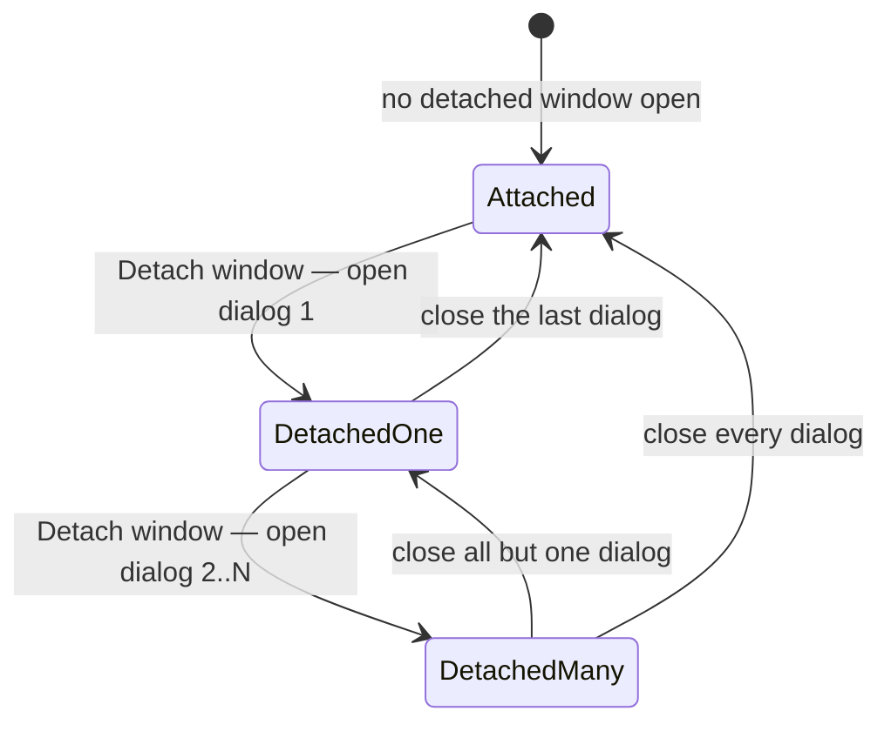

# Result Widget — State Machine

**Status:** Draft
**Owner:** architect
**Audience:** coder, tester
**Last Updated:** 2026-06-06
**Cross-references:** `description.md`, `flow_diagram.md`, `implementation_structure.md`; `08_Cross_Cutting/08-H_app_modes.md`; `08_Cross_Cutting/08-J_event_bus_catalog.md`; `10_Domain_and_Data/02_DTOS_AND_ENUMS.md`; `tabs/charts_tab.md`

This document defines the widget-level state machines of the Result Widget — the visual states the panel can be in, the events that drive transitions, and the affordances available in each state. It covers the top-level run-selection state, the per-tab data lifecycle, the dropdown auto-jump rule, the shared save-destination control, and the detached-window lifecycle. The states describe what the user sees; the pipeline states that drive them are defined in `08_Cross_Cutting/08-B_benchmark_state_machine.md`.

---

## Table of Contents

1. Top-level state diagram
2. Run-active overlay
3. Per-tab data lifecycle
4. Dropdown auto-jump
5. Save-destination control
6. Detached-window lifecycle
7. State affordances
8. Transition triggers

---

## 1. Top-level state diagram

The widget has two top-level states: `NoRun` when the Data Store holds no runs, and `RunSelected` when a run is displayed. The four-tab strip is a nested machine inside `RunSelected`.

`Loading` resolves once on mount: the dropdown is populated from the Data Store, the selected tab is restored from `ui.last_result_tab`, and either `NoRun` or `RunSelected` is entered. A run is never created, renamed, or deleted by this widget; `RunSelected → NoRun` is driven by a deletion in the Resume Benchmark Widget.

## 2. Run-active overlay

`RunSelected` carries an orthogonal `live` flag. The flag does not change which tab is shown; it changes whether the displayed run updates live and whether the generative actions are enabled.

- **Idle** — no run is non-terminal. Every export and the Regenerate action are enabled.
- **LiveActiveRun** — a run is non-terminal and the active run is selected. The tabs repaint live from the debounced data-changed events. Every export and Regenerate are disabled with the tooltip "Disabled — a benchmark is in progress."
- **LivePastRunFrozen** — a run is non-terminal but the user has selected a past run. The past run's tabs render its persisted, frozen data. Exports and Regenerate stay disabled — the rule is "no run is non-terminal", not "the selected run is non-terminal" (see `description.md` §7).

The dropdown, tab switching, filtering, sorting, column changes, detach, copy, and chart navigation stay enabled in all three states.

## 3. Per-tab data lifecycle

Each of the four tabs holds its own cache for the selected run. A tab fetches lazily — the first time it is shown for a run.

- The Summary, Details, and Charts caches are refreshed by `_summary_data_changed`, `_detailed_data_changed`, and `_chart_data_changed`; the Run Analysis cache is refreshed by `_run_analysis_received`.
- The data-changed events are debounced at 250 ms, so a fast-completing run moves a tab `Loaded → Stale → Loaded` at a bounded rate (EC-PERF-3).
- Changing the selected run invalidates all four caches; each tab returns to `ColdCache` and refetches when next shown.

## 4. Dropdown auto-jump

The run-selector dropdown auto-selects a newly started run on its first appearance, but never overrides a deliberate user selection. The parent controller holds a "user-locked selection" flag.

- **Unlocked** — the dropdown follows the active run. A `_run_started` event adds the run and selects it.
- **Locked** — the user has chosen a run deliberately. Later `_run_started` events add runs to the dropdown but do not move the selection.
- Selecting the active run while `Locked` returns the controller to `Unlocked`.

## 5. Save-destination control

The footer's save-destination toggle is bound to the shared `ui.export_save_directly` setting. Its state is the same on every tab and every detached window; flipping it anywhere updates all footers through `_app_settings_changed`.

- **Indirect** — the `Open Exports Folder` Button is hidden. Each Export opens a native Save Picker defaulted to the Desktop.
- **Direct** — the `Open Exports Folder` Button is shown. Each Export writes straight to the Exports Folder. A failed direct write (EC-RES-5) shows an error modal and leaves the toggle on; no partial file is left.

Every transition in this machine is inert while a run is non-terminal: the Export buttons are disabled, so `SavePicker` and `DirectWrite` are unreachable, but the toggle itself stays operable.

## 6. Detached-window lifecycle

Each of the three detachable tabs — Summary, Details, Charts — may open one or more Modeless Dialogs. The widget tracks how many are open.

- A detached window owns its own data-changed subscription, owner-bound to itself; closing it auto-cancels the subscription.
- A detached chart window owns its own chart index, chart-kind filters, and prev/next state; the save-destination state is the shared `ui.export_save_directly` value.
- A detached window survives a workspace switch (EC-WS-1); it is closed only by the user or on application quit.

## 7. State affordances

| State | Dropdown | Tab switch | Filter / columns | Detach | Export buttons | Regenerate | Copy |
|---|:--:|:--:|:--:|:--:|:--:|:--:|:--:|
| `Loading` | disabled | disabled | disabled | disabled | disabled | disabled | disabled |
| `NoRun` | empty, disabled | disabled | disabled | disabled | disabled | disabled | disabled |
| `RunSelected` + `Idle` | enabled | enabled | enabled | enabled | enabled | enabled | enabled |
| `RunSelected` + `LiveActiveRun` | enabled | enabled | enabled | enabled | disabled | disabled | enabled |
| `RunSelected` + `LivePastRunFrozen` | enabled | enabled | enabled | enabled | disabled | disabled | enabled |

The Regenerate and Copy affordances apply only on the Run Analysis tab; Detach applies only on Summary, Details, and Charts. An export button is additionally gated by its tab being active. The disabled-export tooltip is always "Disabled — a benchmark is in progress."

## 8. Transition triggers

| Transition | Trigger |
|---|---|
| `Loading → NoRun` | mount completes; the Data Store returns zero runs |
| `Loading → RunSelected` | mount completes; the newest run is selected |
| `NoRun → RunSelected` | `_run_list_changed` reports the first run |
| `RunSelected → NoRun` | `_run_list_changed` reports the last run was deleted |
| tab → tab | the user clicks a tab in the strip; persists `ui.last_result_tab` |
| `RunSelected → RunSelected` (new run) | the user changes the dropdown, or `_run_id_changed` arrives from another widget |
| `Idle → LiveActiveRun` / `LivePastRunFrozen` | `_run_started` |
| `LiveActiveRun` / `LivePastRunFrozen` → `Idle` | `_run_finished`, `_run_stopped`, or `_run_failed` |
| `Unlocked → Locked` | the user manually selects a run that is not the active run |
| `Locked → Unlocked` | the user selects the active run |
| `Indirect ↔ Direct` | the user flips the save-destination toggle, or `_app_settings_changed` reports the change from another footer |
| `Attached → DetachedOne → DetachedMany` | the user clicks `Detach window` |
| `… → Attached` | the user closes the last detached window |
| `ColdCache → Fetching → Loaded` | a tab is shown for the selected run |
| `Loaded → Stale → Loaded` | a data-changed event for the selected run, then the 250 ms debounced refresh |
