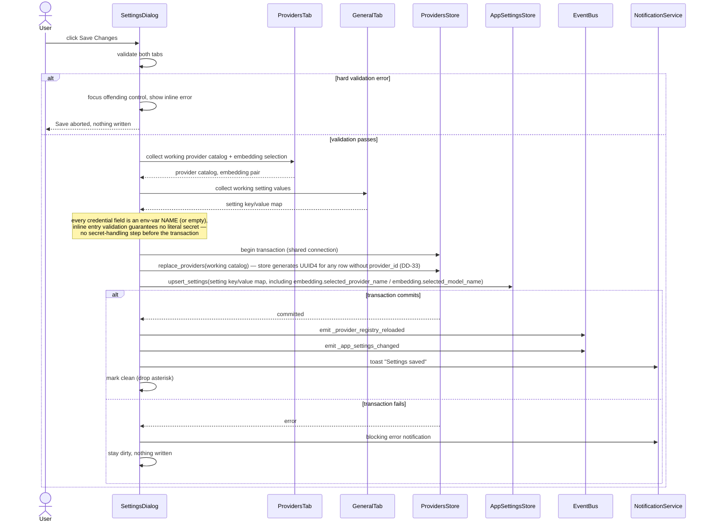
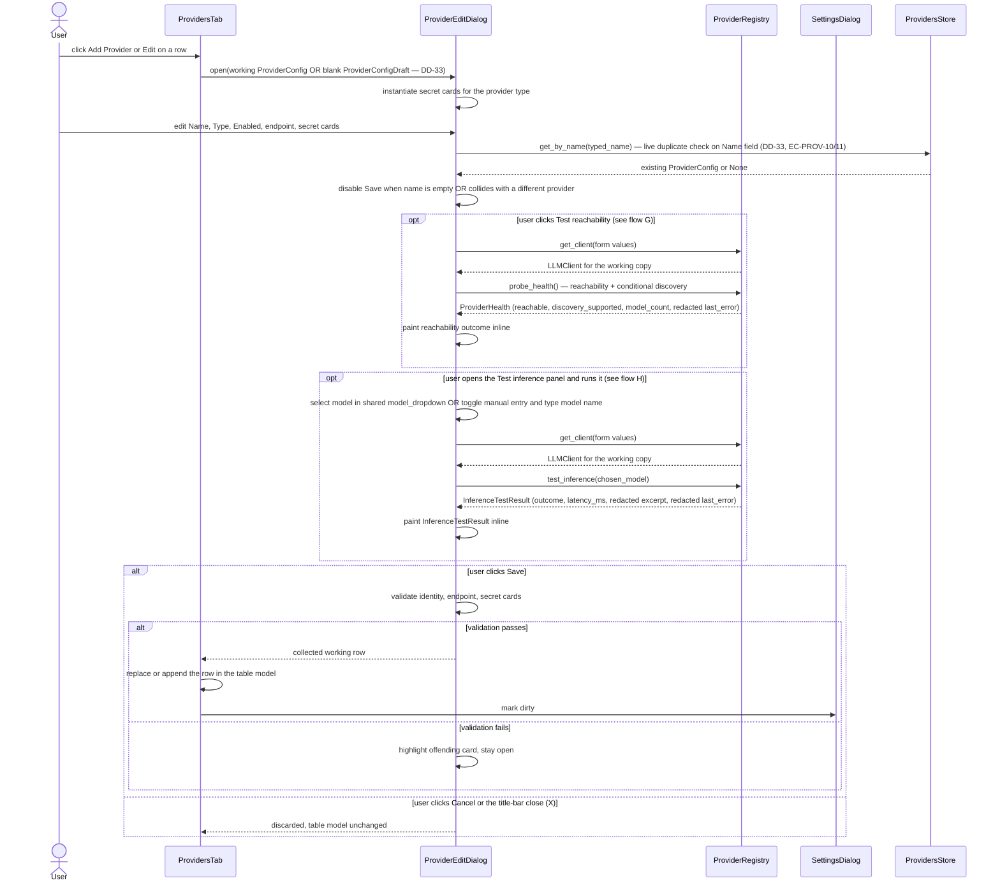
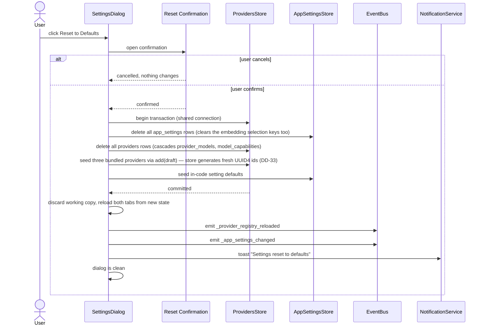
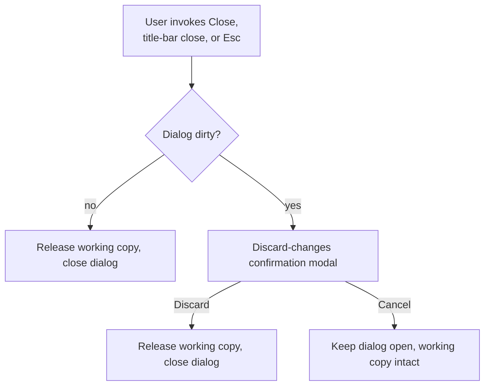
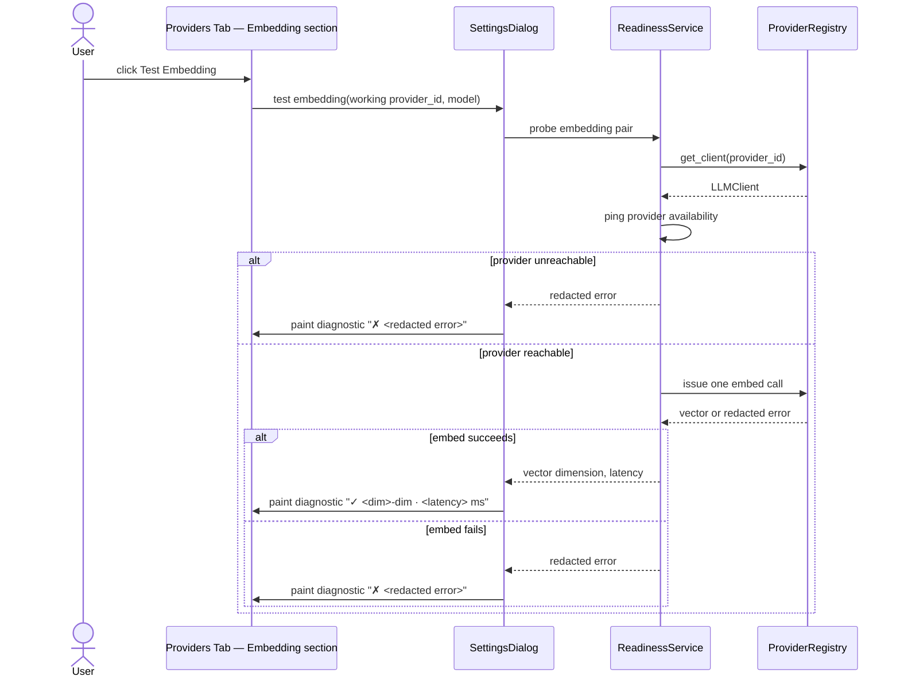
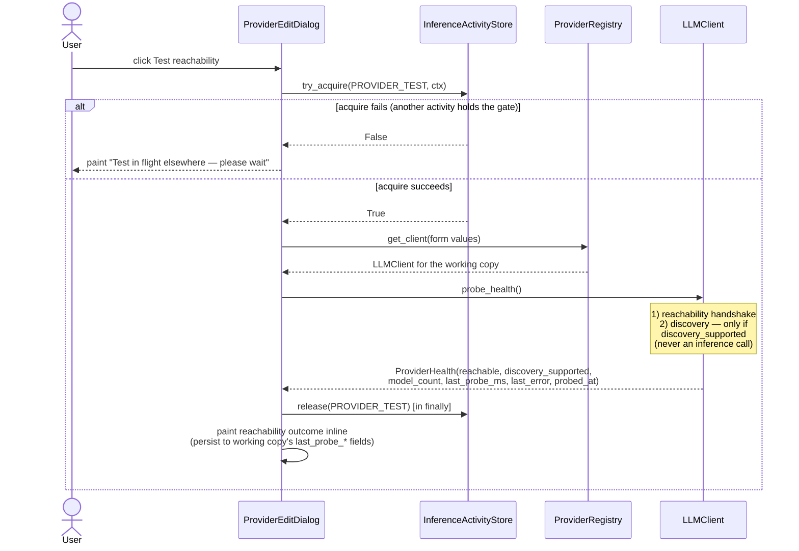

# Settings Dialog — Flow Diagrams

**Status:** Draft
**Owner:** coder, tester
**Audience:** coder, tester
**Last Updated:** 2026-06-06
**Cross-references:**
`06_Settings_Dialog/description.md`,
`06_Settings_Dialog/state_machine.md`,
`06_Settings_Dialog/sub_dialogs/provider_edit.md`,
`06_Settings_Dialog/sub_dialogs/reset_confirmation.md`,
`08_Cross_Cutting/08-E_interfaces_contracts.md`,
`08_Cross_Cutting/08-J_event_bus_catalog.md`,
`10_Domain_and_Data/06_IMPORT_FORMATS.md`,
`10_Domain_and_Data/08_REDACTION_PATTERNS.md`,
`11_Services_and_Algorithms/09_READINESS_PROBE.md`

This document gives the sequence and flow diagrams for every major user action
of the Settings Dialog: the atomic Save, editing a provider, resetting to
defaults, the export and import round-trip, closing while dirty, and testing the
embedding model. Each diagram names the concrete methods and Event Bus signals
involved, so that the coder can trace the call path and the tester can derive a
scenario from each branch.

---

## Table of Contents

- A. Save flow (atomic)
- B. Edit provider flow
- C. Reset to defaults flow
- D. Export and import round-trip
- E. Close-while-dirty flow
- F. Test embedding flow
- G. Test reachability flow (`probe_health`)
- H. Test inference flow (`test_inference`)
- Actor legend

---

## Actor legend

| Actor | Role |
|---|---|
| `User` | The person operating the dialog. |
| `SettingsDialog` | The base modal dialog and its controller. |
| `ProvidersTab` / `GeneralTab` | The two tab bodies; each collects its own working values. |
| `ProviderEditDialog` | The Provider Edit sub-dialog (`sub_dialogs/provider_edit.md`). |
| `ProvidersStore` | The persistence Protocol for the provider catalog; one part of the atomic transactions. **Owns `provider_id` generation** — `add(draft)` returns the new UUID4 (DD-33, `08_Cross_Cutting/08-E_interfaces_contracts.md` §7.4). |
| `AppSettingsStore` | The persistence Protocol for the user-saved settings layer; the final part of the atomic transactions. Also stores the single embedding selection (`embedding.selected_provider_name` / `embedding.selected_model_name`) — there is no separate embedding-config store (D-R-13). |
| `EventBus` | The application Event Bus. |
| `ReadinessService` | The readiness probe service (`11_Services_and_Algorithms/09_READINESS_PROBE.md`). |
| `ProviderRegistry` | Supplies `LLMClient` instances for the Test probes. |
| `LLMClient` | The unified provider-facing client (`08_Cross_Cutting/08-E_interfaces_contracts.md` §10) — exposes `probe_health()` for the Test reachability action and `test_inference(model_name)` for the Test inference action. |
| `InferenceActivityStore` | The application-wide single-inference gate (`08_Cross_Cutting/08-E_interfaces_contracts.md` §13). Both reachability and inference tests acquire `PROVIDER_TEST` for the duration of the call. |
| `ModelDropdown` | The shared `ui/shared/model_dropdown` widget (`11_Services_and_Algorithms/01_SERVICE_INVENTORY.md` §3.1), reused by the Provider Edit dialog inference-test panel. |
| `NativePickers` | Native save / open-file / open-folder pickers. |
| `Clipboard` | Clipboard copy (`copy_text`). |
| `FileSystemActions` | The file-manager action (`open_in_file_manager`). |
| `NotificationService` | Toasts and blocking error notifications. |

## A. Save flow (atomic)

A single persistence transaction spanning the `ProvidersStore` and the
`AppSettingsStore` commits the provider catalog and the general-tab settings
(including the embedding selection keys) together. Every provider credential
field already holds only an environment-variable name (or empty) — entry
validation in the Provider Edit sub-dialog (`sub_dialogs/provider_edit.md` §5.1)
guarantees this — so the Save proceeds straight to the transaction with no
secret-handling step. For each row in the working provider catalog that lacks a
`provider_id` (an added-this-session row), `ProvidersStore.replace_providers`
(or the equivalent atomic insert path) generates a fresh UUID4 inside the
transaction (DD-33).



The emission of `_provider_registry_reloaded` causes the Readiness Service to
run a fresh `probe_all`; the dialog observes the result through
`_app_readiness_changed` and repaints its Health Dots (flow F covers the probe
itself for the embedding case).

## B. Edit provider flow

The Provider Edit sub-dialog edits a working copy of one provider row. Test
connection runs against the form values, never the persisted values (EC-PROV-4).
Save writes the row back into the in-memory provider table; it does not touch the
`ProvidersStore` — the main dialog's Save Changes does that.



## C. Reset to defaults flow

Reset wipes the configuration and re-seeds factory defaults in one transaction.
It discards any unsaved working edits as part of the wipe (EC-SET-5).



## D. Export and import round-trip

Export and Import share one YAML format (`10_Domain_and_Data/06_IMPORT_FORMATS.md`).
Export writes the current configuration to a file; Import parses, validates,
previews, and — on confirm — replaces the configuration in one transaction. A
file exported and then re-imported reproduces the same configuration.

```mermaid
flowchart TB
    subgraph Export
      EX0[User clicks Export] --> EX1[NativePickers.save_file<br/>default name ollama_bench_settings_YYYY-MM-DD.yaml]
      EX1 -->|cancelled| EXC[No-op]
      EX1 -->|path chosen| EX2[Collect provider catalog,<br/>embedding selection, settings]
      EX2 --> EX3[Write one YAML file<br/>credential values are env-var NAMES, never keys]
      EX3 --> EX6[Toast: Exported to path]
    end
    subgraph Import
      IM0[User clicks Import] --> IM1[NativePickers.open_file<br/>accepts .yaml / .yml]
      IM1 -->|cancelled| IMC[No-op]
      IM1 -->|file chosen| IM2[Parse and fully validate]
      IM2 -->|file-level hard error| IM3[Error modal names the cause,<br/>nothing applied]
      IM2 -->|valid| IM4[Import Preview modal<br/>Added / Changed / Unchanged / Skipped<br/>credential values are env-var NAMES, shown verbatim]
      IM4 -->|cancel| IMC
      IM4 -->|confirm| IM7[Begin transaction]
      IM7 --> IM8[Replace provider registry wholesale,<br/>merge present valid settings keys]
      IM8 --> IM9[Reload both tabs,<br/>emit _provider_registry_reloaded + _app_settings_changed]
      IM9 --> IM10[Toast: Settings imported]
    end
```



Round-trip note: a provider credential value is an environment-variable name; it
is written verbatim on export and read back as the identical string on import,
so the round-trip is an exact identity. No literal secret can be present (entry
validation forbids it), so there is nothing to convert on either leg
(`10_Domain_and_Data/06_IMPORT_FORMATS.md` §9).

## E. Close-while-dirty flow

A clean dialog closes immediately. A dirty dialog prompts to discard; the working
copy is released only on Discard.



## F. Test embedding flow

The Test Embedding action in the Providers tab embedding section runs the
embedding probe against the selected provider/model pair: it pings the provider
and issues one real `embed` call (`11_Services_and_Algorithms/09_READINESS_PROBE.md`
§6.3). The inline diagnostic shows the vector dimension and latency on success,
or a redacted error on failure.



Every SDK-originated error string surfaced in the diagnostic has already passed
through `redact(text)` at the `LLMClient` adapter boundary
(`10_Domain_and_Data/08_REDACTION_PATTERNS.md` surface 2,
`11_Services_and_Algorithms/17_ERROR_TAXONOMY.md` §6.5); the dialog renders it
verbatim.

## G. Test reachability flow (`probe_health`)

The Test reachability action calls `LLMClient.probe_health()` on the working
copy's client. The probe confirms the endpoint is reachable and (only when the
per-provider implementation supports it) issues a model-discovery call. It is
**never billable** and **never issues an inference**. Available on the
Providers tab table row (Test connection action — `description.md` §3.3) and
on the Provider Edit sub-dialog footer (`sub_dialogs/provider_edit.md` §8.1).



`probe_health` never raises: an unreachable endpoint, a missing discovery
endpoint (Anthropic), an empty discovery list, and a failed discovery call are
all returned as data on the `ProviderHealth`. The dialog renders the four
distinct sub-states described in `sub_dialogs/provider_edit.md` §8.1.

## H. Test inference flow (`test_inference`)

The Test inference action calls `LLMClient.test_inference(model_name)` on the
working copy's client. It issues exactly one chat call with a fixed canned
prompt against the user-selected (or user-typed) model and returns a typed
`InferenceTestResult`. The user MUST pick or enter a model name first; the Run
button is disabled until they do. The action is available only in the Provider
Edit sub-dialog's inline panel (`sub_dialogs/provider_edit.md` §8.2). Because
the call is billable on paid providers, it is never automatic.

```mermaid
sequenceDiagram
    actor User
    participant ProviderEditDialog
    participant ModelDropdown as ui/shared/model_dropdown
    participant InferenceActivityStore
    participant ProviderRegistry
    participant LLMClient
    participant EventBus

    User->>ProviderEditDialog: click Test inference (opens the inline panel)
    ProviderEditDialog->>ModelDropdown: bind to form provider_id, pre-fill from last probe
    alt provider's discovery_supported == False (e.g. Anthropic) OR no model list available
        ProviderEditDialog->>ProviderEditDialog: dropdown is empty,<br/>user toggles "Enter model name manually"
        User->>ProviderEditDialog: type model name into single-line input
    else dropdown has models
        User->>ModelDropdown: pick a model
    end
    Note over ProviderEditDialog: Run button is DISABLED until<br/>(model selected OR non-empty typed name)<br/>AND gate is IDLE or held by PROVIDER_TEST
    User->>ProviderEditDialog: click Run inference test
    ProviderEditDialog->>EventBus: subscribe _inference_progress filtered to<br/>context=PROVIDER_TEST AND provider_id=<form provider_id>
    ProviderEditDialog->>InferenceActivityStore: try_acquire(PROVIDER_TEST, ctx)
    alt acquire fails (another activity holds the gate)
        InferenceActivityStore-->>ProviderEditDialog: False
        ProviderEditDialog-->>ProviderEditDialog: build InferenceTestResult(outcome=GATE_BUSY, ...) directly
    else acquire succeeds
        InferenceActivityStore-->>ProviderEditDialog: True
        ProviderEditDialog->>ProviderEditDialog: replace Run-button area with live indicator<br/>(sub-state A: "Testing — waiting for response — N.N s")
        ProviderEditDialog->>ProviderRegistry: get_client(form values)
        ProviderRegistry-->>ProviderEditDialog: LLMClient for the working copy
        ProviderEditDialog->>LLMClient: test_inference(model_name)
        Note over LLMClient: wraps the chat call in the shared<br/>emit_progress_during(...) helper with<br/>context=PROVIDER_TEST, issues ONE chat call,<br/>captures every provider error into the result,<br/>never raises to the caller
        emit ≥1Hz (chunk-driven) while the call is in flight
            LLMClient-->>EventBus: emit _inference_progress(context=PROVIDER_TEST, provider_id, model_name, elapsed_ms, tokens_received, first_token_received)
            EventBus-->>ProviderEditDialog: deliver progress event (filtered)
            ProviderEditDialog->>ProviderEditDialog: refresh live indicator (sub-state A or B per first_token_received)
        end
        LLMClient-->>ProviderEditDialog: InferenceTestResult(outcome, latency_ms,<br/>response_excerpt, redacted last_error, tested_at)
        ProviderEditDialog->>InferenceActivityStore: release(PROVIDER_TEST) [in finally]
    end
    ProviderEditDialog->>ProviderEditDialog: replace live indicator with InferenceTestResult outcome chip<br/>(persist to working copy's last_inference_test_* fields)
    ProviderEditDialog->>EventBus: emit _provider_inference_test_completed(InferenceTestResult)
    ProviderEditDialog->>EventBus: unsubscribe _inference_progress (terminal event observed)
    Note over EventBus: Providers tab subscribes _provider_inference_test_completed,<br/>refreshes row summary.
```

`test_inference` never raises. Every provider-side failure (auth, model not
found, rate limit, timeout, transport failure) is classified into the
`InferenceTestOutcome` and captured into the result struct. The live indicator
between the request and the outcome is driven by the `_inference_progress`
event filtered on `context=InferenceContext.PROVIDER_TEST` and the working
copy's `provider_id`; events of any other context are ignored
(`06_Settings_Dialog/sub_dialogs/provider_edit.md` §8.2).
