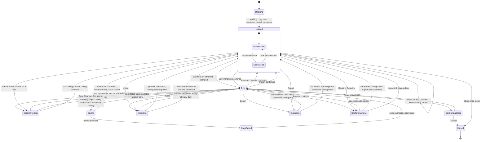

# Settings Dialog — State Machine

**Status:** Draft
**Owner:** coder, tester
**Audience:** coder, tester
**Last Updated:** 2026-05-22
**Cross-references:**
`06_Settings_Dialog/description.md`,
`06_Settings_Dialog/flow_diagram.md`,
`06_Settings_Dialog/sub_dialogs/provider_edit.md`,
`06_Settings_Dialog/sub_dialogs/reset_confirmation.md`,
`08_Cross_Cutting/08-H_app_modes.md`,
`08_Cross_Cutting/08-J_event_bus_catalog.md`,
`10_Domain_and_Data/06_IMPORT_FORMATS.md`,
`11_Services_and_Algorithms/09_READINESS_PROBE.md`

This document specifies the state machine of the Settings Dialog: every state
the dialog can occupy, the trigger of every transition, and the affordances
available in each state. It covers the base dialog and the modal sub-dialog
stack as one machine, so that the coder can implement the dialog as an explicit
state model and the tester can derive a transition test from every edge.

---

## Table of Contents

1. Scope
2. State catalogue
3. State diagram
4. Transition table
5. Sub-dialog stack rules
6. Per-state affordances
7. Edge-case states

---

## 1. Scope

The machine begins when the user invokes the Settings menu action and ends when
the dialog is dismissed. The Settings menu action is itself disabled while a
benchmark run is in any non-terminal state, so the machine is never entered
during a run (`08_Cross_Cutting/08-H_app_modes.md` §10); the dialog is never
forced closed by a run starting because a run cannot start while the dialog is
open.

The machine treats both tabs — Providers and General — as one editable working
copy. Tab switching is an intra-state move inside the `Loaded` and `Dirty`
states and does not change the top-level state. Every sub-dialog (Provider Edit,
Reset confirmation, Import preview, Discard confirmation) appears in the machine
as a distinct state, because each one suspends interaction with the base dialog
until it resolves.

## 2. State catalogue

| State | Meaning |
|---|---|
| `Opening` | The dialog has been requested; the working copy is being read from the Data Store and an auto-check readiness refresh is being requested. No control is interactive yet. |
| `Loaded` | The working copy equals the persisted configuration; the dialog is clean. The active tab is either Providers or General. |
| `Dirty` | At least one field on either tab differs from the persisted value; the working copy is editable and Save Changes is eligible. |
| `EditingProvider` | The Provider Edit sub-dialog is open over the base dialog (`sub_dialogs/provider_edit.md`). |
| `Saving` | The atomic Data Store transaction for Save Changes is committing. |
| `SaveFailed` | The Save transaction failed; a blocking error notification is shown; nothing was written. |
| `Importing` | The Import file has been picked and is being parsed, validated, and previewed (`10_Domain_and_Data/06_IMPORT_FORMATS.md`). |
| `Exporting` | The Export save picker is open or the YAML file is being written. |
| `ConfirmingReset` | The Reset confirmation sub-dialog is open (`sub_dialogs/reset_confirmation.md`). |
| `ConfirmingClose` | The Discard-changes confirmation is open because Close was invoked while dirty. |
| `Closed` | The dialog is dismissed; the working copy is released. Terminal. |

`Opening` and `Saving` are transient: no user input is accepted in them; they
exist so the coder can disable the whole dialog while a blocking operation runs.

## 3. State diagram

## 4. Transition table

| From | Trigger | To | Notes |
|---|---|---|---|
| `Opening` | Working copy read; readiness refresh requested | `Loaded` | The dialog opens on the Providers tab. The auto-check probe runs asynchronously and repaints Health Dots when it resolves; it does not gate this transition. |
| `Loaded` | Tab click | `Loaded` | Intra-state; the active tab changes only. |
| `Loaded` / `Dirty` | Any editable field changes | `Dirty` | Idempotent once already `Dirty`. |
| `Dirty` | Working copy matches persisted again (every edit manually reverted) | `Loaded` | The dialog re-cleans without a Save when the user undoes every change. |
| `Loaded` / `Dirty` | Add Provider or row Edit | `EditingProvider` | The base dialog is non-interactive while the sub-dialog is open. |
| `EditingProvider` | Sub-dialog Save with a changed working row | `Dirty` | The row is written into the in-memory provider table. |
| `EditingProvider` | Sub-dialog Cancel, or Save with no net change | prior state | Returns to `Loaded` or `Dirty` depending on the pre-existing dirty state. |
| `Dirty` | Save Changes (validation passes) | `Saving` | The transaction begins immediately after validation passes. Every credential field is an environment-variable name (inline entry validation guarantees this), so there is no secret-handling step before the transaction (`flow_diagram.md` §A). |
| `Saving` | Transaction commits | `Loaded` | `_provider_registry_reloaded` and `_app_settings_changed` are emitted; a `Settings saved` toast is shown; the dialog becomes clean. |
| `Saving` | Transaction fails | `SaveFailed` | Nothing is written; the transaction is all-or-nothing. |
| `SaveFailed` | Error notification dismissed | `Dirty` | The working copy is intact; the user may correct and retry. |
| `Loaded` / `Dirty` | Import | `Importing` | A native file picker opens; the file is parsed and validated. |
| `Importing` | File-level hard error, or preview cancelled | prior state | Nothing is applied (`10_Domain_and_Data/06_IMPORT_FORMATS.md` §8). |
| `Importing` | Preview confirmed | `Loaded` | The configuration is applied in one transaction; both tabs reload; a `Settings imported` toast is shown. Every credential value is an environment-variable name, so there is no secret-handling step. |
| `Loaded` / `Dirty` | Export | `Exporting` | A native save picker opens. |
| `Exporting` | File written, or save picker cancelled | prior state | Export never mutates the working copy, so the dirty state is unchanged. |
| `Loaded` / `Dirty` | Reset to Defaults | `ConfirmingReset` | The Reset confirmation sub-dialog opens. |
| `ConfirmingReset` | Confirmed | `Loaded` | The configuration is wiped and re-seeded in one transaction; any unsaved working edits are discarded; both tabs reload. |
| `ConfirmingReset` | Cancelled | prior state | Nothing changes. |
| `Loaded` | Close, title-bar close, or `Esc` | `Closed` | A clean dialog closes immediately. |
| `Dirty` | Close, title-bar close, or `Esc` | `ConfirmingClose` | A dirty dialog prompts before closing. |
| `ConfirmingClose` | Discard | `Closed` | The working copy is released without a write. |
| `ConfirmingClose` | Cancel | `Dirty` | The dialog stays open with the working copy intact. |

## 5. Sub-dialog stack rules

- The Settings Dialog is the **base** Modal Dialog for the duration of the
  machine. Every sub-dialog opens on top of it.
- **Exactly one sub-dialog is open at a time.** The states `EditingProvider`,
  `ConfirmingReset`, `ConfirmingClose`, and the Import preview phase of
  `Importing` are mutually exclusive — no transition produces a second sub-dialog
  over a first.
- While a sub-dialog is open, the base dialog's controls are non-interactive;
  the tabs, the footer, and the provider table do not accept input.
- `Esc` inside a sub-dialog dismisses **only that sub-dialog** and returns the
  machine to the state the sub-dialog was entered from. `Esc` is the Cancel
  affordance of every sub-dialog.
- The Provider Edit sub-dialog runs its own internal state machine
  (`sub_dialogs/provider_edit.md` §State machine); from the Settings Dialog's
  machine it is the single state `EditingProvider` regardless of that internal
  detail. The Provider Edit machine includes its own
  `TestingReachability` / `InferenceTestPanelOpen` / `InferenceTestPanelGated`
  / `TestingInference` sub-states for the two distinct provider-test actions
  (`sub_dialogs/provider_edit.md` §8); the `InferenceTestPanelGated` sub-state
  is entered when the `InferenceActivityStore` gate is held by an activity
  other than `PROVIDER_TEST` and the Run inference test button is therefore
  disabled with a tooltip. From the Settings Dialog's perspective the whole
  Provider Edit modal is still the single `EditingProvider` state.

## 6. Per-state affordances

| State | Tabs | Footer Save | Footer Reset / Import / Export | Footer Close | Base controls |
|---|---|---|---|---|---|
| `Opening` | inert | disabled | disabled | disabled | inert |
| `Loaded` | switchable | disabled (clean — no asterisk) | enabled | enabled | interactive |
| `Dirty` | switchable | enabled when no hard validation error; carries an asterisk | enabled | enabled | interactive |
| `EditingProvider` | inert | inert | inert | inert | inert (sub-dialog owns input) |
| `Saving` | inert | inert (shows the saving indicator) | disabled | disabled | inert |
| `SaveFailed` | inert | inert | inert | inert | inert (error notification owns input) |
| `Importing` | inert | inert | inert | inert | inert |
| `Exporting` | inert | inert | inert | inert | inert |
| `ConfirmingReset` | inert | inert | inert | inert | inert |
| `ConfirmingClose` | inert | inert | inert | inert | inert |

In `Dirty`, the Save Changes button is enabled only when validation reports no
hard error (`description.md` §15.1); a hard error keeps the button disabled even
though the dialog is dirty. Reset, Import, and Export are disabled only in the
transient `Saving` state, never by the dirty state.

## 7. Edge-case states

| ID | Situation | Machine behaviour |
|---|---|---|
| EC-SET-3 | A numeric field is cleared. | The dialog is `Dirty` but the Save Changes button stays disabled; the field's hard error blocks the `Dirty → Saving` transition until a valid value is entered. |
| EC-SET-4 | A run begins, or the user attempts to open Settings, while a run is non-terminal. | The machine is never entered: the Settings menu action is disabled (`08_Cross_Cutting/08-H_app_modes.md` §10). The case does not arise in practice. |
| EC-SET-5 | Reset to Defaults is confirmed while the dialog is `Dirty`. | `ConfirmingReset → Loaded` discards every unsaved working edit as part of the wipe-and-reseed; the dialog lands clean. |
| EC-PROV-6 | A value that is not a valid environment-variable name (it looks like an actual key) is entered in a provider's API-key field. | It is rejected inline in the Provider Edit sub-dialog (`sub_dialogs/provider_edit.md` §5.1) and cannot be saved; the base dialog never sees a literal secret, so the `Dirty → Saving` edge carries only env-var names. |
