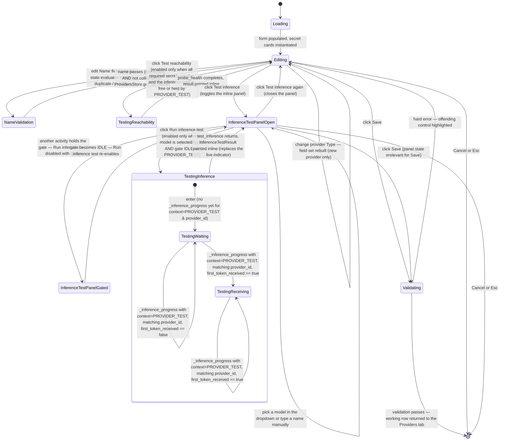

# Sub-dialog — Provider Edit

**Status:** Draft
**Owner:** coder, tester
**Audience:** coder, tester
**Last Updated:** 2026-05-22
**Cross-references:**
`06_Settings_Dialog/description.md`,
`06_Settings_Dialog/state_machine.md`,
`06_Settings_Dialog/flow_diagram.md`,
`08_Cross_Cutting/08-E_interfaces_contracts.md`,
`10_Domain_and_Data/02_DTOS_AND_ENUMS.md`,
`10_Domain_and_Data/06_IMPORT_FORMATS.md`,
`10_Domain_and_Data/08_REDACTION_PATTERNS.md`,
`11_Services_and_Algorithms/09_READINESS_PROBE.md`

The Provider Edit sub-dialog is the modal surface for creating or editing one
provider. It opens on top of the Settings Dialog and edits an in-memory working
copy of a single provider row. It renders the API-key credential as a secret
card whose value is the **name of an environment variable** that holds the key,
presents the identity and endpoint fields per provider type, runs the
multi-stage Test connection probe against the form values, and on Save writes
the working row back into the Providers tab table — it never writes to the Data
Store itself.

---

## Table of Contents

1. Role and triggers
2. Layout
3. Identity fields
4. Endpoint fields
5. Secret cards
6. Per-provider-type secret-card sets
7. Default models
8. Test connection (Test reachability, Test inference, Last-test indicator, single-inference gate)
9. Validation
10. Save and Cancel
11. State machine
12. Storage form
13. Edge cases
14. Function inventory

---

## 1. Role and triggers

The Provider Edit sub-dialog is a Modal Dialog. It opens in one of two ways:

| Trigger | Initial state |
|---|---|
| Add Provider — the Providers tab toolbar button. | Blank, with no `provider_id` (the working draft is a `ProviderConfigDraft`; the `provider_id` is generated by `ProvidersStore.add` at Save Changes time on the base dialog — see DD-33). The provider type defaults to `openai_compatible`. The Name field is empty and the Save button is disabled until the user types a non-empty, non-colliding name. |
| Edit — a provider row's Edit action. | Populated from that row's working copy, including any unsaved edits made earlier in the session. The persisted `provider_id` is held by the working copy but is never shown in the dialog (DD-33). |

The sub-dialog edits one provider only and one provider's working copy at a
time. It does not touch the Data Store; persistence happens when the user clicks
Save Changes on the base Settings Dialog (`06_Settings_Dialog/description.md` §6).
The base dialog is non-interactive while this sub-dialog is open
(`state_machine.md` §5).

## 2. Layout

The sub-dialog is a vertical form, top to bottom:

| Region | Content |
|---|---|
| Title bar | `Add Provider` or `Edit Provider — <name>`, plus a close affordance. |
| Identity section | The Name, Type, and Enabled fields (§3). The Name field is the sole unique-identifier input — there is no Provider ID field, because `provider_id` is an internal auto-generated UUID4 (DD-33). |
| Endpoint section | The Base URL field and, for `openai_compatible`, the Azure OpenAI toggle (§4). |
| Authentication section | One secret card per credential field of the chosen provider type (§5, §6). |
| Default models section | The optional pre-selected model list (§7). |
| Last-test indicator | A read-only two-line block showing the provider's most recent stored reachability probe and inference-test results (§8.3). |
| Footer | The **Test reachability** button, the **Test inference** button (which toggles the inline inference-test panel — §8.2), and the Cancel and Save buttons. |

The visual reference is `06_Settings_Dialog/mockup.html`; the secret-card and
source-toggle structure described below renders inside the Authentication
section.

## 3. Identity fields

The Identity section has **three** controls — Name, Type, and Enabled. There is **no Provider ID field**. The `provider_id` is an internal auto-generated UUID4 (DD-33, `08_Cross_Cutting/08-F_spec_issues_log.md`); it is never typed by the user, never displayed in the dialog, and never copied to the clipboard. The Name is the sole unique-identifier input.

| Field | Control | Editable | Validation |
|---|---|---|---|
| Name | Single-line Input | Always editable. | Non-empty (after trim); unique among the working provider rows AND unique against the persisted catalog (the dialog calls `ProvidersStore.get_by_name(typed_name)` on every commit-worthy keystroke and disables Save when a collision is detected). |
| Type | Dropdown | Editable for a new provider; read-only when editing an existing provider. | One of `openai_compatible`, `anthropic`, `gemini` (`ProviderType` — `10_Domain_and_Data/02_DTOS_AND_ENUMS.md`). |
| Enabled | Toggle | Always editable. | None. Bound to `ProviderConfig.enabled`. |

Type is frozen for an existing provider because changing it would invalidate the secret-card set. To change the Type, the user deletes the provider and adds it anew. Changing the Type for a *new* provider rebuilds the secret-card set immediately (§6).

The `provider_id` of an existing provider is held by the working copy (so the eventual `ProvidersStore.update(provider_id, config)` call references the correct row) but is never rendered in the dialog and never user-mutable. A rename mutates only the Name; the `provider_id` stays the same, so historical run references remain valid (DD-33, EC-PROV-12).

## 4. Endpoint fields

The endpoint fields shown depend on the provider type.

| Provider type | Endpoint controls |
|---|---|
| `openai_compatible` (non-Azure) | A required Base URL Single-line Input, plus an `Azure OpenAI?` Toggle. |
| `openai_compatible` with the Azure toggle on | The Base URL field is replaced by the Azure endpoint secret card (§6); the Azure endpoint value resolves into `base_url` at launch. |
| `anthropic` | An optional Base URL override; empty means the SDK default endpoint. |
| `gemini` | An optional Base URL override; empty means the SDK default endpoint. |

A Base URL value must be a syntactically valid URL when non-empty. For
`openai_compatible` (non-Azure) it is required (`description.md` §15.1).

## 5. Secret cards

The **API key** credential is rendered as a **secret card** whose value is the
**name of an environment variable** that holds the key (D-R-18) — never the key
itself. The non-secret Azure configuration fields (Azure endpoint, deployment
name, API version) are **plain literal config inputs**, not secret cards: they
hold ordinary configuration values, not credentials (§6.2).

The API-key secret card carries:

- **Title** — `API key` plus a `required` or `optional` flag.
- **Input area** — a Single-line Input that holds the **name of an environment
  variable** (placeholder e.g. `OPENAI_API_KEY`), or empty for a provider that
  needs no key. It is **not** masked, because a variable name is not a secret.
- **Inline help / user guidance** (shown near the field): *"Enter the name of an
  environment variable that holds the secret. Set the variable in the
  environment the application is launched from. The application reads
  environment variables once at startup, so **restart the application** after
  you add or change a variable. A variable you `export` in a single terminal is
  only visible if you launch the app from that same terminal session — to have
  it picked up generally, set it system-wide or in your shell profile / login
  environment."*
- **Live diagnostic** — a one-line lookup of whether the named variable resolves
  (§5.2).

There is **no source toggle and no plain-secret mode**: the field can only ever
hold an environment-variable name (or be empty), so there is no literal key to
translate and no second input shape.

### 5.1 Entry validation (inline)

The API-key field accepts **a valid environment-variable name** (regex
`[A-Za-z_][A-Za-z0-9_]*`) or **empty**. A value that is not a valid env-var name
— one that has spaces, `=`, a dollar sign, a brace, punctuation, or otherwise
looks like an actual key — is **rejected inline** with the guidance:

> Enter the NAME of an environment variable that holds the key (e.g.
> `OPENAI_API_KEY`) — not the key itself.

The card shows a red border and this inline message until the value is a valid
name or cleared. There is no intermediate dialog to translate a key into a
reference and no "save plain" path; the only credential form the field can hold
is a name.

### 5.2 Env-var diagnostic

The one-line diagnostic under the API-key input shows the live lookup result of
the named variable:

| State | Diagnostic |
|---|---|
| Name set and the variable resolves to a non-empty value | `✓ resolved` plus the fixed `<redacted>` placeholder and the character count of the resolved value. The dialog never displays the resolved key. |
| Name set but the variable is unset or empty | `⚠ not set` in the warning colour. |
| No name set | the diagnostic is blank (empty is allowed for local providers). |
| Value is not a valid variable name | `✗ name invalid` in the error colour (see §5.1). |

The diagnostic is the only place the sub-dialog reads an environment variable
directly; resolution for actual provider use is centralised in the env resolver
service and happens at launch and on `_provider_registry_reloaded`. Every value
shown is redacted (`10_Domain_and_Data/08_REDACTION_PATTERNS.md`). The Test
reachability action (§8.1) also reports whether the named variable resolves so
the user can verify setup.

## 6. Per-provider-type field sets

The provider type fixes which credential and config fields appear. The default
environment-variable name is pre-filled as the API-key field's placeholder.

### 6.1 `openai_compatible` (non-Azure)

| Field | Kind | Required | Placeholder / default |
|---|---|---|---|
| API key | env-var name (secret card) | Required for a cloud endpoint; optional for a local endpoint. | A suggested name the user may freely edit (DD-33 removed the per-`provider_id` template because the id is now an opaque UUID4). For an OpenAI-style cloud provider, suggested default `OPENAI_API_KEY`. The user may type any valid variable name, or leave it empty for a local endpoint. |

A local endpoint may need no key at all: the API-key field is **left empty** for
a local provider (`localhost`, `127.0.0.1`, `0.0.0.0`). Empty is valid and the
provider is usable without any environment variable.

### 6.2 `openai_compatible` with the Azure toggle on

Turning on the Azure OpenAI toggle replaces the Base URL field with one secret
card (the API key, as an env-var name) and three **plain literal config inputs**:

| Field | Kind | Required | Placeholder / default |
|---|---|---|---|
| API key | env-var name (secret card) | yes | `AZURE_OPENAI_API_KEY` |
| Azure endpoint | plain literal config value (the endpoint URL — **not a secret**) | yes | e.g. `https://my-resource.openai.azure.com` |
| Deployment name | plain literal config value (**not a secret**) | yes | e.g. `gpt-4o` |
| API version | plain literal config value (**not a secret**) | yes | e.g. `2024-10-21` |

Only the **API key** is an environment-variable name; the Azure endpoint,
deployment name, and API version are entered as **plain literal config values**
because they are non-secret configuration, not credentials. They are stored
verbatim in their `azure_*_raw` columns and are never resolved from the
environment. The Azure endpoint value supplies the URL that resolves into
`base_url`.

### 6.3 `anthropic`

| Field | Kind | Required | Placeholder / default |
|---|---|---|---|
| API key | env-var name (secret card) | yes | `ANTHROPIC_API_KEY` |

### 6.4 `gemini`

| Field | Kind | Required | Placeholder / default |
|---|---|---|---|
| API key | env-var name (secret card) | yes | `GOOGLE_API_KEY` |

## 7. Default models

The Default models section is an optional list of model names pre-selected for
this provider in the New Benchmark widget's test-model picker. It is a List View
with Add and Remove controls. An empty list is valid. Default models are stored
on the `ProviderConfig` record and are not credentials.

## 8. Test connection

The footer exposes **two distinct, independently-triggered actions** for
checking a provider's working copy: **Test reachability** and **Test
inference**. Both run against the **form values** of the working copy — never a
persisted value (EC-PROV-4). They map directly to the two methods on the
`LLMClient` Protocol (`08_Cross_Cutting/08-E_interfaces_contracts.md` §10):

- **Test reachability** calls `LLMClient.probe_health()` — reachability +
  conditional model discovery; never issues an inference; never billable.
- **Test inference** calls `LLMClient.test_inference(model_name)` — a single
  user-initiated end-to-end chat call against one named model; potentially
  billable on paid providers; user MUST select or enter the model first.

Separating the two is binding: the user MUST be able to verify that an endpoint
answers without ever issuing a chat call (the reachability action), and MUST
NOT be able to issue a billable chat call without first naming the model (the
inference action). The dialog enforces both rules in the UI.

### 8.1 Test reachability

A button labelled **Test reachability**. Clicking it calls
`LLMClient.probe_health()` on the working copy's client. The probe reuses
`11_Services_and_Algorithms/02_LLM_CLIENT_PROTOCOL.md` §6.8.1 and
`11_Services_and_Algorithms/09_READINESS_PROBE.md` §6.2 — it confirms the
endpoint is reachable and (only if the provider type supports it) issues the
discovery call. **Zero discovered models is not a failure**, and a provider
type whose implementation reports `discovery_supported=False` (Anthropic) is
not a failure either.

The inline result paints one row containing:

- **Reachable** — `yes` (success colour) or `no` (error colour).
- **Models** — the integer model count when discovery succeeded; the literal
  text `discovery not supported by this provider` when `discovery_supported`
  is `False`; `discovery failed: <redacted message>` when the provider is
  reachable but the listing call itself failed; not shown when the
  reachability step failed.
- **Latency** — milliseconds.
- **Last error** — when present, the redacted error string.
- **Tested at** — the localised timestamp.

The Test reachability button may run while editing. It is **disabled** when a
required API-key field is empty or names an environment variable that does not
resolve; a callout `One secret is unresolved` explains why. The probe reports
whether the named variable resolves, so the user can verify their setup. Every
error string the probe surfaces has already passed through redaction at the
`LLMClient` boundary.

The result is also persisted on Save into the working copy's
`ProviderConfig.last_probe_*` columns (`10_Domain_and_Data/02_DTOS_AND_ENUMS.md`
§5.1) so the dialog can display the last probe on reopen via the §8.3
Last-test indicator.

### 8.2 Test inference

An action exposed as a labelled button **Test inference** that toggles an
**inline panel** beneath the footer. The panel contains, top to bottom:

1. **Model dropdown** — the shared `ui/shared/model_dropdown` widget
   (`11_Services_and_Algorithms/01_SERVICE_INVENTORY.md` §3.1). The dropdown
   is bound to the form's `provider_id` (the dialog plays the consumer role;
   there is no sibling `provider_dropdown` here because this dialog edits
   exactly one provider). The dropdown is pre-filled with the model list
   discovered by the last reachability probe; it is **empty** for a provider
   type whose implementation reports `discovery_supported=False` (e.g.
   Anthropic), and empty for any provider that has not yet been probed
   successfully. The reusable widget is the same one used by the New Benchmark
   widget's Judge section and by the Embedding section of the main dialog — do
   not introduce a competing widget.
2. **Manual entry toggle** — a checkbox labelled `Enter model name manually`.
   When checked, the dropdown is hidden and replaced with a single-line text
   input for a freely typed model name. The toggle is the only way to use this
   panel against a provider whose dropdown is empty.
3. **Cloud-billing warning strip** — visible only when the working copy's
   provider type is `ANTHROPIC` or the working copy is configured for a known
   paid cloud endpoint (an `openai_compatible` provider whose `base_url` is a
   public cloud host such as `api.openai.com`, or any `azure_*` configuration,
   or `GEMINI`). The strip reads: `This call is billable on this provider —
   one short request will be sent to the selected model.` The strip is purely
   informational; it does not block the user.
4. **Run inference test** — a primary button that calls
   `LLMClient.test_inference(chosen_model_name)` on the working copy's client.

The Run inference test button is **DISABLED** when:

- the dropdown is visible and no model is selected; OR
- the manual entry toggle is on and the typed text is empty (after trim); OR
- the `InferenceActivityStore` gate (`08_Cross_Cutting/08-E_interfaces_contracts.md`
  §13) is held by an activity other than `PROVIDER_TEST`, with the tooltip
  `An inference is in flight; please wait.`

**Gate-busy warning strip.** When the gate is held by an activity other than
`PROVIDER_TEST` — a benchmark run in progress, or another `PROVIDER_TEST` /
`RUN_ANALYSIS` activity in flight — the Test inference panel renders an amber
(`warn`-tone) explanatory strip above the Run button, in addition to the
disabled button and its tooltip. The strip reads verbatim:

> ⚠ A benchmark run is in progress — the inference test will be available once
> the inference gate is free.

and the panel footer carries the supporting note: `The Run button re-enables
when _inference_activity_changed reports the gate IDLE.` The strip and the note
appear only while the gate is held by a foreign activity; when
`_inference_activity_changed` reports the gate `IDLE` (or held by this dialog's
own `PROVIDER_TEST`), the strip disappears and the Run button re-enables per its
own model-selection rules. The strip is the user-facing rendering of the
gate-busy state described in §8.4; the disabled button and tooltip remain the
mechanical guard, and the strip is the human-readable explanation of *why*.

When the button is clicked, the dialog acquires the gate
(`try_acquire(InferenceActivity.PROVIDER_TEST, ctx)`), calls
`test_inference`, and releases the gate in `finally`. The method never raises
to the UI; every outcome is rendered inline.

**Live indicator while the test call is in flight.** Between the moment the Run
inference test button is clicked and the moment `test_inference` returns, the
Run-button area is replaced by a **live indicator** driven by the
`_inference_progress` event
(`08_Cross_Cutting/08-J_event_bus_catalog.md` §5.3, payload
`InferenceProgressEvent`, `10_Domain_and_Data/02_DTOS_AND_ENUMS.md` §7.7a),
filtered to:

- `context == InferenceContext.PROVIDER_TEST`, and
- `provider_id == <the working copy's provider_id>`.

Events that do not match both filters are ignored (the other three contexts —
`BENCHMARK_TASK`, `BENCHMARK_JUDGE`, `RUN_ANALYSIS` — belong to other
surfaces). The indicator has two sub-states:

| Sub-state | Condition | Rendering |
|---|---|---|
| **A — testing waiting** | No matching `_inference_progress` snapshot has yet arrived with `first_token_received == True`. | `Testing — waiting for response — N.N s` where the seconds value is `elapsed_ms / 1000` from the latest snapshot. Tone: `info`. |
| **B — testing receiving** | The latest matching `_inference_progress` snapshot has `first_token_received == True`. | `Testing — N tokens · T.T s elapsed` where `N` is `tokens_received` and `T.T` is `elapsed_ms / 1000` from the latest snapshot. Tone: `primary`. |

When the token-estimation source on the call is the 4-character heuristic (no
provider per-chunk `delta_tokens` and no provider running count — see
`11_Services_and_Algorithms/02_LLM_CLIENT_PROTOCOL.md` §6.5a), the indicator
appends `~` immediately before the token count (for example
`Testing — ~N tokens · T.T s elapsed`) to surface that the count is an
approximation.

When the call completes, the indicator is replaced by the outcome rendering
described next; the subscription is cleared on the terminal
`_provider_inference_test_completed` event
(`08_Cross_Cutting/08-J_event_bus_catalog.md` §5.6).

The inline result paints one row containing:

- **Outcome** — the `InferenceTestOutcome` mapped to a chip: `SUCCESS` in the
  success colour; `GATE_BUSY` in the muted colour; every other outcome in the
  error colour with its enum name humanised (for example `model_not_found` →
  `Model not found`).
- **Model** — the model that was tested.
- **Latency** — milliseconds (or `—` when `latency_ms` is `None`).
- **Response excerpt** — the first ~200 characters of the response on `SUCCESS`;
  displayed as-is, consistent with the redaction model
  (`10_Domain_and_Data/08_REDACTION_PATTERNS.md` §1 — the user is reading their own
  machine's response to a canned prompt). Not shown otherwise.
- **Error** — the error string on any non-success outcome. For an SDK-originated
  failure, the string was already canonicalised by `redact(text)` at the
  `LLMClient` adapter boundary before being placed in `InferenceTestResult.last_error`
  (`11_Services_and_Algorithms/02_LLM_CLIENT_PROTOCOL.md` §6.8.2).
- **Tested at** — the localised timestamp.

The result is also persisted on Save into the working copy's
`ProviderConfig.last_inference_test_*` columns
(`10_Domain_and_Data/02_DTOS_AND_ENUMS.md` §5.1). The dialog also emits the
`_provider_inference_test_completed` event
(`08_Cross_Cutting/08-J_event_bus_catalog.md` §5.6) so the Providers tab's row
for this provider can refresh its summary without re-querying the working copy.

The user MUST select (or enter) a model for the inference test. The test is
**not** automatic for providers with paid models — surprise billing must be
impossible. The Run button's gating in this section, the cloud-billing warning
strip, and the inability to start the test without a model name are the three
layers that enforce this rule.

### 8.3 Last-test indicator

The **Last-test indicator** above the footer is a two-line read-only block
showing the working copy's most recent persisted results, sourced from
`ProviderConfig.last_probe_*` and `last_inference_test_*` respectively:

- Line 1 — `Last reachability: ✓ reachable · 7 models · 87 ms · 2026-05-30 14:12`,
  or `Last reachability: discovery not supported by this provider · reachable ·
  43 ms · 2026-05-30 14:12`, or `Last reachability: ✗ connection refused ·
  2026-05-30 14:12`, or `Last reachability: never tested`.
- Line 2 — `Last inference test: ✓ qwen2.5:7b · 412 ms · 2026-05-30 14:13`, or
  `Last inference test: ✗ model_not_found · qwen2.5:7b · 2026-05-30 14:13`, or
  `Last inference test: never tested`.

Both lines reflect the last persisted result, not the result of the current
session's probes — those appear inline beside the §8.1 and §8.2 actions.

### 8.4 Single-inference gate

Both Test reachability and Test inference acquire the application-wide
single-inference gate (`InferenceActivityStore`,
`08_Cross_Cutting/08-E_interfaces_contracts.md` §13;
`11_Services_and_Algorithms/03_PROVIDER_REGISTRY.md` §9) as `PROVIDER_TEST` for
the duration of the call and release it in `finally`. Both buttons are
**bound to the store's state** via the `_inference_activity_changed` event
(`08_Cross_Cutting/08-J_event_bus_catalog.md` §5.7) and are disabled with the
tooltip `Another inference activity is in flight - please wait.` whenever the
gate is held by an activity other than `PROVIDER_TEST`. A failed acquire is
the safety net: for Test reachability the dialog renders a UI-visible
`Test in flight elsewhere - please wait` callout instead of starting the
probe; for Test inference the method returns
`InferenceTestResult(outcome=GATE_BUSY, ...)` and the panel renders the
gate-busy outcome chip. The watchdog auto-release timeout for `PROVIDER_TEST`
is 60 seconds (`08_Cross_Cutting/08-I_edge_cases.md` EC-RUN-14).

## 9. Validation

The sub-dialog validates on Save. Hard errors block the Save and highlight the
offending control.

| Rule | Severity | Surface |
|---|---|---|
| Name empty (after trim). | Hard error. | The Name field. |
| Name duplicates another working row's Name OR duplicates a persisted row's Name found via `ProvidersStore.get_by_name(typed_name)` (and that persisted row is not the one being edited). | Hard error. | The Name field; inline message reads `A provider with this name already exists.` (EC-PROV-10, EC-PROV-11) |
| Type not one of the three allowed values. | Hard error. | The Type dropdown. |
| Base URL empty for an `openai_compatible` (non-Azure) provider. | Hard error. | The Base URL field. |
| Base URL non-empty but not a valid URL. | Hard error. | The Base URL field. |
| A required API-key field is empty (for a cloud endpoint). | Hard error. | The API-key secret card. |
| A required Azure config field (endpoint, deployment, or API version) empty while the Azure toggle is on. | Hard error. | That config input. |
| The API-key field holds a value that is not a valid environment-variable name (`[A-Za-z_][A-Za-z0-9_]*`) and is not empty — e.g. it looks like an actual key. | Hard error. | The API-key secret card; inline message reads `Enter the NAME of an environment variable that holds the key (e.g. OPENAI_API_KEY) — not the key itself.` |
| The API-key field names a variable that is unset or empty. | Soft warning. | The card's diagnostic shows `⚠ not set`. The card may still be saved; the provider is usable once the variable is set and the app relaunched. |

An invalid API-key value shows a red border and an inline error label beneath
the input (§5.1). A soft warning does not block the Save; an env-var name whose
variable is not currently set is left as a soft concern (the `⚠ not set`
diagnostic), and the provider becomes usable once the variable is set and the
app relaunched. There is no plain-secret persistence path to resolve, so the
base dialog's Save proceeds straight to its transaction with no intermediate
secret-handling step.

## 10. Save and Cancel

| Control | Behaviour |
|---|---|
| Save | Runs the validation of §9. On pass, the collected working row is returned to the Providers tab, which appends a new row (as a `ProviderConfigDraft`) or replaces the existing row (carrying the row's persisted `provider_id` unchanged) in its table model and marks the base Settings Dialog dirty. No Data Store write happens here — the eventual `ProvidersStore.add(draft) -> ProviderId` (for the appended row) or `ProvidersStore.update(provider_id, config)` (for the replaced row) is executed by the base dialog's atomic Save Changes commit (`06_Settings_Dialog/description.md` §6). On a hard error, the Save is blocked and the offending control is highlighted. |
| Cancel | Closes the sub-dialog and discards the form. The Providers tab table model is unchanged. `Esc` is the Cancel affordance. |

## 11. State machine

The two probe states are mutually exclusive: only one of `TestingReachability`
or `TestingInference` is reachable at a time, because both acquire the
`PROVIDER_TEST` activity. `InferenceTestPanelGated` is the sub-state of the
inference-test panel when the gate is held by a different activity (a
benchmark run, a readiness probe, or a generated analysis); the Run inference
test button is disabled in that sub-state and re-enables when
`_inference_activity_changed` reports the gate is `IDLE` or `PROVIDER_TEST`
again. The `TestingInference` composite state has two leaves —
`TestingWaiting` and `TestingReceiving` — that correspond directly to the two
sub-states of the live indicator described in §8.2 (pre-first-token vs
post-first-token).

## 12. Storage form

The dialog's working draft maps to a `ProviderConfigDraft` (for a new provider) or a `ProviderConfig` carrying the persisted `provider_id` (for an edited provider). The dialog never sets or shows `provider_id`; the base dialog's atomic Save Changes (`06_Settings_Dialog/description.md` §6) calls `ProvidersStore.add(draft) -> ProviderId` for a new row and `ProvidersStore.update(provider_id, config)` for an edited row. See DD-33 (`08_Cross_Cutting/08-F_spec_issues_log.md`) and §7.4 of `08_Cross_Cutting/08-E_interfaces_contracts.md`.

Each field maps to one `*_raw` column on the `ProviderConfig` record:

| Field | Stored column | Stored value |
|---|---|---|
| API key | `api_key_raw` | the **name of an environment variable** (e.g. `OPENAI_API_KEY`), or empty |
| Azure endpoint | `azure_endpoint_raw` | a **plain literal config value** (the endpoint URL) |
| Deployment name | `azure_deployment_raw` | a **plain literal config value** |
| API version | `azure_api_version_raw` | a **plain literal config value** |

The `api_key_raw` column holds **only the bare name of an environment variable**
(or empty) — never a literal key and never a wrapped reference (D-R-18). The
named variable is resolved lazily by the env resolver service at launch and on
`_provider_registry_reloaded`; the resolved value lives only in memory and is
never written to disk. The three `azure_*_raw` columns hold plain literal
configuration values that are not secrets and are never resolved from the
environment. The import and export formats preserve every stored value verbatim
(`10_Domain_and_Data/06_IMPORT_FORMATS.md` §5).

## 13. Edge cases

| ID | Description | Handling |
|---|---|---|
| EC-PROV-4 | Test connection probes the form values, not the persisted values. | The probe always reads the in-memory working copy (§8). |
| EC-PROV-5 | The API-key field names an environment variable that is unset or empty. | A soft warning; the card diagnostic shows `⚠ not set`; the Save is allowed; the provider is usable once the variable is set and the app relaunched. |
| EC-PROV-6 | The user pastes an actual key (or any non-name value) into the API-key field. | Rejected inline (§5.1) with the guidance to enter the NAME of an environment variable, not the key itself; the value cannot be saved until it is a valid name or empty. There is no intermediate secret-handling step and no plain-secret persistence path. |
| EC-PROV-10 | The entered Name duplicates another working row's Name or a persisted row's Name returned by `ProvidersStore.get_by_name`. | A hard error on the Name field with inline message `A provider with this name already exists.`; the Save is blocked (DD-33). |
| EC-PROV-11 | The user renames an existing provider to a Name already used. | Same handling as EC-PROV-10; the dialog never calls `update` while the validation is failing (DD-33). |

## 14. Function inventory

| Action | Description | Gated by |
|---|---|---|
| Edit identity fields | Set Name, Type, Enabled. There is no Provider ID field (DD-33). | The dialog is open; Type is read-only when editing an existing provider. |
| Validate Name uniqueness | On every commit-worthy keystroke in the Name field, call `ProvidersStore.get_by_name(typed_name)` and disable Save when the result is non-`None` and refers to a different row than the one being edited. | The dialog is open and the Name field has focus or has been edited. |
| Toggle Azure mode | Show or hide the Azure API-key secret card and the three plain Azure config inputs (endpoint, deployment, API version). | Provider type is `openai_compatible`. |
| Edit the API-key env-var name | Type the name of an environment variable into the API-key field; validated inline (§5.1). | The dialog is open. |
| Edit an Azure config value | Type a plain literal value into the Azure endpoint / deployment / API-version input. | The Azure toggle is on. |
| Add a default model | Append a model name to the default-models list. | The dialog is open. |
| Remove a default model | Remove the selected default model. | A default model is selected. |
| Test reachability | Run `LLMClient.probe_health()` on the form values; never issues an inference. | Every required secret card resolves AND the `InferenceActivityStore` is `IDLE` or held only by `PROVIDER_TEST`. |
| Open inference-test panel | Toggle the inline inference-test panel (model dropdown + manual-entry toggle + Run button). | The dialog is open. |
| Pick a model for inference test | Select a model from the dropdown, or toggle manual entry and type a name. | The inference-test panel is open. |
| Run inference test | Run `LLMClient.test_inference(model_name)` on the form values; one short canned chat call. | The inference-test panel is open AND a model is selected (dropdown) or a non-empty name is typed (manual) AND the `InferenceActivityStore` is `IDLE` or held only by `PROVIDER_TEST`. |
| Render live indicator while the test is in flight | Subscribe to `_inference_progress` filtered to `context=InferenceContext.PROVIDER_TEST` and matching `provider_id`; render the two-sub-state indicator per §8.2. | The dialog is in the `TestingInference` sub-state. |
| Save | Validate and return the working row to the Providers tab. | Validation passes. |
| Cancel | Close the sub-dialog, discarding the form. | The dialog is open. |
