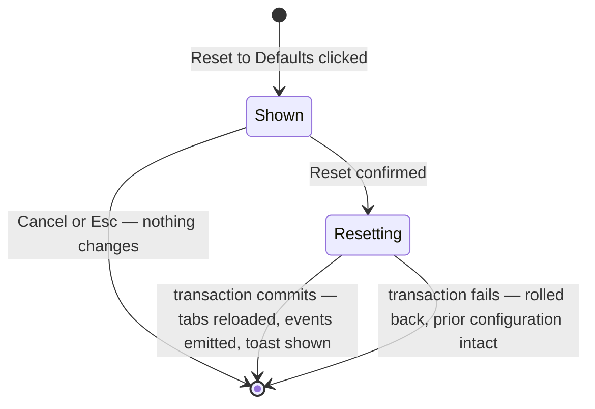

# Sub-dialog — Reset Confirmation

**Status:** Draft
**Owner:** coder, tester
**Audience:** coder, tester
**Last Updated:** 2026-05-22
**Cross-references:**
`06_Settings_Dialog/description.md`,
`06_Settings_Dialog/state_machine.md`,
`06_Settings_Dialog/flow_diagram.md`,
`08_Cross_Cutting/08-G_feature_flags.md`,
`10_Domain_and_Data/02_DTOS_AND_ENUMS.md`,
`10_Domain_and_Data/06_IMPORT_FORMATS.md`

The Reset Confirmation sub-dialog is the guard in front of the Reset to Defaults
action. It states plainly what a reset wipes and what it preserves, and it
requires an explicit confirmation before the destructive transaction runs. On
confirm, the application wipes the configuration tables and re-seeds the
bundled-default providers and the in-code setting defaults. This document also
covers the related per-row Reset action, which is a narrower, non-destructive
revert.

---

## Table of Contents

1. Role and trigger
2. Layout and text
3. Buttons
4. What is reset
5. What is preserved
6. The bundled-default seed
7. After confirm — the reset transaction
8. The per-row Reset action
9. State machine
10. Edge cases
11. Function inventory

---

## 1. Role and trigger

The Reset Confirmation sub-dialog is a warning Modal Dialog that opens on top of
the Settings Dialog. It is triggered only by the footer Reset to Defaults button.
Reset to Defaults is the **only** path to factory defaults; no other control
restores them. The sub-dialog exists because the reset is irreversible and
discards any unsaved working edits, so a deliberate confirmation is required
before the wipe.

The base Settings Dialog is non-interactive while this sub-dialog is open
(`state_machine.md` §5).

## 2. Layout and text

The sub-dialog is a compact modal with a heading, an itemised body, a
preservation note, and two footer buttons. The body states:

> **Reset all settings to factory defaults?**
>
> This will:
>
> - Replace the provider catalog with the three bundled providers — Ollama, LM
>   Studio, and llama.cpp. Any provider you added — OpenAI, Azure, Anthropic,
>   Gemini, or another — is removed.
> - Reset every general setting: theme, evaluation thresholds, retry and timeout
>   values, logging options, and every other key in the setting registry.
> - Reset the embedding-model selection.
>
> Your benchmark runs, their results, and your saved log files are not affected.

The body is plain text; it names the consequences in the user's terms and does
not use technical key names.

## 3. Buttons

| Button | Behaviour |
|---|---|
| Cancel | Closes the sub-dialog; nothing changes. Activated by clicking. |
| Reset | Executes the reset transaction (§7). Styled as the destructive action. Activated by clicking. |

Cancel sits to the left of Reset in the dialog footer and is the only path back out apart from the title-bar close (X) glyph; the destructive Reset button is deliberately placed where the user must aim for it, never adjacent to an inadvertent click target.

## 4. What is reset

A confirmed reset clears and re-seeds three areas of persisted state:

| Area | Effect of the reset |
|---|---|
| Provider catalog | Every `providers` and `provider_models` row is deleted; the three bundled providers are re-seeded (§6). Every user-added provider is removed. |
| Embedding selection | The `embedding.selected_provider_name` / `embedding.selected_model_name` keys are cleared with the rest of `app_settings`; the embedding selection returns to its post-seed state (the first available embedding model auto-selected on next probe, or empty if none is available — `06_Settings_Dialog/description.md` §3.4). |
| User-saved settings | Every `app_settings` row is deleted; each key reverts to its in-code default (`08_Cross_Cutting/08-G_feature_flags.md`). |

The reset operates at the persistence layer, so it also discards any unsaved
working edits in the Settings Dialog: the wipe-and-reseed replaces the whole
configuration, working edits included (EC-SET-5).

## 5. What is preserved

A reset touches only configuration. It does not affect:

- Benchmark runs and their results — every `runs` and `results` row is
  untouched.
- Discovered model capability data.
- Per-run result-table view state stored against `run_id`.
- Saved log files on disk — the per-run logs and the app log are untouched.
- Window geometry and other opaque UI-state keys are reset along with all other
  `app_settings` rows; the dialog re-centres on its parent on next open
  regardless, so this has no visible effect.

The confirmation text states the run-and-result preservation explicitly so the
user can act without fear of losing benchmark history.

## 6. The bundled-default seed

The reset re-seeds the provider catalog with exactly three providers — the
local, no-credential providers the application ships with. Each is seeded
`enabled = false` until the user enables it.

Each row is inserted via `ProvidersStore.add(draft)`, so the `provider_id` is a freshly-generated UUID4 (DD-33) — never `ollama_local`, `lm_studio_local`, or `llama_cpp_local` as in earlier drafts. The user sees only the `name` column in the Settings provider table.

| `name` (user-visible) | Type | Base URL | API key |
|---|---|---|---|
| Ollama (local) | `openai_compatible` | `http://localhost:11434/v1` | empty (no key needed) |
| LM Studio (local) | `openai_compatible` | `http://localhost:1234/v1` | empty (no key needed) |
| llama.cpp (local) | `openai_compatible` | `http://localhost:8080/v1` | empty (no key needed) |

All three are local `openai_compatible` providers that need no API key, so each
seeds with an empty API-key field and an `none` auth badge. No cloud provider is
part of the seed; a cloud provider needs an API key (entered as the name of an
environment variable, per D-R-18) and is always user-added. The settings half of
the seed is the in-code defaults map — every key at the default value listed in
the setting registry.

## 7. After confirm — the reset transaction

On Reset, the application runs one atomic Data Store transaction
(`flow_diagram.md` §C):

1. Begin the transaction.
2. Delete every row from `app_settings` (which holds the embedding selection
   keys), `providers`, and `provider_models`.
3. Insert the three bundled providers (§6) and the in-code setting defaults.
4. Commit. The transaction is all-or-nothing; a failure rolls back and leaves the
   prior configuration intact.
5. The Settings Dialog discards its working copy and reloads both tabs from the
   re-seeded state.
6. The dialog emits `_provider_registry_reloaded` and `_app_settings_changed`.
7. A toast `Settings reset to defaults` is shown; the dialog is clean.

## 8. The per-row Reset action

The per-row Reset action on a provider table row is a different, narrower
operation and is **not** a factory reset.

- It reverts the unsaved edits of **one** provider row to the value last
  persisted in the Data Store for that `provider_id` — a current-session-scoped
  revert.
- It does **not** open this confirmation sub-dialog; the per-row revert is
  reversible by re-editing and is not destructive of persisted state.
- A bundled provider and a user-added provider behave identically under the
  per-row Reset.
- If the row was added in the current session and never persisted, there is no
  persisted value to revert to, so the per-row Reset removes the row.
- No Data Store write happens; the revert changes only the in-memory working
  copy, and the Settings Dialog stays dirty if other rows still carry edits.

The footer Reset to Defaults restores factory defaults for the whole
configuration; the per-row Reset reverts one row to its persisted value. The two
are deliberately distinct (`06_Settings_Dialog/description.md` §3.3).

## 9. State machine

## 10. Edge cases

| ID | Description | Handling |
|---|---|---|
| EC-SET-5 | Reset to Defaults is confirmed while the Settings Dialog has unsaved edits. | The confirmation text states the working edits will be discarded; on confirm, the wipe-and-reseed replaces the whole configuration, working edits included. |

## 11. Function inventory

| Action | Description | Gated by |
|---|---|---|
| Confirm Reset | Run the atomic wipe-and-reseed transaction. | The sub-dialog is open. |
| Cancel | Close the sub-dialog; nothing changes. | The sub-dialog is open. |
| Per-row Reset | Revert one provider row's unsaved edits to its last-persisted value, or remove a never-persisted session-added row. | The row has unsaved edits, or the row is session-added. |
