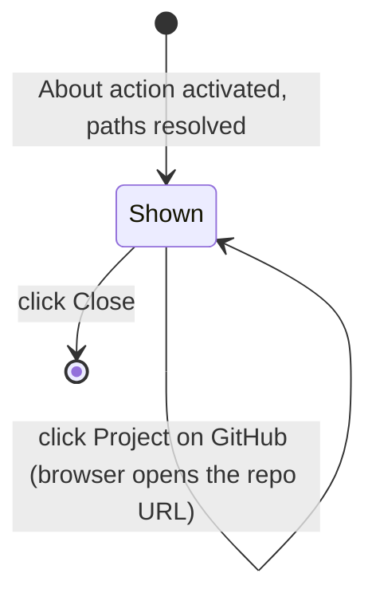

# About Dialog

**Status:** Draft
**Owner:** architect
**Audience:** coder, tester, human
**Last Updated:** 2026-06-06
**Cross-references:** `07_Common_Dialogs/mockup.html`; `08_Cross_Cutting/08-L_ui_standardization.md`; `01_Main_Window/description.md`

The About dialog is a small informational modal that identifies the application, describes briefly what it does, links to the project's GitHub repository, and exposes the on-disk folder locations a user needs when inspecting logs or reporting a bug — the application-data folder and its log subfolders. It carries no settings and changes nothing; it shows the application name and build version, gives the user one-click ways to copy the data-folder path and open folder locations in the operating-system file manager, and opens the GitHub repository in the browser.

---

## Table of Contents

1. [Purpose and Scope](#1-purpose-and-scope)
2. [Invoking Surface](#2-invoking-surface)
3. [Layout](#3-layout)
4. [Identity Block](#4-identity-block)
5. [Paths Block](#5-paths-block)
6. [Folder Actions](#6-folder-actions)
7. [Default State](#7-default-state)
8. [Button Behaviour](#8-button-behaviour)
9. [State Machine](#9-state-machine)
10. [Out of Scope](#10-out-of-scope)
11. [Edge Cases](#11-edge-cases)
12. [Function Inventory](#12-function-inventory)

---

## 1. Purpose and Scope

The dialog identifies the application, describes what it does, links to the GitHub repository, and surfaces the file-system locations a user reaches when inspecting logs or reporting a bug. It is read-only: it persists nothing, edits nothing, and emits no event on the event bus. Closing it leaves the application in exactly the state it was in before the dialog opened.

The dialog is the application's always-available home for reaching the on-disk data: the single application-data-folder row with its Copy-path and Open-folder actions. The minimal menu bar carries no Help menu (`08-L` §2.2), so the folder-open affordance that a conventional Help menu would hold lives here instead; the dedicated per-subfolder open actions (Run Logs, App Logs) live in Settings → Storage.

## 2. Invoking Surface

The dialog is opened by the **About** action in the menu bar. The menu bar carries exactly the Settings action, the About action, the workspace switcher, the running pill, and the version string (`08-L` §2.2); the **About** action is always enabled, including while a benchmark run is in progress, because the dialog is read-only and never blocks a run.

The dialog is centred over the Main Window. It is not resizable (`08-L` §13).

## 3. Layout

See `mockup.html`, panel **About**. The body is a vertical stack of two regions:

1. The **identity block** — the application name, build version, a short description, and the `Project on GitHub` repository link (§4).
2. The **paths block** — labelled path rows, each with its own action button(s) (§5).

The footer uses a single right-most primary button, **Close** (`08-L` §5.3). There is no side-action cluster.

## 4. Identity Block

The identity block, at the top of the body, shows:

| Element | Content |
|---|---|
| Application name | `Ollama LLM Bench`, rendered as the prominent heading of the block. |
| Version | The application build version string (for example `v2.4.1`), **injected at build time** into the running build's version metadata, rendered below the name in the muted role. The version is **optional**: if the build did not inject a version string, the version line is simply omitted (the dialog does not fabricate one; see EC-AB-6). |
| Description | A short muted description of what the application is: `Ollama LLM Bench — a local-first desktop tool for benchmarking large language models. It runs your benchmark tasks against local and cloud providers and grades the results.` |
| Repository link | A link labelled `Project on GitHub` that opens the project's GitHub repository in the user's default browser (via the OS adapter). This is where the user can read documentation and file a bug report. |

When present, the version string shown here is the same string shown in the menu bar's right cluster and in the status bar's right region (`08-L` §2.2, §4); all three read the same source. The repository URL is a fixed build-time constant.

## 5. Paths Block

The paths block shows the one folder a user needs to reach — the **application-data folder**. It is a single row with the field-row anatomy of `08-L` §8.1 reduced to a label, a read-only path display, and its action buttons:

| Row | Label | Path shown | Actions |
|---|---|---|---|
| Application-data folder | `Application data folder` | The absolute path of the application-data folder root — the folder that holds the database, the logs, and the exports. | **Copy path** and **Open folder**. |

The path is resolved on open from the application's path service; it is the live, OS-specific location the application is actually using. The path text is rendered in the monospaced role and truncates with an ellipsis when it cannot fit, exposing the full text in a hover tooltip (`08-L` §13). The logs and exports live in subfolders of this folder — `logs/app/` holds `app.log`, `logs/run/` holds the per-run logs, and `exports/` holds direct-save exports — so opening the application-data folder reaches them all. There are no separate per-subfolder rows.

## 6. Folder Actions

### 6.1 Copy path

The application-data folder row carries a **Copy path** button (the clipboard glyph, `08-L` §10). Activating it writes the **untruncated** application-data folder path to the system clipboard through the OS adapter, then shows a brief confirmation toast `Path copied.` in the status bar. The dialog stays open. This is the path a user can reference when reporting a bug (for example, to locate `app.log` under the folder's `logs/` subfolder).

### 6.2 Open folder

The application-data folder row carries an **Open folder** button (the open-folder glyph, `08-L` §10). Activating it asks the OS adapter to reveal the application-data folder in the operating-system file manager; from there the user can navigate into its `logs/` and `exports/` subfolders. The dialog stays open after an **Open folder** action.

The application-data folder is created at startup, so it always exists when the dialog is open; if for any reason it is missing, the OS adapter creates it before revealing it, so the action never fails.

## 7. Default State

On open:

- The identity block shows the application name and the live version string.
- The three path rows are populated with the live, resolved, OS-specific paths.
- Focus is on the **Close** primary button; `Enter` and `Escape` both close the dialog.
- No action has been taken; the clipboard and the file manager are untouched.

## 8. Button Behaviour

| Button | Position | Style | Behaviour |
|---|---|---|---|
| Copy path | Application-data folder row | Icon button (clipboard glyph) | Writes the untruncated data-folder path to the system clipboard; shows the `Path copied.` toast. Does not close the dialog. Always available. |
| Open folder | Application-data folder row | Icon button (open-folder glyph) | Reveals the application-data folder in the OS file manager; creates it first if it is missing. Does not close the dialog. Always available. |
| Project on GitHub | Identity block | Hyperlink / link button | Opens the project's GitHub repository URL in the user's default browser via the OS adapter. Does not close the dialog. Always available. |
| Close | Right cluster, right-most (primary) | Filled primary | Dismisses the dialog. Activated by clicking. |

The dialog is dismissed by clicking the Close button or the close (X) glyph in the title bar. There are no keyboard shortcuts or accelerators. Every icon button carries a hover tooltip stating its action (`08-L` §9, §10) — for example `Copy the application data folder path`, `Open the application data folder`.

## 9. State Machine

## 10. Out of Scope

The About dialog deliberately does **not** contain:

- **Licence text.** The licence ships with the application's documentation, not in this dialog.
- **Contributor or credits lists.** Kept in the documentation.
- **An update check or release-notes view.** Update behaviour is specified separately and is not surfaced here.
- **Any setting or editable field.** All configuration lives in the Settings dialog; this dialog is strictly read-only.
- **Any diagnostic archive or support-bundle generation.** The application has no support bundle and no crash reporting (D-R-17). This dialog only shows information, links to the GitHub repository, and reveals folder locations — it assembles, packages, and exports nothing.

## 11. Edge Cases

| ID | Situation | Handling |
|---|---|---|
| EC-AB-1 | The application-data folder is missing on open (unexpected — it is created at startup). | The **Open folder** action still appears. The OS adapter creates the missing folder, then reveals it. The action does not fail. |
| EC-AB-2 | The OS file manager cannot be launched (no file manager, or the OS integration fails). | The open action raises an `OsAdapterError`, surfaced as a toast `Could not open the folder.` The dialog stays open and usable. |
| EC-AB-3 | The system clipboard is unavailable when **Copy path** is clicked. | The copy raises an `OsAdapterError`, surfaced as a toast `Could not copy the path.` The dialog stays open. |
| EC-AB-4 | A path is too long for its row. | The path text truncates with an ellipsis and exposes the full path in a hover tooltip (`08-L` §13). **Copy path** always copies the full, untruncated path regardless of the visible truncation. |
| EC-AB-5 | The About action is activated while a benchmark run is in progress. | The dialog opens normally. It is read-only and modal over the Main Window; it does not pause, interrupt, or otherwise affect the running run. |
| EC-AB-6 | No build version was injected at build time. | The version line is **omitted** entirely (the dialog does not fabricate or show a placeholder version); the application name, description, repository link, and path rows are unaffected and the dialog opens normally. |
| EC-AB-7 | The default browser cannot be launched for the `Project on GitHub` link. | The open raises an `OsAdapterError`, surfaced as a toast `Could not open the repository link.` The dialog stays open and usable. |

## 12. Function Inventory

| Action | Description | Gated by |
|---|---|---|
| Open dialog | Show the application identity and the three resolved folder paths. | The **About** menu-bar action is activated. Always available. |
| Copy path | Write the untruncated application-data folder path to the system clipboard. | Always available while the dialog is open. |
| Open application-data folder | Reveal the application-data folder root in the OS file manager (its `logs/` and `exports/` subfolders are reached from there). | Always available while the dialog is open. |
| Open repository | Open the project's GitHub repository URL in the default browser. | Always available while the dialog is open. |
| Close | Dismiss the dialog. | Always available. |
