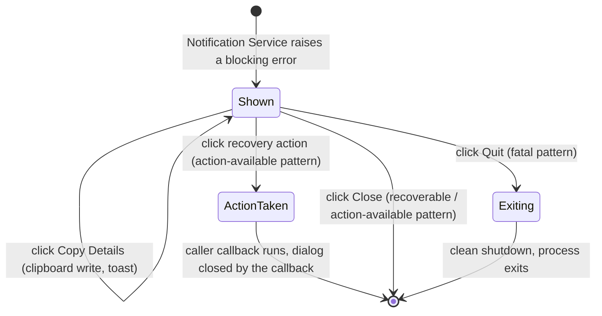

# Error Dialog

**Status:** Draft
**Owner:** architect
**Audience:** coder, tester, human
**Last Updated:** 2026-05-22
**Cross-references:** `07_Common_Dialogs/mockup.html`; `08_Cross_Cutting/08-L_ui_standardization.md`; `08_Cross_Cutting/08-J_event_bus_catalog.md`; `10_Domain_and_Data/02_DTOS_AND_ENUMS.md`; `11_Services_and_Algorithms/17_ERROR_TAXONOMY.md`

The Error dialog is the application's single generic blocking error modal. It is raised by the Notification Service when an error must be acknowledged before the user can continue, and never constructed directly by a widget. It presents a redacted, human-readable description of one failure, an optional caller-supplied recovery action, and a way to copy the diagnostic detail (to paste into a bug report). The error taxonomy and the error-to-UX dispatch decide *when* this dialog appears; this document specifies *what it looks like and how it behaves* once it does.

---

## Table of Contents

1. [Purpose and Scope](#1-purpose-and-scope)
2. [Invoking Surface](#2-invoking-surface)
3. [Relationship to the Error Taxonomy](#3-relationship-to-the-error-taxonomy)
4. [Layout](#4-layout)
5. [Three Error Patterns](#5-three-error-patterns)
6. [Content Composition](#6-content-composition)
7. [Source of the displayed text](#7-source-of-the-displayed-text)
8. [Default State](#8-default-state)
9. [Button Behaviour](#9-button-behaviour)
10. [State Machine](#10-state-machine)
11. [Out of Scope](#11-out-of-scope)
12. [Edge Cases](#12-edge-cases)
13. [Function Inventory](#13-function-inventory)

---

## 1. Purpose and Scope

The dialog shows exactly one error at a time. It is **blocking and modal**: while it is open the user cannot interact with the window behind it, and the error must be acknowledged before work resumes. It is the surface used when the error-to-UX dispatch (`11_Services_and_Algorithms/17_ERROR_TAXONOMY.md` §6.6) selects the `MODAL_DIALOG` surface for an error.

The dialog is generic. It has no knowledge of *which* operation failed; everything it shows — the title, the message, the diagnostic detail, the optional action — is supplied by the caller through the Notification Service. The dialog renders that payload in one of three fixed patterns (§5).

The dialog is the surface for *user-actionable* and *fatal* errors. It is **not** the surface for in-flight transient errors during a benchmark run (those are quiet — `LOG_ONLY | HEALTH_AMBER | RESULT_ROW`), nor for inline field-validation errors, nor for programmer errors (which bypass the Notification Service entirely and reach the process-terminal crash dialog).

## 2. Invoking Surface

The dialog is raised through the Notification Service, the single application service for all user-facing notifications. A caller requests a blocking error; a non-blocking request instead produces a transient toast in the status bar and never opens this dialog.

The request carries:

| Field | Meaning |
|---|---|
| `title` | The dialog's heading — a short statement of what failed (for example `Save failed`). |
| `message` | A one- or two-sentence plain-language description of the failure and, where useful, what the user can do. |
| `detail` | The redacted diagnostic text — the error type and message, optionally an `ErrorContext` summary. Optional; omitted for a self-explanatory error. |
| `pattern` | One of the three patterns of §5: recoverable, action-available, or fatal. |
| `action` | For the action-available pattern only: the label and the callback of the recovery action. |

The Notification Service serializes blocking errors: if a second blocking error is requested while one Error dialog is open, the second is queued and shown after the first is dismissed (§12, EC-ERR-3).

The dialog is centred over the Main Window. It is **not** movable and **not** resizable (`08-L` §13) — a blocking error is meant to be read and dismissed, not set aside.

## 3. Relationship to the Error Taxonomy

`11_Services_and_Algorithms/17_ERROR_TAXONOMY.md` defines the four error categories — **transient**, **permanent**, **user**, and **programmer-error** — and the data-driven dispatch that maps a typed error to a set of UI surfaces. The Error dialog is the realisation of the `MODAL_DIALOG` surface in that dispatch. The mapping between an error's category and the pattern this dialog uses:

| Error category | Reaches the Error dialog? | Pattern (§5) |
|---|---|---|
| Transient | Only the persistent variants that escalate to a run-level failure (for example a `ProviderQuotaExhaustedError` that sets `RUN_FAILED`). | Recoverable, or action-available when the caller supplies an action. |
| Permanent | The variants the dispatch marks `MODAL_DIALOG` — `ProviderQuotaExhaustedError`, `DatabaseDiskFullError`. | Recoverable. |
| User | The variants the dispatch marks `MODAL_DIALOG` — `ProviderAuthError`, `MissingEnvVarError`, `ConfigurationError`. | Action-available, with the action pointing the user at the fix. |
| Programmer-error | No. A `ProgrammerError` bypasses the Notification Service and this dialog entirely; it reaches the process-terminal crash dialog. | Not applicable. |

The fatal pattern of this dialog (§5) is reserved for a small set of **startup-blocking** failures — for example a data-store integrity failure that prevents the application from opening at all. A fatal error of this kind is surfaced through the Error dialog before the Main Window is usable, with the only outcome being a clean application exit. It is distinct from a `ProgrammerError` crash dialog, which is for an in-process invariant break.

## 4. Layout

See `mockup.html`, panel **Error**. The body is a vertical stack:

- A **title row** in the dialog header — the `title` text with the error glyph (the cross-mark glyph from `08-L` §10) tinted with the `error.base` role from `08-L` §9.
- A **message block** — the `message` text, rendered in the standard body text role.
- A **detail block** — present only when the caller supplied `detail`. It is a monospaced, muted, read-only block holding the redacted diagnostic text. It is selectable so the user can read it; copying is done through the **Copy Details** button rather than by manual selection.

The footer follows `08-L` §5.3. The exact button set depends on the pattern (§5); the standardized footer (`08-L` §5.3) is **Copy Details** as a back-out-adjacent action and **Close** as the right-most primary.

## 5. Three Error Patterns

The dialog renders one of three patterns. The pattern is fixed by the caller; the dialog never changes pattern after it opens.

### 5.1 Recoverable

The failure is over and the user simply needs to know it happened. The application state is intact and the user may retry the operation themselves.

- **Footer:** **Copy Details**, then **Close** as the right-most primary.
- **Close** dismisses the dialog and returns the user to exactly where they were. Nothing else happens.
- This is the default pattern for a permanent error and for a transient error that escalated to a visible failure.

### 5.2 Action available

The failure has a known fix the application can take the user to. The dialog offers a recovery action in addition to dismissal.

- **Footer:** **Copy Details** in the left-of-cluster position, then the **recovery action** button, then **Close** as the right-most primary.
- The **recovery action** is caller-supplied — its label is the caller's `action.label` (for example `Open Settings`, `Open Run Log`) and activating it runs the caller's `action` callback. A typical callback closes the Error dialog and opens the Settings dialog focused on the offending provider, so the user can correct an authentication or environment-variable problem.
- **Close** dismisses the dialog without taking the recovery action.
- This is the pattern for a user-category error — `ProviderAuthError`, `MissingEnvVarError`, `ConfigurationError`.

### 5.3 Fatal

The failure prevents the application from running. There is no way to continue; the only outcome is a clean exit.

- **Footer:** **Copy Details** in the left-of-cluster position, then **Quit** as the right-most primary, styled with the destructive style (`08-L` §6) so it is visually distinct from an ordinary confirm. There is **no Close button** — the dialog cannot be dismissed back into a broken application.
- **Quit** runs the application's clean-shutdown sequence and exits the process.
- `Escape` does **not** dismiss a fatal dialog; there is no back-out action, so `Escape` does nothing (`08-L` §7).
- The fatal pattern is reserved for the startup-blocking failures of §3 — for example a data-store that cannot be opened. The `message` for a fatal error states the consequence plainly (`The application cannot start.`) and, where a manual remediation exists, the `detail` block includes the relevant file path.

## 6. Content Composition

The dialog renders the caller's payload verbatim, with no rewriting:

- **`title`** — a short noun phrase naming the failed operation. It never contains a stack frame, an exception class name, or a file path.
- **`message`** — one or two sentences. For a recoverable error it states what failed. For an action-available error it states what failed and names the fix the action button performs. For a fatal error it states the consequence (`The application cannot start.`).
- **`detail`** — the redacted diagnostic. It holds the application error leaf type and its message (for example `ProviderAuthError: provider rejected the credential`) and, when present, a short `ErrorContext` summary (`provider_id`, `http_status`, `correlation_id`). It never holds a secret, a full credential, or unredacted free text — see §7.

The dialog never derives content; if the caller supplies no `detail`, the detail block and the **Copy Details** button are both absent.

## 7. Source of the displayed text

The dialog renders the caller's `title`, `message`, and `detail` strings verbatim. The dialog itself performs **no** redaction and no formatting of error text — it is a passive renderer.

**Provider naming in the message (DD-33).** When an error message names a provider — as the action-available `ProviderAuthError` message does — the caller composes the message using the **run-data snapshot name**, never the internal `provider_id`. For a run-scoped failure that is `BenchmarkRun.judge_provider_name` (judge role) or `BenchmarkResult.provider_name` (test role); both are the display-fidelity name snapshotted at run/task start (DD-33, `08_Cross_Cutting/08-F_spec_issues_log.md`; `10_Domain_and_Data/02_DTOS_AND_ENUMS.md` §"Snapshot rendering rule"). The internal `provider_id` UUID4 is never shown in the user-facing `title` or `message`; it appears only in the optional `detail` block as part of the `ErrorContext` summary (§6), where it serves diagnostics. This keeps the user-facing message stable against later catalog renames and never leaks the internal id. The `detail` text is whatever the caller placed in `AppError.message` (or an `ErrorContext` summary derived from it). For errors raised by a provider adapter, `AppError.message` is the SDK exception's message string after the adapter applied `redact(text)` at the boundary (`10_Domain_and_Data/08_REDACTION_PATTERNS.md` surface 2, `11_Services_and_Algorithms/17_ERROR_TAXONOMY.md` §6.5) — that wrap point is where the canonicalisation happens. The dialog does not redact again. For errors raised inside the application's own code, `AppError.message` is application-authored text that does not require redaction.

## 8. Default State

On open:

- The dialog renders the caller's `title`, `message`, and — if supplied — `detail`.
- The footer carries the buttons for the caller's pattern (§5).
- Focus is on the right-most primary button — **Close** for the recoverable and action-available patterns, **Quit** for the fatal pattern. `Enter` activates it.
- For the recoverable and action-available patterns, `Escape` activates **Close**. For the fatal pattern, `Escape` does nothing.
- The window behind the dialog is inert until the dialog is dismissed.

## 9. Button Behaviour

| Button | Pattern | Position | Style | Behaviour |
|---|---|---|---|---|
| Copy Details | All, only when `detail` was supplied | Left of the right cluster | Outlined muted | Copies the redacted `detail` text to the system clipboard via the OS adapter. Shows a brief confirmation toast `Details copied.` Does not close the dialog. |
| Recovery action | Action available only | Right cluster, left of primary | Outlined muted | Runs the caller-supplied `action` callback. The callback typically closes this dialog and opens the relevant Settings surface. |
| Close | Recoverable, action available | Right cluster, right-most (primary) | Filled primary | Dismisses the dialog; returns to the prior surface. Activated by clicking. |
| Quit | Fatal only | Right cluster, right-most (primary) | Filled destructive | Runs the clean-shutdown sequence and exits the process. Activated by clicking. |

The dialog is dismissed by clicking the Close button or, for a recoverable error, the title-bar close (X) glyph; the primary button is activated by clicking it. A fatal dialog has no close (X) glyph — the only way out is the Quit button. There are no keyboard shortcuts or accelerators.

## 10. State Machine

## 11. Out of Scope

The Error dialog is **not** the surface for the following; each has its own surface:

- **Inline, non-modal field errors.** A validation failure on a form input — an invalid provider URL, a malformed task name — shows in the field's validation strip (`08-L` §8.1), not in this dialog.
- **Transient run-time noise.** An in-flight transient provider error during a benchmark run is quiet; it surfaces as `LOG_ONLY`, an amber health dot, and a row-level failure status, with at most a first-occurrence toast (`11_Services_and_Algorithms/17_ERROR_TAXONOMY.md` §6.6). It does not raise this dialog.
- **Run-level result failures.** A single failing `BenchmarkResult` is recorded against the result row (`RESULT_ROW`) and read on the Result widget; it does not raise a modal.
- **Programmer errors.** A `ProgrammerError` bypasses the Notification Service entirely and reaches the process-terminal crash dialog. The crash dialog is a separate surface, not this one.
- **Toasts and banners.** A non-blocking informational or warning notification is a status-bar toast, not this dialog.

## 12. Edge Cases

| ID | Situation | Handling |
|---|---|---|
| EC-ERR-1 | The caller supplies no `detail`. | The detail block and the **Copy Details** button are both absent. The footer collapses to just the pattern's confirm button (and the recovery action, for the action-available pattern). |
| EC-ERR-2 | The `message` or `detail` text is very long. | The body becomes vertically scrollable within the fixed dialog size; the dialog itself does not resize (`08-L` §13). The footer stays fixed at the bottom. |
| EC-ERR-3 | A second blocking error is raised while an Error dialog is open. | The Notification Service queues the second error and shows it only after the first is dismissed. Two Error dialogs are never visible at once. |
| EC-ERR-4 | The recovery action's callback fails. | The failure is itself an application error; it is dispatched through the normal error-to-UX path. If it warrants a modal, it is queued behind the dialog the callback was invoked from (EC-ERR-3). |
| EC-ERR-5 | A fatal error is raised before the Main Window is shown. | The Error dialog is shown on its own, centred on screen, with the fatal pattern. **Quit** is the only outcome; the Main Window never appears. |
| EC-ERR-6 | The clipboard write for **Copy Details** fails (OS clipboard unavailable). | The copy raises an `OsAdapterError`, which the dispatch surfaces as a toast `Could not copy to the clipboard.` The Error dialog stays open and usable. |
| EC-ERR-7 | The user clicks the recovery action, fixes the problem, and the same operation is retried. | The recovery action's callback decides; a typical callback closes this dialog and opens Settings. Whether the failed operation re-runs automatically is the caller's behaviour, not this dialog's. |

## 13. Function Inventory

| Action | Description | Gated by |
|---|---|---|
| Show error | Render a caller-supplied blocking error in one of the three patterns. | The Notification Service received a blocking-error request; no other Error dialog is currently open. |
| Copy Details | Copy the redacted diagnostic text to the system clipboard. | The caller supplied a `detail` string. |
| Recovery action | Run the caller-supplied recovery callback. | The error uses the action-available pattern. |
| Close | Dismiss the dialog and return to the prior surface. | The error uses the recoverable or action-available pattern. |
| Quit | Run a clean shutdown and exit the process. | The error uses the fatal pattern. |
