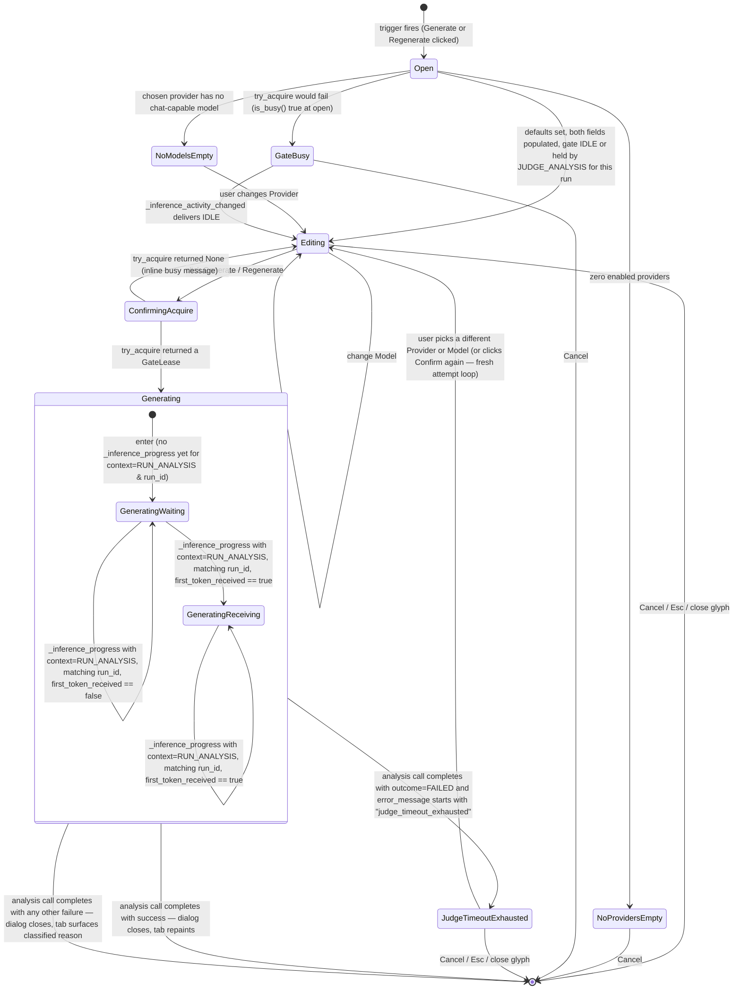

# Generate Analysis Dialog

**Status:** Draft
**Owner:** architect
**Audience:** coder, tester, human
**Last Updated:** 2026-06-06
**Cross-references:** `05_Result_Widget/tabs/run_analysis_tab.md`; `07_Common_Dialogs/mockup.html`; `08_Cross_Cutting/08-A_architecture_principles.md`; `08_Cross_Cutting/08-E_interfaces_contracts.md`; `08_Cross_Cutting/08-H_app_modes.md`; `08_Cross_Cutting/08-I_edge_cases.md`; `08_Cross_Cutting/08-J_event_bus_catalog.md`; `08_Cross_Cutting/08-L_ui_standardization.md`; `10_Domain_and_Data/02_DTOS_AND_ENUMS.md`; `11_Services_and_Algorithms/22_RUN_ANALYSIS_SERVICE.md`

The Generate Analysis dialog is the small modal that opens whenever the user clicks the **Generate analysis** button (when the run has no `run_analysis` yet) or the **Regenerate analysis** button (when it already has one) on the Result Widget's Run Analysis tab. It lets the user pick the `(provider, model)` pair used to produce the consolidated run-level narrative for the selected run. On confirm, it hands the chosen pair to the Run Analysis Service through the parent controller and closes; the Run Analysis tab shows a spinner until the new text arrives.

---

## Table of Contents

1. Purpose and Scope
2. Invoking Surface
3. Layout
4. Provider and Model selection
5. Default selection rule
6. Filter rule
7. Validation and soft warnings
8. Confirm behaviour and the single-inference gate
9. Cancel behaviour
10. State Machine
11. Edge Cases
12. Function Inventory

---

## 1. Purpose and Scope

The dialog is the user's choice point for which `(provider, model)` pair generates the consolidated run-level narrative — the single Markdown body that becomes `BenchmarkRun.run_analysis` (see `10_Domain_and_Data/02_DTOS_AND_ENUMS.md` §6.7). It does not aggregate, prompt, or call the model itself; the Run Analysis Service (`11_Services_and_Algorithms/22_RUN_ANALYSIS_SERVICE.md`) does. The dialog's job is to take a confirmed selection and dispatch the service call through the parent controller.

The same dialog covers both flows — the first generation and a regeneration — because the user choice is identical: pick the analysis model and confirm. The title and the primary button label change between **Generate Analysis** / **Generate** and **Regenerate Analysis** / **Regenerate** according to whether the selected run already has `run_analysis` set.

## 2. Invoking Surface

The dialog opens from a single trigger: the Generate / Regenerate button in the Result Widget's Run Analysis tab toolbar (`05_Result_Widget/tabs/run_analysis_tab.md` §7). The button is disabled (with a tooltip) while the run is non-terminal, while the run has zero completed results, or while the application-wide single-inference gate (`InferenceActivityStore`, `08_Cross_Cutting/08-E_interfaces_contracts.md` §13) is held by an activity other than `JUDGE_ANALYSIS` for the same run. The dialog therefore opens only from a state in which a generation could plausibly start.

The dialog is centred over the Main Window. It is modal to the Main Window, not resizable, and dismissed by `Escape` or the close glyph.

## 3. Layout

See `mockup.html`, panel **Generate Analysis**. The body is a short vertical stack:

```
+----------------------------------------------------------------+
| Generate Analysis            (or Regenerate Analysis)     [x]  |
+----------------------------------------------------------------+
| Provider   [ provider_dropdown                       v ]       |
| Model      [ model_dropdown (chat-capable only)      v ]       |
|                                                                |
| Generating the run analysis will call the chosen model once    |
| against the run's results. The chosen pair is used only for    |
| this call; the run's snapshot is not modified.                 |
|                                                                |
| (optional soft warning callout if reachability is uncertain)   |
| (optional gate-busy inline message)                            |
+----------------------------------------------------------------+
|                                       [ Cancel ] [ Generate ]  |
+----------------------------------------------------------------+
```

Layout rules:

- Two **field rows** — Provider then Model — each rendered with the standard `08_Cross_Cutting/08-L_ui_standardization.md` §8 field-row anatomy: label, control, optional strip beneath. Both controls are the shared `ui/shared/provider_dropdown` and `ui/shared/model_dropdown` widgets (consumer-wired, see §4).
- A short **explanatory paragraph** below the field rows stating what will happen on Confirm.
- An optional **soft warning callout** when reachability is uncertain (§7).
- An optional **gate-busy inline message** when the gate is held at open time (§11).
- A footer with the standard right cluster (`08_Cross_Cutting/08-L_ui_standardization.md` §5.3): **Cancel** as the back-out action, then the primary **Generate** or **Regenerate** button as the right-most action.

The title and the primary button label both reflect the trigger:

| Run has `run_analysis` already | Title | Primary button |
|:---:|---|---|
| no  | `Generate Analysis`    | `Generate`   |
| yes | `Regenerate Analysis`  | `Regenerate` |

## 4. Provider and Model selection

The Provider row hosts the shared `ui/shared/provider_dropdown` widget (`11_Services_and_Algorithms/01_SERVICE_INVENTORY.md` §3.1). The Model row hosts the shared `ui/shared/model_dropdown` widget. The two widgets are **independent**: the dialog wires them together — on every `provider_changed(provider_id)` emission from the Provider dropdown the dialog calls `model_dropdown.set_provider(provider_id)`. The Model dropdown then re-fetches its items for the chosen provider.

The Provider dropdown lists every **enabled** provider from the Provider Registry. There is no filter callable applied here — any enabled provider is a valid analysis-model host. When the user changes Provider, the Model selection is reset to the first item that the Model dropdown's filter (§6) admits. Until a provider is selected (the no-provider empty state of §11, EC-GA-1) the Model dropdown has nothing to populate from: it shows the placeholder `(no provider)` and is disabled, becoming active only once a provider is chosen.

## 5. Default selection rule

On open the dialog pre-fills both dropdowns:

1. **If the run's snapshot carries a judge model** (`RunSettingsSnapshot.judge_provider_id` and `RunSettingsSnapshot.judge_model_name` are both set — true for any run created with a judge configured, regardless of mode), the dialog defaults to that pair.
2. **Otherwise** (any run — including a `GRADED` run started with both the per-task judge phase and the run-level analysis toggle off, or a `TASKS` / `SYNTHETIC` run created without analysis requested), the dialog defaults to the **first enabled provider** and that provider's **first chat-capable model** (the same predicate the Model dropdown filter applies — see §6). When no provider is enabled, the empty-state path of §11 (EC-GA-1) applies.

The default is informational: the user can change either or both fields freely before confirming.

## 6. Filter rule

The Model dropdown is configured with a filter callable that admits only **chat-capable, non-embedding** models — the same predicate the Judge section in the New Benchmark widget uses (`02_New_Benchmark_Widget/description.md` §4.4). Concretely the filter excludes any model the `EmbeddingModelClassifier` (`11_Services_and_Algorithms/01_SERVICE_INVENTORY.md` §4.9) classifies as an embedding-only model and any model the `ModelCapabilityService` records as not chat-capable. The provider's full model list is fetched through the Provider Registry; the filter is applied per item.

The Provider dropdown has no filter applied here — the per-provider Model filter is sufficient to keep the selectable set sensible.

## 7. Validation and soft warnings

Validation is minimal:

| Rule | Severity | Surface |
|---|---|---|
| Provider selection is empty (no enabled providers exist at all). | Hard error. | The Provider field shows the empty state per §11 (EC-GA-1); the primary button is disabled. |
| Model selection is empty (the chosen provider has no chat-capable models). | Hard error. | The Model field shows the empty state per §11 (EC-GA-2); the primary button is disabled. |
| The chosen `(provider, model)` is not currently reachable (the provider's `ProviderHealth` is not OK, or the readiness verdict is `NOT_READY` for the pair). | Soft warning. | A `warn`-tone callout under the field rows reads: `The selected pair may be unreachable; the call will fail unless it recovers before Confirm.` The primary button stays enabled. |

A soft warning never blocks Confirm — a probe verdict can be stale, and the user is allowed to attempt the call. If the call cannot complete, the service returns `FAILED` and the Run Analysis tab surfaces the classified reason (`05_Result_Widget/tabs/run_analysis_tab.md` §9).

## 8. Confirm behaviour and the single-inference gate

On Confirm:

1. The dialog calls the parent controller's `regenerate_analysis(run_id, provider_id, model_name)` (or its equivalent for the first-generation case), which in turn calls `RunAnalysisService.generate(run_id, provider_id, model_name)` (`11_Services_and_Algorithms/22_RUN_ANALYSIS_SERVICE.md` §2.1).
2. The service first calls `InferenceActivityStore.try_acquire(InferenceActivity.JUDGE_ANALYSIS, ctx)` (see `08_Cross_Cutting/08-E_interfaces_contracts.md` §13 and `10_Domain_and_Data/02_DTOS_AND_ENUMS.md` §4.18, §7.8).
3. If `try_acquire` returns a `GateLease` (DD-50), the dialog **enters its Generating sub-state** — the field rows and the explanatory paragraph are replaced by a **live progress line** (see §8.1 below) that consumes `_inference_progress` events for the duration of the analysis call; the primary Confirm button is disabled (it is already disabled per D-037 during a regeneration); Cancel is the only remaining action. When the analysis call completes (success or failure), the dialog closes; on `GENERATED` the Run Analysis tab repaints with the new narrative via `_run_analysis_received`; on `FAILED` the tab surfaces the classified reason and the previously stored `run_analysis` (if any) is preserved.
4. If `try_acquire` returns `None` (a benchmark run, another judge analysis, a provider test, or a readiness probe started between the open and the click), the dialog **stays open** in the Editing sub-state and shows an inline `info`-tone message under the field rows: `An inference is currently in flight — please wait.` The primary button is **disabled** for as long as the gate is held. The dialog subscribes to `_inference_activity_changed` (`08_Cross_Cutting/08-J_event_bus_catalog.md` §5.7); when the gate returns to `IDLE` the primary button is re-enabled and the inline message clears, so the user may try again without re-opening the dialog.

The service releases the gate in `finally` once the model call completes (see `11_Services_and_Algorithms/22_RUN_ANALYSIS_SERVICE.md` §6.1a and §9), and the store's watchdog auto-releases `JUDGE_ANALYSIS` after 10 minutes as a safety net (`08_Cross_Cutting/08-I_edge_cases.md` EC-RUN-14).

### 8.1 Live progress line during the analysis call

While the analysis call is in flight (between step 3's `try_acquire` returning a lease and the call completing), the dialog renders a **live progress line** in place of the existing "Generating…" spinner text. The line is driven by the `_inference_progress` event (`08_Cross_Cutting/08-J_event_bus_catalog.md` §5.3, payload `InferenceProgressEvent`, `10_Domain_and_Data/02_DTOS_AND_ENUMS.md` §7.7a) filtered to:

- `context == InferenceContext.RUN_ANALYSIS`, and
- `run_id == <the run being analyzed>`.

Events that do not match both filters are ignored (the other three contexts — `BENCHMARK_TASK`, `BENCHMARK_JUDGE`, `PROVIDER_TEST` — belong to other surfaces). The line has two sub-states:

| Sub-state | Condition | Rendering |
|---|---|---|
| **A — waiting** | No matching `_inference_progress` snapshot has yet arrived with `first_token_received == True`. | `Waiting for response — N.N s` where the seconds value is `elapsed_ms / 1000` from the latest snapshot. Tone: `info`. |
| **B — receiving** | The latest matching `_inference_progress` snapshot has `first_token_received == True`. | `Receiving — N tokens · T.T s elapsed` where `N` is `tokens_received` and `T.T` is `elapsed_ms / 1000` from the latest snapshot. Tone: `primary`. |

Visibility and reset:

- The progress line is **shown** only while the analysis call is in flight; the field rows are hidden during this time.
- The progress line is **replaced** by the dialog's close on completion (success or failure). The dialog never renders the line for a completed call.
- When the token-estimation source on the call is the 4-character heuristic (no provider per-chunk `delta_tokens` and no provider running count — see `11_Services_and_Algorithms/02_LLM_CLIENT_PROTOCOL.md` §6.5a), the line appends `~` immediately before the token count (for example `Receiving — ~N tokens · T.T s elapsed`) to surface that the count is an approximation.
- The subscription is cleared on the dialog's terminal event (`_run_analysis_received` for success; the failure path delivers a different signal to the parent tab — see `05_Result_Widget/tabs/run_analysis_tab.md` §9).

## 9. Cancel behaviour

Cancel closes the dialog with no analysis generated and no state change. The Run Analysis tab returns to its prior state — `Generate analysis` / `Regenerate analysis` available again if the gating §7 rules in `05_Result_Widget/tabs/run_analysis_tab.md` are met. `Escape` and the title-bar close glyph are both Cancel affordances.

## 10. State Machine



The dialog never holds the gate itself. The transition `ConfirmingAcquire → Generating` is the moment the service has the gate; from that point the dialog renders the live progress line (§8.1) consuming `_inference_progress` events filtered to `context=RUN_ANALYSIS` and the run's `run_id`. The `Generating` composite state has two leaves — `GeneratingWaiting` and `GeneratingReceiving` — that correspond directly to the two sub-states of the progress line in §8.1. On success the dialog closes; the Run Analysis tab then repaints from `_run_analysis_received`. On a generic failure (provider unreachable, model returns empty text, gate-busy late race) the dialog also closes and the tab surfaces the classified reason. On the **role=JUDGE adaptive-timeout exhaustion** failure specifically (`error_message` prefixed `judge_timeout_exhausted`), the dialog transitions to the `JudgeTimeoutExhausted` sub-state instead: the dialog **stays open** with the failure callout from EC-GA-8 rendered in place of the progress line, Confirm is re-enabled, and the user can pick a different provider/model and try again immediately. This special sub-state exists because the canonical remedy is to switch judge models, and forcing the user to reopen the dialog from the parent tab would lose the in-flight context.

## 11. Edge Cases

| ID | Situation | Handling |
|---|---|---|
| EC-GA-1 | No enabled providers exist when the dialog opens. | The Provider dropdown shows the empty state `No enabled providers — open Settings to add one.` The Model dropdown, having no provider to populate from, shows the placeholder `(no provider)` and is disabled. Confirm is disabled; the dialog still opens for inspection so the user can read the message and click Cancel. |
| EC-GA-2 | The chosen provider has no chat-capable models. | The Model dropdown is empty; a soft warning under it reads `No chat-capable model for this provider. Pick a different provider.` Confirm is disabled while this state holds. |
| EC-GA-3 | `InferenceActivityStore.is_busy()` is true at open time. | The dialog opens for inspection; the inline `info`-tone message `An inference is currently in flight — please wait.` is shown under the field rows; Confirm is disabled with the tooltip `Another inference activity is in flight — please wait.` The dialog subscribes to `_inference_activity_changed` and re-enables Confirm when the gate returns to `IDLE`. |
| EC-GA-4 | The gate flips from `IDLE` to held by another activity after open and before the user clicks Confirm. | The dialog's subscription delivers the change; Confirm is disabled with the same tooltip and the inline busy message appears. |
| EC-GA-5 | The user clicks Confirm exactly as a benchmark run starts elsewhere. | `try_acquire(JUDGE_ANALYSIS)` returns `None` (DD-50); the dialog stays open and shows the inline busy message (§8 step 4). No model call is made. |
| EC-GA-6 | The chosen `(provider, model)` is not currently reachable. | A soft `warn`-tone callout appears under the field rows; Confirm stays enabled; on Confirm the call is attempted and, if it fails, the Run Analysis Service returns `FAILED` and the Run Analysis tab surfaces the classified reason — the previously stored `run_analysis`, if any, is preserved unchanged. |
| EC-GA-7 | A regeneration is in flight for the same run when the user opens the dialog a second time. | The Result Widget's button is already showing `Generating...` disabled per `05_Result_Widget/tabs/run_analysis_tab.md` §7, so the dialog cannot be re-opened by that path. If the dialog is somehow open while a regeneration is in flight (for example it was already open when the gate flipped), the gate-busy path of EC-GA-3 applies — the dialog is informational and Confirm is disabled. (There is no keyboard-accelerator open path: only the toolkit's modal Enter/Esc defaults exist, and they cannot open this dialog — D-R-07.) |
| EC-GA-8 | The analysis call exhausts the role=JUDGE adaptive-timeout ladder. | `RunAnalysisService.generate(...)` returns `RunAnalysisResult(outcome=FAILED, error_message="judge_timeout_exhausted: …")` (`11_Services_and_Algorithms/22_RUN_ANALYSIS_SERVICE.md` §6.4 and DD-34). The dialog detects the `judge_timeout_exhausted` prefix on the `error_message` and renders the user-facing failure callout **"The judge model failed to respond within the time budget after N attempts. Pick a different model and retry."** in `error` tone in place of the live progress line. The dialog stays open with Confirm re-enabled so the user can pick a different `(provider, model)` and try again immediately. The previously stored `run_analysis` (if any) is preserved unchanged. The `_judge_model_excluded` Event Bus event is NOT emitted from this path — the dialog's failure callout is the user's sole signal for analysis exhaustion (the event is reserved for the BENCHMARK_RUN activity, where the Event Log warning is needed because the user is not in the loop). The in-run consecutive-timeout counter for the role=JUDGE bucket resets when this activity ends, so a subsequent Confirm click starts a fresh count — but the persistent last-known-good budget for the same `(provider, model)` carries over, so retrying with the **same** judge model will likely fail again at the same rate. Picking a different judge model is the canonical remedy. |

## 12. Function Inventory

| Action | Description | Gated by |
|---|---|---|
| Open dialog | Show the Generate or Regenerate Analysis dialog with the snapshot-or-default selection pre-filled. | The Run Analysis tab's Generate / Regenerate button is enabled (`05_Result_Widget/tabs/run_analysis_tab.md` §7). |
| Pick Provider | Change the analysis-model provider; the Model dropdown re-populates. | At least one enabled provider exists. |
| Pick Model | Change the analysis model within the chosen provider. | At least one chat-capable model exists for the chosen provider. |
| Confirm (Generate / Regenerate) | Dispatch `RunAnalysisService.generate(run_id, provider_id, model_name)` through the parent controller. | Both selections non-empty; the gate is `IDLE` or held by `JUDGE_ANALYSIS` for this run. |
| Render live progress while the call is in flight | Subscribe to `_inference_progress` filtered to `context=InferenceContext.RUN_ANALYSIS` and matching `run_id`; render the two-sub-state progress line per §8.1. | The dialog is in the `Generating` sub-state (the service has acquired `JUDGE_ANALYSIS`). |
| Cancel | Close the dialog without producing or replacing the analysis. | Always while the dialog is open. Cancel is the only remaining action while in the `Generating` sub-state (Confirm is already disabled). |
