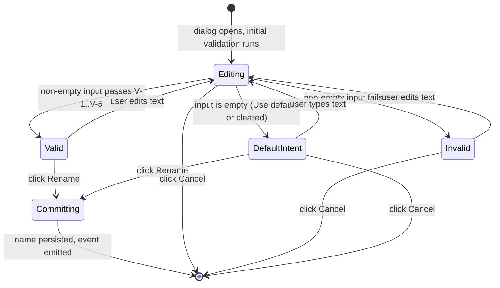

# Rename Run Dialog

**Status:** Draft
**Owner:** architect
**Audience:** coder, tester, human
**Last Updated:** 2026-06-06
**Cross-references:** `07_Common_Dialogs/mockup.html`; `08_Cross_Cutting/08-L_ui_standardization.md`; `08_Cross_Cutting/08-J_event_bus_catalog.md`; `08_Cross_Cutting/08-E_interfaces_contracts.md`; `10_Domain_and_Data/02_DTOS_AND_ENUMS.md`

The Rename Run dialog is a small modal dialog that lets the user give a benchmark run a custom display name, or revert it to the application-computed default name. It validates the typed name live and commits the change through the rename use case, which persists it and announces it on the event bus so every surface showing the run name updates immediately.

---

## Table of Contents

1. [Purpose and Scope](#1-purpose-and-scope)
2. [Invoking Surfaces](#2-invoking-surfaces)
3. [Layout](#3-layout)
4. [Fields](#4-fields)
5. [Validation Rules](#5-validation-rules)
6. [Use Default](#6-use-default)
7. [Default State](#7-default-state)
8. [Button Behaviour](#8-button-behaviour)
9. [State Machine](#9-state-machine)
10. [Commit Effects](#10-commit-effects)
11. [Edge Cases](#11-edge-cases)
12. [Function Inventory](#12-function-inventory)

---

## 1. Purpose and Scope

The dialog operates on exactly one `BenchmarkRun` identified by its `RunId`. It changes only the run's display name; it never touches run status, results, or the settings snapshot. The persisted name is either a non-empty custom string or `NULL`. A `NULL` name means the run continues to use the application-computed default name (canonical display format `Run N — <Mode display name> — YYYY-MM-DD HH:MM`, SPEC-077); the dialog never writes the computed name as a literal string into storage.

## 2. Invoking Surfaces

| Surface | Trigger | Availability |
|---|---|---|
| Resume Benchmark widget | Right-click a run row, choose **Rename...** | The run is in any non-running state. This is the canonical path. |
| Progress widget header | Click the pencil icon button | Only while the run displayed in the Progress widget is in a non-terminal stage. The button is hidden (not disabled) once the run reaches a terminal status, per `08-L` §1. This path lets the user rename the active run without switching workspaces. |

The Result widget has no rename affordance. To rename a finished run the user switches to the Resume Benchmark widget.

The dialog is centred over its invoking window and is not resizable (`08-L` §13).

## 3. Layout

See `mockup.html`, panel **Rename Run**. The body is a single form column:

- **Current name** — a read-only line showing the run's current effective name (the custom name, or the computed default if none is set).
- **New name** field row — a label, a format hint, a single-line input, and a validation strip, following the field-row anatomy in `08-L` §8.1.
- A muted **default-name preview** line that appears below the validation strip only while the input is empty or **Use default** has been pressed; it reads `Will use: <computed default name>`.

The footer carries the standard two-button right cluster (`08-L` §5.3): **Cancel**, then **Rename** as the right-most primary. **Use default** is a side action; it is placed in the footer's left cluster, separated from the back-out/primary cluster.

## 4. Fields

| Field | Control | Notes |
|---|---|---|
| New name | Single-line text input | The placeholder text is the run's computed default name. The input is pre-filled with the run's current custom name when one exists; it is left empty when the run currently uses the default. |

## 5. Validation Rules

Validation runs live on every keystroke after a 150 ms debounce, and once immediately when the dialog opens. The input is first trimmed of leading and trailing whitespace; every rule below is checked against the trimmed value.

| # | Rule | Failure message |
|---|---|---|
| V-1 | Non-empty after trim. | `Enter a name, or choose Use default.` |
| V-2 | Maximum length 80 characters after trim. | `Name is too long (maximum 80 characters).` |
| V-3 | No control characters in the range `\x00`–`\x1F` or `\x7F`. | `Name contains characters that are not allowed.` |
| V-4 | Allowed character set: Unicode letters, Unicode digits, the space character, and the punctuation `_ - . : ( ) [ ] /`. Any other character fails. | `Name contains characters that are not allowed.` |
| V-5 | Case-insensitive uniqueness across every other run's non-`NULL` custom name. The run being renamed is excluded from the comparison, so re-saving the same name is valid. | `A run named "<name>" already exists.` |

The validation strip shows the first failing rule's message. While the input is empty, V-1 is reported only as the muted default-name preview — an empty input is treated as the intent to use the default, not as an error, so the strip stays in the neutral state and the primary button remains enabled (it commits `NULL`). The strip shows the valid state with the success glyph when all rules pass on a non-empty value.

Rule V-5 requires a uniqueness lookup. The dialog queries existing run names through `RunsStore.list_runs` once on open and re-queries on each validation pass; the lookup is a fast indexed read.

## 6. Use Default

**Use default** is a side-action button. Activating it:

1. Clears the input.
2. Shows the muted default-name preview line `Will use: <computed default name>`.
3. Leaves the **Rename** button enabled — committing now persists `NULL`.

The computed default name follows the canonical display format `Run N — <Mode display name> — YYYY-MM-DD HH:MM` (SPEC-077), where `N` is the run's id, the mode is the `RunMode` display name (e.g. `Graded Benchmark`), and the datetime is the run's creation timestamp; the export filename is derived from it by sanitisation (underscores). The dialog displays this preview; it never stores the literal string.

## 7. Default State

On open:

- The **New name** input is pre-filled with the run's current custom name, or left empty if the run currently uses the default.
- Validation runs once immediately, so the strip and the primary-button enabled state are correct before the user types.
- Focus is placed in the **New name** input with the existing text selected, so typing replaces it.
- The default-name preview line is visible only when the input starts empty.

## 8. Button Behaviour

| Button | Position | Style | Behaviour |
|---|---|---|---|
| Use default | Left cluster (side action) | Outlined muted | Clears the input; shows the default-name preview. Always available. |
| Cancel | Right cluster, left of primary | Outlined muted | Closes the dialog with no change. Activated by clicking. |
| Rename | Right cluster, right-most (primary) | Filled primary | Commits the name. Activated by clicking. Disabled only when the input is non-empty and fails any of V-1–V-5; an empty input keeps the button enabled because it commits `NULL`. |

The dialog is dismissed by clicking the Cancel button or the close (X) glyph; the primary button is activated by clicking it. There are no keyboard shortcuts or accelerators.

## 9. State Machine

## 10. Commit Effects

When **Rename** is activated in the `Valid` or `DefaultIntent` state:

1. The dialog calls the rename use case with the `RunId` and either the trimmed custom name or `None` (for the default-intent case).
2. The use case persists the name through `RunsStore.rename_run`: a non-empty string is stored verbatim; the default-intent case stores `NULL`.
3. The use case emits `_run_renamed` (`RunRenamedEvent`) and `_run_list_changed` (`RunListChangedEvent`) on the event bus — see `08-J` §5. `_run_renamed` lets single-name surfaces (the Progress header, a tab label) update in place; `_run_list_changed` lets list surfaces (the Result widget run dropdown, the Resume Benchmark run table) rebuild their rows.
4. The dialog closes.

## 11. Edge Cases

| ID | Situation | Handling |
|---|---|---|
| EC-RR-1 | The run was deleted between dialog open and **Rename** click. | The use case finds no row; it raises a `UserError`. The dialog closes and a non-blocking toast reports `That run no longer exists.` No event is emitted. |
| EC-RR-2 | Another run is created with a colliding name while this dialog is open. | The uniqueness check (V-5) re-queries on every validation pass and also on commit. If a collision appears, the primary button disables and the strip shows V-5; if it is detected only at commit, the use case rejects the write and the dialog returns to the `Invalid` state with the V-5 message. |
| EC-RR-3 | The user pastes a name that exceeds 80 characters. | V-2 fails; the strip shows the too-long message; the primary button is disabled. The input is not silently truncated. |
| EC-RR-4 | The user enters a name consisting only of whitespace. | After trim the value is empty; the dialog treats it as default-intent (V-1 is not raised as an error) and shows the default-name preview. |
| EC-RR-5 | The pencil button is used and the run reaches a terminal status while the dialog is open. | The dialog stays open and operable; rename is still valid on a terminal run. Only the pencil button itself disappears from the Progress header on the next state change. |
| EC-RR-6 | The renamed run is the one currently selected in the Result widget. | `_run_renamed` updates the Result widget's run dropdown label without changing the selection. |

## 12. Function Inventory

| Action | Description | Gated by |
|---|---|---|
| Type new name | Live-validated text entry, debounced 150 ms. | Always available. |
| Use default | Clear the input; show the default-name preview; commit will persist `NULL`. | Always available. |
| Rename | Commit the trimmed custom name or `NULL`; emit `_run_renamed` and `_run_list_changed`. | Input is empty (default intent) or non-empty and passes V-1–V-5. |
| Cancel | Close with no change. | Always available. |
