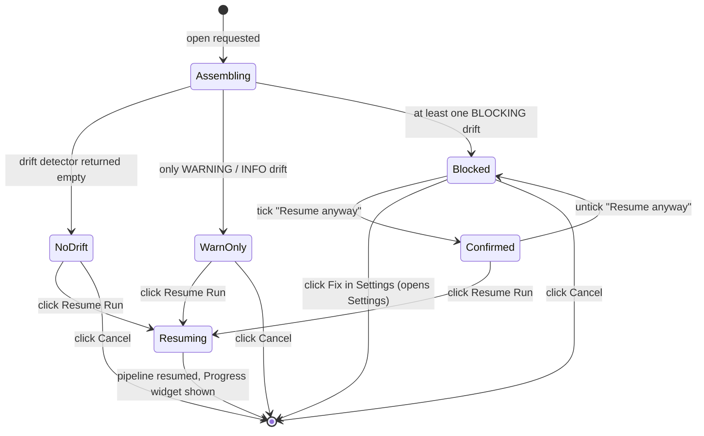

# Resume Summary Dialog

**Status:** Draft
**Owner:** architect
**Audience:** coder, tester, human
**Last Updated:** 2026-06-06
**Cross-references:** `07_Common_Dialogs/mockup.html`; `07_Common_Dialogs/retry_selection_dialog.md`; `08_Cross_Cutting/08-L_ui_standardization.md`; `08_Cross_Cutting/08-J_event_bus_catalog.md`; `10_Domain_and_Data/02_DTOS_AND_ENUMS.md`; `11_Services_and_Algorithms/11_RUN_DRIFT_DETECTOR.md`

The Resume Summary dialog is the confirmation modal shown when the user requests to resume a previously created run from the Resume Benchmark widget. It presents the run's frozen original configuration, its current per-result progress, and any configuration drift detected by the Run Drift Detector, then lets the user resume the run, fix a drift problem first, or cancel.

---

## Table of Contents

1. [Purpose and Scope](#1-purpose-and-scope)
2. [Invoking Surface](#2-invoking-surface)
3. [Layout](#3-layout)
4. [Sections](#4-sections)
5. [Drift Warnings](#5-drift-warnings)
6. [Resume Gating](#6-resume-gating)
7. [Task Selection](#7-task-selection)
8. [Default State](#8-default-state)
9. [Button Behaviour](#9-button-behaviour)
10. [State Machine](#10-state-machine)
11. [Resume Effects](#11-resume-effects)
12. [Edge Cases](#12-edge-cases)
13. [Function Inventory](#13-function-inventory)

---

## 1. Purpose and Scope

The dialog operates on one `BenchmarkRun` whose `status` is resumable — `INCOMPLETE`, `STOPPED`, or `FAILED` — and which has at least one result that is still `PENDING` or in a retryable terminal-failure status (`FAILED_INFERENCE`, `FAILED_PROVIDER`, `FAILED_TIMEOUT`, `FAILED_JUDGE_TIMEOUT`, `ERRORED` — see `10_Domain_and_Data/02_DTOS_AND_ENUMS.md` §4.3). The resumed run executes against its own frozen `settings_snapshot`; the dialog shows the user what that snapshot contains, how far the run got, and whether the live environment still satisfies the snapshot.

The dialog presents and routes; it never edits the run or the snapshot. Configuration fixes happen in the Settings dialog, reached through the dialog's **Fix in Settings** button.

## 2. Invoking Surface

The dialog is opened by the **Resume Run** action on the Resume Benchmark widget, applied to the run currently selected in that widget's run table. The action is offered only for runs in a resumable status with pending or retryable work. The dialog is centred over the Main Window and may be vertically scrollable; it is otherwise not resizable (`08-L` §13).

## 3. Layout

See `mockup.html`, panel **Resume Summary**. The body opens with an **intro legend** — a short muted line at the top of the body that frames the dialog. When the Run Drift Detector returned at least one warning, the legend reads verbatim **"Environment changed since this run started. Review the warnings, then choose which tasks to resume."**; when the detector returned an empty tuple (no drift), the legend instead reads **"Choose which tasks to resume."** so the line stays accurate. Below the intro legend the body is a vertical stack of titled sections:

1. **Original config** — the run's frozen configuration.
2. **Current progress** — per-`ResultStatus` counts.
3. **Drift** — the drift-warning panel, present only when the Run Drift Detector returned at least one warning.
4. **Settings note** — a reminder that the resumed run uses its own frozen snapshot.
5. **Tasks to resume** — the inline task picker (§7): one checkbox row per resumable task, with its per-task status, letting the user choose exactly which tasks the resume re-runs directly in this dialog.

The footer uses the standard two-button right cluster (`08-L` §5.3): **Cancel**, then **Resume Run** as the right-most primary. There is no separate "Pick Rows to Retry…" side action — task selection is inline (§7).

## 4. Sections

### 4.1 Original config

Read from the `BenchmarkRun` record and its snapshot collections:

- **Mode** — the `RunMode` label.
- **Test models** — the count and the `provider · model` composite-key rows.
- **Judge** — the judge `provider · model`, or `none` when the run carries no judge.
- **Embedding** — the embedding `provider · model`, shown only for `GRADED` runs whose snapshot enables the cosine phase.
- **Task files** — the file count and the file names, for `TASKS` and `GRADED` runs.

### 4.2 Current progress

Counts of the run's results grouped by `ResultStatus`, presented as a small table. The presentation groups the ten statuses into:

- **Completed** — `COMPLETED`.
- **Failed (retryable)** — the five retryable terminal-failure statuses, summed.
- **Pending / in pipeline** — `PENDING` and the four in-pipeline statuses, summed.

A line states `Resume will process the pending and retryable rows.` No duration estimate is shown — consistent with the Run Summary dialog, the application does not predict run duration.

### 4.3 Drift

The drift panel renders the `tuple[DriftWarning, ...]` returned by the Run Drift Detector (`11_Services_and_Algorithms/11_RUN_DRIFT_DETECTOR.md`). The panel is absent entirely when the detector returned an empty tuple. See §5.

### 4.4 Settings note

A muted line: `This run resumes against the settings it was created with. Later changes to application settings do not affect it.`

## 5. Drift Warnings

The Run Drift Detector runs once as the dialog is assembled, after the Resume use case has refreshed the readiness snapshot. The dialog renders the returned warnings grouped by `DriftSeverity`, in the detector's defined order (`BLOCKING`, then `WARNING`). Every warning reports an environment-availability failure of the run's frozen configuration (DD-57); configuration differences are not drift and produce no warning:

| Severity group | Rendering | Gates Resume? |
|---|---|---|
| `BLOCKING` | A red-accented group at the top. Each warning shows its `headline` and an expandable `detail`. A `MODEL_NO_LONGER_AVAILABLE` warning whose provider also carries a `BLOCKING` warning is nested under that provider warning. | Yes — see §6. |
| `WARNING` | An amber group. Each warning shows its `headline` and expandable `detail`. | No. |

For each `BLOCKING` warning whose `kind` is a provider or embedding problem (`PROVIDER_NOW_DISABLED`, `PROVIDER_NOW_UNREACHABLE`, `PROVIDER_REMOVED`, `PROVIDER_ENV_VAR_MISSING`, `EMBEDDING_MODEL_UNAVAILABLE`, `EMBEDDING_NOW_UNREACHABLE`), the warning row carries a **Fix in Settings** button (for `PROVIDER_ENV_VAR_MISSING` the real fix is external — set the environment variable and relaunch — and the row's `detail` says so). For a `BLOCKING` `model` or `judge` warning the dialog also surfaces **Fix in Settings** pointing at the affected provider.

Each `BLOCKING` warning states how many results (`DriftWarning.pending_results_affected`) would be recorded as `FAILED_PROVIDER` or `FAILED_INFERENCE` if the run resumes without the fix.

The dialog never auto-resolves drift. The detector reports, the dialog surfaces, the user acts.

## 6. Resume Gating

- **No `BLOCKING` warnings** — **Resume Run** is enabled directly.
- **One or more `BLOCKING` warnings** — **Resume Run** is disabled until the user ticks the confirmation checkbox `Resume anyway — affected tasks will fail`. The checkbox is shown only when at least one `BLOCKING` warning is present, and the line beside it states the total `pending_results_affected` across the blocking warnings. Ticking the checkbox enables **Resume Run**; the resumed run then records the affected results with their failure status.
- `WARNING` and `INFO` items never gate the button.

If the user fixes a blocking condition via **Fix in Settings** and reopens the dialog, the detector re-runs against the now-current configuration and the resolved warnings disappear (the detector is idempotent — `11_RUN_DRIFT_DETECTOR.md` §9).

## 7. Task Selection (inline picker)

Task selection is **inline in this dialog** — the **Tasks to resume** section (§3 item 5) — so the user picks exactly which tasks the resume re-runs without opening a separate dialog. The section is a vertically scrollable list with a header line ("Tasks to resume — not-yet-completed tasks are pre-checked") and one row per resumable task. Each row carries:

- a **checkbox** selecting whether this task is re-run on Resume;
- the **task label** (`task_id`, optionally with its short type/category);
- the task's **current per-task status** rendered as a small status chip/meta — `Pending`, `Failed (provider)`, `Failed (timeout)`, `Failed (judge timeout)`, `Errored`, or `Completed · <verdict>` (mapping `ResultStatus`, see `10_Domain_and_Data/02_DTOS_AND_ENUMS.md` §4.3).

**Pre-check rule.** Every **not-yet-completed** task — `PENDING` and every retryable terminal-failure status — is **pre-checked**. **`COMPLETED`** tasks are listed but **unchecked**; the user may tick them to force a re-run (which resets that row to `PENDING` on Resume). A task whose target is covered by an unresolved `BLOCKING` drift warning is shown disabled/unchecked until the user ticks the drift override (§6); once overridden it becomes checkable.

**Select-all / Clear-all** affordances toggle every enabled row at once. On **Resume Run**, exactly the **checked** tasks are reset to `PENDING` (completed-and-re-checked rows included) and the pipeline resumes over them; unchecked tasks keep their stored status and are not re-run.

The standalone **Retry Selection dialog** (`07_Common_Dialogs/retry_selection_dialog.md`) is retained only for the Resume widget's **Retry** row action (re-running selected rows of a finished run without the full resume-summary flow); it is no longer reachable from this dialog.

## 8. Default State

On open:

- The Original config and Current progress sections are populated from the run record.
- The Run Drift Detector has already run; the drift panel is populated or absent accordingly.
- When `BLOCKING` warnings exist, the `Resume anyway` checkbox is shown unticked and **Resume Run** is disabled; otherwise **Resume Run** is enabled.
- The dialog scrolls to its top so the user sees the run name and any drift first.

## 9. Button Behaviour

| Button | Position | Style | Behaviour |
|---|---|---|---|
| Task checkbox (per row) | Tasks-to-resume section (§7) | Checkbox | Includes/excludes that task from the resume. Not-yet-completed rows pre-checked; completed rows unchecked-but-tickable; drift-blocked rows disabled until the override is ticked. |
| Select all / Clear all | Tasks-to-resume section header | Text buttons | Toggle every enabled task row at once. |
| Fix in Settings | Inline, on each blocking provider/embedding warning row | Outlined muted | Closes this dialog and opens the Settings dialog focused on the relevant tab and row. |
| Cancel | Right cluster, left of primary | Outlined muted | Closes the dialog with no change. Activated by clicking. |
| Resume Run | Right cluster, right-most (primary) | Filled primary | Triggers the resume use case. Activated by clicking. Disabled while an unconfirmed `BLOCKING` warning is present (§6). |

The dialog is dismissed by clicking the Cancel button or the close (X) glyph in the title bar; the primary button is activated by clicking it. There are no keyboard shortcuts or accelerators.

## 10. State Machine

## 11. Resume Effects

When **Resume Run** is activated:

1. The resume use case selects the rows to process — the pending and retryable rows, minus targets covered by an unconfirmed `BLOCKING` warning.
2. The benchmark pipeline resumes the run against its frozen `settings_snapshot`.
3. The use case emits the run-resumed event on the event bus (`08-J` §5); the Benchmark workspace shows the Progress widget; the running pill appears in the menu bar.
4. The dialog closes.

The tasks the user checked in the inline **Tasks to resume** picker (§7) are reset to `PENDING` first (including any `COMPLETED` rows the user explicitly re-checked), and the resume then proceeds as above over exactly those tasks.

## 12. Edge Cases

| ID | Situation | Handling |
|---|---|---|
| EC-RES-1 | A previously `STOPPED` run is resumed. | Normal path; the run's pending and retryable rows are processed. |
| EC-RES-2 | A `FAILED` run is resumed. | Allowed; the run's pending and retryable rows are processed. The original fatal cause may recur — the user reads any drift warnings first. |
| EC-RES-3 | The run was created on a different machine or a different application version. | The drift detector compares the snapshot against the live environment regardless of origin; any unreachable provider, missing model, or missing task file surfaces as a drift warning. The settings divergence appears as the aggregated `INFO` warning. |
| EC-RES-4 | The run snapshot is incomplete (no providers or no models). | The drift detector returns a single `BLOCKING` warning describing the incomplete snapshot; the Resume use case escalates this to a run-integrity error; **Resume Run** stays disabled and the dialog explains the run cannot be resumed. |
| EC-RES-5 | The readiness snapshot could not be refreshed before the dialog opened. | The drift detector downgrades reachability checks to `WARNING` severity (`11_RUN_DRIFT_DETECTOR.md` §8); the dialog shows the uncertainty as amber warnings and does not falsely block. |
| EC-RES-6 | The run has results but none are pending or retryable. | The Resume action is not offered for this run; the dialog cannot be opened. The user re-runs failed rows through the Retry Selection dialog only if retryable rows exist. |
| EC-RES-7 | The user fixes a blocking provider via **Fix in Settings**, then reopens Resume. | The detector re-runs against the updated configuration; the resolved blocking warning is gone; **Resume Run** is enabled directly when no other blocking warning remains. |
| EC-RES-8 | The run is deleted from the Resume Benchmark widget between dialog open and **Resume Run**. | The resume use case finds no run; it raises a `UserError`; the dialog closes and a toast reports `That run no longer exists.` |

## 13. Function Inventory

| Action | Description | Gated by |
|---|---|---|
| Open dialog | Show the resume review; run the drift detector. | The run is resumable and has at least one pending or retryable result. |
| Expand drift detail | Reveal a warning's `detail` text. | Always available while the dialog is open. |
| Fix in Settings | Close this dialog; open Settings at the affected provider or embedding tab. | The warning is a `BLOCKING` provider or embedding warning. |
| Tick "Resume anyway" | Acknowledge that blocked tasks will fail; enable **Resume Run**. | At least one `BLOCKING` warning is present. |
| Toggle a task row | Include/exclude a task from the inline resume picker (§7). | Always available; drift-blocked rows require the override first. |
| Select all / Clear all tasks | Toggle every enabled task row in the inline picker. | Always available while the dialog is open. |
| Resume Run | Resume the run against its frozen snapshot. | No `BLOCKING` warning, or the `Resume anyway` checkbox is ticked. |
| Cancel | Close with no change. | Always available. |
