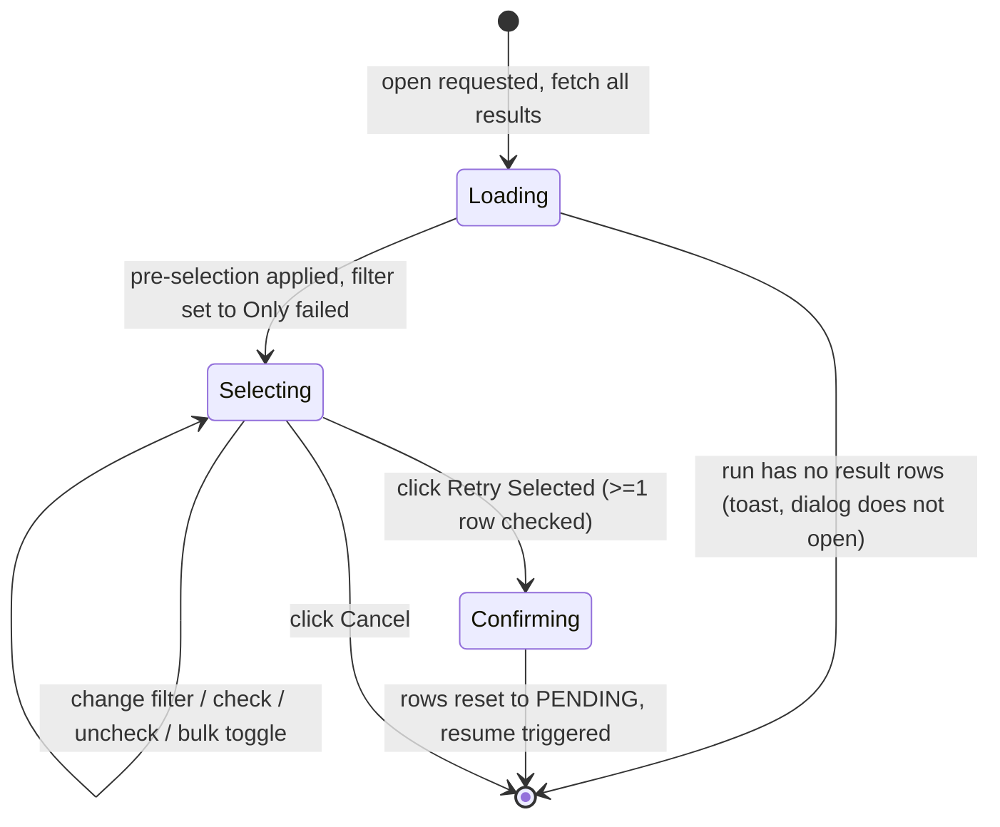

# Retry Selection Dialog

**Status:** Draft
**Owner:** architect
**Audience:** coder, tester, human
**Last Updated:** 2026-06-06
**Cross-references:** `07_Common_Dialogs/mockup.html`; `07_Common_Dialogs/resume_summary_dialog.md`; `08_Cross_Cutting/08-L_ui_standardization.md`; `08_Cross_Cutting/08-J_event_bus_catalog.md`; `10_Domain_and_Data/02_DTOS_AND_ENUMS.md`

The Retry Selection dialog is a modal dialog that lets the user choose, row by row, which results of a partially-completed `BenchmarkRun` to re-process. It lists every result of the run as a checkable table, offers a status filter to narrow the view, pre-selects the rows that most users want — the failed and still-pending rows — and on confirmation resets the chosen rows to `PENDING` and triggers the resume of the run.

---

## Table of Contents

1. [Purpose and Scope](#1-purpose-and-scope)
2. [Invoking Surfaces](#2-invoking-surfaces)
3. [Layout](#3-layout)
4. [Result Status Grouping](#4-result-status-grouping)
5. [Filter Dropdown](#5-filter-dropdown)
6. [Per-Row Check Semantics](#6-per-row-check-semantics)
7. [Pre-Selection Rule](#7-pre-selection-rule)
8. [Bulk Toggles](#8-bulk-toggles)
9. [Selection Summary Line](#9-selection-summary-line)
10. [Default State](#10-default-state)
11. [Button Behaviour](#11-button-behaviour)
12. [State Machine](#12-state-machine)
13. [Confirm Effects](#13-confirm-effects)
14. [Edge Cases](#14-edge-cases)
15. [Function Inventory](#15-function-inventory)

---

## 1. Purpose and Scope

The dialog operates on exactly one `BenchmarkRun` and on its `BenchmarkResult` rows. It changes nothing about the run record itself, the `settings_snapshot`, the providers list, or the models list. Its only effect is to reset a chosen set of result rows to `ResultStatus.PENDING` (clearing their prior outcome) and then to hand the run to the resume use case, which re-processes every `PENDING` row.

The dialog presents and routes; it never edits a task and never re-grades a row in place. A row that is reset loses its prior `verdict`, per-phase verdicts, `error_kind`, and `error_message` — the row is re-run from scratch.

The dialog gives finer control than a plain Resume. A plain Resume processes the pending and retryable rows automatically (`07_Common_Dialogs/resume_summary_dialog.md` §7). This dialog additionally lets the user re-run `COMPLETED` rows by explicitly selecting them, and lets the user *exclude* a retryable row they do not want re-processed yet.

## 2. Invoking Surfaces

| Surface | Trigger | Availability |
|---|---|---|
| Resume Benchmark widget | Right-click a run row, choose **Retry** | The run is in a resumable status (`INCOMPLETE`, `STOPPED`, `FAILED`) and has at least one result row. This is the **only** entry point — it re-runs selected rows of a finished run without the full resume-summary flow. (The Resume Summary dialog now selects tasks **inline** — `07_Common_Dialogs/resume_summary_dialog.md` §7 — and no longer opens this dialog.) |

When the dialog is reached from the Resume Summary dialog, that dialog closes as this one opens; control does not return to the Resume Summary dialog after this dialog confirms or cancels.

The dialog is centred over its invoking window and may be vertically scrollable when the result table exceeds the available height; it is otherwise not resizable (`08-L` §13).

## 3. Layout

See `mockup.html`, panel **Retry Selection**. The body is a vertical stack:

- A **toolbar row** carrying the **Filter** dropdown on the left and the **Check all visible** / **Uncheck all visible** bulk-toggle buttons on the right.
- The **result table** — one row per `BenchmarkResult` matching the active filter. Columns, left to right: a check column, **Model** (the `provider · model` composite key), **Task** (the task identifier or, for `SYNTHETIC`, the synthetic-cell label), **Status** (the `ResultStatus`, rendered with the status colour per `08-L` §9), **Time** (the recorded elapsed time, or a dash when none), **Reason** (a short failure reason for a failed row, a dash otherwise).
- A **selection summary line** below the table (§9).

The footer uses the standard two-button right cluster (`08-L` §5.3): **Cancel**, then **Retry Selected** as the right-most primary. The footer carries no side-action cluster.

## 4. Result Status Grouping

The dialog reasons about three groups built from the eleven `ResultStatus` members (`10_Domain_and_Data/02_DTOS_AND_ENUMS.md` §4.3):

| Group | `ResultStatus` members | Meaning for retry |
|---|---|---|
| **Completed** | `COMPLETED` | A finished, graded row. Not error-retryable, but selectable for an explicit re-run. |
| **Failed (retryable)** | `FAILED_INFERENCE`, `FAILED_PROVIDER`, `FAILED_TIMEOUT`, `FAILED_JUDGE_TIMEOUT`, `ERRORED` | The five retryable terminal-failure states. Pre-selected on open. A `FAILED_JUDGE_TIMEOUT` retry re-runs the WHOLE task end-to-end (re-inference + re-grade), uniform with the other `FAILED_*` retries — the original attempt's inference text and timings are NOT preserved. See DD-34 in `08_Cross_Cutting/08-F_spec_issues_log.md`. |
| **Incomplete (in pipeline)** | `PENDING`, `RUNNING_INFERENCE`, `AWAITING_KEYWORD_CHECK`, `AWAITING_COSINE_CHECK`, `AWAITING_JUDGE_CHECK` | A row that never reached a terminal state — the run was stopped or interrupted mid-flight. Pre-selected on open. |

The dialog only ever opens against a run that is not currently executing, so a row in `RUNNING_INFERENCE` or an `AWAITING_*` state is one that was frozen there when the run stopped, not one actively in progress.

## 5. Filter Dropdown

The **Filter** dropdown narrows which rows the table shows. It changes the *view* only; it never changes which rows are checked, and a row that scrolls out of view because of a filter change keeps its check state.

| Filter option | Rows shown |
|---|---|
| `All` | Every result row of the run. |
| `Only failed` | Rows in the Failed (retryable) group — `FAILED_INFERENCE`, `FAILED_PROVIDER`, `FAILED_TIMEOUT`, `FAILED_JUDGE_TIMEOUT`, `ERRORED`. |
| `Only incomplete` | Rows in the Incomplete (in pipeline) group — `PENDING` and the four `AWAITING_*` / `RUNNING_INFERENCE` states. |
| `Only completed` | Rows in the Completed group — `COMPLETED`. |

The **Filter** control is a single-select combo (a closed dropdown, not a free-text field) carrying these four options. It **opens defaulted to `Only failed`**, because the failed rows are the most common retry target; the mockup renders the closed combo showing `Only failed` (its `readonly` styling is the standard non-editable-combo appearance, not a disabled control — the combo is interactive and the user may open it to pick any of the four options).

## 6. Per-Row Check Semantics

Each table row carries a checkbox. The check column header carries a tri-state master checkbox reflecting the check state of the **currently visible** rows: checked when all visible rows are checked, unchecked when none are, mixed when some are.

A checked row is included in the retry set. Checking or unchecking is unrestricted — every row, regardless of its `ResultStatus`, is freely checkable, including a `COMPLETED` row. There is no per-row confirmation when a `COMPLETED` row is checked, because a `COMPLETED` row is unchecked on open (§7) and ticking it is therefore an explicit, deliberate user gesture.

The check column is the only interactive part of a row; the dialog never opens a result for editing.

## 7. Pre-Selection Rule

On open, the dialog sets the initial check state by group, before any filter is applied:

- **Failed (retryable) rows** — pre-checked. Re-running a failed row is the safe, expected operation and needs no extra gesture.
- **Incomplete (in pipeline) rows** — pre-checked. These rows never finished; resuming them is the expected operation.
- **Completed rows** — left unchecked. A `COMPLETED` row carries a final, graded result; re-running it discards that result, so it is never selected by default. The user may still check it manually.

The pre-selection is computed once on open. Changing the filter afterwards never re-applies the pre-selection; it only changes which rows are visible.

## 8. Bulk Toggles

Two toolbar buttons act on the **currently visible** rows only:

| Button | Effect |
|---|---|
| **Check all visible** | Checks every row currently shown under the active filter. Rows hidden by the filter are untouched. |
| **Uncheck all visible** | Unchecks every row currently shown under the active filter. Rows hidden by the filter are untouched. |

Because the bulk toggles are scoped to the visible set, a user can — for example — switch the filter to `Only completed`, click **Check all visible** to opt every completed row into a full re-run, then switch the filter back to `Only failed` without disturbing those completed selections.

## 9. Selection Summary Line

A single line below the table states the current selection across the **whole run**, not just the visible rows:

```
<N> selected for retry  ·  <M> not selected  ·  <K> completed rows untouched
```

- `<N>` — the total count of checked rows.
- `<M>` — the count of unchecked rows that are in the Failed or Incomplete group (rows the user could have selected but did not).
- `<K>` — the count of `COMPLETED` rows that remain unchecked.

The line updates on every check, uncheck, and bulk-toggle action. It does not change when the filter changes.

## 10. Default State

On open:

- The result table is populated with every result row of the run; the filter is applied as `Only failed`.
- The pre-selection rule (§7) has run: failed and incomplete rows are checked, completed rows are unchecked.
- The selection summary line reflects the pre-selection.
- **Retry Selected** is enabled when at least one row is checked — which, given the pre-selection, is the normal case for any run that has failed or incomplete work. It is disabled only when zero rows are checked.
- Focus is on the **Retry Selected** primary button; `Enter` confirms, `Escape` cancels.
- The table scrolls to its top.

## 11. Button Behaviour

| Button | Position | Style | Behaviour |
|---|---|---|---|
| Filter | Toolbar, left | Dropdown | Narrows the visible rows (§5). Always available. |
| Check all visible | Toolbar, right | Outlined muted | Checks every currently visible row (§8). Always available. |
| Uncheck all visible | Toolbar, right | Outlined muted | Unchecks every currently visible row (§8). Always available. |
| Cancel | Right cluster, left of primary | Outlined muted | Closes the dialog with no change; no row is reset. Activated by clicking. |
| Retry Selected | Right cluster, right-most (primary) | Filled primary | Resets the checked rows and triggers the resume (§13). Activated by clicking. Disabled when zero rows are checked. |

The dialog is dismissed by clicking the Cancel button or the close (X) glyph; the primary button is activated by clicking it. There are no keyboard shortcuts or accelerators.

## 12. State Machine



## 13. Confirm Effects

When **Retry Selected** is activated with at least one checked row:

1. The dialog calls the retry use case with the `RunId` and the list of checked `BenchmarkResult` identifiers.
2. The use case resets each chosen row through `ResultsStore.reset_results_for_retry(result_ids)` (`08_Cross_Cutting/08-E_interfaces_contracts.md` §7.3, DD-66): the reset **resumes each row from its failed stage**. A `FAILED_JUDGE_TIMEOUT` row (and a judge-stage `ERRORED` row whose response is present) is reset to `AWAITING_JUDGE_CHECK` — only the judge outputs and combined verdict are cleared; the inference response, timing/token metrics, keyword verdict, and cosine score are **preserved**, and the resume re-runs **only the judge** on the same response. Every other retryable row (`FAILED_INFERENCE`/`FAILED_PROVIDER`/`FAILED_TIMEOUT`, response-less `ERRORED`, or an in-pipeline `RUNNING_INFERENCE`/`AWAITING_*` row) is reset fully to `PENDING` and re-runs the whole task. A row already `PENDING` is left as-is; unchecked `PENDING` rows still get processed by the resume.
3. The use case emits `_run_list_changed` (`RunListChangedEvent`) so list surfaces refresh the run's per-status counts — see `08-J` §5.
4. The use case hands the run to the resume use case, which resumes the run against its frozen `settings_snapshot`; the resume processes every `PENDING` row of the run, which now includes the rows just reset.
5. The resume use case emits the run-resumed event; the Benchmark workspace shows the Progress widget and the running pill appears in the menu bar.
6. The dialog closes.

A `COMPLETED` row that the user checked is reset like any other: its final result is discarded and the row is re-run from scratch. This is irreversible; the dialog relies on the unchecked-by-default rule (§7) so that no completed row is ever discarded without an explicit user action.

## 14. Edge Cases

| ID | Situation | Handling |
|---|---|---|
| EC-RT-1 | The run has zero result rows. | The dialog refuses to open; a non-blocking toast reports `This run has no result rows to retry yet.` This applies to a `SYNTHETIC` run that failed before its synthetic matrix produced any rows. |
| EC-RT-2 | The user unchecks every row, then clicks the footer. | **Retry Selected** is disabled while zero rows are checked, so the confirm cannot fire; `Enter` also does nothing. The user must check at least one row. |
| EC-RT-3 | The active filter hides every row (for example `Only completed` on a run with no completed rows). | The table shows a designed empty state with the text `No rows match this filter.` (`08-L` §1). The selection from other filter views is unaffected; switching the filter restores visible rows. |
| EC-RT-4 | The user checks a `COMPLETED` row, confirms, and the re-run later produces a different verdict. | Expected behaviour. The row was reset on the user's explicit gesture; the new run is final for that row. No prior state is recoverable. |
| EC-RT-5 | The run was deleted between dialog open and **Retry Selected**. | The retry use case finds no run; it raises a `UserError`. The dialog closes and a toast reports `That run no longer exists.` No row is reset and no resume is triggered. |
| EC-RT-6 | A required provider for a selected row is unreachable when the resume starts. | The retry use case does not gate on provider health; the resume proceeds and the affected rows fail again with a retryable failure status. The run remains resumable, and the user may open this dialog again. The Resume Summary dialog's drift check (`resume_summary_dialog.md` §5) is the surface that warns about unreachable providers before a resume. |
| EC-RT-7 | The run reached a terminal status but every result row is `COMPLETED`. | The dialog opens; the filter defaults to `Only failed` and shows the empty state (EC-RT-3). The user may switch the filter to `Only completed` and manually select rows for a deliberate re-run. |
| EC-RT-8 | A row is in `RUNNING_INFERENCE` or an `AWAITING_*` state because the run was interrupted. | The row is treated as Incomplete (in pipeline) — pre-checked, shown under `Only incomplete`. Resetting it to `PENDING` re-runs the whole task; the partial in-pipeline state is discarded. |

## 15. Function Inventory

| Action | Description | Gated by |
|---|---|---|
| Open dialog | Show the retry picker; load every result row; apply the pre-selection. | The run is resumable and has at least one result row. |
| Change filter | Narrow the visible rows to `All` / `Only failed` / `Only incomplete` / `Only completed`. | Always available while the dialog is open. |
| Check / uncheck a row | Add or remove a single row from the retry set. | Always available for any row, including `COMPLETED`. |
| Check all visible | Check every row currently shown under the active filter. | Always available. |
| Uncheck all visible | Uncheck every row currently shown under the active filter. | Always available. |
| Retry Selected | Reset the checked rows to `PENDING`, clear their prior outcomes, trigger the resume. | At least one row is checked. |
| Cancel | Close the dialog with no change. | Always available. |
