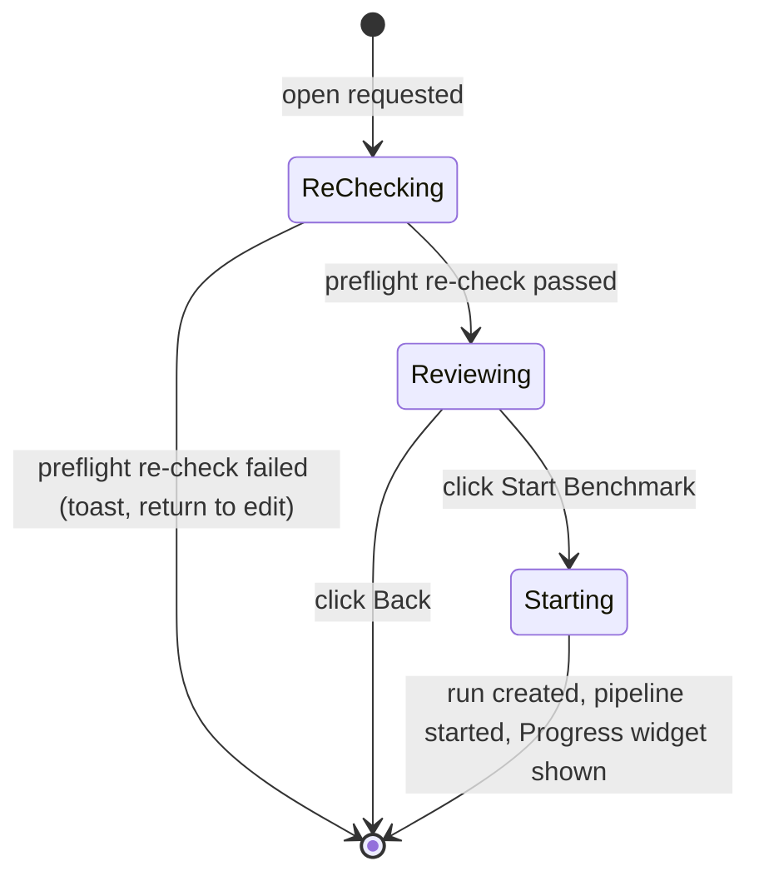

# Run Summary Dialog

**Status:** Draft
**Owner:** architect
**Audience:** coder, tester, human
**Last Updated:** 2026-06-06
**Cross-references:** `07_Common_Dialogs/mockup.html`; `08_Cross_Cutting/08-L_ui_standardization.md`; `08_Cross_Cutting/08-J_event_bus_catalog.md`; `08_Cross_Cutting/08-E_interfaces_contracts.md`; `10_Domain_and_Data/02_DTOS_AND_ENUMS.md`; `11_Services_and_Algorithms/10_MODE_VISIBILITY_POLICY.md`

The Run Summary dialog is the pre-start confirmation modal shown when the user requests a new benchmark run from the New Benchmark widget. It presents the complete configuration about to be frozen into the run's settings snapshot, lets the user verify it against the selected `RunMode`, and offers a single decisive action — start the run, or go back and edit. The dialog is mode-aware: sections that do not apply to the selected mode are absent rather than greyed out.

---

## Table of Contents

1. [Purpose and Scope](#1-purpose-and-scope)
2. [Invoking Surface](#2-invoking-surface)
3. [Layout](#3-layout)
4. [Universal Sections](#4-universal-sections)
5. [Mode-Specific Sections](#5-mode-specific-sections)
6. [Per-Mode Contents](#6-per-mode-contents)
7. [Settings-Snapshot Transparency](#7-settings-snapshot-transparency)
8. [Preflight Re-Check on Open](#8-preflight-re-check-on-open)
9. [Default State](#9-default-state)
10. [Button Behaviour](#10-button-behaviour)
11. [State Machine](#11-state-machine)
12. [Start Effects](#12-start-effects)
13. [Edge Cases](#13-edge-cases)
14. [Function Inventory](#14-function-inventory)

---

## 1. Purpose and Scope

The dialog is the last checkpoint before a run starts. Everything it shows is the configuration that will be copied verbatim into `BenchmarkRun.settings_snapshot`, the providers list, and the models list at run creation. The dialog presents; it does not edit. To change anything, the user returns to the New Benchmark widget via **Back**.

The dialog is mode-aware. It reads the selected `RunMode` and the mode-visibility policy (`11_Services_and_Algorithms/10_MODE_VISIBILITY_POLICY.md`) to decide which sections are present. A section that does not apply to the mode is omitted entirely — per `08-L` §1, the dialog never shows a disabled or empty section.

## 2. Invoking Surface

The dialog is opened by the **Start Benchmark** action on the New Benchmark widget. That action is enabled only when every hard-error preflight check on the widget has already passed, so the dialog opens against a configuration that was valid a moment earlier. The dialog re-checks the environment on open (§8) to catch state that changed between the click and the dialog appearing.

The dialog is centred over the Main Window. It may be vertically scrollable when its content exceeds the available height; it is otherwise not resizable (`08-L` §13).

## 3. Layout

See `mockup.html`, panel **Run Summary**. The body is a vertical stack of titled sections, each section being a group box per the section layout in `08-L` §8.2. Section order, top to bottom:

1. Mode and run-name preview (universal).
2. Test models (universal).
3. Judge (mode-aware label and content).
4. Embedding (`GRADED` only).
5. Task files (`TASKS` and `GRADED`).
6. Synthetic prompt matrix (`SYNTHETIC` only).
7. Work to be done (universal).
8. Inference — per-run snapshot (universal).
9. Pipeline events — per-run snapshot (universal).
10. Evaluation phases — per-run snapshot (`GRADED` only).
11. Warnings callout (universal; present only when the Run Validator produced non-blocking warnings).

The footer carries the standard right cluster (`08-L` §5.3): **Back** as the back-out action, then **Start Benchmark** as the right-most primary. There is no side-action cluster.

## 4. Universal Sections

These sections appear in every mode.

| Section | Content |
|---|---|
| Mode and run-name preview | The `RunMode` label and the previewed `run_name` using the canonical **display** format `Run N — <Mode display name> — YYYY-MM-DD HH:MM` (SPEC-077; the same format the Main Window, Resume list, and Result dropdown use; the export filename is derived from it by sanitisation, where underscores replace separators). The previewed name is informational; the run's id and creation timestamp are fixed when the run is created on Start. |
| Test models | One row per benchmark target as the composite key `provider · model`. Each row carries a health dot reflecting the most recent readiness probe (`08-L` §9 health palette). A row that triggered a non-blocking Run Validator warning carries a warn-coloured dot, a small warning glyph and tooltip, and may carry an inline qualifier describing the warning. A model whose streaming support is unconfirmed — so time-to-first-token may not be measurable — shows the inline warn row text `streaming unconfirmed (TTFT may be missing)`. |
| Work to be done | The total count of inference calls and, when the mode runs a judge, the total count of judge calls. **No duration estimate is shown.** Without prior measurements of these specific models on this machine, any prediction would mislead; the user reads the actual elapsed time on the Progress widget once the run is underway. |
| Inference — per-run snapshot | Every `feature.*` and `benchmark.*` retry, timeout, max-output-tokens, and warmup flag with its effective value and the setting key it resolved from (see §7). The stream-tokens-to-log preference is **not** listed here — it is a live `ui.*` setting, not frozen into the snapshot (SPEC-116). |
| Pipeline events — per-run snapshot | Every `benchmark.pause_on_*` and `benchmark.stop_on_*` flag with its effective value and resolving key. |
| Warnings | Non-blocking issues reported by the Run Validator, rendered as an informational callout (`08-L` §9 `info` / `warning` roles). Present only when there is at least one warning. |

## 5. Mode-Specific Sections

| Section | `SYNTHETIC` | `TASKS` | `GRADED` |
|---|:---:|:---:|:---:|
| Synthetic prompt matrix (input size × output size × repeats) | Present — full table | Absent | Absent |
| Task files (file list with per-file task count) | Absent | Present | Present |
| Judge | Optional — analysis toggle visible, default OFF | Optional — analysis toggle visible, default OFF | Per-task judge phase toggleable; analysis toggle visible, default ON, user can turn off to skip the extra inference cost |
| Embedding (cosine phase) | Absent | Absent | Present — required when the cosine phase is enabled |
| Evaluation phases — per-run snapshot | Absent | Absent | Present — full phase set with all `eval.*` flags |

**Per-mode variant rendering.** The mockup draws only the `GRADED` variant; the `SYNTHETIC` and `TASKS` variants are specified here in prose. Relative to the drawn `GRADED` layout, the variants differ as follows:

- **`SYNTHETIC`** — the Judge, Embedding, Task files, and Evaluation phases sections are all absent (no per-task grading, no judge/embedding readiness rows). In their place a **Synthetic prompt matrix** summary section appears (one row per `(input_tokens, output_tokens)` cell with the per-cell repeat count). The Judge section reduces to the run-level analysis toggle only (default OFF).
- **`TASKS`** — the Embedding and Evaluation phases sections are absent (no cosine/judge readiness lines). Task files is present. The Judge section reduces to the run-level analysis toggle only (default OFF); when the toggle is off its provider/model lines render muted.

## 6. Per-Mode Contents

### 6.1 `SYNTHETIC`

- Mode and run-name preview; test models.
- **Synthetic prompt matrix** — a table with one row per `(input_tokens, output_tokens)` combination derived from the widget's input-size, output-size, and repeats fields, plus the per-cell repeat count.
- **Judge** — post-run analysis only; the **"Generate run analysis" toggle** row is shown and reflects `feature.judge_run_analysis_enabled` (default OFF in this mode). There is no per-task judging, because synthetic prompts have no golden answer.
- **Inference snapshot** — **backend** streaming is always on so time-to-first-token can be measured (independent of the live `ui.stream_tokens_to_log` log preference, SPEC-116); the warmup, retry, timeout, and max-output-tokens flags are listed.
- **Evaluation** — absent; the section header would read `All grading phases off for SYNTHETIC`, so the section is omitted entirely.
- **Work to be done** — `models × matrix_cells × repeats` inference calls, plus one post-run analysis call when the run-analysis toggle is on. No duration estimate.

### 6.2 `TASKS`

- Mode and run-name preview; test models.
- **Task files** — the file list with per-file task counts and a total.
- **Judge** — optional; the **"Generate run analysis" toggle** row is shown and reflects `feature.judge_run_analysis_enabled` (default OFF in this mode) and covers the run-level analysis only. When the toggle is off, the provider and model lines are rendered muted with the suffix `(disabled — toggle is off)`. A note states `Task Benchmark never runs the per-task grading phases — they belong only to Graded Benchmark. The judge model is used only for the optional run-level analysis.`
- **Inference snapshot** and **Pipeline events snapshot**.
- **Evaluation phases** — absent (Task Benchmark never grades).
- **Work to be done** — `models × total_tasks` inference calls, plus one post-run analysis call when the run-analysis toggle is on. No duration estimate.

### 6.3 `GRADED`

- Mode and run-name preview; test models.
- **Judge model.** The judge provider and model are shown when a judge is required for this run — that is, when either the per-task judge phase or the run-level analysis toggle is on. Both default ON in `GRADED`, so the judge picker is required by default; if the user disables both, the judge picker may be left empty and the dialog accepts that configuration (the provider and model lines are then rendered muted with the suffix `(not required — judge phase and analysis toggle both disabled)`). From the run's settings snapshot the section lists:
  - **Per-task judge phase** — `enabled` or `disabled`, reflecting the Settings evaluation toggle. The per-task judge phase is not mandatory; a `GRADED` run may grade with only the keyword and cosine phases.
  - **Run-level judge analysis (`feature.judge_run_analysis_enabled`)** — visible toggle row; **default ON in `GRADED`**, with a hint `Disable to skip the extra inference cost when you only want per-task verdicts.` The user can turn it off.
- **Embedding** — used by the cosine phase and by semantic keyword terms. The section shows the embedding provider and model and the most recent probe result. The probe-result line states both the reachability verdict and the model's vector dimension, formatted as `reachable · <D>-dim` (for example `reachable · 1024-dim`); when the most recent probe did not reach the model it reads `unreachable` with no dimension. The embedding model is required when the cosine phase is enabled or any task declares semantic terms; when it is required and not reachable, the dialog refuses to open (§8).
- **Task files** — the file list with per-file task counts and a total.
- **Inference snapshot** and **Pipeline events snapshot**.
- **Evaluation phases — per-run snapshot** — the response sanity check is always on; the keyword, cosine, and judge phases are listed with their `eval.*` flag keys; the cosine threshold (`eval.cosine_threshold`) is shown.
- **Work to be done** — `models × total_tasks` inference calls, plus per-task judge calls when the per-task judge phase is enabled, plus one post-run analysis call when the run-level analysis toggle is on. No duration estimate.

## 7. Settings-Snapshot Transparency

Every value in the Inference, Pipeline events, and Evaluation phases sections is annotated with the setting key it resolves from — for example `0.0 · benchmark.temperature` or `120 · benchmark.max_timeout_seconds` (the live `ui.stream_tokens_to_log` preference is **not** frozen and is not annotated here, SPEC-116). The annotation lets the user trace every displayed value back to the flag registry in `08_Cross_Cutting/08-G_feature_flags.md`, so the user knows exactly which values are about to be frozen into `BenchmarkRun.settings_snapshot`. The snapshot is taken at run creation and never changes for the life of the run.

## 8. Preflight Re-Check on Open

The hard-error preflight checks passed before the dialog opened (the **Start Benchmark** action on the widget was enabled). The dialog re-runs them on open, because state can change between the click and the dialog appearing. The re-check refuses to start a run on a broken environment:

- A required item is unconfigured — no test models, no judge model when either the per-task judge phase is enabled (any mode that supports grading) or the run-level analysis toggle is on (any mode), or no embedding model when the cosine phase is enabled.
- A required provider went down or became unreachable since the click.
- The embedding model became unreachable in `GRADED` while the cosine phase is enabled.

On any re-check failure the dialog does not open (or closes immediately if the failure is detected as it opens); a non-blocking toast names the failure and the user is returned to the New Benchmark widget with every field value intact. Non-blocking warnings do not fail the re-check — they are rendered inside the dialog's Warnings callout and the user may choose to proceed.

## 9. Default State

On a successful open:

- All applicable sections are populated from the current widget configuration and the live readiness snapshot.
- The Warnings callout is present only when the Run Validator produced at least one warning.
- Focus is on the **Start Benchmark** primary button. As incidental toolkit-default modal behaviour (D-R-07), `Enter` activates that default button (starting the run) and `Escape` triggers Back (returns to edit); both actions are always available as visible buttons, so neither key is required.
- The dialog scrolls to its top.

## 10. Button Behaviour

| Button | Position | Style | Behaviour |
|---|---|---|---|
| Back | Right cluster, left of primary | Outlined muted | Closes the dialog with no change; every field on the New Benchmark widget keeps its value. Activated by clicking. |
| Start Benchmark | Right cluster, right-most (primary) | Filled primary | Fires the start handler. Activated by clicking. Always enabled once the dialog is open, because the open itself is gated on the preflight re-check passing. |

The dialog is dismissed by clicking Back or the close (X) glyph; the primary is activated by clicking it. There are no **custom** keyboard shortcuts or accelerators — only the toolkit's built-in modal Enter (default button) and Esc (Back/close) defaults apply (D-R-07).

## 11. State Machine

## 12. Start Effects

When **Start Benchmark** is activated:

1. The start use case creates the `BenchmarkRun`, freezing the current configuration into `settings_snapshot`, the participating providers, and the test, judge, and embedding model entries.
2. The benchmark pipeline begins executing the new run.
3. The use case emits the run-started event on the event bus (`08-J` §5); the Benchmark workspace hides the New Benchmark configuration panel (`08-L` §1) and shows the Progress widget; the running pill appears in the menu bar.
4. The dialog closes.

## 13. Edge Cases

| ID | Situation | Handling |
|---|---|---|
| EC-RS-1 | The user requests a new run while another run is already in a non-terminal stage. | The New Benchmark configuration panel is hidden during any active run (`08-L` §1), so the Start action is not reachable; the dialog cannot be opened. |
| EC-RS-2 | No test model is reachable when the dialog is asked to open. | The preflight re-check (§8) fails; the dialog does not open; a toast reports `No test model is reachable. Check provider settings.` |
| EC-RS-3 | A test model uses a provider with a plain API key and an unset environment variable. | The preflight re-check fails with a configuration error; the dialog does not open; the toast names the missing environment variable and the affected provider. |
| EC-RS-4 | `GRADED` with the cosine phase enabled, but the embedding model is unreachable. | The preflight re-check fails; the dialog does not open; the toast reports the embedding model is unreachable. |
| EC-RS-5 | A provider goes down while the dialog is open and being reviewed. | The dialog does not poll; the configuration was valid on open. If the provider is still down at start, the resulting tasks for its models fail during the run and are recorded with a retryable failure status; the run is then resumable. |
| EC-RS-6 | The Run Validator produced warnings but no hard errors. | The dialog opens with the Warnings callout populated; **Start Benchmark** stays enabled; the user may proceed or go back. |
| EC-RS-7 | `SYNTHETIC` synthetic matrix produces zero cells (every size field empty). | This is a hard error caught on the widget before the dialog can open; the Start action stays disabled. |

## 14. Function Inventory

| Action | Description | Gated by |
|---|---|---|
| Open dialog | Show the pre-start review with mode-aware sections. | Every hard-error preflight check on the widget passes. |
| Re-check preflight | Verify required-item configuration and provider/embedding reachability at open time. | Runs automatically on every open. |
| Start Benchmark | Create the run, freeze the snapshot, start the pipeline. | The preflight re-check passed. |
| Back | Close the dialog without starting; keep all widget field values. | Always available while the dialog is open. |
